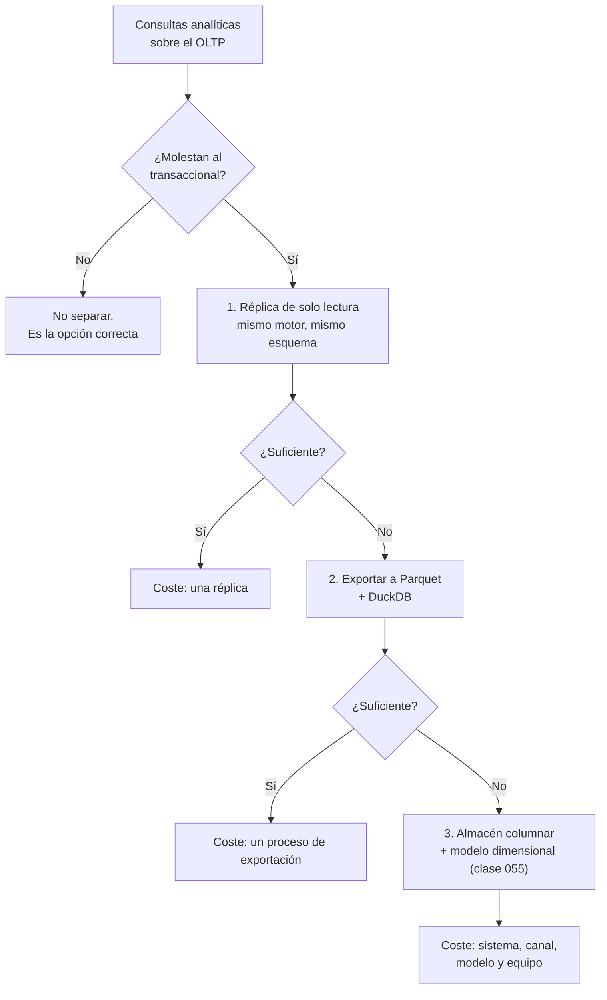

# 054 — OLTP frente a OLAP: por qué se separan

> [Programa](../../../README.md) · [Parte 11](../README.md) · [← Anterior](../../part-10-operacion-seguridad-y-gobierno/053-privacidad-retencion-y-gobierno-del-dato/README.md) · [Siguiente →](../../part-11-analitica-integracion-y-streaming/055-modelado-dimensional/README.md)

Parte 11 — Analítica, integración y streaming · Intermedio ·
3 horas estimadas · motores `postgresql`, `duckdb`, `clickhouse` · laboratorio
[`labs/04-indexing`](../../../labs/04-indexing/README.md) · 3 fuentes.

**Conceptos centrales:** `carga transaccional` · `carga analítica` · `contención` · `formato de almacenamiento`

---

## Propósito

Explicar por qué las cargas transaccionales y analíticas se separan, qué pasa cuando no se separan y cuándo esa separación es innecesaria.

## Resultados de aprendizaje

Al terminar podrás:

1. Caracterizar ambas cargas por su patrón de acceso, no por su nombre.
2. Explicar los tres conflictos concretos de ejecutarlas en el mismo motor.
3. Ordenar las opciones de separación por costo creciente.
4. Reconocer cuándo la separación no compensa.
5. Situar HTAP y el enfoque de tabla externa.

## Fundamentos

### Dos cargas, dos formas

| Dimensión | OLTP | OLAP |
|---|---|---|
| Unidad de trabajo | Transacción de pocas filas | Consulta que barre millones |
| Columnas por consulta | Casi todas de pocas filas | Pocas de casi todas las filas |
| Concurrencia | Miles de sesiones | Decenas |
| Latencia objetivo | Milisegundos | Segundos a minutos |
| Escrituras | Continuas, pequeñas | Por lotes |
| Datos | Actuales | Históricos |
| Consistencia | Estricta | Tolera desfase |
| Formato óptimo | Filas | **Columnas** (clase 032) |
| Índices | Muchos, selectivos | Pocos, dispersos |

La incompatibilidad es física, no organizativa: **el mismo dato no puede estar simultáneamente ordenado por filas y por columnas** sin duplicarse.

### Los tres conflictos

**1. Contención de recursos.** Una consulta analítica lee millones de páginas y desaloja el conjunto de trabajo transaccional del buffer. Las consultas OLTP que iban a 2 ms pasan a 20 ms hasta que el caché se recalienta.

**2. Bloqueos y versiones.** En un motor MVCC, una consulta analítica de 40 minutos mantiene una instantánea abierta y **bloquea la recolección de versiones muertas** durante ese tiempo (clase 033). Con 2 000 escrituras/s, son 4,8 millones de versiones acumuladas.

**3. Modelos de datos opuestos.** El esquema normalizado que hace correcto el OLTP obliga a reuniones múltiples en el OLAP. El modelo dimensional que hace rápido el OLAP introduce redundancia inaceptable en el OLTP.

Stonebraker et al. midieron además que un motor OLTP tradicional gasta la mayor parte de sus ciclos en gestión de bloqueos, registro y buffer —trabajo que la carga analítica no necesita en absoluto—.

### Las opciones, de menor a mayor costo



**La opción 1 resuelve el conflicto 1 y parcialmente el 2**, y no el 3: el esquema sigue siendo el transaccional. Aun así, resuelve la mayoría de los casos reales y cuesta muy poco.

**La opción 2** es la más infravalorada. Una exportación nocturna a Parquet consultada con DuckDB (clase 023) da rendimiento columnar sin ningún servidor nuevo:

```sql
-- Sobre archivos Parquet, sin base de datos analítica
SELECT periodo, count(*), avg(nota)
FROM read_parquet('exportacion/enrollments/*.parquet')
GROUP BY periodo;
```

**La opción 3** se justifica cuando hay varias fuentes que integrar, histórico que conservar más allá del OLTP, o volúmenes que no caben en una máquina.

### Cuándo no separar

Con menos de unos 100 GB y consultas analíticas fuera del horario punta, separar añade un canal que mantener, un desfase que explicar y un sistema que operar, a cambio de poco. La pregunta correcta es **si la carga analítica está degradando la transaccional**, medido, no supuesto.

## Ejemplo trabajado

Plataforma: 5 M de inscripciones, 300 consultas OLTP/s, y un panel de dirección que ejecuta 12 consultas analíticas cada mañana.

**Sin separar, medición:**

```sql
-- panel de dirección, 08:00
SELECT c.periodo, count(*), avg(e.nota),
       count(DISTINCT e.student_id)
FROM enrollments e JOIN courses c ON c.id = e.course_id
GROUP BY c.periodo;
```

```text
Duración:                       47 s
Páginas leídas:                 65 790 (barrido completo)
Efecto medido en el OLTP durante esos 47 s:
  p99 de lectura:  4 ms  →  38 ms
  aciertos de buffer:  99,2 %  →  71,4 %
  filas muertas no recuperables: +94 000
```

El panel funciona. Y durante 47 segundos, cada mañana, todos los usuarios notan la plataforma lenta. **Ese es el conflicto, cuantificado.**

**Opción 1 — réplica de solo lectura:**

```text
El panel consulta la réplica. El OLTP no se entera.
p99 durante el panel: 4 ms (sin cambio)
Coste: una instancia más
Nuevo problema: el retraso de réplica crece a 12 s durante el panel
                → aceptable para un panel; hay que declararlo
```

Para este caso, **aquí termina el problema**. Es la respuesta correcta y cuesta una instancia.

**Opción 2 — exportación a Parquet**, si la réplica no bastara:

```bash
# Exportación nocturna incremental
psql -c "\copy (SELECT * FROM enrollments WHERE registrada_en >= current_date - 1)
         TO PROGRAM 'zstd > exportacion/enrollments/$(date +%F).parquet.zst'"
```

```text
Consulta del panel sobre Parquet con DuckDB:  1,2 s   (frente a 47 s)
Bytes leídos:                                 0,4 GB  (frente a 20 GB)
Coste: un trabajo programado; ningún servidor nuevo
Desfase: hasta 24 h — hay que decidir si es aceptable
```

**Opción 3 — almacén columnar.** Se justificaría si hubiera que cruzar estas inscripciones con datos de facturación y de una plataforma externa, conservar diez años de histórico y servir a veinte analistas. Entonces el modelo dimensional (clase 055) y el canal de integración (clase 056) valen su costo.

**La regla de decisión, con los números de este caso:**

| Opción | Coste operativo | Latencia del panel | Desfase | ¿Resuelve? |
|---|---|---|---|---|
| No separar | 0 | 47 s | 0 | No: degrada el OLTP |
| Réplica | 1 instancia | 47 s | segundos | **Sí** |
| Parquet + DuckDB | 1 trabajo | 1,2 s | horas | Sí, y más rápido |
| Almacén | Sistema + equipo | < 1 s | horas | Sí, y desproporcionado aquí |

### HTAP

Algunos sistemas mantienen ambas representaciones a la vez: filas para el OLTP y un almacén columnar sincronizado para el OLAP (índices columnares de SQL Server, TiFlash de TiDB, `pg_analytics` y similares). Evita el canal de integración a cambio de más recursos y más complejidad interna. Es una opción real, no una promesa, pero no elimina el compromiso: sigue habiendo dos copias del dato en dos formatos.

## Comparación

| Situación | Decisión |
|---|---|
| Consultas analíticas ocasionales, < 100 GB | No separar |
| Panel diario que degrada el OLTP | Réplica de solo lectura |
| Analítica pesada, una sola fuente | Exportar a Parquet + DuckDB |
| Varias fuentes, histórico largo, muchos analistas | Almacén + modelo dimensional |
| Necesidad de analítica sobre datos del segundo | HTAP, con su costo |

## Errores frecuentes

1. **Montar un almacén sin haber medido la degradación.** Coste alto para un problema que quizá no existe.
2. **Consultas analíticas contra el primario.** Contención y bloqueo de la recolección.
3. **Ignorar el retraso de réplica durante el panel.** El panel muestra datos más viejos de lo que cree.
4. **Copiar el esquema OLTP al almacén.** Se hereda la normalización y las reuniones.
5. **Separar y no declarar el desfase.** Dos cifras distintas y nadie sabe cuál es la buena.
6. **Suponer que HTAP elimina el compromiso.** Lo esconde, no lo elimina.

## De la clase a la operación

La conversación productiva no es «¿necesitamos un almacén de datos?», sino «¿cuánto degrada el OLTP nuestra carga analítica, y cuál es la opción más barata que lo resuelve?». Medir primero convierte una decisión de arquitectura en una decisión con evidencia.

## Reto de transferencia

1. Mide el p99 del OLTP con y sin la carga analítica en ejecución.
2. Cuantifica el efecto sobre el buffer y sobre las versiones no recuperables.
3. Prueba la opción 2 exportando a Parquet y consultando con DuckDB.
4. Justifica con cifras qué opción elegirías y qué desfase declararías.

## Preguntas de evaluación

1. Explica los tres conflictos con datos de tu propio sistema.
2. ¿Por qué una consulta analítica larga impide recuperar versiones muertas?
3. ¿En qué caso la exportación a Parquet supera a una réplica de solo lectura?
4. Da una situación donde no separar sea la decisión correcta, y defiéndela.

---

## Laboratorio

```bash
python scripts/validate_repository.py
python labs/04-indexing/run_indexing_lab.py
```

Guarda como evidencia la salida completa, la versión del motor y la semilla o
los parámetros usados. Una captura sin comando no es evidencia: no se puede
repetir.

## Evaluación

| Criterio | Peso | Qué se comprueba |
|---|---:|---|
| Comprensión conceptual | 25 % | Explica el mecanismo, no solo el resultado |
| Ejecución reproducible | 25 % | Otra persona obtiene lo mismo con las instrucciones dadas |
| Interpretación basada en evidencia | 25 % | Cada conclusión se apoya en una salida o una medición |
| Límites y riesgos declarados | 25 % | Dice qué no demuestra el ejercicio y qué faltaría en producción |

La clase se da por superada cuando la respuesta explica el mecanismo, muestra
la salida que la respalda y declara al menos un límite del ejercicio.

## Fuentes de esta clase

Todo lo afirmado arriba procede de estas obras. Los identificadores viven en
[`catalog/sources.json`](../../../catalog/sources.json) y el estado de los
enlaces se comprueba con `python scripts/check_external_links.py`.

- **Michael Stonebraker, Samuel Madden, Daniel J. Abadi, Stavros Harizopoulos, Nabil Hachem, Pat Helland** (2007). [The End of an Architectural Era (It's Time for a Complete Rewrite)](https://cs.brown.edu/courses/cs227/archives/2008/Papers/OLTP/hstore.pdf). VLDB.  
  Mide en qué gasta el tiempo realmente un motor OLTP tradicional.
- **Ralph Kimball, Margy Ross** (2013). [The Data Warehouse Toolkit](https://www.kimballgroup.com/data-warehouse-business-intelligence-resources/kimball-techniques/dimensional-modeling-techniques/). 3.a ed. Wiley. ISBN 978-1-118-53080-1.  
  Modelado dimensional, tablas de hechos y dimensiones de cambio lento.
- **DuckDB Foundation** (2026). [DuckDB Documentation](https://duckdb.org/docs/).  
  Motor analítico embebido: OLAP columnar sin servidor.

---

> [Programa](../../../README.md) · [Parte 11](../README.md) · [← Anterior](../../part-10-operacion-seguridad-y-gobierno/053-privacidad-retencion-y-gobierno-del-dato/README.md) · [Siguiente →](../../part-11-analitica-integracion-y-streaming/055-modelado-dimensional/README.md)
