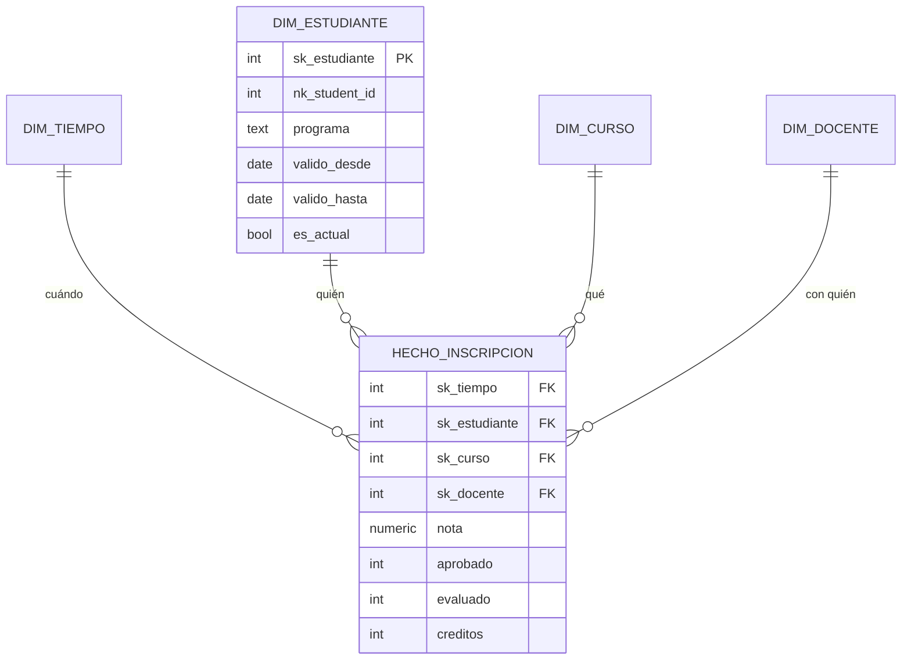

## Propósito

Modelar para el análisis. El modelo dimensional optimiza una cosa —responder preguntas de negocio sobre grandes volúmenes— y renuncia deliberadamente a otras.

## Resultados de aprendizaje

Al terminar podrás:

1. Aplicar los cuatro pasos del método de Kimball.
2. Declarar el grano de una tabla de hechos y comprobar que se respeta.
3. Distinguir hechos aditivos, semiaditivos y no aditivos.
4. Implementar dimensiones de cambio lento de tipos 1, 2 y 3.
5. Explicar por qué se desnormaliza y qué se pierde.

## Fundamentos

### Los cuatro pasos

Kimball y Ross proponen un método en este orden estricto:

1. **Elegir el proceso de negocio.** No un informe: un proceso («inscripción a cursos»).
2. **Declarar el grano.** Qué representa exactamente **una fila** de la tabla de hechos.
3. **Identificar las dimensiones.** Los «por qué, quién, cuándo, dónde» de ese hecho.
4. **Identificar los hechos.** Las medidas numéricas del proceso.

**El paso 2 es el crítico.** Un grano ambiguo produce dobles conteos, sumas incorrectas y meses de desconfianza en los datos. La formulación debe ser una frase completa: *«una fila por estudiante, curso y período»*, no «inscripciones».

Y la regla que se deriva: **nunca mezclar granos en la misma tabla de hechos**. Si un informe necesita otro grano, es otra tabla.

### Hechos y su aditividad

| Tipo | Se puede sumar | Ejemplo |
|---|---|---|
| **Aditivo** | Por todas las dimensiones | Monto pagado, unidades |
| **Semiaditivo** | Por todas menos el tiempo | Saldo, inventario, matriculados |
| **No aditivo** | Por ninguna | Porcentajes, ratios, promedios |

Regla de oro: **guardar los componentes, no el ratio**. En vez de `porcentaje_aprobacion`, guardar `aprobados` y `evaluados`, y calcular el porcentaje al consultar. Sumar porcentajes de distintas filas da un número sin significado; sumar componentes y dividir después, no.

Los semiaditivos son la trampa silenciosa: sumar los saldos de los doce meses del año da un número que no es el saldo anual de nada.

### Dimensiones de cambio lento

¿Qué pasa cuando un atributo de dimensión cambia? Una estudiante cambia de programa en 2026. ¿Sus inscripciones de 2025 pertenecen al programa antiguo o al nuevo?

| Tipo | Qué hace | Historia | Cuándo |
|---|---|---|---|
| **1** | Sobrescribe | Se pierde | Corrección de errores |
| **2** | Nueva fila con vigencia | **Se conserva** | El cambio importa históricamente |
| **3** | Columna «valor anterior» | Solo el cambio previo | Comparar dos versiones |

El tipo 2 es el habitual para atributos con significado histórico:

```sql
CREATE TABLE dim_estudiante (
  sk_estudiante SERIAL PRIMARY KEY,       -- clave sustituta del almacén
  nk_student_id INTEGER NOT NULL,         -- clave natural del origen
  nombre        TEXT NOT NULL,
  programa      TEXT NOT NULL,
  comuna        TEXT,
  valido_desde  DATE NOT NULL,
  valido_hasta  DATE NOT NULL DEFAULT '9999-12-31',
  es_actual     BOOLEAN NOT NULL DEFAULT true
);
CREATE UNIQUE INDEX ON dim_estudiante (nk_student_id) WHERE es_actual;
```

La clave que la tabla de hechos guarda es `sk_estudiante`, **no** `nk_student_id`. Así cada hecho queda ligado a la versión de la dimensión vigente en su momento, y un informe de 2025 sigue mostrando el programa de 2025 aunque hoy sea otro.

Es la diferencia entre «cómo era» y «cómo es», y las dos preguntas son legítimas: la primera se responde uniendo por `sk`, la segunda uniendo por `nk` con `es_actual`.



### Por qué desnormalizar

Las dimensiones se desnormalizan deliberadamente (esquema en estrella) en vez de normalizarse (copo de nieve):

- Menos reuniones en cada consulta analítica.
- Las dimensiones son pequeñas: la redundancia cuesta poco.
- Las herramientas de análisis y los usuarios entienden mejor un esquema plano.

Lo que se pierde —anomalías de actualización— importa poco en un almacén, porque las escrituras son controladas y por lotes, no concurrentes desde una aplicación. **Es la aplicación consciente de lo contrario a la clase 008**, y por eso es legítima.

## Ejemplo trabajado

**Paso 1 — proceso:** inscripción y evaluación académica.

**Paso 2 — grano:** *«una fila por estudiante, curso y período académico»*.

**Paso 3 — dimensiones:** tiempo (período), estudiante, curso, docente.

**Paso 4 — hechos:** nota, aprobado (0/1), evaluado (0/1), créditos.

```sql
CREATE TABLE hecho_inscripcion (
  sk_tiempo     INTEGER NOT NULL REFERENCES dim_tiempo(sk_tiempo),
  sk_estudiante INTEGER NOT NULL REFERENCES dim_estudiante(sk_estudiante),
  sk_curso      INTEGER NOT NULL REFERENCES dim_curso(sk_curso),
  sk_docente    INTEGER          REFERENCES dim_docente(sk_docente),
  nota          NUMERIC(2,1),
  aprobado      SMALLINT NOT NULL DEFAULT 0,
  evaluado      SMALLINT NOT NULL DEFAULT 0,
  creditos      SMALLINT NOT NULL,
  PRIMARY KEY (sk_tiempo, sk_estudiante, sk_curso)
);
```

La clave primaria **es** la declaración del grano, hecha cumplir por el motor. Insertar dos filas para el mismo estudiante, curso y período es ahora imposible: el doble conteo queda excluido por construcción.

**Los hechos elegidos, y por qué:**

- `aprobado` y `evaluado` como enteros 0/1 en vez de un porcentaje. Son aditivos: `SUM(aprobado) / SUM(evaluado)` da el porcentaje correcto en **cualquier** agregación. Un `porcentaje_aprobacion` por fila no se puede promediar sin ponderar.
- `nota` es **no aditiva**: `AVG(nota)` es válido, `SUM(nota)` no significa nada. Se documenta.

**Consulta típica, sin ninguna reunión compleja:**

```sql
SELECT t.anio, t.semestre, c.facultad,
       count(*)                                          AS inscripciones,
       sum(f.evaluado)                                   AS evaluados,
       sum(f.aprobado)                                   AS aprobados,
       round(100.0 * sum(f.aprobado) / NULLIF(sum(f.evaluado),0), 1) AS pct_aprobacion,
       round(avg(f.nota) FILTER (WHERE f.nota IS NOT NULL), 2)       AS nota_media
FROM hecho_inscripcion f
JOIN dim_tiempo t ON t.sk_tiempo = f.sk_tiempo
JOIN dim_curso  c ON c.sk_curso  = f.sk_curso
GROUP BY t.anio, t.semestre, c.facultad
ORDER BY t.anio, t.semestre, c.facultad;
```

Cuatro reuniones como máximo, todas por clave sustituta entera, todas hacia tablas pequeñas. Comparado con el esquema normalizado del OLTP, que exigiría recorrer `students`, `enrollments`, `courses`, `teaching` y `teachers`.

**El cambio lento en acción.** Ana pasa de «Ingeniería» a «Ciencias» el 2026-03-01:

```sql
UPDATE dim_estudiante
   SET valido_hasta = DATE '2026-02-28', es_actual = false
 WHERE nk_student_id = 11 AND es_actual;

INSERT INTO dim_estudiante (nk_student_id, nombre, programa, valido_desde)
VALUES (11, 'Ana Pérez', 'Ciencias', DATE '2026-03-01');
```

Ahora:

```sql
-- "Como era entonces": las inscripciones de 2025 cuentan en Ingeniería
SELECT d.programa, count(*) FROM hecho_inscripcion f
JOIN dim_estudiante d ON d.sk_estudiante = f.sk_estudiante
JOIN dim_tiempo t ON t.sk_tiempo = f.sk_tiempo
WHERE t.anio = 2025 GROUP BY d.programa;

-- "Como es ahora": las mismas inscripciones cuentan en Ciencias
SELECT d.programa, count(*) FROM hecho_inscripcion f
JOIN dim_estudiante h ON h.sk_estudiante = f.sk_estudiante
JOIN dim_estudiante d ON d.nk_student_id = h.nk_student_id AND d.es_actual
JOIN dim_tiempo t ON t.sk_tiempo = f.sk_tiempo
WHERE t.anio = 2025 GROUP BY d.programa;
```

**Dos cifras distintas, ambas correctas.** Sin cambio lento de tipo 2 solo se puede responder una de las dos preguntas, y normalmente se descubre cuando alguien pregunta la otra.

**La dimensión de tiempo, siempre poblada de antemano:**

```sql
CREATE TABLE dim_tiempo (
  sk_tiempo  INTEGER PRIMARY KEY,     -- p. ej. 20260301
  fecha      DATE NOT NULL UNIQUE,
  anio       SMALLINT NOT NULL,
  semestre   SMALLINT NOT NULL,
  mes        SMALLINT NOT NULL,
  periodo_academico TEXT NOT NULL,
  es_habil   BOOLEAN NOT NULL
);
```

Tener el calendario como tabla evita repetir lógica de fechas en cada consulta y permite atributos que ninguna función de fecha conoce: períodos académicos, feriados locales, semanas de exámenes.

## Comparación

| Aspecto | Modelo normalizado (OLTP) | Modelo dimensional (OLAP) |
|---|---|---|
| Objetivo | Evitar anomalías | Responder preguntas rápido |
| Redundancia | Mínima | Aceptada en dimensiones |
| Reuniones por consulta | Muchas | Pocas, en estrella |
| Escrituras | Concurrentes | Por lotes, controladas |
| Historia | Presente | Conservada (tipo 2) |
| Comprensible para el negocio | Poco | **Mucho** |

## Errores frecuentes

1. **No declarar el grano.** Origen de todos los dobles conteos.
2. **Mezclar granos en una tabla de hechos.** Las sumas dejan de tener sentido.
3. **Guardar ratios en vez de componentes.** No se pueden reagregar.
4. **Sumar hechos semiaditivos por el tiempo.** Un saldo anual que no es de nadie.
5. **Tipo 1 donde hacía falta tipo 2.** La historia se pierde y no se recupera.
6. **Usar la clave natural en los hechos.** Rompe el cambio lento de tipo 2.
7. **Calcular fechas en cada consulta.** Falta la dimensión de tiempo.

## De la clase a la operación

La causa más frecuente de «los informes no cuadran» no está en los datos: está en dos tablas de hechos con granos distintos que alguien sumó. Declarar el grano en la clave primaria lo convierte en un error de inserción en vez de en un número equivocado.

## Reto de transferencia

1. Elige un proceso de negocio tuyo y aplica los cuatro pasos.
2. Declara el grano como frase completa y hazlo cumplir con la clave primaria.
3. Clasifica cada hecho como aditivo, semiaditivo o no aditivo, y documéntalo.
4. Implementa un cambio lento de tipo 2 y responde la misma pregunta «como era» y «como es».

## Preguntas de evaluación

1. Escribe el grano de una tabla de hechos tuya como frase completa.
2. ¿Por qué se guardan `aprobados` y `evaluados` en vez del porcentaje?
3. Da un hecho semiaditivo de tu dominio y la agregación que sería incorrecta.
4. Explica qué se rompe si la tabla de hechos guarda la clave natural.
