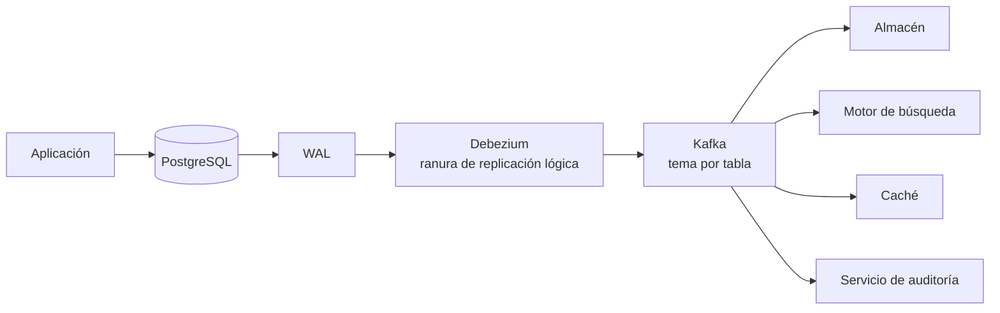

# 056 — Integración: ETL, ELT, captura de cambios y el registro como nexo

> [Programa](../../../README.md) · [Parte 11](../README.md) · [← Anterior](../../part-11-analitica-integracion-y-streaming/055-modelado-dimensional/README.md) · [Siguiente →](../../part-11-analitica-integracion-y-streaming/057-streaming-tiempo-de-evento-y-ventanas/README.md)

Parte 11 — Analítica, integración y streaming · Avanzado ·
3 horas estimadas · motores `postgresql`, `kafka` · laboratorio
[`labs/05-nosql-workloads`](../../../labs/05-nosql-workloads/README.md) · 4 fuentes.

**Conceptos centrales:** `ETL` · `ELT` · `CDC` · `escritura dual` · `idempotencia de carga`

---

## Propósito

Mover datos entre sistemas sin perderlos, sin duplicarlos y sin perder su significado. El registro de transacciones resulta ser la pieza que unifica replicación, integración y streaming.

## Resultados de aprendizaje

Al terminar podrás:

1. Comparar ETL y ELT y decidir con criterio.
2. Explicar por qué la extracción incremental por marca de tiempo pierde filas.
3. Describir la captura de cambios leyendo el registro del motor.
4. Diseñar una carga idempotente y reprocesable.
5. Reconocer el problema de la doble escritura y sus soluciones.

## Fundamentos

### ETL frente a ELT

| | ETL | ELT |
|---|---|---|
| Orden | Extraer, transformar, cargar | Extraer, cargar, **transformar dentro** |
| Dónde se transforma | Proceso intermedio | En el almacén |
| Reproceso | Reejecutar todo el canal | Volver a ejecutar SQL sobre lo crudo |
| Requiere | Motor de transformación | Almacén potente y barato |
| Trazabilidad | Se pierde el dato original | **Se conserva lo crudo** |

ELT es hoy la opción predominante porque el almacenamiento es barato y los motores columnares son rápidos. Su ventaja decisiva es la trazabilidad: conservar los datos crudos permite **rehacer** la transformación cuando se descubre que estaba mal, sin volver a pedirle nada al sistema origen.

En ETL, un error de transformación descubierto tres meses después es irrecuperable si el origen ya rotó sus datos.

### Por qué la extracción incremental por marca de tiempo pierde filas

El patrón más común y el más roto:

```sql
SELECT * FROM enrollments WHERE actualizado_en > :ultima_marca;
```

Falla por cuatro motivos, todos silenciosos:

1. **Transacciones largas.** Una fila con `actualizado_en = 10:00:05` confirmada a las 10:00:12, cuando la extracción ya leyó hasta las 10:00:10, no se ve nunca.
2. **Relojes.** Si `actualizado_en` lo pone la aplicación, dos servidores con desfase producen huecos.
3. **Borrados.** Una fila borrada no aparece en ninguna consulta. El destino conserva datos que ya no existen.
4. **Actualizaciones sin tocar la marca.** Una migración con `UPDATE ... SET x = y` que olvide `actualizado_en` es invisible.

El punto 1 es el que engaña: el canal no falla nunca y las filas simplemente faltan. Solo se detecta comparando conteos con el origen.

**Mitigación parcial:** solapar la ventana (`> ultima_marca - 5 minutos`) y hacer la carga idempotente. No resuelve el punto 3.

### Captura de cambios desde el registro

En lugar de consultar la tabla, se lee el **registro de transacciones** del motor —el mismo WAL de la clase 036 que sirve para recuperarse y para replicar—.



Ventajas frente a la consulta periódica:

| | Consulta por marca | Captura desde el registro |
|---|---|---|
| Borrados | **Invisibles** | Capturados |
| Transacciones largas | Pierde filas | Correcto: lee el orden de confirmación |
| Carga sobre el origen | Consultas periódicas | Mínima: lee el WAL |
| Latencia | Intervalo de sondeo | Segundos |
| Estado anterior | No disponible | Disponible (con `REPLICA IDENTITY FULL`) |
| Complejidad | Baja | Media-alta |

Kreps lo formuló como principio general: **el registro es la abstracción que unifica** replicación, integración y streaming. Un solo flujo ordenado de cambios alimenta todos los consumidores, cada uno a su ritmo.

Requisitos en PostgreSQL:

```sql
ALTER SYSTEM SET wal_level = logical;   -- requiere reinicio
CREATE PUBLICATION cdc_enrollments FOR TABLE enrollments, courses, students;
ALTER TABLE enrollments REPLICA IDENTITY FULL;   -- para tener el estado anterior
```

**Advertencia operativa:** una ranura de replicación con un consumidor detenido **impide reciclar el WAL** y llena el disco del primario. Es la causa número uno de incidentes con captura de cambios, y hay que vigilarla:

```sql
SELECT slot_name, active,
       pg_size_pretty(pg_wal_lsn_diff(pg_current_wal_lsn(), restart_lsn)) AS retenido
FROM pg_replication_slots;
```

### El problema de la doble escritura

```python
db.insert(inscripcion)        # ✓
kafka.publish(evento)         # ✗ falla → el evento nunca sale
```

Dos sistemas, ninguna atomicidad. Las tres soluciones, ya vistas en la clase 047:

1. **Bandeja de salida transaccional:** escribir estado y evento en la misma transacción local; un proceso publica desde la tabla de salida.
2. **Captura de cambios:** no publicar nada; el evento se deriva del cambio en la base.
3. **Origen de eventos:** el evento **es** el estado; la base se deriva de él.

La 2 es la más barata cuando ya existe la infraestructura de captura, porque elimina la doble escritura sin tocar el código de la aplicación.

## Ejemplo trabajado

Objetivo: mantener el almacén sincronizado con las inscripciones, con latencia inferior a un minuto y sin perder borrados.

**Enfoque A — consulta periódica. Detección del fallo:**

```sql
-- en el origen
SELECT count(*) FROM enrollments;                  -- 5 002 341
-- en el destino
SELECT count(*) FROM stg_enrollments;              -- 4 998 102
--                                                    faltan 4 239
```

Investigación: 3 100 corresponden a filas borradas en el origen que el destino conserva, y 1 139 a filas confirmadas por transacciones largas durante la ventana de extracción. El canal llevaba meses «funcionando».

**Enfoque B — captura desde el registro:**

```json
// Evento producido por Debezium
{
  "op": "u",
  "before": {"student_id": 11, "course_id": 42, "nota": 5.5, "estado": "activa"},
  "after":  {"student_id": 11, "course_id": 42, "nota": 6.0, "estado": "activa"},
  "source": {"lsn": 24857392, "ts_ms": 1755600000123, "table": "enrollments"}
}
```

`op` vale `c` (crear), `u` (actualizar), `d` (borrar) o `r` (instantánea inicial). El borrado deja de ser invisible.

**Carga idempotente en el almacén:**

```sql
-- Zona cruda: se guarda TODO el evento, sin transformar (principio ELT)
CREATE TABLE raw_enrollments (
  lsn        BIGINT PRIMARY KEY,     -- orden total del origen; hace la carga idempotente
  op         CHAR(1) NOT NULL,
  ts_ms      BIGINT  NOT NULL,
  before     JSONB,
  after      JSONB,
  ingerido_en TIMESTAMPTZ NOT NULL DEFAULT now()
);

-- Reprocesar el mismo evento no duplica: la clave primaria lo impide.
INSERT INTO raw_enrollments (lsn, op, ts_ms, before, after)
VALUES (:lsn, :op, :ts, :before::jsonb, :after::jsonb)
ON CONFLICT (lsn) DO NOTHING;
```

El LSN es la pieza clave: es un **orden total** asignado por el origen. Sirve de clave de idempotencia (clase 037) y de criterio de desempate.

**Vista del estado actual, derivada de lo crudo:**

```sql
CREATE OR REPLACE VIEW cur_enrollments AS
SELECT DISTINCT ON (
         COALESCE(after->>'student_id', before->>'student_id'),
         COALESCE(after->>'course_id',  before->>'course_id'))
       COALESCE(after->>'student_id', before->>'student_id')::int AS student_id,
       COALESCE(after->>'course_id',  before->>'course_id')::int  AS course_id,
       (after->>'nota')::numeric(2,1) AS nota,
       after->>'estado'               AS estado,
       op = 'd'                       AS borrado,
       lsn
FROM raw_enrollments
ORDER BY 1, 2, lsn DESC;    -- el LSN mayor gana: es el último cambio
```

Propiedades que resultan de este diseño:

- **Idempotente:** reprocesar el mismo flujo no cambia el resultado.
- **Reprocesable:** si la transformación estaba mal, se corrige la vista y se recalcula sobre lo crudo. No hay que pedirle nada al origen.
- **Completo:** los borrados aparecen como `op = 'd'`.
- **Auditable:** el histórico completo de cambios queda disponible.

**Verificación diaria, que es lo que convierte el canal en fiable:**

```sql
-- Conteos comparados: origen frente a destino
SELECT (SELECT count(*) FROM enrollments)                                AS origen,
       (SELECT count(*) FROM cur_enrollments WHERE NOT borrado)          AS destino;

-- Frescura: ¿cuánto hace del último evento recibido?
SELECT now() - to_timestamp(max(ts_ms)/1000) AS retraso FROM raw_enrollments;
```

Ambas comprobaciones con alerta. Un canal de datos sin verificación de conteo es un canal del que nadie puede afirmar que funciona.

## Comparación

| Necesidad | Mecanismo |
|---|---|
| Carga histórica inicial | Instantánea completa |
| Sincronización continua sin borrados | Consulta por marca (con reservas) |
| Sincronización completa | Captura desde el registro |
| Estado + evento atómicos | Bandeja de salida |
| Varios destinos del mismo cambio | Registro compartido (Kafka) |
| Corregir una transformación pasada | ELT sobre datos crudos conservados |

## Errores frecuentes

1. **Extracción incremental sin solape ni verificación de conteos.** Pierde filas en silencio.
2. **Ignorar los borrados.** El destino acumula datos que ya no existen.
3. **Ranura de replicación sin vigilancia.** Llena el disco del primario.
4. **Cargas no idempotentes.** Un reintento duplica.
5. **Transformar antes de conservar lo crudo.** Un error de transformación es irreversible.
6. **Doble escritura a base y a cola.** Divergencia garantizada.
7. **Canal sin comprobación de frescura.** Se detiene y nadie lo nota.

## De la clase a la operación

Un canal de datos roto no da errores: da cifras ligeramente distintas que nadie relaciona con él. La verificación de conteo y de frescura, con alerta, es lo único que convierte el canal en una fuente en la que se puede confiar.

## Reto de transferencia

1. Compara conteos entre origen y destino de un canal real tuyo y explica la diferencia.
2. Configura replicación lógica y captura los tres tipos de operación.
3. Implementa la carga idempotente por LSN y demuestra que reprocesar no duplica.
4. Añade las comprobaciones de conteo y frescura con sus alertas.

## Preguntas de evaluación

1. Explica con una traza cómo una transacción larga hace perder filas a la extracción por marca.
2. ¿Por qué los borrados son invisibles en ese enfoque y no en la captura desde el registro?
3. ¿Qué ocurre si el consumidor de una ranura de replicación se detiene una semana?
4. Da una transformación tuya que hoy sería imposible corregir retroactivamente, y cómo lo arreglarías.

---

## Laboratorio

```bash
python scripts/validate_repository.py
python labs/05-nosql-workloads/run_nosql_lab.py
```

Guarda como evidencia la salida completa, la versión del motor y la semilla o
los parámetros usados. Una captura sin comando no es evidencia: no se puede
repetir.

## Evaluación

| Criterio | Peso | Qué se comprueba |
|---|---:|---|
| Comprensión conceptual | 25 % | Explica el mecanismo, no solo el resultado |
| Ejecución reproducible | 25 % | Otra persona obtiene lo mismo con las instrucciones dadas |
| Interpretación basada en evidencia | 25 % | Cada conclusión se apoya en una salida o una medición |
| Límites y riesgos declarados | 25 % | Dice qué no demuestra el ejercicio y qué faltaría en producción |

La clase se da por superada cuando la respuesta explica el mecanismo, muestra
la salida que la respalda y declara al menos un límite del ejercicio.

## Fuentes de esta clase

Todo lo afirmado arriba procede de estas obras. Los identificadores viven en
[`catalog/sources.json`](../../../catalog/sources.json) y el estado de los
enlaces se comprueba con `python scripts/check_external_links.py`.

- **Jay Kreps** (2013). [The Log: What Every Software Engineer Should Know About Real-Time Data's Unifying Abstraction](https://web.archive.org/web/2023/https://engineering.linkedin.com/distributed-systems/log-what-every-software-engineer-should-know-about-real-time-datas-unifying). LinkedIn Engineering.  
  El registro append-only como nexo entre replicación, integración y streaming. Se cita la copia archivada: LinkedIn retiro el original.
- **Debezium Community** (2026). [Debezium Documentation](https://debezium.io/documentation/).  
  Captura de cambios leyendo el registro de transacciones del motor.
- **dbt Labs** (2026). [dbt Documentation](https://docs.getdbt.com/).  
  Transformaciones versionadas y pruebas de datos en el almacen.
- **Apache Software Foundation** (2026). [Apache Iceberg Documentation](https://iceberg.apache.org/docs/latest/).  
  Formato de tabla con instantaneas y evolución de esquema sobre almacenamiento de objetos.

---

> [Programa](../../../README.md) · [Parte 11](../README.md) · [← Anterior](../../part-11-analitica-integracion-y-streaming/055-modelado-dimensional/README.md) · [Siguiente →](../../part-11-analitica-integracion-y-streaming/057-streaming-tiempo-de-evento-y-ventanas/README.md)
