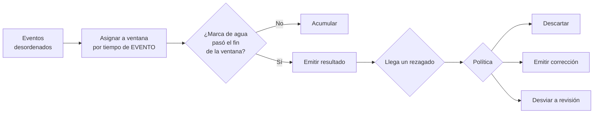

# 057 — Streaming: tiempo de evento, ventanas y semántica de entrega

> [Programa](../../../README.md) · [Parte 11](../README.md) · [← Anterior](../../part-11-analitica-integracion-y-streaming/056-integracion-etl-elt-y-captura-de-cambios/README.md) · [Siguiente →](../../part-12-vectores-recuperacion-y-rag/058-embeddings-y-metricas-de-distancia/README.md)

Parte 11 — Analítica, integración y streaming · Avanzado ·
3 horas estimadas · motores `kafka`, `clickhouse` · laboratorio
[`labs/05-nosql-workloads`](../../../labs/05-nosql-workloads/README.md) · 3 fuentes.

**Conceptos centrales:** `tiempo de evento` · `marca de agua` · `ventana` · `entrega al menos una vez`

**En este caso se comparan 7 motores**: 5 lo resuelven (3 con el resultado comprobado por máquina) y 2 no, con el motivo escrito.

---

## Propósito

Procesar datos que no dejan de llegar. La dificultad no es el caudal: es que los eventos llegan tarde, desordenados y a veces dos veces, y hay que decidir cuándo se cierra un resultado.

## Resultados de aprendizaje

Al terminar podrás:

1. Distinguir tiempo de evento, de ingesta y de procesamiento.
2. Elegir el tipo de ventana adecuado a la pregunta.
3. Explicar qué es una marca de agua y qué compromiso codifica.
4. Comparar las tres semánticas de entrega y cómo se consigue cada una.
5. Aplicar la dualidad flujo-tabla.

## Fundamentos

### Los tres tiempos

| Tiempo | Definición | Problema |
|---|---|---|
| **De evento** | Cuando ocurrió en el mundo | Llega tarde y desordenado |
| **De ingesta** | Cuando entró al sistema | No refleja la realidad |
| **De procesamiento** | Cuando se calculó | Reprocesar da otro resultado |

Akidau, Chernyak y Lax establecen la regla: **si la pregunta es sobre el mundo, se usa tiempo de evento**. «¿Cuántas inscripciones hubo el martes?» se refiere al martes real, no a cuándo llegaron los mensajes.

El desfase entre evento y procesamiento no está acotado: un móvil sin cobertura puede enviar eventos de hace tres días.

### Tipos de ventana

| Ventana | Forma | Pregunta que responde |
|---|---|---|
| **Fija** (tumbling) | Intervalos contiguos sin solape | «Inscripciones por hora» |
| **Deslizante** (sliding) | Tamaño y desplazamiento independientes | «Media de los últimos 10 min, cada minuto» |
| **De sesión** | Agrupa por inactividad | «Actividad de un usuario hasta 30 min de pausa» |
| **Global** | Todo el flujo | «Total desde siempre» |

### Marcas de agua

Una **marca de agua** es la afirmación del sistema: *«creo que ya no llegarán eventos anteriores a T»*. Es la que permite cerrar una ventana y emitir un resultado.

Es una **heurística**, no una certeza. De ahí el compromiso central del streaming:

```text
marca de agua agresiva  → resultados rápidos, más eventos rezagados descartados
marca de agua permisiva → resultados tardíos, menos pérdida
```

Y las tres políticas para lo que llega después de la marca:

| Política | Qué hace | Cuándo |
|---|---|---|
| **Descartar** | Ignora el rezagado | El error es tolerable |
| **Emitir corrección** | Reemite la ventana actualizada | El consumidor sabe reconciliar |
| **Desviar** | A un canal aparte para revisión | Auditoría, cumplimiento |



### Semánticas de entrega

| Semántica | Garantía | Cómo |
|---|---|---|
| **Como mucho una vez** | Puede perder | Sin reintentos |
| **Al menos una vez** | Puede duplicar | Reintentos + confirmación tras procesar |
| **Exactamente una vez** | Ni pierde ni duplica | Al menos una vez **+ receptor idempotente**, o transacciones del propio sistema |

La entrega exactamente-una-vez **de extremo a extremo no existe** como propiedad de la red: se construye combinando entrega al-menos-una-vez con un receptor que deduplica por identificador (clase 037). Kafka ofrece transacciones que dan «procesamiento exactamente una vez» dentro de Kafka; en cuanto un efecto sale del sistema —una fila en otra base, un correo—, la idempotencia vuelve a ser responsabilidad del receptor.

### Dualidad flujo-tabla

- Un **flujo** es la secuencia de cambios.
- Una **tabla** es el estado acumulado de esos cambios.

Cada uno se deriva del otro: agregar un flujo produce una tabla; observar los cambios de una tabla produce un flujo. Es exactamente lo que hace la captura de cambios de la clase 056, y es la misma idea del WAL de la clase 036 vista desde otro ángulo.

## Ejemplo trabajado

Métrica: inscripciones por curso y por hora, con paneles casi en tiempo real. Los eventos llegan de móviles con conectividad variable.

**Observación previa, imprescindible:** medir el retraso real antes de elegir la marca de agua.

```sql
SELECT percentile_disc(0.50) WITHIN GROUP (ORDER BY retraso_s) AS p50,
       percentile_disc(0.95) WITHIN GROUP (ORDER BY retraso_s) AS p95,
       percentile_disc(0.99) WITHIN GROUP (ORDER BY retraso_s) AS p99,
       max(retraso_s)                                          AS maximo
FROM (SELECT extract(epoch FROM (ingerido_en - ocurrido_en)) AS retraso_s
      FROM eventos WHERE ingerido_en > now() - interval '7 days') t;
```

```text
p50 = 0,8 s      p95 = 45 s      p99 = 340 s      máximo = 3 días
```

Ese `máximo` de 3 días es un móvil que estuvo sin cobertura. Esperar tres días para cerrar una ventana horaria es absurdo; descartarlo sin más, tampoco es aceptable si son inscripciones.

**Decisión, justificada con los percentiles:**

```text
Marca de agua: tiempo de evento máximo visto − 10 minutos
   → cubre el p99 (340 s) con margen
Política para rezagados: emitir corrección hasta 24 h; después, desviar a revisión
   → el panel se corrige solo; lo muy tardío no se pierde, se revisa
```

**Implementación en SQL de ventanas, sobre la tabla cruda:**

```sql
-- Ventana fija de una hora, por tiempo de EVENTO
CREATE MATERIALIZED VIEW inscripciones_hora AS
SELECT date_trunc('hour', ocurrido_en) AS hora,
       course_id,
       count(*)                        AS n,
       max(ingerido_en)                AS ultima_actualizacion
FROM eventos
WHERE tipo = 'inscripcion.creada'
GROUP BY 1, 2;
```

Una ventana que se recalcula incorpora automáticamente los rezagados: es la política de «emitir corrección», implementada sin ningún motor de streaming.

**Marca de agua y estado de cada ventana:**

```sql
WITH marca AS (
  SELECT max(ocurrido_en) - interval '10 minutes' AS w FROM eventos
)
SELECT h.hora, h.course_id, h.n,
       CASE WHEN h.hora + interval '1 hour' < (SELECT w FROM marca)
            THEN 'cerrada' ELSE 'provisional' END AS estado
FROM inscripciones_hora h
ORDER BY h.hora DESC LIMIT 24;
```

**Esta columna `estado` es el entregable pedagógico de la clase.** Un panel que muestra cifras sin decir si son definitivas o provisionales genera desconfianza: alguien anota el número de las 14:00, vuelve a mirar y ve otro. Con la marca explícita, el cambio es esperado y comprensible.

**Rezagados muy tardíos:**

```sql
INSERT INTO eventos_tardios
SELECT * FROM eventos
WHERE ingerido_en - ocurrido_en > interval '24 hours';
```

No se descartan: se desvían. Para inscripciones, perder un evento es perder una matrícula.

**Ventana de sesión**, para «cuánto dura una sesión de estudio»:

```sql
WITH marcado AS (
  SELECT student_id, ocurrido_en,
         CASE WHEN ocurrido_en - lag(ocurrido_en)
                   OVER (PARTITION BY student_id ORDER BY ocurrido_en)
                   > interval '30 minutes'
              THEN 1 ELSE 0 END AS nueva
  FROM eventos WHERE tipo = 'actividad'
),
sesiones AS (
  SELECT student_id, ocurrido_en,
         sum(nueva) OVER (PARTITION BY student_id ORDER BY ocurrido_en) AS sesion
  FROM marcado
)
SELECT student_id, sesion, min(ocurrido_en) AS inicio, max(ocurrido_en) AS fin,
       max(ocurrido_en) - min(ocurrido_en) AS duracion, count(*) AS eventos
FROM sesiones GROUP BY student_id, sesion;
```

Las funciones de ventana de la clase 018 resuelven ventanas de sesión sin ningún motor de streaming, y sobre datos históricos. Es el recordatorio útil: **muchos problemas de «streaming» son problemas de SQL sobre datos con marca de tiempo**.

**Idempotencia del consumidor**, que cierra el círculo:

```sql
CREATE TABLE eventos (
  evento_id   UUID PRIMARY KEY,     -- generado por el productor
  tipo        TEXT NOT NULL,
  ocurrido_en TIMESTAMPTZ NOT NULL,
  ingerido_en TIMESTAMPTZ NOT NULL DEFAULT now(),
  carga       JSONB NOT NULL
);

INSERT INTO eventos (...) VALUES (...) ON CONFLICT (evento_id) DO NOTHING;
```

Con esto, la entrega al-menos-una-vez de Kafka se convierte en efecto exactamente-una-vez en el destino.

## Comparación

| Necesidad | Herramienta |
|---|---|
| Métricas por intervalo | Ventana fija |
| Media móvil | Ventana deslizante |
| Agrupar actividad | Ventana de sesión |
| Analítica histórica con marca de tiempo | **SQL con funciones de ventana** |
| Latencia de segundos | Motor de streaming |
| Un flujo, muchos consumidores | Kafka |
| No duplicar en el destino | Clave de evento + `ON CONFLICT` |

## Errores frecuentes

1. **Usar tiempo de procesamiento para preguntas del mundo.** Reprocesar da otro resultado.
2. **Marca de agua sin medir el retraso real.** Se elige a ojo y se descartan eventos válidos.
3. **Descartar rezagados sin registrarlos.** Se pierden datos y nadie lo sabe.
4. **Mostrar cifras sin marcar si son provisionales.** Destruye la confianza en el panel.
5. **Suponer entrega exactamente una vez de la infraestructura.** El receptor debe ser idempotente.
6. **Motor de streaming donde bastaba SQL.** Muchas ventanas se resuelven con `OVER`.
7. **Ventanas de sesión con tiempo de procesamiento.** Agrupan por latencia de red, no por conducta.

## De la clase a la operación

La pregunta que ordena cualquier discusión sobre streaming es: **¿cuánto se espera a un evento tardío y qué se hace con el que llega después?** Sin esa respuesta escrita, cada componente del canal toma la suya y las cifras dejan de cuadrar.

## Reto de transferencia

1. Mide la distribución real del retraso de tus eventos, con percentiles.
2. Elige la marca de agua justificándola con el p99 y define la política de rezagados.
3. Implementa una ventana fija con la columna `estado` de provisional o cerrada.
4. Calcula ventanas de sesión con funciones de ventana sobre datos históricos.

## Preguntas de evaluación

1. Da una pregunta de tu negocio que exija tiempo de evento y explica qué se rompería con tiempo de procesamiento.
2. ¿Qué compromiso codifica exactamente una marca de agua?
3. Explica por qué la entrega exactamente una vez de extremo a extremo no es una propiedad de la red.
4. Da un caso tuyo de «streaming» que en realidad se resuelva con SQL sobre una tabla con marca de tiempo.

---

## 🌐 El mismo problema en cada motor

**Caso:** Un evento que ocurrió a las 10:50 y llegó a las 11:10, y en qué ventana tiene que contar

En un flujo hay dos relojes y confundirlos falsea todos los informes. El
**tiempo de evento** es cuándo ocurrió la cosa; el **tiempo de proceso** es
cuándo llegó al sistema. Entre los dos hay una diferencia variable: una red
lenta, un móvil sin cobertura, un reintento.

El caso tiene cuatro eventos, y uno ocurrió a las 10:50 pero llegó a las
11:10, veinte minutos tarde y con la ventana de las 10 aparentemente
cerrada. Agrupando por tiempo de evento —lo correcto— la ventana de las 10
tiene tres eventos. Agrupando por tiempo de llegada tendría dos, y el informe
diría que a las 10 pasaron dos cosas cuando pasaron tres.

En una tabla, esto es un `GROUP BY` y ya está. En un flujo, la pregunta se
vuelve difícil: **¿cuánto se espera antes de dar una ventana por cerrada?**
Ahí es donde aparecen las marcas de agua y los periodos de gracia.

Salida esperada, idéntica en todos los motores que lo resuelven:

| ventana | eventos |
|---|---|
| `10:00` | `3` |
| `11:00` | `1` |

El contrato vive en [`motores.yaml`](motores.yaml) y lo comprueba
`python scripts/verificar_equivalencia.py --clase 057`: 3 de
las 5 implementaciones se ejecutan de verdad y su
resultado se compara con esa tabla; el resto se declara como material revisado,
no ejecutado.

| Motor | ¿Resuelve el caso? | Nivel de prueba | Código | Fuente |
|---|---|---|---|---|
| Apache Kafka | sí | declarado | [código](implementaciones/kafka/consulta.txt) | [doc oficial](https://kafka.apache.org/documentation/streams/developer-guide/dsl-api.html) |
| ClickHouse | sí | declarado | [código](implementaciones/clickhouse/consulta.sql) | [doc oficial](https://clickhouse.com/docs/en/sql-reference/functions/date-time-functions) |
| DuckDB | sí | núcleo | [código](implementaciones/duckdb/consulta.sql) | [doc oficial](https://duckdb.org/docs/stable/sql/functions/timestamp.html) |
| SQLite | sí | núcleo | [código](implementaciones/sqlite/consulta.sql) | [doc oficial](https://sqlite.org/lang_datefunc.html) |
| PostgreSQL | sí | servicio | [código](implementaciones/postgresql/consulta.sql) | [doc oficial](https://www.postgresql.org/docs/current/functions-datetime.html) |
| InfluxDB | **no** | — | — | [doc oficial](https://docs.influxdata.com/influxdb/v2/write-data/best-practices/) |
| MongoDB | **no** | — | — | [doc oficial](https://www.mongodb.com/docs/manual/core/timeseries-collections/) |

### Los que resuelven el caso

#### Apache Kafka · [`implementaciones/kafka/consulta.txt`](implementaciones/kafka/consulta.txt)

⚪ **declarado** — se revisa a mano contra la documentación citada; la máquina no lo ejecuta

```text
# motor: kafka
# doc: https://kafka.apache.org/documentation/streams/developer-guide/dsl-api.html
# nota: implementacion declarada. Es aqui donde el problema es DIFICIL, porque
#       hay que decidir sin tener todavia todos los datos.
#
#       Tres conceptos y ningun sinonimo:
#         TIEMPO DE EVENTO   la marca que trae el registro (timestamp del
#                            productor o extraida del propio mensaje)
#         MARCA DE AGUA      la afirmacion «ya no espero nada anterior a T»
#         PERIODO DE GRACIA  cuanto se sigue admitiendo despues de esa marca
#
#       El evento tardio del caso —ocurrido a las 10:50, llegado a las 11:10—
#       entra en la ventana de las 10 SI el periodo de gracia es mayor que 20
#       minutos. Si es menor, se DESCARTA EN SILENCIO. Ese numero no se elige a
#       ojo: sale del percentil 99 del retraso real, medido sobre el historico.

# === preparacion ===
# Topico con la marca de tiempo del propio mensaje como tiempo de evento:
#   kafka-topics --create --topic eventos --partitions 3
#   kafka-configs --alter --entity-type topics --entity-name eventos \
#     --add-config message.timestamp.type=CreateTime

# === consulta ===
# Kafka Streams (Java). La ventana es por tiempo de evento y la gracia es
# explicita: 30 minutos, mas que el retraso del evento tardio.
#
#   builder.stream("eventos")
#          .groupByKey()
#          .windowedBy(TimeWindows.ofSizeAndGrace(
#                Duration.ofHours(1), Duration.ofMinutes(30)))
#          .count()
#          .toStream()
#          .to("eventos-por-hora");
#
# Y para no perder los que lleguen aun mas tarde, se recogen aparte en vez de
# descartarlos:
#   .stream("eventos")
#   .filter((k, v) -> esTardio(v))
#   .to("eventos-tardios");
```

- **Por qué sí:** Es donde el problema se plantea de verdad y donde existe el vocabulario para resolverlo: ventanas por tiempo de evento, **marcas de agua** para decidir cuándo cerrar, **periodo de gracia** para admitir tardíos y semántica de exactamente una vez con productor idempotente y transacciones.
- **Por qué no:** Nada de eso es gratis: la semántica de exactamente una vez exige transacciones en el productor y consumidores que las respeten, el estado de las ventanas hay que guardarlo, y un evento que llegue **después** del periodo de gracia se descarta en silencio salvo que se recoja aparte.
- 📄 Documentación oficial: <https://kafka.apache.org/documentation/streams/developer-guide/dsl-api.html>

#### ClickHouse · [`implementaciones/clickhouse/consulta.sql`](implementaciones/clickhouse/consulta.sql)

⚪ **declarado** — se revisa a mano contra la documentación citada; la máquina no lo ejecuta

```sql
-- motor: clickhouse
-- doc: https://clickhouse.com/docs/en/sql-reference/functions/date-time-functions
-- nota: implementacion declarada. ClickHouse resuelve el problema por el camino
--       contrario al de un procesador de flujos: no cierra ventanas, GUARDA
--       TODO y agrega por tiempo de evento cuando alguien pregunta. El evento
--       tardio simplemente se inserta y la proxima consulta ya lo incluye; no
--       hace falta marca de agua porque no hay nada que cerrar.
--
--       Y el precio, que en contabilidad no se acepta: el resultado de un
--       informe puede cambiar despues de publicado.

-- === preparacion ===
CREATE TABLE eventos (
    id             UInt32,
    tiempo_evento  DateTime,
    tiempo_llegada DateTime
) ENGINE = MergeTree ORDER BY tiempo_evento;

INSERT INTO eventos VALUES
    (1, '2026-08-19 10:05:00', '2026-08-19 10:05:02'),
    (2, '2026-08-19 10:30:00', '2026-08-19 10:30:01'),
    (3, '2026-08-19 10:50:00', '2026-08-19 11:10:00'),
    (4, '2026-08-19 11:20:00', '2026-08-19 11:20:03');

-- === consulta ===
SELECT formatDateTime(toStartOfHour(tiempo_evento), '%H:%M') AS ventana,
       COUNT(*) AS eventos
FROM eventos
GROUP BY ventana
ORDER BY ventana;
```

- **Por qué sí:** Resuelve el problema por otro camino: en vez de cerrar ventanas, **guarda todo** y agrega por tiempo de evento cuando se pregunta. Un evento tardío simplemente se inserta, y la próxima consulta ya lo incluye. No hace falta marca de agua porque no hay nada que cerrar.
- **Por qué no:** Eso significa que el resultado de un informe puede cambiar después de publicado, lo que en contabilidad no se acepta; y las vistas materializadas que agregan al insertar **no** recolocan al tardío en su ventana correcta salvo que se diseñen para ello.
- 📄 Documentación oficial: <https://clickhouse.com/docs/en/sql-reference/functions/date-time-functions>

#### DuckDB · [`implementaciones/duckdb/consulta.sql`](implementaciones/duckdb/consulta.sql)

✅ **verificado** — se ejecuta en CI sin servicios

```sql
-- motor: duckdb
-- doc: https://duckdb.org/docs/stable/sql/functions/timestamp.html
-- nota: la consulta que de verdad hay que ejecutar aqui es la que decide el
--       periodo de gracia del flujo, sobre el historico real:
--         SELECT quantile_cont(
--                  epoch(tiempo_llegada::TIMESTAMP) - epoch(tiempo_evento::TIMESTAMP),
--                  0.99) AS retraso_p99
--         FROM eventos;
--       Sin ese numero, el periodo de gracia se elige a ojo.

-- === preparacion ===
CREATE TABLE eventos (
    id             INTEGER PRIMARY KEY,
    tiempo_evento  VARCHAR NOT NULL,   -- cuando OCURRIO
    tiempo_llegada VARCHAR NOT NULL    -- cuando LLEGO al sistema
);
INSERT INTO eventos (id, tiempo_evento, tiempo_llegada) VALUES
    (1, '2026-08-19T10:05:00Z', '2026-08-19T10:05:02Z'),
    (2, '2026-08-19T10:30:00Z', '2026-08-19T10:30:01Z'),
    -- El evento tardio: ocurrio a las 10:50 y llego a las 11:10, veinte
    -- minutos despues y con la ventana de las 10 ya «cerrada».
    (3, '2026-08-19T10:50:00Z', '2026-08-19T11:10:00Z'),
    (4, '2026-08-19T11:20:00Z', '2026-08-19T11:20:03Z');

-- === consulta ===
-- Agrupar por TIEMPO DE EVENTO: el tardio cuenta en la ventana de las 10, que
-- es cuando ocurrio. Cambiar `tiempo_evento` por `tiempo_llegada` daria 2 y 2,
-- y ese informe seria falso: diria que a las 10 pasaron dos cosas cuando
-- pasaron tres.
SELECT SUBSTR(tiempo_evento, 12, 2) || ':00' AS ventana,
       COUNT(*) AS eventos
FROM eventos
GROUP BY ventana
ORDER BY ventana;
```

- **Por qué sí:** Es la herramienta para la pregunta que precede a todo diseño de flujo: **cuánto tarda de verdad en llegar un evento**. Con el histórico, el percentil 99 del retraso es lo que decide el periodo de gracia, y sin ese número se elige a ojo.
- **Por qué no:** No procesa flujos: analiza lo que ya se guardó. Aquí no hay ventana que cerrar porque no hay tiempo real.
- 📄 Documentación oficial: <https://duckdb.org/docs/stable/sql/functions/timestamp.html>

#### SQLite · [`implementaciones/sqlite/consulta.sql`](implementaciones/sqlite/consulta.sql)

✅ **verificado** — se ejecuta en CI sin servicios

```sql
-- motor: sqlite
-- doc: https://sqlite.org/lang_datefunc.html
-- nota: la version equivocada esta a una palabra de distancia: cambiar
--       `tiempo_evento` por `tiempo_llegada` en el GROUP BY da 2 y 2. No hay
--       error, no hay aviso: hay un informe falso.

-- === preparacion ===
CREATE TABLE eventos (
    id             INTEGER PRIMARY KEY,
    tiempo_evento  TEXT NOT NULL,   -- cuando OCURRIO
    tiempo_llegada TEXT NOT NULL    -- cuando LLEGO al sistema
);
INSERT INTO eventos (id, tiempo_evento, tiempo_llegada) VALUES
    (1, '2026-08-19T10:05:00Z', '2026-08-19T10:05:02Z'),
    (2, '2026-08-19T10:30:00Z', '2026-08-19T10:30:01Z'),
    -- El evento tardio: ocurrio a las 10:50 y llego a las 11:10, veinte
    -- minutos despues y con la ventana de las 10 ya «cerrada».
    (3, '2026-08-19T10:50:00Z', '2026-08-19T11:10:00Z'),
    (4, '2026-08-19T11:20:00Z', '2026-08-19T11:20:03Z');

-- === consulta ===
-- Agrupar por TIEMPO DE EVENTO: el tardio cuenta en la ventana de las 10, que
-- es cuando ocurrio. Cambiar `tiempo_evento` por `tiempo_llegada` daria 2 y 2,
-- y ese informe seria falso: diria que a las 10 pasaron dos cosas cuando
-- pasaron tres.
SELECT SUBSTR(tiempo_evento, 12, 2) || ':00' AS ventana,
       COUNT(*) AS eventos
FROM eventos
GROUP BY ventana
ORDER BY ventana;
```

- **Por qué sí:** Muestra el problema en su forma más desnuda: dos columnas de tiempo y un `GROUP BY` que puede usar la correcta o la equivocada. Elegir mal no da ningún error; da un informe falso.
- **Por qué no:** Sobre una tabla completa la respuesta es fácil porque **ya están todos los eventos**. La dificultad del flujo —decidir sin tener todavía todos los datos— no se puede reproducir aquí.
- 📄 Documentación oficial: <https://sqlite.org/lang_datefunc.html>

#### PostgreSQL · [`implementaciones/postgresql/consulta.sql`](implementaciones/postgresql/consulta.sql)

✅ **verificado** — se ejecuta contra el motor real levantado con `docker compose`

```sql
-- motor: postgresql
-- doc: https://www.postgresql.org/docs/current/functions-datetime.html
-- nota: con tipos de fecha de verdad, la ventana se expresa con date_trunc y el
--       retraso se puede medir como intervalo. Lo que no hay es estado de
--       ventana ni marca de agua: aqui siempre estan todos los eventos, porque
--       se consulta una tabla, no un flujo.

-- === preparacion ===
DROP TABLE IF EXISTS eventos;

CREATE TABLE eventos (
    id             integer PRIMARY KEY,
    tiempo_evento  timestamptz NOT NULL,
    tiempo_llegada timestamptz NOT NULL
);
INSERT INTO eventos (id, tiempo_evento, tiempo_llegada) VALUES
    (1, '2026-08-19 10:05:00+00', '2026-08-19 10:05:02+00'),
    (2, '2026-08-19 10:30:00+00', '2026-08-19 10:30:01+00'),
    (3, '2026-08-19 10:50:00+00', '2026-08-19 11:10:00+00'),
    (4, '2026-08-19 11:20:00+00', '2026-08-19 11:20:03+00');

-- === consulta ===
SELECT to_char(date_trunc('hour', tiempo_evento AT TIME ZONE 'UTC'), 'HH24:MI') AS ventana,
       COUNT(*) AS eventos
FROM eventos
GROUP BY 1
ORDER BY 1;
```

- **Por qué sí:** Con `date_trunc` y ventanas resuelve el caso, y con `LISTEN`/`NOTIFY` o decodificación lógica puede alimentar un flujo. Para volúmenes moderados evita añadir una plataforma entera.
- **Por qué no:** No es un procesador de flujos: no hay estado de ventana, ni marcas de agua, ni reintentos con garantías. Simular todo eso con tablas y trabajos periódicos funciona hasta que deja de funcionar, y entonces la migración es completa.
- 📄 Documentación oficial: <https://www.postgresql.org/docs/current/functions-datetime.html>

### Los que no resuelven este caso — y qué se hace en su lugar

Descartar un motor con un argumento es tan formativo como usarlo. Ninguna de estas filas dice que el motor sea peor: dice que este problema no es el suyo.

| Motor | Por qué no | Qué se hace en su lugar | Fuente |
|---|---|---|---|
| InfluxDB | Su modelo asume que la marca de tiempo del punto **es** el tiempo de evento y que los datos llegan más o menos en orden: escribir puntos muy viejos es posible pero funciona contra su organización por bloques temporales y degrada la escritura. | Corregir el retraso antes de escribir, o acumular los tardíos y reescribir el bloque afectado, aceptando el costo. | [doc](https://docs.influxdata.com/influxdb/v2/write-data/best-practices/) |
| MongoDB | Las colecciones de series temporales están optimizadas para escritura cercana al presente: insertar datos muy antiguos es correcto pero ineficiente, porque obliga a tocar bloques ya cerrados. | Tratar los tardíos como una carga aparte y reprocesar la ventana afectada, en vez de esperar que el motor los recoloque solo. | [doc](https://www.mongodb.com/docs/manual/core/timeseries-collections/) |

---

## Laboratorio

```bash
python scripts/validate_repository.py
python labs/05-nosql-workloads/run_nosql_lab.py
```

Guarda como evidencia la salida completa, la versión del motor y la semilla o
los parámetros usados. Una captura sin comando no es evidencia: no se puede
repetir.

## Evaluación

| Criterio | Peso | Qué se comprueba |
|---|---:|---|
| Comprensión conceptual | 25 % | Explica el mecanismo, no solo el resultado |
| Ejecución reproducible | 25 % | Otra persona obtiene lo mismo con las instrucciones dadas |
| Interpretación basada en evidencia | 25 % | Cada conclusión se apoya en una salida o una medición |
| Límites y riesgos declarados | 25 % | Dice qué no demuestra el ejercicio y qué faltaría en producción |

La clase se da por superada cuando la respuesta explica el mecanismo, muestra
la salida que la respalda y declara al menos un límite del ejercicio.

## Fuentes de esta clase

Todo lo afirmado arriba procede de estas obras. Los identificadores viven en
[`catalog/sources.json`](../../../catalog/sources.json) y el estado de los
enlaces se comprueba con `python scripts/check_external_links.py`.

- **Tyler Akidau, Slava Chernyak, Reuven Lax** (2018). [Streaming Systems](https://www.oreilly.com/library/view/streaming-systems/9781491983867/). O'Reilly. ISBN 978-1-4919-8387-4.  
  Tiempo de evento, ventanas, marcas de agua y la dualidad tabla-flujo.
- **Apache Software Foundation** (2026). [Apache Kafka Documentation](https://kafka.apache.org/documentation/).  
  Particiones, orden, retención y semántica de entrega.
- **Jay Kreps** (2013). [The Log: What Every Software Engineer Should Know About Real-Time Data's Unifying Abstraction](https://web.archive.org/web/2023/https://engineering.linkedin.com/distributed-systems/log-what-every-software-engineer-should-know-about-real-time-datas-unifying). LinkedIn Engineering.  
  El registro append-only como nexo entre replicación, integración y streaming. Se cita la copia archivada: LinkedIn retiro el original.

---

> [Programa](../../../README.md) · [Parte 11](../README.md) · [← Anterior](../../part-11-analitica-integracion-y-streaming/056-integracion-etl-elt-y-captura-de-cambios/README.md) · [Siguiente →](../../part-12-vectores-recuperacion-y-rag/058-embeddings-y-metricas-de-distancia/README.md)
