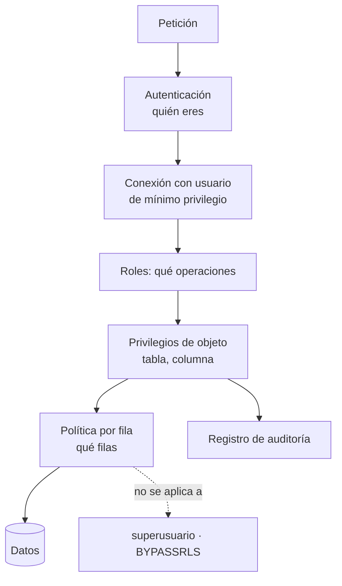

# 060 — Control de acceso: privilegio mínimo, roles y seguridad por fila

> [Programa](../../../README.md) · [Parte 11](../README.md) · [← Anterior](../../part-11-operacion-seguridad-y-gobierno/059-migraciones-evolutivas-sin-caida/README.md) · [Siguiente →](../../part-11-operacion-seguridad-y-gobierno/061-inyeccion-sql-y-parametrizacion/README.md)

Parte 11 — Operación, seguridad y gobierno · Intermedio ·
3 horas estimadas · motores `postgresql`, `mysql` · laboratorio
[`labs/03-transactions`](../../../labs/03-transactions/README.md) · 4 fuentes.

**Conceptos centrales:** `privilegio mínimo` · `rol` · `seguridad por fila` · `separación de funciones`

**En este caso se comparan 7 motores**: 6 lo resuelven (5 con el resultado comprobado por máquina) y 1 no, con el motivo escrito.

---

## Propósito

Declarar quién puede ver y hacer qué, en el motor y no solo en la aplicación. El control de acceso que vive únicamente en el código se salta con una consola y unas credenciales.

## Resultados de aprendizaje

Al terminar podrás:

1. Diseñar roles con privilegio mínimo y separación de funciones.
2. Distinguir privilegios de objeto, de columna y de fila.
3. Implementar seguridad por fila para multiinquilino.
4. Reconocer los riesgos de `SECURITY DEFINER` y del rol `PUBLIC`.
5. Auditar los privilegios efectivos de una base.

## Fundamentos

### Privilegio mínimo

Cada actor recibe **solo** lo que necesita. NIST SP 800-53 lo formaliza como control AC-6; OWASP lo sitúa como A01 (control de acceso roto), la categoría número uno de su Top 10.

La estructura habitual separa el **rol** (permisos) del **usuario** (identidad):

```sql
-- Roles por función, sin capacidad de conectarse
CREATE ROLE app_lectura   NOLOGIN;
CREATE ROLE app_escritura NOLOGIN;
CREATE ROLE app_migracion NOLOGIN;

GRANT USAGE ON SCHEMA public TO app_lectura, app_escritura, app_migracion;
GRANT SELECT ON ALL TABLES IN SCHEMA public TO app_lectura;
GRANT SELECT, INSERT, UPDATE, DELETE ON ALL TABLES IN SCHEMA public TO app_escritura;
GRANT ALL ON SCHEMA public TO app_migracion;

-- Los futuros objetos también, o el rol se queda obsoleto en la próxima migración
ALTER DEFAULT PRIVILEGES IN SCHEMA public
  GRANT SELECT ON TABLES TO app_lectura;

-- Usuarios: identidades que se conectan
CREATE USER svc_api        LOGIN PASSWORD '...' IN ROLE app_escritura;
CREATE USER svc_informes   LOGIN PASSWORD '...' IN ROLE app_lectura;
CREATE USER svc_migraciones LOGIN PASSWORD '...' IN ROLE app_migracion;
```

Tres cuentas con tres alcances distintos. Si se filtran las credenciales de `svc_informes`, el atacante lee; no borra.

**`ALTER DEFAULT PRIVILEGES` es imprescindible:** sin él, cada tabla nueva creada por una migración queda invisible para el rol de lectura, y alguien acaba «arreglándolo» con un `GRANT ALL`.

### Errores estructurales de PostgreSQL por defecto

```sql
-- Hasta PG 14, cualquiera podía crear objetos en el esquema public
REVOKE CREATE ON SCHEMA public FROM PUBLIC;
-- Cualquiera puede conectarse a cualquier base
REVOKE CONNECT ON DATABASE mi_base FROM PUBLIC;
```

`PUBLIC` no es «los administradores»: es **todo rol existente**. Los CIS Benchmarks incluyen ambas revocaciones entre sus controles de configuración endurecida.

### Seguridad por fila

Los privilegios de tabla son de todo o nada. Para multiinquilino hace falta filtrar por fila **en el motor**:

```sql
ALTER TABLE enrollments ENABLE ROW LEVEL SECURITY;
ALTER TABLE enrollments FORCE  ROW LEVEL SECURITY;   -- aplicar también al dueño

CREATE POLICY inquilino_aislado ON enrollments
  USING       (tenant_id = current_setting('app.tenant_id')::int)
  WITH CHECK  (tenant_id = current_setting('app.tenant_id')::int);
```

- `USING` filtra lo que se **lee** (y lo que se puede actualizar o borrar).
- `WITH CHECK` valida lo que se **escribe**: sin él, un inquilino podría insertar filas atribuidas a otro.

La aplicación fija la variable al tomar la conexión del agrupador:

```python
with pool.connection() as conn:
    conn.execute("SELECT set_config('app.tenant_id', %s, true)", (tenant,))
    # `true` = local a la transacción: se limpia al terminar, y una conexión
    # reutilizada del agrupador no hereda el inquilino de la petición anterior.
```

El tercer argumento `true` es la diferencia entre un aislamiento correcto y una fuga entre inquilinos con agrupadores de conexiones.

**Advertencia:** la seguridad por fila **no** se aplica a superusuarios ni a roles con `BYPASSRLS`. La aplicación nunca debe conectarse como superusuario, aquí menos que nunca.

### `SECURITY DEFINER`

Una función `SECURITY DEFINER` se ejecuta con los privilegios de quien la creó, no de quien la llama. Es útil y es la vía habitual de escalada de privilegios si se escribe mal:

```sql
CREATE FUNCTION resumen_curso(cid int) RETURNS TABLE(...) AS $$
  SELECT ... FROM enrollments WHERE course_id = cid;
$$ LANGUAGE sql SECURITY DEFINER SET search_path = pg_catalog, public;
```

`SET search_path` es obligatorio: sin él, quien llama puede crear un objeto en un esquema propio que sombree al real y hacer que la función ejecute su código con privilegios ajenos.



## Ejemplo trabajado

Plataforma multiinquilino: cada institución ve solo sus datos. Además, los docentes ven las notas de sus cursos y los estudiantes solo las propias.

```sql
ALTER TABLE enrollments ENABLE ROW LEVEL SECURITY;
ALTER TABLE enrollments FORCE  ROW LEVEL SECURITY;

-- Aislamiento entre instituciones: se aplica SIEMPRE, encima de todo lo demás
CREATE POLICY p_inquilino ON enrollments
  AS RESTRICTIVE
  USING (tenant_id = current_setting('app.tenant_id')::int);

-- Un estudiante ve sus propias inscripciones
CREATE POLICY p_estudiante ON enrollments
  FOR SELECT TO rol_estudiante
  USING (student_id = current_setting('app.user_id')::int);

-- Un docente ve las de los cursos que dicta
CREATE POLICY p_docente ON enrollments
  FOR SELECT TO rol_docente
  USING (EXISTS (SELECT 1 FROM teaching t
                 WHERE t.course_id = enrollments.course_id
                   AND t.teacher_id = current_setting('app.user_id')::int));

-- Y solo el docente puede calificar, solo sus cursos
CREATE POLICY p_docente_califica ON enrollments
  FOR UPDATE TO rol_docente
  USING      (EXISTS (SELECT 1 FROM teaching t WHERE t.course_id = enrollments.course_id
                        AND t.teacher_id = current_setting('app.user_id')::int))
  WITH CHECK (EXISTS (SELECT 1 FROM teaching t WHERE t.course_id = enrollments.course_id
                        AND t.teacher_id = current_setting('app.user_id')::int));
```

**Cómo se combinan las políticas** —esto es lo que se entiende mal—:

- Las políticas **permisivas** (por defecto) se combinan con **OR**: basta que una permita.
- Las **restrictivas** se combinan con **AND**: todas deben permitir.

Por eso `p_inquilino` es `RESTRICTIVE`: garantiza que ninguna política permisiva futura pueda saltarse el aislamiento entre instituciones. Si fuera permisiva, añadir mañana una política de «administrador ve todo» abriría un agujero entre inquilinos.

**Privilegios de columna** para datos sensibles:

```sql
REVOKE SELECT ON students FROM app_lectura;
GRANT  SELECT (id, nombre, email) ON students TO app_lectura;   -- sin RUT ni dirección
```

**Verificación, que es lo que convierte esto en ingeniería:**

```sql
SET app.tenant_id = '1';
SET app.user_id   = '11';
SET ROLE rol_estudiante;

SELECT count(*) FROM enrollments;             -- solo las del estudiante 11
SELECT count(*) FROM enrollments WHERE student_id <> 11;   -- debe ser 0
INSERT INTO enrollments (tenant_id, student_id, course_id) VALUES (2, 11, 1);
-- ERROR: new row violates row-level security policy
RESET ROLE;
```

Estas comprobaciones deben ser **pruebas automatizadas**. Una política de seguridad sin prueba es una intención.

**Auditoría de privilegios efectivos:**

```sql
SELECT grantee, table_name, string_agg(privilege_type, ', ') AS privilegios
FROM information_schema.role_table_grants
WHERE table_schema = 'public'
GROUP BY grantee, table_name ORDER BY grantee, table_name;

SELECT rolname, rolsuper, rolbypassrls, rolcreatedb FROM pg_roles
WHERE rolsuper OR rolbypassrls;    -- debe ser una lista muy corta y conocida
```

## Comparación

| Necesidad | Mecanismo |
|---|---|
| Servicio que solo lee | Rol con `SELECT` |
| Ocultar columnas sensibles | Privilegios de columna o vista |
| Aislar inquilinos | Política restrictiva por fila |
| Un usuario ve solo lo suyo | Política permisiva por fila |
| Operación privilegiada acotada | `SECURITY DEFINER` con `search_path` fijo |
| Saber quién hizo qué | Registro de auditoría |

## Errores frecuentes

1. **La aplicación se conecta como superusuario.** Ignora toda la seguridad por fila.
2. **Un solo usuario para todo.** Una filtración lo compromete todo.
3. **`set_config` sin `local = true`.** El inquilino persiste en la conexión reutilizada del agrupador: fuga entre inquilinos.
4. **Política sin `WITH CHECK`.** Se puede escribir en el ámbito de otro.
5. **Olvidar `ALTER DEFAULT PRIVILEGES`.** Las tablas nuevas quedan mal permisionadas.
6. **`PUBLIC` con privilegios.** Aplica a todos los roles.
7. **`SECURITY DEFINER` sin `search_path`.** Escalada de privilegios.

## De la clase a la operación

Las filtraciones de datos multiinquilino rara vez son un fallo del motor: son un `WHERE tenant_id = ?` que faltaba en una consulta nueva. La seguridad por fila hace que ese olvido sea imposible, porque el filtro deja de depender de que alguien lo escriba.

## Reto de transferencia

1. Diseña tres roles con privilegio mínimo para tu sistema.
2. Implementa el aislamiento entre inquilinos con una política restrictiva.
3. Escribe pruebas automatizadas que intenten leer y escribir fuera del ámbito.
4. Audita los privilegios efectivos y los roles con `BYPASSRLS`.

## Preguntas de evaluación

1. ¿Por qué la política de inquilino debe ser restrictiva y no permisiva?
2. Explica la fuga que produce `set_config` sin ámbito local en un agrupador.
3. ¿Qué añade `WITH CHECK` que `USING` no cubre?
4. Da un caso donde `SECURITY DEFINER` sea necesario y cómo lo asegurarías.

---

## 🌐 El mismo problema en cada motor

**Caso:** Cada cliente ve sus filas y solo las suyas

Tres notas de dos clientes en la misma tabla. La aplicación del cliente
`acme` tiene que ver dos filas y **no puede** ver la tercera. La pregunta de
la clase no es cómo filtrar —eso es un `WHERE`— sino **dónde vive ese
filtro**: si está en cada consulta, basta que una lo olvide para filtrar los
datos de otro cliente, y ese error no se detecta con pruebas funcionales
porque la consulta devuelve resultados perfectamente plausibles.

Cada motor ofrece un sitio distinto donde poner la frontera: una política de
fila que el servidor aplica siempre, una vista con permisos, un usuario por
inquilino o nada en absoluto. El caso muestra la forma mínima —la vista— y
la matriz dice hasta dónde llega cada uno.

Salida esperada, idéntica en todos los motores que lo resuelven:

| estudiante | nota |
|---|---|
| `Ada` | `90` |
| `Bea` | `58` |

El contrato vive en [`motores.yaml`](motores.yaml) y lo comprueba
`python scripts/verificar_equivalencia.py --clase 060`: 5 de
las 6 implementaciones se ejecutan de verdad y su
resultado se compara con esa tabla; el resto se declara como material revisado,
no ejecutado.

| Motor | ¿Resuelve el caso? | Nivel de prueba | Código | Fuente |
|---|---|---|---|---|
| PostgreSQL | sí | servicio | [código](implementaciones/postgresql/consulta.sql) | [doc oficial](https://www.postgresql.org/docs/current/ddl-rowsecurity.html) |
| SQLite | sí | núcleo | [código](implementaciones/sqlite/consulta.sql) | [doc oficial](https://sqlite.org/lang_createview.html) |
| DuckDB | sí | núcleo | [código](implementaciones/duckdb/consulta.sql) | [doc oficial](https://duckdb.org/docs/stable/sql/statements/create_view) |
| MySQL | sí | servicio | [código](implementaciones/mysql/consulta.sql) | [doc oficial](https://dev.mysql.com/doc/refman/8.4/en/create-view.html) |
| MongoDB | sí | servicio | [código](implementaciones/mongodb/consulta.js) | [doc oficial](https://www.mongodb.com/docs/manual/core/views/) |
| Microsoft SQL Server | sí | declarado | [código](implementaciones/sql-server/consulta.sql) | [doc oficial](https://learn.microsoft.com/sql/relational-databases/security/row-level-security) |
| Redis | **no** | — | — | [doc oficial](https://redis.io/docs/latest/operate/oss_and_stack/management/security/acl/) |

### Los que resuelven el caso

#### PostgreSQL · [`implementaciones/postgresql/consulta.sql`](implementaciones/postgresql/consulta.sql)

✅ **verificado** — se ejecuta contra el motor real levantado con `docker compose`

```sql
-- motor: postgresql
-- doc: https://www.postgresql.org/docs/current/ddl-rowsecurity.html
-- nota: aqui la frontera NO esta en la consulta: la aplica el servidor. El
--       SELECT de abajo no lleva ningun WHERE sobre el inquilino y aun asi
--       devuelve solo dos filas.
--
--       TRES trampas, y las tres se descubren tarde:
--       1) El SUPERUSUARIO se salta TODAS las politicas, siempre, y no hay
--          FORCE que lo impida. Como el usuario de la aplicacion en un entorno
--          de desarrollo suele ser superusuario, la proteccion parece no
--          funcionar. Por eso este guion crea un rol sin privilegios y cambia a
--          el antes de consultar: sin ese SET ROLE, esta consulta devuelve las
--          TRES filas.
--       2) FORCE ROW LEVEL SECURITY: sin el, el DUENO de la tabla tambien se
--          salta sus propias politicas.
--       3) La politica se evalua por fila: si consulta otras tablas, puede
--          impedir el uso de indices y costar mas que la propia consulta.

-- === preparacion ===
DROP TABLE IF EXISTS notas;

CREATE TABLE notas (
    inquilino  text NOT NULL,
    estudiante text NOT NULL,
    nota       integer NOT NULL,
    PRIMARY KEY (inquilino, estudiante)
);
INSERT INTO notas (inquilino, estudiante, nota) VALUES
    ('acme',   'Ada', 90),
    ('acme',   'Bea', 58),
    ('globex', 'Cid', 77);

ALTER TABLE notas ENABLE ROW LEVEL SECURITY;
ALTER TABLE notas FORCE ROW LEVEL SECURITY;

CREATE POLICY solo_mi_inquilino ON notas
    USING (inquilino = current_setting('app.inquilino', true));

-- El rol de la aplicacion: sin privilegios especiales, que es la unica forma de
-- que las politicas se le apliquen.
DO $$
BEGIN
    IF NOT EXISTS (SELECT 1 FROM pg_roles WHERE rolname = 'app_inquilino') THEN
        CREATE ROLE app_inquilino NOLOGIN;
    END IF;
END;
$$;
-- Y los permisos minimos: ver el esquema y leer la tabla. Nada mas.
DO $$
BEGIN
    EXECUTE format('GRANT USAGE ON SCHEMA %I TO app_inquilino', current_schema());
END;
$$;
GRANT SELECT ON notas TO app_inquilino;

-- === consulta ===
-- La aplicacion fija su identidad al abrir la conexion. A partir de ahi,
-- ninguna consulta necesita —ni puede— saltarse el filtro.
SET app.inquilino = 'acme';
SET ROLE app_inquilino;

SELECT estudiante, nota FROM notas ORDER BY estudiante;
```

- **Por qué sí:** La seguridad a nivel de fila la aplica **el servidor**, no la consulta: con `ENABLE ROW LEVEL SECURITY` y una política, una consulta sin `WHERE` devuelve solo las filas permitidas. Es la única forma de que olvidarse del filtro deje de ser posible.
- **Por qué no:** La política se evalúa por fila y puede impedir el uso de índices si está mal escrita; y hay que recordar `FORCE ROW LEVEL SECURITY`, porque el dueño de la tabla **se salta sus propias políticas** por omisión. Es una trampa que aparece justo en las pruebas, donde todo se ejecuta como dueño.
- 📄 Documentación oficial: <https://www.postgresql.org/docs/current/ddl-rowsecurity.html>

#### SQLite · [`implementaciones/sqlite/consulta.sql`](implementaciones/sqlite/consulta.sql)

✅ **verificado** — se ejecuta en CI sin servicios

```sql
-- motor: sqlite
-- doc: https://sqlite.org/lang_createview.html
-- nota: la vista es una CONVENCION, no un control de acceso: nada impide que el
--       mismo proceso consulte `notas` directamente. En SQLite, quien tiene el
--       archivo lo tiene todo.

-- === preparacion ===
CREATE TABLE notas (
    inquilino  TEXT NOT NULL,
    estudiante TEXT NOT NULL,
    nota       INTEGER NOT NULL,
    PRIMARY KEY (inquilino, estudiante)
);
INSERT INTO notas (inquilino, estudiante, nota) VALUES
    ('acme',   'Ada', 90),
    ('acme',   'Bea', 58),
    ('globex', 'Cid', 77);

-- La vista ES la frontera. La aplicacion consulta `mis_notas`, nunca `notas`,
-- y el filtro por inquilino deja de depender de que cada consulta se acuerde
-- de escribirlo. Basta UNA consulta que lo olvide para filtrar los datos de
-- otro cliente.
CREATE VIEW mis_notas AS
SELECT estudiante, nota
FROM notas
WHERE inquilino = 'acme';

-- === consulta ===
SELECT estudiante, nota FROM mis_notas ORDER BY estudiante;
```

- **Por qué sí:** La vista es la forma mínima y portable de la frontera: la aplicación consulta `mis_notas` y nunca `notas`, así que el filtro está en un solo sitio.
- **Por qué no:** No hay usuarios ni permisos: nada impide que el mismo proceso consulte la tabla de debajo. La frontera es una convención, no un control de acceso, y quien tenga el archivo lo tiene todo.
- 📄 Documentación oficial: <https://sqlite.org/lang_createview.html>

#### DuckDB · [`implementaciones/duckdb/consulta.sql`](implementaciones/duckdb/consulta.sql)

✅ **verificado** — se ejecuta en CI sin servicios

```sql
-- motor: duckdb
-- doc: https://duckdb.org/docs/stable/sql/statements/create_view
-- nota: la auditoria que precede a cualquier control de acceso:
--         SELECT inquilino, COUNT(*) FROM notas GROUP BY inquilino;
--         SELECT COUNT(*) FROM notas WHERE inquilino IS NULL OR inquilino = '';
--       La segunda busca el agujero clasico del esquema multiinquilino: filas
--       sin inquilino, que las politicas no saben de quien son.

-- === preparacion ===
CREATE TABLE notas (
    inquilino  VARCHAR NOT NULL,
    estudiante VARCHAR NOT NULL,
    nota       INTEGER NOT NULL,
    PRIMARY KEY (inquilino, estudiante)
);
INSERT INTO notas (inquilino, estudiante, nota) VALUES
    ('acme',   'Ada', 90),
    ('acme',   'Bea', 58),
    ('globex', 'Cid', 77);

-- La vista ES la frontera. La aplicacion consulta `mis_notas`, nunca `notas`,
-- y el filtro por inquilino deja de depender de que cada consulta se acuerde
-- de escribirlo. Basta UNA consulta que lo olvide para filtrar los datos de
-- otro cliente.
CREATE VIEW mis_notas AS
SELECT estudiante, nota
FROM notas
WHERE inquilino = 'acme';

-- === consulta ===
SELECT estudiante, nota FROM mis_notas ORDER BY estudiante;
```

- **Por qué sí:** Sirve para la auditoría que precede a cualquier control de acceso: contar cuántas filas de cada inquilino hay y comprobar que ninguna tiene el campo vacío, que es el agujero clásico de los esquemas multiinquilino.
- **Por qué no:** No tiene usuarios, roles ni políticas: no es un sitio donde poner una frontera de seguridad, sino donde analizar los datos que ya cruzaron una.
- 📄 Documentación oficial: <https://duckdb.org/docs/stable/sql/statements/create_view>

#### MySQL · [`implementaciones/mysql/consulta.sql`](implementaciones/mysql/consulta.sql)

✅ **verificado** — se ejecuta contra el motor real levantado con `docker compose`

```sql
-- motor: mysql
-- doc: https://dev.mysql.com/doc/refman/8.4/en/create-view.html
-- nota: MySQL NO tiene seguridad a nivel de fila. Lo mas parecido es una vista
--       con SQL SECURITY DEFINER y permisos:
--         GRANT SELECT ON learning.mis_notas TO 'app_acme'@'%';
--         REVOKE ALL ON learning.notas FROM 'app_acme'@'%';
--       Asi la vista deja de ser una convencion y pasa a ser una frontera. El
--       limite: para cien inquilinos hacen falta cien vistas o cien bases.

-- === preparacion ===
DROP VIEW IF EXISTS mis_notas;
DROP TABLE IF EXISTS notas;

CREATE TABLE notas (
    inquilino  VARCHAR(50) NOT NULL,
    estudiante VARCHAR(50) NOT NULL,
    nota       INT NOT NULL,
    PRIMARY KEY (inquilino, estudiante)
);
INSERT INTO notas (inquilino, estudiante, nota) VALUES
    ('acme',   'Ada', 90),
    ('acme',   'Bea', 58),
    ('globex', 'Cid', 77);

-- La vista ES la frontera. La aplicacion consulta `mis_notas`, nunca `notas`,
-- y el filtro por inquilino deja de depender de que cada consulta se acuerde
-- de escribirlo. Basta UNA consulta que lo olvide para filtrar los datos de
-- otro cliente.
CREATE VIEW mis_notas AS
SELECT estudiante, nota
FROM notas
WHERE inquilino = 'acme';

-- === consulta ===
SELECT estudiante, nota FROM mis_notas ORDER BY estudiante;
```

- **Por qué sí:** Tiene vistas con `SQL SECURITY DEFINER`, que ejecutan con los privilegios de quien las creó: se puede dar acceso a la vista y negarlo a la tabla, lo que convierte la vista en una frontera de verdad y no solo en una convención.
- **Por qué no:** **No tiene seguridad a nivel de fila.** Todo se apoya en vistas y permisos, y para muchos inquilinos hace falta una vista o una base por inquilino: la solución no escala a cientos de clientes.
- 📄 Documentación oficial: <https://dev.mysql.com/doc/refman/8.4/en/create-view.html>

#### MongoDB · [`implementaciones/mongodb/consulta.js`](implementaciones/mongodb/consulta.js)

✅ **verificado** — se ejecuta contra el motor real levantado con `docker compose`

```javascript
// motor: mongodb
// doc: https://www.mongodb.com/docs/manual/core/views/
// nota: la vista de solo lectura con la tuberia filtrada, mas un rol que de
//       acceso a la vista y NO a la coleccion, consigue la misma frontera:
//         db.createRole({ role: "acme_lector",
//                         privileges: [{ resource: { db: "learning",
//                                                    collection: "mis_notas" },
//                                        actions: ["find"] }], roles: [] })
//       En la version Community no hay control por documento: es por coleccion.

// === preparacion ===
db.mis_notas.drop();
db.notas.drop();

db.notas.insertMany([
  { inquilino: "acme", estudiante: "Ada", nota: 90 },
  { inquilino: "acme", estudiante: "Bea", nota: 58 },
  { inquilino: "globex", estudiante: "Cid", nota: 77 },
]);

db.createView("mis_notas", "notas", [
  { $match: { inquilino: "acme" } },
  { $project: { _id: 0, estudiante: 1, nota: 1 } },
]);

// === consulta ===
db.mis_notas
  .find()
  .sort({ estudiante: 1 })
  .forEach((d) => print(d.estudiante + "|" + d.nota));
```

- **Por qué sí:** Una vista de solo lectura con la tubería filtrada, más un rol que dé acceso a la vista y no a la colección, consigue lo mismo. Y con la versión Enterprise existe redacción a nivel de campo.
- **Por qué no:** No hay seguridad a nivel de documento en la versión Community: el control es por colección. Y el modelo habitual —un campo `inquilino` en cada documento— depende por completo de que la aplicación no se equivoque.
- 📄 Documentación oficial: <https://www.mongodb.com/docs/manual/core/views/>

#### Microsoft SQL Server · [`implementaciones/sql-server/consulta.sql`](implementaciones/sql-server/consulta.sql)

⚪ **declarado** — se revisa a mano contra la documentación citada; la máquina no lo ejecuta

```sql
-- motor: sql-server
-- doc: https://learn.microsoft.com/sql/relational-databases/security/row-level-security
-- nota: implementacion declarada. SQL Server separa dos cosas que conviene no
--       confundir:
--         predicado de FILTRO   -> que filas se VEN
--         predicado de BLOQUEO  -> que filas se pueden ESCRIBIR
--       Sin el segundo, un usuario puede insertar filas de otro inquilino que
--       despues no podra ver: el dato se pierde de vista sin haberse borrado.

-- === preparacion ===
DROP SECURITY POLICY IF EXISTS dbo.politica_inquilino;
DROP FUNCTION IF EXISTS dbo.fn_inquilino;
DROP TABLE IF EXISTS dbo.notas;

CREATE TABLE dbo.notas (
    inquilino  NVARCHAR(50) NOT NULL,
    estudiante NVARCHAR(50) NOT NULL,
    nota       INT NOT NULL,
    CONSTRAINT pk_notas PRIMARY KEY (inquilino, estudiante)
);
INSERT INTO dbo.notas (inquilino, estudiante, nota) VALUES
    (N'acme', N'Ada', 90), (N'acme', N'Bea', 58), (N'globex', N'Cid', 77);
GO

-- SCHEMABINDING y una funcion simple: se ejecuta POR FILA.
CREATE FUNCTION dbo.fn_inquilino(@inquilino AS NVARCHAR(50))
RETURNS TABLE
WITH SCHEMABINDING
AS
RETURN SELECT 1 AS visible
       WHERE @inquilino = CAST(SESSION_CONTEXT(N'inquilino') AS NVARCHAR(50));
GO

CREATE SECURITY POLICY dbo.politica_inquilino
ADD FILTER PREDICATE dbo.fn_inquilino(inquilino) ON dbo.notas,
ADD BLOCK PREDICATE dbo.fn_inquilino(inquilino) ON dbo.notas AFTER INSERT
WITH (STATE = ON);
GO

-- === consulta ===
EXEC sp_set_session_context @key = N'inquilino', @value = N'acme';

SELECT estudiante, nota FROM dbo.notas ORDER BY estudiante;
```

- **Por qué sí:** Su seguridad a nivel de fila se declara con una función con valores de tabla y una política de seguridad, y distingue **predicados de filtro** —qué se ve— de **predicados de bloqueo** —qué se puede escribir—, una separación que PostgreSQL cubre con dos cláusulas distintas.
- **Por qué no:** La función de predicado se ejecuta por fila y se convierte en el cuello de botella si consulta otras tablas; hay que escribirla con `SCHEMABINDING` y mantenerla simple, o el filtro cuesta más que la consulta.
- 📄 Documentación oficial: <https://learn.microsoft.com/sql/relational-databases/security/row-level-security>

### Los que no resuelven este caso — y qué se hace en su lugar

Descartar un motor con un argumento es tan formativo como usarlo. Ninguna de estas filas dice que el motor sea peor: dice que este problema no es el suyo.

| Motor | Por qué no | Qué se hace en su lugar | Fuente |
|---|---|---|---|
| Redis | El control de acceso llega hasta el patrón de clave: las ACL permiten restringir a `~acme:*`, pero no hay forma de filtrar **dentro** de un valor. Si los datos de dos inquilinos comparten una estructura, no hay frontera posible. | Separar por prefijo de clave desde el diseño (`acme:notas:...`) y usar ACL por usuario sobre ese patrón: la frontera se consigue por nomenclatura, y hay que sostenerla en cada escritura. | [doc](https://redis.io/docs/latest/operate/oss_and_stack/management/security/acl/) |

---

## Laboratorio

```bash
python scripts/validate_repository.py
python labs/03-transactions/run_transactions_lab.py
```

Guarda como evidencia la salida completa, la versión del motor y la semilla o
los parámetros usados. Una captura sin comando no es evidencia: no se puede
repetir.

## Evaluación

| Criterio | Peso | Qué se comprueba |
|---|---:|---|
| Comprensión conceptual | 25 % | Explica el mecanismo, no solo el resultado |
| Ejecución reproducible | 25 % | Otra persona obtiene lo mismo con las instrucciones dadas |
| Interpretación basada en evidencia | 25 % | Cada conclusión se apoya en una salida o una medición |
| Límites y riesgos declarados | 25 % | Dice qué no demuestra el ejercicio y qué faltaría en producción |

La clase se da por superada cuando la respuesta explica el mecanismo, muestra
la salida que la respalda y declara al menos un límite del ejercicio.

## Fuentes de esta clase

Todo lo afirmado arriba procede de estas obras. Los identificadores viven en
[`catalog/sources.json`](../../../catalog/sources.json) y el estado de los
enlaces se comprueba con `python scripts/check_external_links.py`.

- **PostgreSQL Global Development Group** (2026). [PostgreSQL: Row Security Policies](https://www.postgresql.org/docs/current/ddl-rowsecurity.html).  
  Control de acceso por fila declarado en el propio motor.
- **NIST** (2020). [NIST SP 800-53 Rev. 5: Security and Privacy Controls for Information Systems](https://csrc.nist.gov/pubs/sp/800/53/r5/upd1/final).  
  Controles de auditoria, cifrado y acceso aplicables a bases de datos.
- **Center for Internet Security** (2026). [CIS Benchmarks](https://www.cisecurity.org/cis-benchmarks).  
  Guias de configuración endurecida para PostgreSQL, MySQL, MongoDB y otros.
- **OWASP** (2021). [OWASP Top 10](https://owasp.org/Top10/).  
  A03 Inyección y A01 Control de acceso roto afectan directamente al diseño de datos.

---

> [Programa](../../../README.md) · [Parte 11](../README.md) · [← Anterior](../../part-11-operacion-seguridad-y-gobierno/059-migraciones-evolutivas-sin-caida/README.md) · [Siguiente →](../../part-11-operacion-seguridad-y-gobierno/061-inyeccion-sql-y-parametrizacion/README.md)
