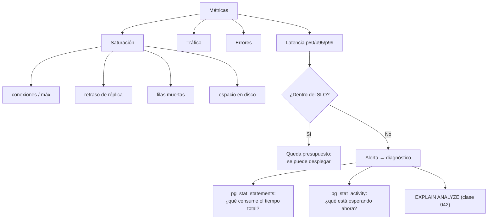

# 062 — Observabilidad, objetivos de servicio y capacidad

> [Programa](../../../README.md) · [Parte 11](../README.md) · [← Anterior](../../part-11-operacion-seguridad-y-gobierno/061-inyeccion-sql-y-parametrizacion/README.md) · [Siguiente →](../../part-11-operacion-seguridad-y-gobierno/063-privacidad-retencion-y-gobierno-del-dato/README.md)

Parte 11 — Operación, seguridad y gobierno · Avanzado ·
3 horas estimadas · motores `postgresql`, `mongodb` · laboratorio
[`labs/04-indexing`](../../../labs/04-indexing/README.md) · 3 fuentes.

**Conceptos centrales:** `percentil` · `presupuesto de error` · `saturación` · `consulta lenta`

**En este caso se comparan 7 motores**: 6 lo resuelven (0 con el resultado comprobado por máquina) y 1 no, con el motivo escrito.

---

## Propósito

Saber cómo está la base antes de que alguien se queje, y expresar «está bien» como un número acordado en lugar de una impresión.

## Resultados de aprendizaje

Al terminar podrás:

1. Definir un SLI y un SLO de base de datos y derivar el presupuesto de error.
2. Explicar por qué la latencia se mide en percentiles y nunca en medias.
3. Instrumentar las cuatro señales de un almacén de datos.
4. Identificar las consultas que consumen el tiempo total, no las más lentas.
5. Estimar capacidad con un criterio de saturación.

## Fundamentos

### SLI, SLO y presupuesto de error

- **SLI:** lo que se mide (`% de consultas por debajo de 100 ms`).
- **SLO:** el objetivo acordado (`99,9 % de las consultas por debajo de 100 ms en 30 días`).
- **Presupuesto de error:** lo que se permite fallar. Con un SLO del 99,9 % son **43 minutos al mes**.

El presupuesto es una herramienta de decisión: mientras quede, se puede desplegar y experimentar; si se agota, se para y se estabiliza. Convierte una discusión de opiniones en una regla.

### Percentiles, no medias

Dean y Barroso lo demuestran: la media oculta exactamente lo que importa.

```text
1 000 consultas: 990 de 5 ms, 10 de 2 000 ms
media   = (990·5 + 10·2000) / 1000 = 24,95 ms      ← «todo bien»
p50     = 5 ms
p99     = 2 000 ms                                  ← 10 usuarios esperaron 2 s
```

Y el efecto se **amplifica** cuando una petición hace varias consultas. Si una página lanza 20 consultas en serie con p99 de 100 ms:

```text
P(al menos una consulta cae en el p99) = 1 - 0,99²⁰ = 18,2 %
```

Casi una de cada cinco cargas de página sufre la latencia del p99. Por eso la cola alta importa mucho más de lo que su porcentaje sugiere, y por eso reducir el número de consultas por petición suele mejorar más que optimizar cada una.

### Las cuatro señales

| Señal | Qué medir en una base de datos |
|---|---|
| **Latencia** | p50, p95, p99 por tipo de consulta; separando errores de aciertos |
| **Tráfico** | Consultas/s, transacciones/s, filas devueltas/s |
| **Errores** | Fallos de serialización, interbloqueos, tiempos agotados, conexiones rechazadas |
| **Saturación** | Conexiones usadas / máximo, retraso de réplica, filas muertas, espacio, aciertos de caché |

La saturación es la que **predice**; las otras tres describen el presente.

### Las consultas que importan

El error habitual es optimizar la consulta más lenta. Lo correcto es optimizar la que consume **más tiempo total**:

```sql
CREATE EXTENSION IF NOT EXISTS pg_stat_statements;

SELECT substring(query, 1, 70) AS consulta,
       calls,
       round(mean_exec_time::numeric, 2)  AS media_ms,
       round(total_exec_time::numeric)    AS total_ms,
       round(100 * total_exec_time / sum(total_exec_time) OVER (), 1) AS pct
FROM pg_stat_statements
ORDER BY total_exec_time DESC LIMIT 10;
```

```text
consulta                              calls    media_ms   total_ms   pct
SELECT ... FROM enrollments WHERE ... 4 200 000     2,10  8 820 000  61,2   ← aquí
SELECT ... FROM courses c JOIN ...           40  8 100,00   324 000   2,2   ← no aquí
```

Una consulta de 2 ms ejecutada cuatro millones de veces consume 27 veces más tiempo que una de 8 segundos ejecutada 40 veces. Bajarla de 2,1 ms a 0,8 ms libera más capacidad que cualquier trabajo sobre la lenta.

### Consultas en curso

```sql
SELECT pid, now() - query_start AS duracion, state, wait_event_type, wait_event,
       substring(query, 1, 80)
FROM pg_stat_activity
WHERE state <> 'idle' ORDER BY duracion DESC LIMIT 10;
```

`wait_event` dice **por qué** espera: bloqueo, E/S, red o cliente. Un `Client:ClientRead` prolongado significa que el motor terminó y la aplicación no lee: el problema no está en la base.



## Ejemplo trabajado

Plataforma con SLO: *«99,5 % de las consultas de lectura por debajo de 200 ms, medido en ventanas de 30 días»*.

**Presupuesto de error:**

```text
0,5 % de 30 días = 3 h 39 min de incumplimiento permitido
con 50 M de consultas mensuales: 250 000 consultas pueden exceder 200 ms
```

**Panel mínimo:**

```sql
-- Latencia por tipo, desde pg_stat_statements (media; los percentiles reales
-- vienen del cliente, que es donde se percibe la latencia de verdad)
SELECT queryid, calls, mean_exec_time, max_exec_time FROM pg_stat_statements
ORDER BY total_exec_time DESC LIMIT 20;

-- Saturación de conexiones
SELECT count(*) FILTER (WHERE state = 'active')          AS activas,
       count(*)                                          AS totales,
       current_setting('max_connections')::int           AS maximo,
       round(100.0 * count(*) / current_setting('max_connections')::int, 1) AS pct
FROM pg_stat_activity;

-- Retraso de réplica en segundos
SELECT client_addr, extract(epoch FROM replay_lag) AS retraso_s FROM pg_stat_replication;

-- Deuda de vacuum
SELECT relname, n_dead_tup,
       round(100.0*n_dead_tup/NULLIF(n_live_tup+n_dead_tup,0),1) AS pct_muertas
FROM pg_stat_user_tables WHERE n_dead_tup > 100000 ORDER BY n_dead_tup DESC;
```

**Alertas, con la distinción que importa:**

| Alerta | Umbral | Tipo |
|---|---|---|
| p99 de lectura > 200 ms durante 10 min | SLO | **Página**: afecta a usuarios |
| Conexiones > 80 % del máximo | Saturación | **Página**: precede a un rechazo |
| Retraso de réplica > 30 s | Saturación | Página |
| Espacio libre < 20 % | Saturación | Página |
| Filas muertas > 30 % en tabla grande | Saturación | **Ticket**: degradación lenta |
| Interbloqueos > 10/h | Errores | Ticket |
| Sin restauración verificada en 35 días | Proceso | Ticket |

La distinción página/ticket es la que hace sostenible la guardia: solo despierta a alguien lo que afecta a usuarios o lo que va a hacerlo pronto.

**Capacidad.** La regla operativa más útil para una base transaccional:

```text
Con utilización > 70 % sostenida, la latencia crece de forma no lineal
(teoría de colas: el tiempo de espera tiende a infinito al acercarse a 1)

utilización actual: 45 %
crecimiento:        8 % mensual
meses hasta el 70 %: ln(70/45) / ln(1,08) ≈ 5,7 meses
```

Ese número —cinco meses y medio— es lo que convierte «hay que crecer en algún momento» en una tarea con fecha.

**Contraejemplo instructivo.** Un servicio reportaba latencia alta; el panel de la base mostraba p99 de 3 ms y utilización del 30 %.

```sql
SELECT wait_event_type, wait_event, count(*)
FROM pg_stat_activity WHERE state <> 'idle' GROUP BY 1,2 ORDER BY 3 DESC;
```

```text
Client   ClientRead    47
```

Cuarenta y siete conexiones esperando a que la aplicación **leyera** el resultado. El motor había terminado. El cuello de botella estaba en el cliente, que procesaba fila a fila. La base estaba sana y el panel de la base lo decía; sin esa consulta, el equipo habría pasado días optimizando consultas que ya eran rápidas.

## Comparación

| Pregunta | Fuente |
|---|---|
| ¿Qué consume el tiempo total? | `pg_stat_statements` por `total_exec_time` |
| ¿Qué pasa ahora mismo? | `pg_stat_activity` |
| ¿Por qué esta consulta es lenta? | `EXPLAIN ANALYZE` (clase 042) |
| ¿Estamos saturando? | Conexiones, retraso, espacio, filas muertas |
| ¿Cumplimos lo prometido? | SLI frente a SLO, con percentiles del cliente |
| ¿Cuánto aguantamos? | Utilización + tasa de crecimiento |

## Errores frecuentes

1. **Medir la media.** Oculta la cola, que es lo que sufre el usuario.
2. **Optimizar la consulta más lenta.** Casi nunca es la que consume el tiempo.
3. **Alertar sobre CPU.** Rara vez es la causa en una base de datos.
4. **Medir la latencia solo en el servidor.** El usuario percibe la del cliente, con red y agrupador incluidos.
5. **Alertas sin distinguir página de ticket.** Fatiga de alertas y guardias que se ignoran.
6. **SLO sin acuerdo con el negocio.** Un objetivo que nadie firmó no dirige ninguna decisión.
7. **No medir la saturación.** Se descubre el límite cuando se cruza.

## De la clase a la operación

La instrumentación se instala **antes** del incidente. Durante uno, no hay tiempo de crear un panel, y las decisiones se toman con la intuición de quien habla más fuerte. `pg_stat_statements` activado desde el primer día es la inversión de menor costo y mayor retorno.

## Reto de transferencia

1. Define un SLI y un SLO para una operación crítica y calcula su presupuesto de error.
2. Instala `pg_stat_statements` y ordena por tiempo total; identifica la consulta dominante.
3. Construye el panel con las cuatro señales y clasifica cada alerta en página o ticket.
4. Calcula los meses que faltan hasta el 70 % de utilización con tu crecimiento real.

## Preguntas de evaluación

1. Con p99 de 100 ms y 20 consultas por petición, ¿qué fracción de peticiones sufre la cola?
2. ¿Por qué una consulta de 2 ms puede ser más urgente que una de 8 s?
3. Da tres métricas de saturación de tu base y el umbral que elegirías para cada una.
4. Interpreta un `wait_event` de `Client:ClientRead` sostenido en 50 conexiones.

---

## 🌐 El mismo problema en cada motor

**Caso:** Qué mirar cuando la base va lenta, y desde dónde

«La base de datos va lenta» no es un diagnóstico: es una queja. Convertirla
en un diagnóstico exige tres cosas distintas, y cada motor las expone en
sitios distintos: **qué consultas** consumen el tiempo, **en qué esperan**
las sesiones, y **cuánta capacidad** queda antes de que deje de aguantar.

Y antes de mirar nada, hay que haber decidido **qué se promete**: un
objetivo de nivel de servicio expresado en percentiles —«el 99 % de las
lecturas en menos de 50 ms»— y no en medias, porque la media esconde
justamente la cola que sufre el usuario.

Esta comparación no ejecuta nada: enumera, motor por motor, dónde está cada
una de esas tres respuestas.

Esta comparación es **conceptual**: la decisión no se reduce a una consulta con
resultado, así que aquí no hay sello de máquina. Lo que se compara es lo que
cada motor **ofrece** y a qué precio, con la página oficial al lado de cada
afirmación.

| Motor | ¿Resuelve el caso? | Nivel de prueba | Código | Fuente |
|---|---|---|---|---|
| PostgreSQL | sí | conceptual | — | [doc oficial](https://www.postgresql.org/docs/current/pgstatstatements.html) |
| MySQL | sí | conceptual | — | [doc oficial](https://dev.mysql.com/doc/refman/8.4/en/performance-schema.html) |
| MongoDB | sí | conceptual | — | [doc oficial](https://www.mongodb.com/docs/manual/tutorial/manage-the-database-profiler/) |
| Redis | sí | conceptual | — | [doc oficial](https://redis.io/docs/latest/commands/slowlog-get/) |
| Apache Cassandra | sí | conceptual | — | [doc oficial](https://cassandra.apache.org/doc/latest/cassandra/managing/tools/nodetool/nodetool.html) |
| SQLite | sí | conceptual | — | [doc oficial](https://sqlite.org/c3ref/profile.html) |
| DuckDB | **no** | — | — | [doc oficial](https://duckdb.org/docs/stable/dev/profiling) |

### Los que resuelven el caso

#### PostgreSQL

- **Cómo se hace aquí:** `pg_stat_statements` acumula tiempo total, llamadas y filas por consulta normalizada: es la respuesta a «qué consume el tiempo». `pg_stat_activity` con la columna `wait_event` responde «en qué esperan». Y `pg_stat_user_tables` con `n_dead_tup` y la antigüedad de transacción avisan de la capacidad que queda antes de que el vacío se convierta en un incidente.
- **Por qué sí:** Es la instrumentación más completa y **consultable con SQL**: los mismos paneles se construyen con las mismas consultas, sin agente ni producto.
- **Por qué no:** `pg_stat_statements` es una extensión que hay que activar y que cuesta un poco de sobrecarga, y sus contadores son acumulados desde el arranque: sin tomar diferencias entre dos instantes, no dicen nada del último minuto.
- 📄 Documentación oficial: <https://www.postgresql.org/docs/current/pgstatstatements.html>

#### MySQL

- **Cómo se hace aquí:** El esquema `performance_schema` y las vistas de `sys` —`sys.statement_analysis`, `sys.schema_table_statistics`— dan el mismo trío, y el registro de consultas lentas sigue siendo la vía más directa para encontrar las peores.
- **Por qué sí:** `sys` presenta la información ya interpretada y con unidades legibles, que es exactamente lo que falta cuando hay que diagnosticar deprisa.
- **Por qué no:** `performance_schema` tiene un costo notable y viene con parte de la instrumentación desactivada: decidir qué activar es un compromiso entre visibilidad y rendimiento que hay que tomar antes del incidente, no durante.
- 📄 Documentación oficial: <https://dev.mysql.com/doc/refman/8.4/en/performance-schema.html>

#### MongoDB

- **Cómo se hace aquí:** El perfilador de base de datos guarda las operaciones lentas en una colección consultable, `db.currentOp()` muestra lo que está corriendo ahora, y `db.serverStatus()` da los contadores globales.
- **Por qué sí:** Que el perfil sea una **colección** significa que se analiza con las mismas herramientas que los datos: se puede agregar, ordenar y filtrar sin exportar nada.
- **Por qué no:** El perfilador tiene costo y por eso viene desactivado; activarlo al 100 % en producción es una mala idea, y activarlo solo por encima de un umbral hace que se pierdan justo las operaciones que aún no eran lentas y estaban a punto de serlo.
- 📄 Documentación oficial: <https://www.mongodb.com/docs/manual/tutorial/manage-the-database-profiler/>

#### Redis

- **Cómo se hace aquí:** `SLOWLOG GET` guarda las órdenes que superaron un umbral —y en un servidor de un solo hilo, esas son las que bloquearon a todos—, `INFO` da memoria, conexiones y aciertos de caché, y `LATENCY DOCTOR` interpreta los picos.
- **Por qué sí:** La métrica que importa es una y es evidente: cuánto tiempo estuvo bloqueado el hilo único. El registro de lentas la responde directamente.
- **Por qué no:** `INFO` no da percentiles ni series temporales: solo el estado actual y contadores acumulados. Cualquier objetivo de servicio en percentiles hay que medirlo desde el cliente, no desde Redis.
- 📄 Documentación oficial: <https://redis.io/docs/latest/commands/slowlog-get/>

#### Apache Cassandra

- **Cómo se hace aquí:** `nodetool tpstats` muestra las colas de hilos y las tareas descartadas —la señal más clara de saturación—, `nodetool tablehistograms` da percentiles reales de latencia por tabla, y `nodetool tablestats` avisa de particiones grandes y de lápidas por lectura.
- **Por qué sí:** Es de los pocos que expone **percentiles** directamente, en vez de medias, y por tabla: es la información que un objetivo de servicio necesita.
- **Por qué no:** Todo es por nodo: no hay una vista del clúster sin una herramienta que agregue. Diagnosticar un clúster de treinta nodos con `nodetool` es inviable sin recolección centralizada.
- 📄 Documentación oficial: <https://cassandra.apache.org/doc/latest/cassandra/managing/tools/nodetool/nodetool.html>

#### SQLite

- **Cómo se hace aquí:** No hay vistas de estadísticas ni sesiones que observar: la instrumentación es del proceso que lo enlaza. `sqlite3_profile`, `sqlite3_status` y `PRAGMA compile_options` dan lo que hay.
- **Por qué sí:** Al vivir dentro de la aplicación, se instrumenta con las mismas herramientas que el resto del código: no hay un sistema aparte que monitorizar.
- **Por qué no:** Tampoco hay nada que consultar desde fuera: si el proceso no publica la métrica, la métrica no existe. La observabilidad hay que construirla entera.
- 📄 Documentación oficial: <https://sqlite.org/c3ref/profile.html>

### Los que no resuelven este caso — y qué se hace en su lugar

Descartar un motor con un argumento es tan formativo como usarlo. Ninguna de estas filas dice que el motor sea peor: dice que este problema no es el suyo.

| Motor | Por qué no | Qué se hace en su lugar | Fuente |
|---|---|---|---|
| DuckDB | Se ejecuta como parte de un análisis, no como un servicio que atienda tráfico: no hay sesiones que vigilar, ni saturación que anticipar, ni objetivo de servicio que cumplir. | Su instrumentación útil es por consulta —`EXPLAIN ANALYZE` y `PRAGMA enable_profiling`— y sirve para optimizar un informe, no para operar un sistema. | [doc](https://duckdb.org/docs/stable/dev/profiling) |

---

## Laboratorio

```bash
python scripts/validate_repository.py
python labs/04-indexing/run_indexing_lab.py
```

Guarda como evidencia la salida completa, la versión del motor y la semilla o
los parámetros usados. Una captura sin comando no es evidencia: no se puede
repetir.

## Evaluación

| Criterio | Peso | Qué se comprueba |
|---|---:|---|
| Comprensión conceptual | 25 % | Explica el mecanismo, no solo el resultado |
| Ejecución reproducible | 25 % | Otra persona obtiene lo mismo con las instrucciones dadas |
| Interpretación basada en evidencia | 25 % | Cada conclusión se apoya en una salida o una medición |
| Límites y riesgos declarados | 25 % | Dice qué no demuestra el ejercicio y qué faltaría en producción |

La clase se da por superada cuando la respuesta explica el mecanismo, muestra
la salida que la respalda y declara al menos un límite del ejercicio.

## Fuentes de esta clase

Todo lo afirmado arriba procede de estas obras. Los identificadores viven en
[`catalog/sources.json`](../../../catalog/sources.json) y el estado de los
enlaces se comprueba con `python scripts/check_external_links.py`.

- **Betsy Beyer, Chris Jones, Jennifer Petoff, Niall Richard Murphy** (2016). [Site Reliability Engineering: How Google Runs Production Systems](https://sre.google/sre-book/table-of-contents/). O'Reilly. ISBN 978-1-4919-2912-4.  
  Lectura libre. Objetivos de nivel de servicio y presupuesto de error.
- **Jeffrey Dean, Luiz Andre Barroso** (2013). [The Tail at Scale](https://dl.acm.org/doi/10.1145/2408776.2408794). Communications of the ACM 56(2). DOI [10.1145/2408776.2408794](https://doi.org/10.1145/2408776.2408794).  
  Por qué la latencia se mide en percentiles altos y no en promedio.
- **Laine Campbell, Charity Majors** (2017). [Database Reliability Engineering](https://www.oreilly.com/library/view/database-reliability-engineering/9781491925935/). O'Reilly. ISBN 978-1-4919-2594-2.  
  Operación, respaldos, objetivos de servicio y gestion de cambios.

---

> [Programa](../../../README.md) · [Parte 11](../README.md) · [← Anterior](../../part-11-operacion-seguridad-y-gobierno/061-inyeccion-sql-y-parametrizacion/README.md) · [Siguiente →](../../part-11-operacion-seguridad-y-gobierno/063-privacidad-retencion-y-gobierno-del-dato/README.md)
