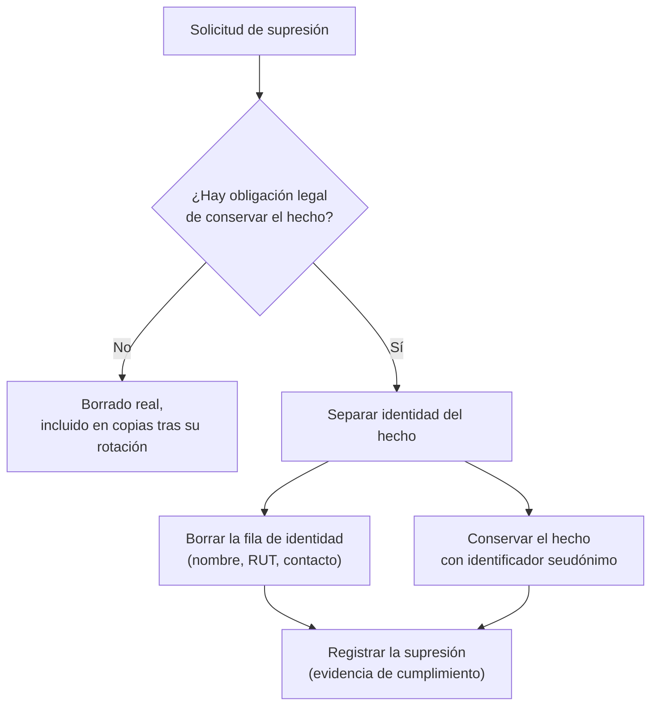

# 063 — Privacidad, retención y gobierno del dato

> [Programa](../../../README.md) · [Parte 11](../README.md) · [← Anterior](../../part-11-operacion-seguridad-y-gobierno/062-observabilidad-slo-y-capacidad/README.md) · [Siguiente →](../../part-12-analitica-integracion-y-streaming/064-oltp-frente-a-olap/README.md)

Parte 11 — Operación, seguridad y gobierno · Intermedio ·
3 horas estimadas · motores `postgresql`, `mongodb` · laboratorio
[`labs/02-polyglot-modeling`](../../../labs/02-polyglot-modeling/README.md) · 3 fuentes.

**Conceptos centrales:** `minimización` · `limitación de finalidad` · `seudonimización` · `derecho de supresión`

**En este caso se comparan 7 motores**: 6 lo resuelven (5 con el resultado comprobado por máquina) y 1 no, con el motivo escrito.

---

## Propósito

Traducir las obligaciones de privacidad en decisiones de esquema. Minimización, retención y supresión no son cláusulas de un documento legal: son columnas, políticas y trabajos programados.

## Resultados de aprendizaje

Al terminar podrás:

1. Aplicar minimización y limitación de finalidad al diseñar tablas.
2. Distinguir anonimización de seudonimización y sus consecuencias legales.
3. Implementar una política de retención con supresión verificable.
4. Resolver el conflicto entre derecho de supresión y necesidad de conservar evidencia.
5. Construir un registro de tratamiento a partir del propio esquema.

## Fundamentos

### Los principios que afectan al esquema

El RGPD europeo y la Ley 19.628 chilena comparten principios cuya traducción técnica es directa:

| Principio | Traducción al esquema |
|---|---|
| **Minimización** | No crear la columna si no hay una finalidad declarada |
| **Limitación de finalidad** | El dato recogido para A no se usa para B sin nueva base legal |
| **Limitación del plazo** | Toda tabla con datos personales necesita política de retención |
| **Exactitud** | Debe existir un camino para rectificar |
| **Integridad y confidencialidad** | Cifrado, control de acceso (clase 050), auditoría |
| **Responsabilidad proactiva** | Hay que poder **demostrarlo**, no solo cumplirlo |

El último es el que más se subestima: la obligación incluye poder acreditar lo que se hace. Un registro de tratamiento generado desde el esquema es una forma barata de cumplirlo.

### Anonimización frente a seudonimización

| | Seudonimización | Anonimización |
|---|---|---|
| Qué es | Reemplazar identificadores por códigos, guardando la correspondencia | Eliminar la posibilidad de reidentificar |
| ¿Sigue siendo dato personal? | **Sí** | No |
| Reversible | Sí, con la tabla de correspondencia | No |
| Ejemplo | `student_id` en vez del RUT | Agregados con supresión de celdas pequeñas |

Error frecuente y caro: llamar «anonimizado» a un conjunto seudonimizado. Reemplazar el nombre por un identificador **no** anonimiza: si quedan la fecha de nacimiento, la comuna y el sexo, la reidentificación es factible con datos externos.

Anonimizar de verdad exige agregación con umbral, generalización o ruido:

```sql
-- Publicable: suprime los grupos demasiado pequeños para reidentificar
SELECT comuna, extract(year FROM edad_rango) AS rango, count(*) AS n
FROM v_estudiantes
GROUP BY comuna, rango
HAVING count(*) >= 10;      -- k-anonimato con k = 10
```

### Retención

Cada tabla con datos personales necesita responder cuatro preguntas: **qué** se guarda, **para qué**, **cuánto tiempo** y **qué pasa después**.

Documentado en el propio esquema, para que no viva solo en una hoja de cálculo:

```sql
COMMENT ON TABLE  enrollments IS
  'Datos personales: sí. Finalidad: gestión académica. '
  'Retención: 5 años tras el egreso (obligación legal de certificación). '
  'Después: seudonimizar student_id y conservar el agregado.';
COMMENT ON COLUMN students.rut IS
  'Identificador nacional. Base legal: obligación legal. '
  'Acceso: rol_secretaria. Retención: igual que enrollments.';
```

### El conflicto de la supresión

El derecho de supresión no es absoluto: cede ante obligaciones legales de conservación. Un estudiante puede pedir borrar su cuenta, y la institución debe conservar el registro académico.

La solución de diseño es **separar la identidad del hecho**:



```sql
-- Identidad: se puede suprimir
CREATE TABLE student_identity (
  student_id INTEGER PRIMARY KEY REFERENCES students(id),
  rut        TEXT UNIQUE,
  nombre     TEXT NOT NULL,
  email      TEXT,
  suprimida_en TIMESTAMPTZ
);

-- Hechos académicos: se conservan, referencian solo al identificador interno
CREATE TABLE enrollments (
  student_id INTEGER NOT NULL REFERENCES students(id),
  course_id  INTEGER NOT NULL REFERENCES courses(id),
  nota       NUMERIC(2,1),
  PRIMARY KEY (student_id, course_id)
);
```

Con esta separación, ejercer el derecho es borrar una fila de `student_identity`. El histórico académico sobrevive, referido a un identificador que ya no apunta a ninguna persona identificable.

**Esta decisión hay que tomarla al diseñar.** Si el RUT está copiado en quince tablas —y lo estará si es la clave primaria (clase 007)—, la supresión se convierte en un proyecto.

## Ejemplo trabajado

Inventario del dominio, que es el punto de partida de todo lo demás:

| Tabla.columna | ¿Personal? | Finalidad | Base legal | Retención | Acceso |
|---|---|---|---|---|---|
| `student_identity.rut` | Sí, identificador | Certificación académica | Obligación legal | 5 años tras egreso | `rol_secretaria` |
| `student_identity.nombre` | Sí | Emisión de certificados | Contrato | Ídem | `rol_secretaria`, `rol_docente` |
| `student_identity.email` | Sí | Comunicación | Contrato | Hasta baja + 1 año | `rol_secretaria` |
| `enrollments.nota` | Sí, asociado | Evaluación | Contrato | 5 años tras egreso | `rol_docente` (solo sus cursos) |
| `access_log.ip` | **Sí** | Seguridad | Interés legítimo | **90 días** | `rol_seguridad` |
| `courses.nombre` | No | — | — | Indefinida | Público |

`access_log.ip` es el que se olvida: una dirección IP es dato personal en la mayoría de los marcos, y los registros de acceso suelen guardarse para siempre «por si acaso».

**Retención automatizada:**

```sql
CREATE TABLE retencion_politica (
  tabla       TEXT PRIMARY KEY,
  columna_ts  TEXT NOT NULL,
  dias        INTEGER NOT NULL,
  accion      TEXT NOT NULL CHECK (accion IN ('borrar','seudonimizar')),
  descripcion TEXT NOT NULL
);

INSERT INTO retencion_politica VALUES
  ('access_log', 'ocurrido_en',  90, 'borrar',
   'Registros de acceso: interés legítimo en seguridad, 90 días'),
  ('notificaciones', 'enviada_en', 365, 'borrar',
   'Historial de notificaciones enviadas');
```

```sql
-- Ejecución diaria, por lotes para no bloquear (clase 049)
DO $$
DECLARE p RECORD; n INTEGER;
BEGIN
  FOR p IN SELECT * FROM retencion_politica WHERE accion = 'borrar' LOOP
    LOOP
      EXECUTE format(
        'DELETE FROM %I WHERE ctid IN (
           SELECT ctid FROM %I WHERE %I < now() - make_interval(days => $1)
           LIMIT 10000)', p.tabla, p.tabla, p.columna_ts) USING p.dias;
      GET DIAGNOSTICS n = ROW_COUNT;
      EXIT WHEN n = 0;
      COMMIT;
    END LOOP;
  END LOOP;
END $$;
```

Se usa `format` con `%I` (clase 051) porque el nombre de tabla no es parametrizable, y viene de una tabla de configuración controlada, no de una entrada de usuario.

**Verificación, que es lo que acredita el cumplimiento:**

```sql
SELECT p.tabla, p.dias,
       (SELECT count(*) FROM access_log
        WHERE ocurrido_en < now() - make_interval(days => p.dias)) AS fuera_de_plazo
FROM retencion_politica p WHERE p.tabla = 'access_log';
-- fuera_de_plazo debe ser 0
```

**El punto que casi siempre falta: las copias de seguridad.** Borrar de la base no borra de las copias. Un dato suprimido hoy sigue en la copia de ayer, y en la de hace un mes.

La posición defendible —y la que aceptan los reguladores— es: las copias tienen su propio ciclo de rotación, la supresión se completa cuando la última copia que contenía el dato ha expirado, y ese plazo está documentado.

```text
Retención de copias: 35 días
→ La supresión se completa como máximo 35 días después de la solicitud.
→ Se documenta en la respuesta al titular.
→ Nadie restaura una copia parcialmente para reinsertar datos suprimidos.
```

**Registro de tratamiento generado desde el esquema:**

```sql
SELECT c.table_name, c.column_name,
       col_description(format('%I.%I', c.table_schema, c.table_name)::regclass,
                       c.ordinal_position) AS documentacion
FROM information_schema.columns c
WHERE c.table_schema = 'public'
ORDER BY c.table_name, c.ordinal_position;
```

Una columna con datos personales y sin comentario es un hallazgo de auditoría. Convertir eso en una comprobación de integración continua hace que la documentación no envejezca.

## Comparación

| Objetivo | Técnica | Consecuencia |
|---|---|---|
| Reducir exposición | No recoger el dato | La más eficaz y la menos usada |
| Permitir análisis sin identidad | Seudonimización | Sigue siendo dato personal |
| Publicar datos abiertos | Anonimización con k-anonimato | Pérdida de detalle |
| Cumplir plazos | Retención automatizada | Trabajo programado + verificación |
| Atender supresión | Separar identidad de hecho | Decisión de diseño temprana |
| Acreditar cumplimiento | Documentación en el esquema | Auditable y siempre al día |

## Errores frecuentes

1. **Recoger «por si acaso».** Cada columna es una obligación permanente.
2. **Llamar anonimizado a lo seudonimizado.** Error con consecuencias legales.
3. **Registros de acceso eternos.** Las IP son datos personales.
4. **Identificador nacional como clave primaria.** Lo esparce por todo el esquema.
5. **Ignorar las copias en la supresión.** El dato sigue ahí.
6. **Política de retención sin verificación.** Se rompe en silencio.
7. **Borrado lógico llamado supresión.** Marcar `borrado = true` no suprime nada.

## De la clase a la operación

La mayor parte del trabajo de cumplimiento se ahorra al diseñar: separar identidad de hechos, no recoger lo innecesario y documentar la finalidad de cada columna cuesta una tarde al inicio y evita un proyecto de meses cuando llega la primera solicitud o la primera auditoría.

## Reto de transferencia

1. Inventaría las columnas con datos personales de tu esquema, con finalidad y base legal.
2. Documenta cada una con `COMMENT` y añade una comprobación en CI que exija comentario.
3. Implementa una política de retención con su verificación.
4. Diseña el procedimiento de supresión, incluido el plazo derivado de tus copias.

## Preguntas de evaluación

1. ¿Por qué la seudonimización no exime de las obligaciones de protección de datos?
2. Da una columna de tu sistema que hoy no tendría base legal declarada.
3. Explica cómo atiendes una supresión conservando una obligación legal.
4. ¿Cuándo se completa realmente una supresión, dado tu ciclo de copias?

---

## 🌐 El mismo problema en cada motor

**Caso:** Borrar lo que ya no hace falta y enmascarar lo que no debe salir

El gobierno del dato se reduce, en la práctica, a dos gestos que casi nunca
se automatizan: **retención** —lo que ya no hace falta se borra— y
**minimización** —lo que sale del sistema sale con lo mínimo indispensable—.
Guardar «por si acaso» no es prudencia: cada dato conservado de más es un
dato que se puede filtrar y que alguien puede reclamar.

El caso tiene tres eventos, uno de ellos de hace más de un año. Se borra por
política de retención, y los dos que quedan se exportan con el correo
enmascarado: se conserva el dominio, que es lo que el análisis necesita, y
se pierde la persona, que es lo que el análisis no necesita.

Salida esperada, idéntica en todos los motores que lo resuelven:

| correo | fecha |
|---|---|
| `***@example.org` | `2026-08-10` |
| `***@otro.org` | `2026-08-15` |

El contrato vive en [`motores.yaml`](motores.yaml) y lo comprueba
`python scripts/verificar_equivalencia.py --clase 063`: 5 de
las 6 implementaciones se ejecutan de verdad y su
resultado se compara con esa tabla; el resto se declara como material revisado,
no ejecutado.

| Motor | ¿Resuelve el caso? | Nivel de prueba | Código | Fuente |
|---|---|---|---|---|
| SQLite | sí | núcleo | [código](implementaciones/sqlite/consulta.sql) | [doc oficial](https://sqlite.org/lang_delete.html) |
| DuckDB | sí | núcleo | [código](implementaciones/duckdb/consulta.sql) | [doc oficial](https://duckdb.org/docs/stable/sql/functions/char) |
| PostgreSQL | sí | servicio | [código](implementaciones/postgresql/consulta.sql) | [doc oficial](https://www.postgresql.org/docs/current/ddl-partitioning.html) |
| MySQL | sí | servicio | [código](implementaciones/mysql/consulta.sql) | [doc oficial](https://dev.mysql.com/doc/refman/8.4/en/partitioning-management-range-list.html) |
| MongoDB | sí | servicio | [código](implementaciones/mongodb/consulta.js) | [doc oficial](https://www.mongodb.com/docs/manual/core/index-ttl/) |
| Apache Cassandra | sí | declarado | [código](implementaciones/cassandra/consulta.cql) | [doc oficial](https://cassandra.apache.org/doc/latest/cassandra/developing/cql/dml.html) |
| Redis | **no** | — | — | [doc oficial](https://redis.io/docs/latest/commands/expire/) |

### Los que resuelven el caso

#### SQLite · [`implementaciones/sqlite/consulta.sql`](implementaciones/sqlite/consulta.sql)

✅ **verificado** — se ejecuta en CI sin servicios

```sql
-- motor: sqlite
-- doc: https://sqlite.org/lang_delete.html
-- nota: el DELETE no reduce el archivo ni borra los bytes: el espacio queda en
--       la lista de paginas libres y los datos siguen legibles hasta que algo
--       los sobrescriba. Para borrado real hace falta VACUUM, y ni asi se
--       controla lo que el sistema de archivos haya copiado.

-- === preparacion ===
CREATE TABLE eventos (
    id     INTEGER PRIMARY KEY,
    correo TEXT NOT NULL,
    fecha  TEXT NOT NULL
);
INSERT INTO eventos (id, correo, fecha) VALUES
    (1, 'ada@example.org',   '2025-01-15'),
    (2, 'linus@example.org', '2026-08-10'),
    (3, 'grace@otro.org',    '2026-08-15');

-- RETENCION: lo que ya no hace falta se borra. Guardar «por si acaso» no es
-- prudencia, es responsabilidad acumulada: cada dato conservado de mas es un
-- dato que se puede filtrar y que alguien puede reclamar.
DELETE FROM eventos WHERE fecha < '2026-01-01';

-- === consulta ===
-- MINIMIZACION: el analisis necesita el dominio, no la persona. Enmascarar en
-- la CONSULTA no protege nada —el dato sigue ahi—; esto es lo que se hace al
-- exportar a un entorno que no deberia tener el dato original.
SELECT '***@' || SUBSTR(correo, INSTR(correo, '@') + 1) AS correo, fecha
FROM eventos
ORDER BY fecha;
```

- **Por qué sí:** Muestra los dos gestos en su forma desnuda: un `DELETE` con una condición de fecha y una expresión de enmascarado. No hay nada más, y eso deja claro que el gobierno del dato es una decisión, no una funcionalidad.
- **Por qué no:** El `DELETE` no reduce el archivo: el espacio queda libre para reutilizarse y **los datos siguen ahí** hasta que se sobrescriban. Para borrado real hace falta `VACUUM`, y aun así el sistema de archivos puede conservar copias.
- 📄 Documentación oficial: <https://sqlite.org/lang_delete.html>

#### DuckDB · [`implementaciones/duckdb/consulta.sql`](implementaciones/duckdb/consulta.sql)

✅ **verificado** — se ejecuta en CI sin servicios

```sql
-- motor: duckdb
-- doc: https://duckdb.org/docs/stable/sql/functions/char
-- nota: aqui es donde el dato SALE hacia otro entorno —analitica, pruebas, un
--       cuaderno— y de donde ya no vuelve. Enmascarar en la consulta es fragil:
--       basta escribir otra consulta para llevarse el original. El enmascarado
--       tiene que estar en el proceso que exporta.

-- === preparacion ===
CREATE TABLE eventos (
    id     INTEGER PRIMARY KEY,
    correo VARCHAR NOT NULL,
    fecha  VARCHAR NOT NULL
);
INSERT INTO eventos (id, correo, fecha) VALUES
    (1, 'ada@example.org',   '2025-01-15'),
    (2, 'linus@example.org', '2026-08-10'),
    (3, 'grace@otro.org',    '2026-08-15');

-- RETENCION: lo que ya no hace falta se borra. Guardar «por si acaso» no es
-- prudencia, es responsabilidad acumulada: cada dato conservado de mas es un
-- dato que se puede filtrar y que alguien puede reclamar.
DELETE FROM eventos WHERE fecha < '2026-01-01';

-- === consulta ===
-- MINIMIZACION: el analisis necesita el dominio, no la persona. Enmascarar en
-- la CONSULTA no protege nada —el dato sigue ahi—; esto es lo que se hace al
-- exportar a un entorno que no deberia tener el dato original.
SELECT '***@' || SUBSTR(correo, INSTR(correo, '@') + 1) AS correo, fecha
FROM eventos
ORDER BY fecha;
```

- **Por qué sí:** Es donde ocurre de verdad la exportación a otro entorno —analítica, pruebas, un cuaderno— y por tanto donde el enmascarado importa más: el dato personal que sale de aquí ya no vuelve.
- **Por qué no:** Enmascarar en la consulta de exportación es frágil: basta una consulta distinta para llevarse el original. El enmascarado tiene que estar en el proceso que exporta, no en la voluntad de quien consulta.
- 📄 Documentación oficial: <https://duckdb.org/docs/stable/sql/functions/char>

#### PostgreSQL · [`implementaciones/postgresql/consulta.sql`](implementaciones/postgresql/consulta.sql)

✅ **verificado** — se ejecuta contra el motor real levantado con `docker compose`

```sql
-- motor: postgresql
-- doc: https://www.postgresql.org/docs/current/ddl-partitioning.html
-- nota: con particionado por rango de fecha, la retencion deja de ser un DELETE
--       de millones de filas y pasa a ser
--         DROP TABLE eventos_2025_01;
--       instantaneo y sin hinchar nada. Y el aviso incomodo: las copias de
--       seguridad conservan lo borrado durante meses, asi que un «derecho al
--       olvido» de verdad tiene que contemplarlas.

-- === preparacion ===
DROP TABLE IF EXISTS eventos;

CREATE TABLE eventos (
    id     integer PRIMARY KEY,
    correo text NOT NULL,
    fecha  date NOT NULL
);
INSERT INTO eventos (id, correo, fecha) VALUES
    (1, 'ada@example.org',   DATE '2025-01-15'),
    (2, 'linus@example.org', DATE '2026-08-10'),
    (3, 'grace@otro.org',    DATE '2026-08-15');

DELETE FROM eventos WHERE fecha < DATE '2026-01-01';

-- === consulta ===
SELECT '***@' || split_part(correo, '@', 2) AS correo,
       to_char(fecha, 'YYYY-MM-DD') AS fecha
FROM eventos
ORDER BY fecha;
```

- **Por qué sí:** Con particionado por rango de fecha, la retención deja de ser un `DELETE` de millones de filas y pasa a ser `DROP TABLE` de una partición: instantáneo y sin hinchar la tabla. Y las vistas con `security_barrier` permiten publicar la versión enmascarada sin dar acceso a la original.
- **Por qué no:** Un `DELETE` normal no libera espacio hasta el vacío, y las filas borradas siguen siendo legibles en el archivo hasta que se sobrescriban: para cumplir un «derecho al olvido» de verdad hay que pensar también en las copias de seguridad, que conservan lo borrado durante meses.
- 📄 Documentación oficial: <https://www.postgresql.org/docs/current/ddl-partitioning.html>

#### MySQL · [`implementaciones/mysql/consulta.sql`](implementaciones/mysql/consulta.sql)

✅ **verificado** — se ejecuta contra el motor real levantado con `docker compose`

```sql
-- motor: mysql
-- doc: https://dev.mysql.com/doc/refman/8.4/en/partitioning-management-range-list.html
-- nota: la politica se puede dejar declarada DENTRO de la base:
--         CREATE EVENT retencion_eventos ON SCHEDULE EVERY 1 DAY
--         DO DELETE FROM eventos WHERE fecha < CURRENT_DATE - INTERVAL 1 YEAR;
--       Con un aviso: el programador de eventos viene DESACTIVADO por omision
--       (event_scheduler), asi que la politica puede estar escrita y no
--       ejecutarse nunca.

-- === preparacion ===
DROP TABLE IF EXISTS eventos;

CREATE TABLE eventos (
    id     INT PRIMARY KEY,
    correo VARCHAR(200) NOT NULL,
    fecha  DATE NOT NULL
) ENGINE=InnoDB;

INSERT INTO eventos (id, correo, fecha) VALUES
    (1, 'ada@example.org',   '2025-01-15'),
    (2, 'linus@example.org', '2026-08-10'),
    (3, 'grace@otro.org',    '2026-08-15');

DELETE FROM eventos WHERE fecha < '2026-01-01';

-- === consulta ===
SELECT CONCAT('***@', SUBSTRING_INDEX(correo, '@', -1)) AS correo,
       DATE_FORMAT(fecha, '%Y-%m-%d') AS fecha
FROM eventos
ORDER BY fecha;
```

- **Por qué sí:** Tiene particionado por rango con `ALTER TABLE ... DROP PARTITION` para la retención, y el programador de eventos integrado permite dejar la política declarada dentro de la propia base en vez de en un `cron` que nadie revisa.
- **Por qué no:** Ese programador viene desactivado por omisión, así que la política puede estar escrita y no ejecutarse nunca. Y el registro binario conserva las filas borradas durante su periodo de retención, que a veces es más largo que el de los datos.
- 📄 Documentación oficial: <https://dev.mysql.com/doc/refman/8.4/en/partitioning-management-range-list.html>

#### MongoDB · [`implementaciones/mongodb/consulta.js`](implementaciones/mongodb/consulta.js)

✅ **verificado** — se ejecuta contra el motor real levantado con `docker compose`

```javascript
// motor: mongodb
// doc: https://www.mongodb.com/docs/manual/core/index-ttl/
// nota: el indice TTL es la forma mas dificil de OLVIDAR una politica de
//       retencion: se declara una vez y el motor borra. Y el aviso: borra por
//       documento, compite con la carga normal, no devuelve el espacio hasta
//       compactar, y si se configura mal borra lo que no debia sin papelera.

// === preparacion ===
db.eventos.drop();
db.eventos.insertMany([
  { _id: 1, correo: "ada@example.org", fecha: new Date("2025-01-15") },
  { _id: 2, correo: "linus@example.org", fecha: new Date("2026-08-10") },
  { _id: 3, correo: "grace@otro.org", fecha: new Date("2026-08-15") },
]);

// Retencion explicita (el indice TTL haria lo mismo sin que nadie lo pida):
db.eventos.deleteMany({ fecha: { $lt: new Date("2026-01-01") } });

// === consulta ===
db.eventos
  .aggregate([
    { $project: {
        _id: 0,
        correo: { $concat: ["***@", { $arrayElemAt: [{ $split: ["$correo", "@"] }, 1] }] },
        fecha: { $dateToString: { format: "%Y-%m-%d", date: "$fecha" } } } },
    { $sort: { fecha: 1 } },
  ])
  .forEach((d) => print(d.correo + "|" + d.fecha));
```

- **Por qué sí:** El índice TTL aplica la retención sin que nadie programe nada: se declara una vez sobre el campo de fecha y el motor borra. Es la forma más difícil de olvidar.
- **Por qué no:** Borra por documento, así que en colecciones grandes el borrado compite con la carga normal; y el espacio en disco no se devuelve al sistema hasta que se compacta. Además, un TTL mal configurado borra lo que no debía y no hay papelera.
- 📄 Documentación oficial: <https://www.mongodb.com/docs/manual/core/index-ttl/>

#### Apache Cassandra · [`implementaciones/cassandra/consulta.cql`](implementaciones/cassandra/consulta.cql)

⚪ **declarado** — se revisa a mano contra la documentación citada; la máquina no lo ejecuta

```sql
-- motor: cassandra
-- doc: https://cassandra.apache.org/doc/latest/cassandra/developing/cql/dml.html
-- nota: implementacion declarada. Aqui la retencion se declara AL ESCRIBIR, que
--       es cuando de verdad se sabe cuanto tiempo hace falta el dato:
--         USING TTL 7776000    -- noventa dias
--       Con la estrategia de compactacion por ventana temporal (TWCS), expirar
--       un periodo entero es tirar un archivo completo, sin recorrer filas.
--       El precio: cada dato expirado deja una lapida que se recorre en las
--       lecturas hasta que la compactacion la retire.

-- === preparacion ===
CREATE KEYSPACE IF NOT EXISTS gobierno
  WITH replication = {'class': 'SimpleStrategy', 'replication_factor': 1};

DROP TABLE IF EXISTS gobierno.eventos;

CREATE TABLE gobierno.eventos (
    id     int PRIMARY KEY,
    correo text,
    fecha  date
) WITH compaction = {'class': 'TimeWindowCompactionStrategy',
                     'compaction_window_unit': 'DAYS',
                     'compaction_window_size': 30};

INSERT INTO gobierno.eventos (id, correo, fecha)
  VALUES (2, 'linus@example.org', '2026-08-10') USING TTL 7776000;
INSERT INTO gobierno.eventos (id, correo, fecha)
  VALUES (3, 'grace@otro.org', '2026-08-15') USING TTL 7776000;

-- === consulta ===
-- CQL no tiene funciones de cadena para enmascarar: el enmascarado se hace en
-- la capa que exporta. Es una limitacion, y tambien un recordatorio de donde
-- deberia estar siempre.
SELECT id, correo, fecha, TTL(correo) AS segundos_restantes FROM gobierno.eventos;
```

- **Por qué sí:** El TTL por celda expresa la retención en el momento de escribir —«esto caduca en noventa días»—, que es cuando de verdad se sabe cuánto tiempo hace falta el dato. Con la estrategia de compactación por ventana temporal, además, expirar un periodo entero es tirar un archivo.
- **Por qué no:** Cada dato expirado deja una lápida, y las lápidas se recorren en las lecturas hasta que la compactación las retira: una política de retención agresiva sobre datos muy leídos degrada las lecturas justo donde más duelen.
- 📄 Documentación oficial: <https://cassandra.apache.org/doc/latest/cassandra/developing/cql/dml.html>

### Los que no resuelven este caso — y qué se hace en su lugar

Descartar un motor con un argumento es tan formativo como usarlo. Ninguna de estas filas dice que el motor sea peor: dice que este problema no es el suyo.

| Motor | Por qué no | Qué se hace en su lugar | Fuente |
|---|---|---|---|
| Redis | Tiene caducidad, pero no es el sitio donde vive el dato personal que hay que gobernar: es una caché. Aplicar aquí una política de retención da una falsa sensación de cumplimiento mientras el original sigue en otro sistema. | Tratarlo como lo que es —una copia derivada y desechable— e invalidar sus claves cuando el dato de origen se borra, para no servir desde la caché algo que ya no debería existir. | [doc](https://redis.io/docs/latest/commands/expire/) |

---

## Laboratorio

```bash
python scripts/validate_repository.py
# labs/02-polyglot-modeling se entrega escrito: no hay guion que ejecutar
```

Guarda como evidencia la salida completa, la versión del motor y la semilla o
los parámetros usados. Una captura sin comando no es evidencia: no se puede
repetir.

## Evaluación

| Criterio | Peso | Qué se comprueba |
|---|---:|---|
| Comprensión conceptual | 25 % | Explica el mecanismo, no solo el resultado |
| Ejecución reproducible | 25 % | Otra persona obtiene lo mismo con las instrucciones dadas |
| Interpretación basada en evidencia | 25 % | Cada conclusión se apoya en una salida o una medición |
| Límites y riesgos declarados | 25 % | Dice qué no demuestra el ejercicio y qué faltaría en producción |

La clase se da por superada cuando la respuesta explica el mecanismo, muestra
la salida que la respalda y declara al menos un límite del ejercicio.

## Fuentes de esta clase

Todo lo afirmado arriba procede de estas obras. Los identificadores viven en
[`catalog/sources.json`](../../../catalog/sources.json) y el estado de los
enlaces se comprueba con `python scripts/check_external_links.py`.

- **Union Europea** (2016). [Reglamento (UE) 2016/679 - Proteccion de datos personales](https://eur-lex.europa.eu/eli/reg/2016/679/oj).  
  Minimización, limitación de finalidad y derecho de supresión con efecto en el esquema.
- **Biblioteca del Congreso Nacional de Chile** (1999). [Ley 19.628 sobre proteccion de la vida privada](https://www.bcn.cl/leychile/navegar?idNorma=141599).  
  Marco chileno de datos personales aplicable a los proyectos del programa.
- **NIST** (2024). [NIST Cybersecurity Framework 2.0](https://www.nist.gov/cyberframework). DOI [10.6028/NIST.CSWP.29](https://doi.org/10.6028/NIST.CSWP.29).  
  Funciones Gobernar, Identificar, Proteger, Detectar, Responder y Recuperar.

---

> [Programa](../../../README.md) · [Parte 11](../README.md) · [← Anterior](../../part-11-operacion-seguridad-y-gobierno/062-observabilidad-slo-y-capacidad/README.md) · [Siguiente →](../../part-12-analitica-integracion-y-streaming/064-oltp-frente-a-olap/README.md)
