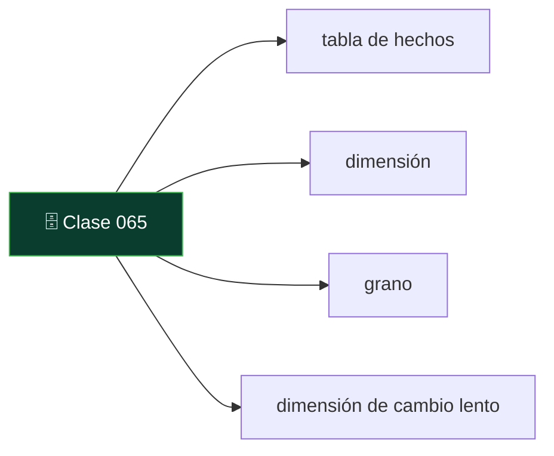
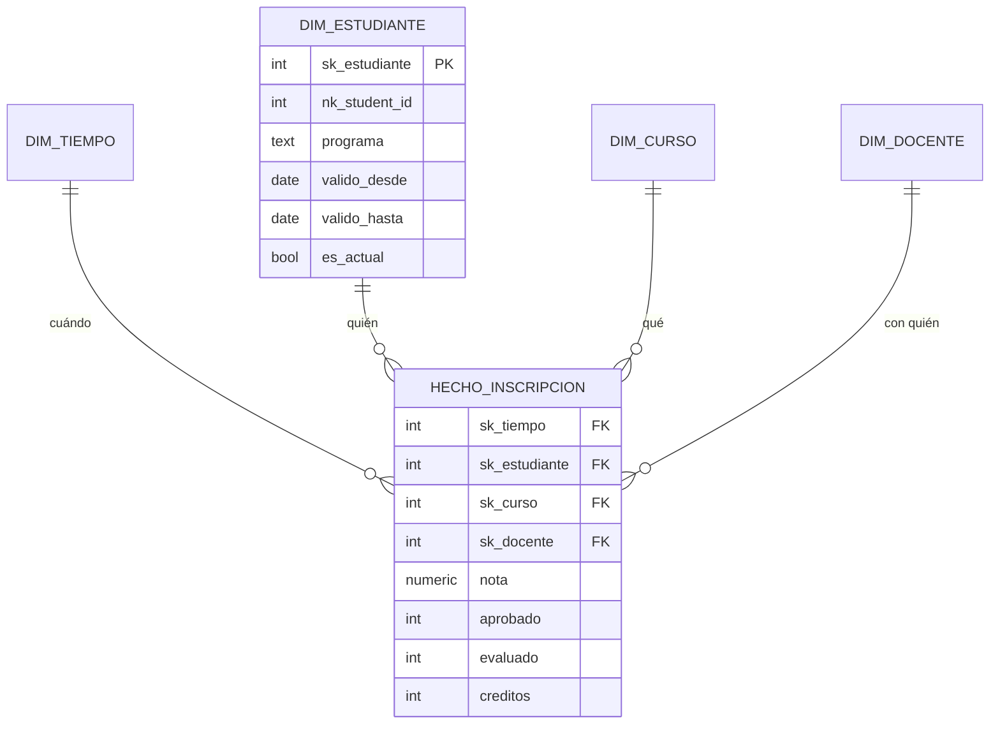

# 065 — Modelado dimensional: hechos, dimensiones y cambios lentos

   

> [Programa](../../../README.md) · [Parte 12](../README.md) · [← Anterior](../../part-12-analitica-integracion-y-streaming/064-oltp-frente-a-olap/README.md) · [Siguiente →](../../part-12-analitica-integracion-y-streaming/066-integracion-etl-elt-y-captura-de-cambios/README.md)

Parte 12 — Analítica, integración y streaming · Intermedio ·
4 horas estimadas · motores `duckdb`, `clickhouse`, `postgresql` · laboratorio
[`labs/04-indexing`](../../../labs/04-indexing/README.md) · 3 fuentes.

**Conceptos centrales:** `tabla de hechos` · `dimensión` · `grano` · `dimensión de cambio lento`

**En este caso se comparan 7 motores**: 5 lo resuelven (3 con el resultado comprobado por máquina) y 2 no, con el motivo escrito.



---

## Propósito

Modelar para el análisis. El modelo dimensional optimiza una cosa —responder preguntas de negocio sobre grandes volúmenes— y renuncia deliberadamente a otras.

## Resultados de aprendizaje

Al terminar podrás:

1. Aplicar los cuatro pasos del método de Kimball.
2. Declarar el grano de una tabla de hechos y comprobar que se respeta.
3. Distinguir hechos aditivos, semiaditivos y no aditivos.
4. Implementar dimensiones de cambio lento de tipos 1, 2 y 3.
5. Explicar por qué se desnormaliza y qué se pierde.

## Fundamentos

### Los cuatro pasos

Kimball y Ross proponen un método en este orden estricto:

1. **Elegir el proceso de negocio.** No un informe: un proceso («inscripción a cursos»).
2. **Declarar el grano.** Qué representa exactamente **una fila** de la tabla de hechos.
3. **Identificar las dimensiones.** Los «por qué, quién, cuándo, dónde» de ese hecho.
4. **Identificar los hechos.** Las medidas numéricas del proceso.

**El paso 2 es el crítico.** Un grano ambiguo produce dobles conteos, sumas incorrectas y meses de desconfianza en los datos. La formulación debe ser una frase completa: *«una fila por estudiante, curso y período»*, no «inscripciones».

Y la regla que se deriva: **nunca mezclar granos en la misma tabla de hechos**. Si un informe necesita otro grano, es otra tabla.

### Hechos y su aditividad

| Tipo | Se puede sumar | Ejemplo |
|---|---|---|
| **Aditivo** | Por todas las dimensiones | Monto pagado, unidades |
| **Semiaditivo** | Por todas menos el tiempo | Saldo, inventario, matriculados |
| **No aditivo** | Por ninguna | Porcentajes, ratios, promedios |

Regla de oro: **guardar los componentes, no el ratio**. En vez de `porcentaje_aprobacion`, guardar `aprobados` y `evaluados`, y calcular el porcentaje al consultar. Sumar porcentajes de distintas filas da un número sin significado; sumar componentes y dividir después, no.

Los semiaditivos son la trampa silenciosa: sumar los saldos de los doce meses del año da un número que no es el saldo anual de nada.

### Dimensiones de cambio lento

¿Qué pasa cuando un atributo de dimensión cambia? Una estudiante cambia de programa en 2026. ¿Sus inscripciones de 2025 pertenecen al programa antiguo o al nuevo?

| Tipo | Qué hace | Historia | Cuándo |
|---|---|---|---|
| **1** | Sobrescribe | Se pierde | Corrección de errores |
| **2** | Nueva fila con vigencia | **Se conserva** | El cambio importa históricamente |
| **3** | Columna «valor anterior» | Solo el cambio previo | Comparar dos versiones |

El tipo 2 es el habitual para atributos con significado histórico:

```sql
CREATE TABLE dim_estudiante (
  sk_estudiante SERIAL PRIMARY KEY,       -- clave sustituta del almacén
  nk_student_id INTEGER NOT NULL,         -- clave natural del origen
  nombre        TEXT NOT NULL,
  programa      TEXT NOT NULL,
  comuna        TEXT,
  valido_desde  DATE NOT NULL,
  valido_hasta  DATE NOT NULL DEFAULT '9999-12-31',
  es_actual     BOOLEAN NOT NULL DEFAULT true
);
CREATE UNIQUE INDEX ON dim_estudiante (nk_student_id) WHERE es_actual;
```

La clave que la tabla de hechos guarda es `sk_estudiante`, **no** `nk_student_id`. Así cada hecho queda ligado a la versión de la dimensión vigente en su momento, y un informe de 2025 sigue mostrando el programa de 2025 aunque hoy sea otro.

Es la diferencia entre «cómo era» y «cómo es», y las dos preguntas son legítimas: la primera se responde uniendo por `sk`, la segunda uniendo por `nk` con `es_actual`.



### Por qué desnormalizar

Las dimensiones se desnormalizan deliberadamente (esquema en estrella) en vez de normalizarse (copo de nieve):

- Menos reuniones en cada consulta analítica.
- Las dimensiones son pequeñas: la redundancia cuesta poco.
- Las herramientas de análisis y los usuarios entienden mejor un esquema plano.

Lo que se pierde —anomalías de actualización— importa poco en un almacén, porque las escrituras son controladas y por lotes, no concurrentes desde una aplicación. **Es la aplicación consciente de lo contrario a la clase 008**, y por eso es legítima.

## Ejemplo trabajado

**Paso 1 — proceso:** inscripción y evaluación académica.

**Paso 2 — grano:** *«una fila por estudiante, curso y período académico»*.

**Paso 3 — dimensiones:** tiempo (período), estudiante, curso, docente.

**Paso 4 — hechos:** nota, aprobado (0/1), evaluado (0/1), créditos.

```sql
CREATE TABLE hecho_inscripcion (
  sk_tiempo     INTEGER NOT NULL REFERENCES dim_tiempo(sk_tiempo),
  sk_estudiante INTEGER NOT NULL REFERENCES dim_estudiante(sk_estudiante),
  sk_curso      INTEGER NOT NULL REFERENCES dim_curso(sk_curso),
  sk_docente    INTEGER          REFERENCES dim_docente(sk_docente),
  nota          NUMERIC(2,1),
  aprobado      SMALLINT NOT NULL DEFAULT 0,
  evaluado      SMALLINT NOT NULL DEFAULT 0,
  creditos      SMALLINT NOT NULL,
  PRIMARY KEY (sk_tiempo, sk_estudiante, sk_curso)
);
```

La clave primaria **es** la declaración del grano, hecha cumplir por el motor. Insertar dos filas para el mismo estudiante, curso y período es ahora imposible: el doble conteo queda excluido por construcción.

**Los hechos elegidos, y por qué:**

- `aprobado` y `evaluado` como enteros 0/1 en vez de un porcentaje. Son aditivos: `SUM(aprobado) / SUM(evaluado)` da el porcentaje correcto en **cualquier** agregación. Un `porcentaje_aprobacion` por fila no se puede promediar sin ponderar.
- `nota` es **no aditiva**: `AVG(nota)` es válido, `SUM(nota)` no significa nada. Se documenta.

**Consulta típica, sin ninguna reunión compleja:**

```sql
SELECT t.anio, t.semestre, c.facultad,
       count(*)                                          AS inscripciones,
       sum(f.evaluado)                                   AS evaluados,
       sum(f.aprobado)                                   AS aprobados,
       round(100.0 * sum(f.aprobado) / NULLIF(sum(f.evaluado),0), 1) AS pct_aprobacion,
       round(avg(f.nota) FILTER (WHERE f.nota IS NOT NULL), 2)       AS nota_media
FROM hecho_inscripcion f
JOIN dim_tiempo t ON t.sk_tiempo = f.sk_tiempo
JOIN dim_curso  c ON c.sk_curso  = f.sk_curso
GROUP BY t.anio, t.semestre, c.facultad
ORDER BY t.anio, t.semestre, c.facultad;
```

Cuatro reuniones como máximo, todas por clave sustituta entera, todas hacia tablas pequeñas. Comparado con el esquema normalizado del OLTP, que exigiría recorrer `students`, `enrollments`, `courses`, `teaching` y `teachers`.

**El cambio lento en acción.** Ana pasa de «Ingeniería» a «Ciencias» el 2026-03-01:

```sql
UPDATE dim_estudiante
   SET valido_hasta = DATE '2026-02-28', es_actual = false
 WHERE nk_student_id = 11 AND es_actual;

INSERT INTO dim_estudiante (nk_student_id, nombre, programa, valido_desde)
VALUES (11, 'Ana Pérez', 'Ciencias', DATE '2026-03-01');
```

Ahora:

```sql
-- "Como era entonces": las inscripciones de 2025 cuentan en Ingeniería
SELECT d.programa, count(*) FROM hecho_inscripcion f
JOIN dim_estudiante d ON d.sk_estudiante = f.sk_estudiante
JOIN dim_tiempo t ON t.sk_tiempo = f.sk_tiempo
WHERE t.anio = 2025 GROUP BY d.programa;

-- "Como es ahora": las mismas inscripciones cuentan en Ciencias
SELECT d.programa, count(*) FROM hecho_inscripcion f
JOIN dim_estudiante h ON h.sk_estudiante = f.sk_estudiante
JOIN dim_estudiante d ON d.nk_student_id = h.nk_student_id AND d.es_actual
JOIN dim_tiempo t ON t.sk_tiempo = f.sk_tiempo
WHERE t.anio = 2025 GROUP BY d.programa;
```

**Dos cifras distintas, ambas correctas.** Sin cambio lento de tipo 2 solo se puede responder una de las dos preguntas, y normalmente se descubre cuando alguien pregunta la otra.

**La dimensión de tiempo, siempre poblada de antemano:**

```sql
CREATE TABLE dim_tiempo (
  sk_tiempo  INTEGER PRIMARY KEY,     -- p. ej. 20260301
  fecha      DATE NOT NULL UNIQUE,
  anio       SMALLINT NOT NULL,
  semestre   SMALLINT NOT NULL,
  mes        SMALLINT NOT NULL,
  periodo_academico TEXT NOT NULL,
  es_habil   BOOLEAN NOT NULL
);
```

Tener el calendario como tabla evita repetir lógica de fechas en cada consulta y permite atributos que ninguna función de fecha conoce: períodos académicos, feriados locales, semanas de exámenes.

## Comparación

| Aspecto | Modelo normalizado (OLTP) | Modelo dimensional (OLAP) |
|---|---|---|
| Objetivo | Evitar anomalías | Responder preguntas rápido |
| Redundancia | Mínima | Aceptada en dimensiones |
| Reuniones por consulta | Muchas | Pocas, en estrella |
| Escrituras | Concurrentes | Por lotes, controladas |
| Historia | Presente | Conservada (tipo 2) |
| Comprensible para el negocio | Poco | **Mucho** |

## Errores frecuentes

1. **No declarar el grano.** Origen de todos los dobles conteos.
2. **Mezclar granos en una tabla de hechos.** Las sumas dejan de tener sentido.
3. **Guardar ratios en vez de componentes.** No se pueden reagregar.
4. **Sumar hechos semiaditivos por el tiempo.** Un saldo anual que no es de nadie.
5. **Tipo 1 donde hacía falta tipo 2.** La historia se pierde y no se recupera.
6. **Usar la clave natural en los hechos.** Rompe el cambio lento de tipo 2.
7. **Calcular fechas en cada consulta.** Falta la dimensión de tiempo.

## De la clase a la operación

La causa más frecuente de «los informes no cuadran» no está en los datos: está en dos tablas de hechos con granos distintos que alguien sumó. Declarar el grano en la clave primaria lo convierte en un error de inserción en vez de en un número equivocado.

## Reto de transferencia

1. Elige un proceso de negocio tuyo y aplica los cuatro pasos.
2. Declara el grano como frase completa y hazlo cumplir con la clave primaria.
3. Clasifica cada hecho como aditivo, semiaditivo o no aditivo, y documéntalo.
4. Implementa un cambio lento de tipo 2 y responde la misma pregunta «como era» y «como es».

## Preguntas de evaluación

1. Escribe el grano de una tabla de hechos tuya como frase completa.
2. ¿Por qué se guardan `aprobados` y `evaluados` en vez del porcentaje?
3. Da un hecho semiaditivo de tu dominio y la agregación que sería incorrecta.
4. Explica qué se rompe si la tabla de hechos guarda la clave natural.

---

## 🌐 El mismo problema en cada motor

**Caso:** Atribuir cada venta a la ciudad que el cliente tenía entonces, no a la que tiene ahora

El modelado dimensional separa **hechos** —lo que pasó, medible y
numeroso— de **dimensiones** —el contexto por el que se filtra y se agrupa—.
Y la pregunta que decide si el modelo sirve es una sola: ¿qué pasa cuando una
dimensión cambia?

El cliente A vendió por 100 cuando vivía en Santiago y por 200 después de
mudarse a Valdivia. Con una dimensión de **tipo 1** —sobrescribir la
ciudad— las dos ventas aparecen en Valdivia, y el informe del primer
trimestre **cambia retroactivamente** cada vez que alguien se muda. Con una
de **tipo 2** —una fila por versión, con su periodo de validez y su clave
sustituta— cada venta queda atribuida a la ciudad de su momento, y el
histórico deja de moverse.

Salida esperada, idéntica en todos los motores que lo resuelven:

| ciudad | importe |
|---|---|
| `Santiago` | `100` |
| `Valdivia` | `200` |

El contrato vive en [`motores.yaml`](motores.yaml) y lo comprueba
`python scripts/verificar_equivalencia.py --clase 065`: 3 de
las 5 implementaciones se ejecutan de verdad y su
resultado se compara con esa tabla; el resto se declara como material revisado,
no ejecutado.

| Motor | ¿Resuelve el caso? | Nivel de prueba | Código | Fuente |
|---|---|---|---|---|
| DuckDB | sí | núcleo | [código](implementaciones/duckdb/consulta.sql) | [doc oficial](https://duckdb.org/docs/stable/sql/query_syntax/from.html) |
| PostgreSQL | sí | servicio | [código](implementaciones/postgresql/consulta.sql) | [doc oficial](https://www.postgresql.org/docs/current/rangetypes.html) |
| ClickHouse | sí | declarado | [código](implementaciones/clickhouse/consulta.sql) | [doc oficial](https://clickhouse.com/docs/en/sql-reference/dictionaries) |
| SQLite | sí | núcleo | [código](implementaciones/sqlite/consulta.sql) | [doc oficial](https://sqlite.org/lang_select.html) |
| Snowflake | sí | declarado | [código](implementaciones/snowflake/consulta.sql) | [doc oficial](https://docs.snowflake.com/en/sql-reference/sql/merge) |
| MongoDB | **no** | — | — | [doc oficial](https://www.mongodb.com/docs/manual/data-modeling/) |
| Redis | **no** | — | — | [doc oficial](https://redis.io/docs/latest/develop/data-types/hashes/) |

### Los que resuelven el caso

#### DuckDB · [`implementaciones/duckdb/consulta.sql`](implementaciones/duckdb/consulta.sql)

✅ **verificado** — se ejecuta en CI sin servicios

```sql
-- motor: duckdb
-- doc: https://duckdb.org/docs/stable/sql/query_syntax/from.html
-- nota: el esquema en estrella es lo que mejor se le da: hechos grandes
--       reunidos con dimensiones pequenas que caben en memoria. Lo que NO tiene
--       es forma de mantener la dimension: cerrar la version vigente y abrir la
--       nueva hay que escribirlo, y nada impide dos vigentes a la vez.

-- === preparacion ===
-- La dimension con historia: una fila por VERSION del cliente, con su
-- periodo de validez y una clave sustituta propia. La clave de negocio
-- («A») se repite; la sustituta, no.
CREATE TABLE dim_cliente (
    sk       INTEGER PRIMARY KEY,
    cliente  VARCHAR NOT NULL,
    ciudad   VARCHAR NOT NULL,
    desde    VARCHAR NOT NULL,
    hasta    VARCHAR NOT NULL,
    vigente  INTEGER NOT NULL
);
INSERT INTO dim_cliente (sk, cliente, ciudad, desde, hasta, vigente) VALUES
    (1, 'A', 'Santiago', '2026-01-01', '2026-06-30', 0),
    (2, 'A', 'Valdivia', '2026-07-01', '9999-12-31', 1);

-- La tabla de hechos apunta a la VERSION, no al cliente. Ahi esta todo.
CREATE TABLE hechos_venta (
    id         INTEGER PRIMARY KEY,
    cliente_sk INTEGER NOT NULL,
    fecha      VARCHAR NOT NULL,
    importe    INTEGER NOT NULL
);
INSERT INTO hechos_venta (id, cliente_sk, fecha, importe) VALUES
    (1, 1, '2026-03-15', 100),   -- cuando A vivia en Santiago
    (2, 2, '2026-08-15', 200);   -- despues de mudarse a Valdivia

-- === consulta ===
-- Con dimension de tipo 2, cada venta se atribuye a la ciudad que el cliente
-- tenia EN ESE MOMENTO. Con una dimension de tipo 1 —sobrescribir la ciudad—
-- las dos ventas apareceran en Valdivia y el informe del primer trimestre
-- CAMBIARIA retroactivamente cada vez que alguien se muda.
SELECT d.ciudad, SUM(h.importe) AS importe
FROM hechos_venta h
JOIN dim_cliente d ON d.sk = h.cliente_sk
GROUP BY d.ciudad
ORDER BY d.ciudad;
```

- **Por qué sí:** El esquema en estrella es exactamente lo que su ejecutor hace mejor: una tabla de hechos grande reunida con dimensiones pequeñas, que caben en memoria y se resuelven con reunión hash sobre columnas comprimidas.
- **Por qué no:** No tiene nada que ayude a **mantener** la dimensión: cerrar la versión vigente y abrir la nueva hay que escribirlo, y sin restricciones que lo impidan es fácil acabar con dos filas vigentes para el mismo cliente.
- 📄 Documentación oficial: <https://duckdb.org/docs/stable/sql/query_syntax/from.html>

#### PostgreSQL · [`implementaciones/postgresql/consulta.sql`](implementaciones/postgresql/consulta.sql)

✅ **verificado** — se ejecuta contra el motor real levantado con `docker compose`

```sql
-- motor: postgresql
-- doc: https://www.postgresql.org/docs/current/rangetypes.html
-- nota: aqui los dos invariantes del tipo 2 se pueden IMPONER:
--         1) una sola version vigente  -> indice unico parcial
--         2) periodos que no se solapan -> restriccion de exclusion con daterange
--       Sin ellos, el tipo 2 es una convencion que alguien acabara rompiendo, y
--       el sintoma sera un informe con ventas duplicadas.

-- === preparacion ===
DROP TABLE IF EXISTS hechos_venta, dim_cliente;

CREATE EXTENSION IF NOT EXISTS btree_gist;

CREATE TABLE dim_cliente (
    sk      integer PRIMARY KEY,
    cliente text NOT NULL,
    ciudad  text NOT NULL,
    validez daterange NOT NULL,
    vigente boolean NOT NULL,
    EXCLUDE USING gist (cliente WITH =, validez WITH &&)
);
CREATE UNIQUE INDEX una_version_vigente ON dim_cliente (cliente) WHERE vigente;

INSERT INTO dim_cliente (sk, cliente, ciudad, validez, vigente) VALUES
    (1, 'A', 'Santiago', daterange('2026-01-01', '2026-07-01', '[)'), false),
    (2, 'A', 'Valdivia', daterange('2026-07-01', 'infinity', '[)'), true);

CREATE TABLE hechos_venta (
    id         integer PRIMARY KEY,
    cliente_sk integer NOT NULL REFERENCES dim_cliente(sk),
    fecha      date NOT NULL,
    importe    integer NOT NULL
);
INSERT INTO hechos_venta (id, cliente_sk, fecha, importe) VALUES
    (1, 1, DATE '2026-03-15', 100),
    (2, 2, DATE '2026-08-15', 200);

-- === consulta ===
SELECT d.ciudad, SUM(h.importe) AS importe
FROM hechos_venta h
JOIN dim_cliente d ON d.sk = h.cliente_sk
GROUP BY d.ciudad
ORDER BY d.ciudad;
```

- **Por qué sí:** Puede **imponer** el invariante que hace correcto al tipo 2: un índice único parcial sobre `(cliente) WHERE vigente` garantiza que nunca haya dos versiones vigentes, y los tipos de rango con restricción de exclusión impiden que dos periodos se solapen.
- **Por qué no:** Esas garantías cuestan escrituras en cada cambio de dimensión, y el esquema en estrella sobre un motor de filas paga la reunión con la tabla de hechos en cada consulta: correcto, y no es donde va a ser rápido.
- 📄 Documentación oficial: <https://www.postgresql.org/docs/current/rangetypes.html>

#### ClickHouse · [`implementaciones/clickhouse/consulta.sql`](implementaciones/clickhouse/consulta.sql)

⚪ **declarado** — se revisa a mano contra la documentación citada; la máquina no lo ejecuta

```sql
-- motor: clickhouse
-- doc: https://clickhouse.com/docs/en/sql-reference/dictionaries
-- nota: implementacion declarada, y con una advertencia importante. Los
--       DICCIONARIOS de ClickHouse resuelven la dimension sin reunion, con una
--       busqueda en memoria por clave... y devuelven el valor ACTUAL. Usarlos
--       con una dimension de tipo 2 reintroduce exactamente el error que el
--       tipo 2 existia para evitar: las ventas viejas se atribuyen a la ciudad
--       nueva.
--       La atribucion historica exige la reunion por rango de fechas de abajo,
--       que es justo lo que peor se le da a un motor columnar distribuido.

-- === preparacion ===
CREATE TABLE dim_cliente (
    sk      UInt32,
    cliente String,
    ciudad  String,
    desde   Date,
    hasta   Date,
    vigente UInt8
) ENGINE = MergeTree ORDER BY (cliente, desde);

CREATE TABLE hechos_venta (
    id         UInt32,
    cliente_sk UInt32,
    fecha      Date,
    importe    UInt32
) ENGINE = MergeTree ORDER BY (fecha, id);

INSERT INTO dim_cliente VALUES
    (1, 'A', 'Santiago', '2026-01-01', '2026-06-30', 0),
    (2, 'A', 'Valdivia', '2026-07-01', '2106-02-07', 1);
INSERT INTO hechos_venta VALUES (1, 1, '2026-03-15', 100), (2, 2, '2026-08-15', 200);

-- === consulta ===
SELECT d.ciudad, SUM(h.importe) AS importe
FROM hechos_venta AS h
INNER JOIN dim_cliente AS d ON d.sk = h.cliente_sk
GROUP BY d.ciudad
ORDER BY d.ciudad;
```

- **Por qué sí:** Para hechos con miles de millones de filas no hay comparación, y sus diccionarios permiten resolver la dimensión sin reunión, con una búsqueda en memoria por clave.
- **Por qué no:** Los diccionarios devuelven el valor **actual**, no el histórico: usarlos con una dimensión de tipo 2 vuelve a producir el error que el tipo 2 existía para evitar. La historia hay que resolverla con reunión por rango de fechas, que es justo lo que peor se le da.
- 📄 Documentación oficial: <https://clickhouse.com/docs/en/sql-reference/dictionaries>

#### SQLite · [`implementaciones/sqlite/consulta.sql`](implementaciones/sqlite/consulta.sql)

✅ **verificado** — se ejecuta en CI sin servicios

```sql
-- motor: sqlite
-- doc: https://sqlite.org/lang_select.html
-- nota: el invariante que hace correcto al tipo 2 —una sola version vigente por
--       cliente— se puede IMPONER, no solo desear:
--         CREATE UNIQUE INDEX una_vigente ON dim_cliente (cliente)
--           WHERE vigente = 1;

-- === preparacion ===
-- La dimension con historia: una fila por VERSION del cliente, con su
-- periodo de validez y una clave sustituta propia. La clave de negocio
-- («A») se repite; la sustituta, no.
CREATE TABLE dim_cliente (
    sk       INTEGER PRIMARY KEY,
    cliente  TEXT NOT NULL,
    ciudad   TEXT NOT NULL,
    desde    TEXT NOT NULL,
    hasta    TEXT NOT NULL,
    vigente  INTEGER NOT NULL
);
INSERT INTO dim_cliente (sk, cliente, ciudad, desde, hasta, vigente) VALUES
    (1, 'A', 'Santiago', '2026-01-01', '2026-06-30', 0),
    (2, 'A', 'Valdivia', '2026-07-01', '9999-12-31', 1);

-- La tabla de hechos apunta a la VERSION, no al cliente. Ahi esta todo.
CREATE TABLE hechos_venta (
    id         INTEGER PRIMARY KEY,
    cliente_sk INTEGER NOT NULL,
    fecha      TEXT NOT NULL,
    importe    INTEGER NOT NULL
);
INSERT INTO hechos_venta (id, cliente_sk, fecha, importe) VALUES
    (1, 1, '2026-03-15', 100),   -- cuando A vivia en Santiago
    (2, 2, '2026-08-15', 200);   -- despues de mudarse a Valdivia

-- === consulta ===
-- Con dimension de tipo 2, cada venta se atribuye a la ciudad que el cliente
-- tenia EN ESE MOMENTO. Con una dimension de tipo 1 —sobrescribir la ciudad—
-- las dos ventas apareceran en Valdivia y el informe del primer trimestre
-- CAMBIARIA retroactivamente cada vez que alguien se muda.
SELECT d.ciudad, SUM(h.importe) AS importe
FROM hechos_venta h
JOIN dim_cliente d ON d.sk = h.cliente_sk
GROUP BY d.ciudad
ORDER BY d.ciudad;
```

- **Por qué sí:** El modelo dimensional es un modelo, no una tecnología: se puede estudiar entero aquí, y el índice único parcial permite imponer también el invariante de la versión vigente.
- **Por qué no:** No es un almacén analítico: sirve para entender el modelo y para prototipar la transformación, no para ejecutarla sobre volúmenes reales.
- 📄 Documentación oficial: <https://sqlite.org/lang_select.html>

#### Snowflake · [`implementaciones/snowflake/consulta.sql`](implementaciones/snowflake/consulta.sql)

⚪ **declarado** — se revisa a mano contra la documentación citada; la máquina no lo ejecuta

```sql
-- motor: snowflake
-- doc: https://docs.snowflake.com/en/sql-reference/sql/merge
-- nota: implementacion declarada. MERGE mantiene la dimension de tipo 2 en una
--       sola sentencia: cierra la version vigente e inserta la nueva.
--       Y una confusion frecuente que conviene deshacer: el VIAJE EN EL TIEMPO
--       de Snowflake permite consultar la tabla como estaba hace dias, pero NO
--       sustituye a la dimension de tipo 2. Sirve para recuperarse de un error,
--       no para atribuir hechos historicos: el viaje en el tiempo caduca, y la
--       historia del negocio no.

-- === preparacion ===
CREATE OR REPLACE TABLE dim_cliente (
    sk      NUMBER,
    cliente STRING,
    ciudad  STRING,
    desde   DATE,
    hasta   DATE,
    vigente BOOLEAN
);
CREATE OR REPLACE TABLE hechos_venta (
    id         NUMBER,
    cliente_sk NUMBER,
    fecha      DATE,
    importe    NUMBER
);

INSERT INTO dim_cliente VALUES
    (1, 'A', 'Santiago', '2026-01-01', '2026-06-30', FALSE),
    (2, 'A', 'Valdivia', '2026-07-01', '9999-12-31', TRUE);
INSERT INTO hechos_venta VALUES (1, 1, '2026-03-15', 100), (2, 2, '2026-08-15', 200);

-- El mantenimiento de la dimension, en una sentencia:
--   MERGE INTO dim_cliente d
--   USING nuevos_clientes n ON d.cliente = n.cliente AND d.vigente
--   WHEN MATCHED AND d.ciudad <> n.ciudad
--     THEN UPDATE SET d.vigente = FALSE, d.hasta = CURRENT_DATE()
--   WHEN NOT MATCHED
--     THEN INSERT (...) VALUES (...);

-- === consulta ===
SELECT d.ciudad, SUM(h.importe) AS importe
FROM hechos_venta h
JOIN dim_cliente d ON d.sk = h.cliente_sk
GROUP BY d.ciudad
ORDER BY d.ciudad;
```

- **Por qué sí:** Tiene `MERGE` para mantener la dimensión de tipo 2 en una sola sentencia —cerrar la versión vigente e insertar la nueva— y viaje en el tiempo, que permite consultar la tabla tal como estaba hace días sin haber guardado nada.
- **Por qué no:** El viaje en el tiempo **no** sustituye a la dimensión de tipo 2: sirve para recuperarse de un error, no para atribuir hechos históricos. Confundir las dos cosas es un error de diseño frecuente y caro.
- 📄 Documentación oficial: <https://docs.snowflake.com/en/sql-reference/sql/merge>

### Los que no resuelven este caso — y qué se hace en su lugar

Descartar un motor con un argumento es tan formativo como usarlo. Ninguna de estas filas dice que el motor sea peor: dice que este problema no es el suyo.

| Motor | Por qué no | Qué se hace en su lugar | Fuente |
|---|---|---|---|
| MongoDB | El modelo dimensional necesita reunir una tabla de hechos grande con dimensiones pequeñas, muchas veces y de muchas formas distintas; `$lookup` hace eso peor que cualquier motor relacional, y el modelo documental empuja a incrustar la dimensión, que es exactamente la desnormalización de tipo 1 con sus anomalías. | Dejar MongoDB en el lado operativo y llevar los hechos a un almacén columnar donde el esquema en estrella tenga sentido. | [doc](https://www.mongodb.com/docs/manual/data-modeling/) |
| Redis | No hay reuniones ni consultas por rango de fechas sobre versiones: la atribución histórica no se puede expresar. | Servir desde Redis el resultado **ya agregado** del informe, calculado en el almacén analítico: es una caché del informe, no un modelo dimensional. | [doc](https://redis.io/docs/latest/develop/data-types/hashes/) |

---

## Laboratorio

```bash
python scripts/validate_repository.py
python labs/04-indexing/run_indexing_lab.py
```

Guarda como evidencia la salida completa, la versión del motor y la semilla o
los parámetros usados. Una captura sin comando no es evidencia: no se puede
repetir.

## Evaluación

| Criterio | Peso | Qué se comprueba |
|---|---:|---|
| Comprensión conceptual | 25 % | Explica el mecanismo, no solo el resultado |
| Ejecución reproducible | 25 % | Otra persona obtiene lo mismo con las instrucciones dadas |
| Interpretación basada en evidencia | 25 % | Cada conclusión se apoya en una salida o una medición |
| Límites y riesgos declarados | 25 % | Dice qué no demuestra el ejercicio y qué faltaría en producción |

La clase se da por superada cuando la respuesta explica el mecanismo, muestra
la salida que la respalda y declara al menos un límite del ejercicio.

## Fuentes de esta clase

Todo lo afirmado arriba procede de estas obras. Los identificadores viven en
[`catalog/sources.json`](../../../catalog/sources.json) y el estado de los
enlaces se comprueba con `python scripts/check_external_links.py`.

- **Ralph Kimball, Margy Ross** (2013). [The Data Warehouse Toolkit](https://www.kimballgroup.com/data-warehouse-business-intelligence-resources/kimball-techniques/dimensional-modeling-techniques/). 3.a ed. Wiley. ISBN 978-1-118-53080-1.  
  Modelado dimensional, tablas de hechos y dimensiones de cambio lento.
- **Joe Reis, Matt Housley** (2022). [Fundamentals of Data Engineering](https://www.oreilly.com/library/view/fundamentals-of-data/9781098108298/). O'Reilly. ISBN 978-1-0981-0830-4.  
  Ciclo de vida de la ingenieria de datos e integración entre sistemas.
- **dbt Labs** (2026). [dbt Documentation](https://docs.getdbt.com/).  
  Transformaciones versionadas y pruebas de datos en el almacen.

---

> [Programa](../../../README.md) · [Parte 12](../README.md) · [← Anterior](../../part-12-analitica-integracion-y-streaming/064-oltp-frente-a-olap/README.md) · [Siguiente →](../../part-12-analitica-integracion-y-streaming/066-integracion-etl-elt-y-captura-de-cambios/README.md)
