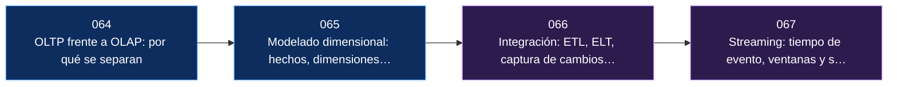

# Parte 12 — Analítica, integración y streaming

> [Programa](../../README.md) · [Índice de clases](../README.md) ·
> [Glosario](../../GLOSARIO.md) · [Modelo de aprendizaje](../../docs/LEARNING-MODEL.md)

Sacar los datos del sistema que los produjo sin perder su significado: almacen dimensional, captura de cambios y procesamiento continuo.

**4 clases · 13 horas · 17 conceptos · 10 fuentes**

## Antes de esta parte

Esta parte se apoya en lo trabajado antes. Si vienes de fuera del programa, revisa al menos el vocabulario de:

- [Parte 07 — Grafos, columnas, tiempo y búsqueda](../part-07-grafos-columnas-tiempo-y-busqueda/README.md)
- [Parte 09 — Almacenamiento, índices y planes](../part-09-almacenamiento-indices-y-planes/README.md)

## De qué trata esta parte

Sacar los datos del sistema que los produjo sin perder su significado. La parte parte de una pregunta operativa —por qué la analítica acaba mudándose a otro sistema— y la responde con dos argumentos independientes: el formato de almacenamiento, que decide el orden de magnitud, y la contención, que es el informe mensual compitiendo con las transacciones por el mismo buffer y el mismo disco.

Después viene el modelado dimensional de Kimball, con el grano como primera decisión y la que no se corrige luego sin rehacerlo todo, y las dimensiones de cambio lento, que deciden si el informe del año pasado sigue diciendo lo que decía. Luego la integración: ETL frente a ELT por lo que cada uno hace auditable, la captura de cambios leyendo el registro de transacciones, y el desmontaje de la escritura dual. Y al final el procesamiento continuo, con la distinción fundacional entre tiempo de evento y tiempo de proceso.

La clase 066 conecta directamente con la 046: la captura de cambios funciona porque el registro anticipado que se estudió para la recuperación resulta ser también el flujo de eventos más fiable que el sistema produce.

## Al terminar esta parte podrás

1. Justificar la separación entre OLTP y OLAP con argumentos de formato y de contención.
2. Diseñar un modelo dimensional declarando el grano y el tipo de cambio lento de cada dimensión.
3. Elegir entre ETL y ELT y diseñar una carga idempotente que se pueda relanzar.
4. Explicar por qué la escritura dual es un antipatrón y qué se usa en su lugar.
5. Distinguir tiempo de evento y de proceso, y decidir qué hacer con los datos que llegan tarde.

## Mapa de la parte

| # | Clase | Nivel | Horas | Fuentes |
|---|---|---|---:|---:|
| [064](064-oltp-frente-a-olap/README.md) | [OLTP frente a OLAP: por qué se separan](064-oltp-frente-a-olap/README.md) | Intermedio | 3 | 3 |
| [065](065-modelado-dimensional/README.md) | [Modelado dimensional: hechos, dimensiones y cambios lentos](065-modelado-dimensional/README.md) | Intermedio | 4 | 3 |
| [066](066-integracion-etl-elt-y-captura-de-cambios/README.md) | [Integración: ETL, ELT, captura de cambios y el registro como nexo](066-integracion-etl-elt-y-captura-de-cambios/README.md) | Avanzado | 3 | 4 |
| [067](067-streaming-tiempo-de-evento-y-ventanas/README.md) | [Streaming: tiempo de evento, ventanas y semántica de entrega](067-streaming-tiempo-de-evento-y-ventanas/README.md) | Avanzado | 3 | 3 |

## Las clases, una por una

### [064 — OLTP frente a OLAP: por qué se separan](064-oltp-frente-a-olap/README.md)

*Intermedio · 3 h · 3 fuentes · requiere [042](../part-07-grafos-columnas-tiempo-y-busqueda/042-analitica-columnar-y-vectorizacion/README.md), [048](../part-09-almacenamiento-indices-y-planes/048-paginas-filas-y-buffer-pool/README.md)*

Por qué la analítica acaba mudándose a otro sistema, con dos argumentos independientes: el formato de almacenamiento, que decide el orden de magnitud, y la contención, que es la razón operativa —el informe mensual compitiendo con las transacciones por el mismo buffer y el mismo disco.

**Conceptos que introduce:** `carga transaccional` · `carga analítica` · `contención` · `formato de almacenamiento`

[Ir a la clase →](064-oltp-frente-a-olap/README.md)

### [065 — Modelado dimensional: hechos, dimensiones y cambios lentos](065-modelado-dimensional/README.md)

*Intermedio · 4 h · 3 fuentes · requiere [018](../part-02-modelado-conceptual-y-requisitos/018-normalizacion-y-dependencias-funcionales/README.md), [064](064-oltp-frente-a-olap/README.md)*

El modelo dimensional de Kimball, con el grano como primera decisión y la que no se corrige después sin rehacerlo todo. Trata las dimensiones de cambio lento como lo que realmente deciden: si el informe del año pasado sigue diciendo lo que decía entonces.

**Conceptos que introduce:** `tabla de hechos` · `dimensión` · `grano` · `dimensión de cambio lento`

[Ir a la clase →](065-modelado-dimensional/README.md)

### [066 — Integración: ETL, ELT, captura de cambios y el registro como nexo](066-integracion-etl-elt-y-captura-de-cambios/README.md)

*Avanzado · 3 h · 4 fuentes · requiere [046](../part-08-transacciones-concurrencia-y-recuperacion/046-registro-anticipado-y-recuperacion/README.md), [065](065-modelado-dimensional/README.md)*

Mover datos entre sistemas sin perder cambios ni significado. Compara ETL y ELT por lo que cada uno hace auditable, presenta la captura de cambios leyendo el registro de transacciones, y desmonta la escritura dual: escribir a la vez en la base y en la cola no es atómico y tarde o temprano una recibe lo que la otra no.

**Conceptos que introduce:** `ETL` · `ELT` · `CDC` · `escritura dual` · `idempotencia de carga`

[Ir a la clase →](066-integracion-etl-elt-y-captura-de-cambios/README.md)

### [067 — Streaming: tiempo de evento, ventanas y semántica de entrega](067-streaming-tiempo-de-evento-y-ventanas/README.md)

*Avanzado · 3 h · 3 fuentes · requiere [066](066-integracion-etl-elt-y-captura-de-cambios/README.md)*

El procesamiento continuo y su distinción fundacional: tiempo de evento frente a tiempo de proceso. La marca de agua permite cerrar una ventana sabiendo que es una apuesta, y la entrega al menos una vez obliga a que el consumidor sea idempotente —el «exactamente una vez» se construye sobre eso, no en lugar de eso.

**Conceptos que introduce:** `tiempo de evento` · `marca de agua` · `ventana` · `entrega al menos una vez`

[Ir a la clase →](067-streaming-tiempo-de-evento-y-ventanas/README.md)

## Errores frecuentes en esta parte

Cada uno de estos es una creencia habitual y su corrección. Si alguna te suena
propia, la clase que la desmonta está señalada arriba.

- «Hago los informes contra la base de producción, total son pocas consultas.» Pocas y largas: compiten por el buffer y por el disco justo cuando más carga transaccional hay.
- «El almacén se modela como el operacional.» El grano y las dimensiones de cambio lento no existen en el operacional y son las decisiones que más pesan.
- «Escribo en la base y publico en la cola desde la aplicación.» No hay atomicidad entre los dos destinos. Es captura de cambios o bandeja de salida.
- «Exactamente una vez.» De extremo a extremo se construye sobre entrega al menos una vez más consumidores idempotentes, no en lugar de eso.

## Vocabulario de la parte

Los 17 términos que esta parte introduce. Cada uno enlaza a la clase
en la que se trabaja, y todos aparecen también en el
[glosario del programa](../../GLOSARIO.md) con sus términos relacionados.

| Término | Qué significa | Se trabaja en |
|---|---|---|
| **carga analítica** | Pocas consultas que recorren millones de filas y agregan unas pocas columnas: OLAP. Favorece almacenamiento columnar, compresión y ejecución vectorizada, y tolera latencias de segundos. | [064](064-oltp-frente-a-olap/README.md) |
| **carga transaccional** | Muchas operaciones pequeñas que leen y escriben pocas filas por identificador, con latencia de milisegundos: OLTP. Favorece filas juntas, índices B-Tree y transacciones cortas. | [064](064-oltp-frente-a-olap/README.md) |
| **CDC** | Captura de cambios: leer el registro de transacciones del origen para publicar cada `INSERT`, `UPDATE` y `DELETE` como un evento. Frente al muestreo periódico, no pierde cambios intermedios, no requiere columna de marca temporal y no carga el origen con consultas. | [066](066-integracion-etl-elt-y-captura-de-cambios/README.md) |
| **contención** | Lo que ocurre cuando la consulta analítica y la transaccional compiten por el mismo buffer, los mismos cerrojos y el mismo disco. Es la razón operativa —antes que la teórica— por la que el informe mensual acaba mudándose a otro sistema. | [064](064-oltp-frente-a-olap/README.md) |
| **dimensión** | Tabla que describe el contexto por el que se filtra y se agrupa: producto, cliente, tiempo, sucursal. Se desnormaliza a propósito para evitar reuniones en cada consulta, y es donde vive casi todo el significado del modelo. (En la parte 13 la misma palabra designa otra cosa: el número de componentes de un vector.) | [065](065-modelado-dimensional/README.md) |
| **dimensión de cambio lento** | Técnica para tratar los atributos que cambian con el tiempo: sobrescribir y perder la historia (tipo 1), o añadir una fila nueva con vigencia y conservarla (tipo 2). Determina si un informe del año pasado sigue diciendo lo que decía entonces. | [065](065-modelado-dimensional/README.md) |
| **ELT** | Cargar los datos en crudo y transformarlos dentro del almacén, con SQL versionado y probado. Es el enfoque dominante desde que el cómputo del almacén es barato, y su ventaja real es que la transformación queda auditable y se puede rehacer. | [066](066-integracion-etl-elt-y-captura-de-cambios/README.md) |
| **entrega al menos una vez** | Garantía de que ningún mensaje se pierde, admitiendo que alguno se repita. Es la garantía realista de las colas, y por eso el consumidor debe ser idempotente: el «exactamente una vez» de extremo a extremo se construye sobre esto, no en lugar de esto. | [067](067-streaming-tiempo-de-evento-y-ventanas/README.md) |
| **escritura dual** | Que la aplicación escriba a la vez en la base y en la cola. Parece la solución obvia y es un antipatrón: no hay atomicidad entre los dos destinos, así que tarde o temprano uno recibe lo que el otro no. La alternativa correcta es CDC o el patrón de bandeja de salida. | [066](066-integracion-etl-elt-y-captura-de-cambios/README.md) |
| **ETL** | Extraer, transformar y luego cargar: la transformación ocurre fuera del destino. Tiene sentido cuando el destino es caro o rígido, o cuando hay que limpiar datos personales antes de que entren. | [066](066-integracion-etl-elt-y-captura-de-cambios/README.md) |
| **formato de almacenamiento** | Cómo se disponen los bytes en disco: por filas o por columnas, comprimidos o no, con o sin estadísticas por bloque. Es la decisión que explica la mayor parte de la diferencia de rendimiento entre OLTP y OLAP, muy por encima del lenguaje de consulta. | [064](064-oltp-frente-a-olap/README.md) |
| **grano** | Qué representa exactamente una fila de la tabla de hechos: ¿una venta, una línea de venta, un resumen diario? Es la primera decisión del modelo dimensional y la que no se puede corregir después sin rehacerlo todo. | [065](065-modelado-dimensional/README.md) |
| **idempotencia de carga** | Que reprocesar el mismo lote no duplique ni corrompa el destino, gracias a una clave de negocio y a una operación de fusión. Es la condición para poder relanzar una carga fallida sin auditar a mano lo que había entrado. | [066](066-integracion-etl-elt-y-captura-de-cambios/README.md) |
| **marca de agua** | Estimación del sistema sobre hasta qué tiempo de evento ya llegó todo. Es lo que permite cerrar una ventana y emitir el resultado; siempre es una apuesta, y por eso hay que decidir explícitamente qué se hace con lo que llega tarde. | [067](067-streaming-tiempo-de-evento-y-ventanas/README.md) |
| **tabla de hechos** | Tabla central del modelo dimensional: una fila por evento medible, con sus métricas numéricas y sus claves a las dimensiones. Crece indefinidamente y se consulta siempre agregando. | [065](065-modelado-dimensional/README.md) |
| **tiempo de evento** | El instante en que el hecho ocurrió, frente al de proceso, que es cuando el sistema lo vio. Son distintos —un móvil sin cobertura envía tres horas después— y agrupar por el segundo cuando se quería el primero produce informes silenciosamente falsos. | [067](067-streaming-tiempo-de-evento-y-ventanas/README.md) |
| **ventana** | Recorte temporal sobre el que se agrega un flujo: fija, deslizante o de sesión. Es lo que convierte un flujo infinito en resultados finitos que se pueden emitir. | [067](067-streaming-tiempo-de-evento-y-ventanas/README.md) |

## Fuentes usadas en esta parte

10 obras distintas sostienen lo que se afirma en estas
4 clases. Los identificadores viven en
[`catalog/sources.json`](../../catalog/sources.json) y el estado de los enlaces
se comprueba con `python scripts/check_external_links.py`.

- **Joe Reis, Matt Housley** (2022). [Fundamentals of Data Engineering](https://www.oreilly.com/library/view/fundamentals-of-data/9781098108298/). O'Reilly. ISBN 978-1-0981-0830-4.  
  Ciclo de vida de la ingenieria de datos e integración entre sistemas.  
  *Se cita en las clases 065.*
- **Tyler Akidau, Slava Chernyak, Reuven Lax** (2018). [Streaming Systems](https://www.oreilly.com/library/view/streaming-systems/9781491983867/). O'Reilly. ISBN 978-1-4919-8387-4.  
  Tiempo de evento, ventanas, marcas de agua y la dualidad tabla-flujo.  
  *Se cita en las clases 067.*
- **Ralph Kimball, Margy Ross** (2013). [The Data Warehouse Toolkit](https://www.kimballgroup.com/data-warehouse-business-intelligence-resources/kimball-techniques/dimensional-modeling-techniques/). 3.a ed. Wiley. ISBN 978-1-118-53080-1.  
  Modelado dimensional, tablas de hechos y dimensiones de cambio lento.  
  *Se cita en las clases 064, 065.*
- **Apache Software Foundation** (2026). [Apache Iceberg Documentation](https://iceberg.apache.org/docs/latest/).  
  Formato de tabla con instantaneas y evolución de esquema sobre almacenamiento de objetos.  
  *Se cita en las clases 066.*
- **Apache Software Foundation** (2026). [Apache Kafka Documentation](https://kafka.apache.org/documentation/).  
  Particiones, orden, retención y semántica de entrega.  
  *Se cita en las clases 067.*
- **Debezium Community** (2026). [Debezium Documentation](https://debezium.io/documentation/).  
  Captura de cambios leyendo el registro de transacciones del motor.  
  *Se cita en las clases 066.*
- **DuckDB Foundation** (2026). [DuckDB Documentation](https://duckdb.org/docs/).  
  Motor analítico embebido: OLAP columnar sin servidor.  
  *Se cita en las clases 064.*
- **dbt Labs** (2026). [dbt Documentation](https://docs.getdbt.com/).  
  Transformaciones versionadas y pruebas de datos en el almacen.  
  *Se cita en las clases 065, 066.*
- **Michael Stonebraker, Samuel Madden, Daniel J. Abadi, Stavros Harizopoulos, Nabil Hachem, Pat Helland** (2007). [The End of an Architectural Era (It's Time for a Complete Rewrite)](https://cs.brown.edu/courses/cs227/archives/2008/Papers/OLTP/hstore.pdf). VLDB.  
  Mide en qué gasta el tiempo realmente un motor OLTP tradicional.  
  *Se cita en las clases 064.*
- **Jay Kreps** (2013). [The Log: What Every Software Engineer Should Know About Real-Time Data's Unifying Abstraction](https://web.archive.org/web/2023/https://engineering.linkedin.com/distributed-systems/log-what-every-software-engineer-should-know-about-real-time-datas-unifying). LinkedIn Engineering.  
  El registro append-only como nexo entre replicación, integración y streaming. Se cita la copia archivada: LinkedIn retiro el original.  
  *Se cita en las clases 066, 067.*

## Cómo estudiar esta parte

El mismo método en las 74 clases, y conviene respetar el orden:

1. **Lee el vocabulario antes que la materia.** Cada clase define sus términos
   arriba precisamente para que no haya que deducirlos del contexto.
2. **Ejecuta el ejemplo trabajado mientras lees**, no después. La mitad de lo
   que se aprende aquí solo aparece cuando la salida no es la esperada.
3. **Compara los motores.** La sección comparada muestra el mismo problema
   resuelto —o descartado con argumento— en varios sistemas. Lee también las
   filas de los que no lo resuelven: descartar con motivo es la habilidad que
   se evalúa en el proyecto final.
4. **Responde las preguntas de evaluación por escrito.** Una respuesta que no
   se puede escribir en tres líneas todavía no está entendida.
5. **Haz el reto de transferencia.** Es el único ejercicio que comprueba si el
   concepto se puede aplicar a un caso que la clase no mostró.
6. **Guarda la evidencia**: comando, versión del motor, semilla y salida
   completa. Sin eso no hay nota, porque no hay nada que revisar.

## Otras partes

- [Parte 00 — Primeros pasos: del archivo a la base de datos](../part-00-primeros-pasos-del-archivo-a-la-base-de-datos/README.md)
- [Parte 01 — Fundamentos, sistemas y método](../part-01-fundamentos-datos-sistemas-y-metodo/README.md)
- [Parte 02 — Modelado conceptual y requisitos](../part-02-modelado-conceptual-y-requisitos/README.md)
- [Parte 03 — Modelo relacional y álgebra](../part-03-modelo-relacional-y-algebra/README.md)
- [Parte 04 — SQL en profundidad](../part-04-sql-en-profundidad/README.md)
- [Parte 05 — Motores relacionales y dialectos](../part-05-motores-relacionales-y-dialectos/README.md)
- [Parte 06 — Documentos y clave-valor](../part-06-documentos-y-clave-valor/README.md)
- [Parte 07 — Grafos, columnas, tiempo y búsqueda](../part-07-grafos-columnas-tiempo-y-busqueda/README.md)
- [Parte 08 — Transacciones, concurrencia y recuperación](../part-08-transacciones-concurrencia-y-recuperacion/README.md)
- [Parte 09 — Almacenamiento, índices y planes](../part-09-almacenamiento-indices-y-planes/README.md)
- [Parte 10 — Distribución, réplica y consistencia](../part-10-distribucion-replica-y-consistencia/README.md)
- [Parte 11 — Operación, seguridad y gobierno](../part-11-operacion-seguridad-y-gobierno/README.md)
- [Parte 13 — Vectores, recuperación y RAG](../part-13-vectores-recuperacion-y-rag/README.md)
- [Parte 14 — Arquitectura y proyecto final](../part-14-arquitectura-y-proyecto-final/README.md)
