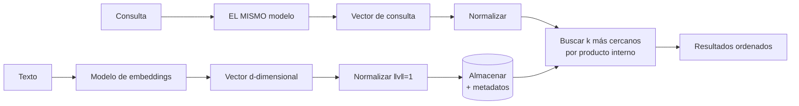

# 058 — Embeddings y métricas de distancia: qué significa parecido

> [Programa](../../../README.md) · [Parte 12](../README.md) · [← Anterior](../../part-11-analitica-integracion-y-streaming/057-streaming-tiempo-de-evento-y-ventanas/README.md) · [Siguiente →](../../part-12-vectores-recuperacion-y-rag/059-indices-vectoriales-aproximados/README.md)

Parte 12 — Vectores, recuperación y RAG · Intermedio ·
3 horas estimadas · motores `qdrant`, `postgresql` · laboratorio
[`labs/06-vector-search`](../../../labs/06-vector-search/README.md) · 3 fuentes.

**Conceptos centrales:** `espacio vectorial` · `coseno` · `producto interno` · `normalización` · `dimensión`

---

## Propósito

Entender qué se guarda en una base vectorial y qué significa exactamente «parecido». Sin esa precisión, la búsqueda semántica se convierte en una caja negra que a veces acierta.

## Resultados de aprendizaje

Al terminar podrás:

1. Explicar qué es un embedding y de qué depende su espacio.
2. Calcular coseno, producto interno y distancia euclídea, y saber cuándo coinciden.
3. Justificar la normalización de vectores.
4. Dimensionar el almacenamiento de una colección vectorial.
5. Reconocer que dos modelos distintos producen espacios incomparables.

## Fundamentos

### Qué es un embedding

Un vector de números reales que representa un objeto —texto, imagen, audio— de modo que **la proximidad geométrica aproxime la similitud semántica**, según lo aprendido por un modelo concreto.

Tres consecuencias que se olvidan:

1. **El espacio pertenece al modelo.** Los vectores de dos modelos distintos no son comparables, aunque tengan la misma dimensión. Cambiar de modelo obliga a **recalcular toda la colección**.
2. **«Similar» significa lo que el modelo aprendió.** Si se entrenó con paráfrasis, «similar» es paráfrasis. Si con preguntas y respuestas, la pregunta se acerca a su respuesta, no a otras preguntas.
3. **No hay explicación.** Ninguna dimensión significa nada por sí sola.

### Las tres métricas

Para vectores `a` y `b` de dimensión `d`:

```text
Producto interno:   a·b = Σ aᵢbᵢ
Norma euclídea:     ‖a‖ = √(Σ aᵢ²)
Coseno:             cos(a,b) = (a·b) / (‖a‖·‖b‖)        ∈ [-1, 1]
Distancia euclídea: ‖a-b‖ = √(Σ (aᵢ-bᵢ)²)
```

| Métrica | Sensible a la magnitud | Uso típico |
|---|---|---|
| Coseno | No: solo dirección | Texto, el caso habitual |
| Producto interno | **Sí** | Recomendación, donde la magnitud codifica popularidad |
| Euclídea | Sí | Imágenes, espacios métricos |

**La relación que hay que conocer.** Si los vectores están normalizados (`‖a‖ = ‖b‖ = 1`):

```text
a·b = cos(a,b)
‖a-b‖² = 2 - 2·cos(a,b)
```

Con vectores normalizados, **las tres métricas ordenan igual**. Por eso la práctica estándar es normalizar al indexar: el producto interno —la operación más barata, sin divisiones ni raíces— produce exactamente el ranking del coseno.

### Dimensionamiento

```text
almacenamiento = n_vectores × dimensión × bytes_por_componente

1 000 000 × 1 536 × 4 B (float32) = 6,1 GB
1 000 000 ×   768 × 4 B           = 3,1 GB
1 000 000 × 1 536 × 1 B (int8)    = 1,5 GB      ← cuantización
```

A eso hay que sumar el índice (clase 059): HNSW añade típicamente entre un 30 % y un 100 % del tamaño de los vectores.

**Una búsqueda exhaustiva** sobre un millón de vectores de 1 536 dimensiones exige 1 536 millones de multiplicaciones y sumas por consulta. Con SIMD son decenas de milisegundos. Con 100 millones de vectores, segundos. De ahí la necesidad del índice aproximado.



## Ejemplo trabajado

Cuatro documentos del dominio, representados en 4 dimensiones para poder calcular a mano:

```text
d1 "índices B-Tree"          v1 = [0,90, 0,10, 0,30, 0,20]
d2 "índices en bases de datos" v2 = [0,85, 0,15, 0,35, 0,25]
d3 "transacciones ACID"      v3 = [0,20, 0,90, 0,10, 0,30]
d4 "recetas de cocina"       v4 = [0,05, 0,05, 0,10, 0,95]

consulta "cómo funcionan los índices"  q = [0,88, 0,12, 0,32, 0,18]
```

**Normas:**

```text
‖v1‖ = √(0,81+0,01+0,09+0,04) = √0,95 = 0,9747
‖v2‖ = √(0,7225+0,0225+0,1225+0,0625) = √0,93 = 0,9644
‖v3‖ = √(0,04+0,81+0,01+0,09) = √0,95 = 0,9747
‖v4‖ = √(0,0025+0,0025+0,01+0,9025) = √0,9175 = 0,9579
‖q‖  = √(0,7744+0,0144+0,1024+0,0324) = √0,9236 = 0,9611
```

**Productos internos con q:**

```text
q·v1 = 0,88·0,90 + 0,12·0,10 + 0,32·0,30 + 0,18·0,20 = 0,792+0,012+0,096+0,036 = 0,936
q·v2 = 0,88·0,85 + 0,12·0,15 + 0,32·0,35 + 0,18·0,25 = 0,748+0,018+0,112+0,045 = 0,923
q·v3 = 0,88·0,20 + 0,12·0,90 + 0,32·0,10 + 0,18·0,30 = 0,176+0,108+0,032+0,054 = 0,370
q·v4 = 0,88·0,05 + 0,12·0,05 + 0,32·0,10 + 0,18·0,95 = 0,044+0,006+0,032+0,171 = 0,253
```

**Cosenos:**

```text
cos(q,v1) = 0,936 / (0,9611·0,9747) = 0,999
cos(q,v2) = 0,923 / (0,9611·0,9644) = 0,996
cos(q,v3) = 0,370 / (0,9611·0,9747) = 0,395
cos(q,v4) = 0,253 / (0,9611·0,9579) = 0,275
```

Orden: **d1 > d2 ≫ d3 > d4**. Coherente con la intención.

**Ahora la diferencia entre métricas.** Los productos internos sin normalizar dan el mismo orden aquí porque las normas son parecidas. Multipliquemos `v2` por 3 —simulando un documento «más intenso» en el mismo tema—:

```text
v2' = [2,55, 0,45, 1,05, 0,75],  ‖v2'‖ = 2,893
q·v2' = 2,769                    ← el mayor de todos
cos(q,v2') = 2,769/(0,9611·2,893) = 0,996   ← idéntico al de v2
```

El producto interno lo pone **primero**; el coseno lo deja donde estaba. Para texto, el coseno es lo correcto: la longitud del vector no debe determinar la relevancia. **Esta es la razón concreta de normalizar**, y no una convención arbitraria.

**En la práctica, con pgvector:**

```sql
CREATE EXTENSION IF NOT EXISTS vector;

CREATE TABLE fragmentos (
  id        BIGSERIAL PRIMARY KEY,
  curso_id  INTEGER NOT NULL REFERENCES courses(id),
  texto     TEXT    NOT NULL,
  modelo    TEXT    NOT NULL,      -- imprescindible: el espacio es del modelo
  embedding vector(768) NOT NULL,
  creado_en TIMESTAMPTZ NOT NULL DEFAULT now()
);

-- <=> coseno   <#> producto interno negativo   <-> euclídea
SELECT id, texto, 1 - (embedding <=> :q) AS similitud
FROM fragmentos
WHERE modelo = 'e5-base-v2'
ORDER BY embedding <=> :q
LIMIT 10;
```

La columna `modelo` y su filtro no son burocracia: **mezclar vectores de dos modelos en la misma consulta produce resultados sin sentido**, y no da ningún error. Es el fallo silencioso más frecuente al migrar de modelo.

**Fragmentación.** Un documento largo no se convierte en un vector: se parte.

```text
Fragmentos grandes (2 000 caracteres):  menos vectores, más contexto,
                                        pero la señal se diluye
Fragmentos pequeños (300 caracteres):   más precisos, pierden contexto,
                                        más vectores que almacenar
Práctica habitual: 500-1 000 caracteres con 10-20 % de solape
```

El solape evita que una frase clave quede partida justo en la frontera. El tamaño óptimo depende del corpus y **se determina midiendo** (clase 061), no eligiendo.

## Comparación

| Decisión | Opciones | Criterio |
|---|---|---|
| Métrica | Coseno / producto interno / euclídea | Coseno para texto; normalizar y usar producto interno |
| Dimensión | 384 / 768 / 1 536 | Más dimensión, mejor calidad y más costo |
| Precisión | float32 / float16 / int8 | Cuantizar cuando la memoria manda |
| Fragmento | 300 / 500 / 1 000 caracteres | Medir con el conjunto de evaluación |
| Modelo | Multilingüe / específico | El idioma del corpus decide |

## Errores frecuentes

1. **Mezclar vectores de modelos distintos.** Resultados sin sentido y sin error.
2. **No guardar qué modelo generó cada vector.** Imposible migrar después.
3. **Usar producto interno sin normalizar en texto.** Los documentos largos dominan.
4. **Usar un modelo inglés con corpus en español.** La calidad cae drásticamente.
5. **Fragmentos demasiado grandes.** La señal del pasaje relevante se diluye.
6. **Suponer que más dimensiones es mejor.** Cuesta memoria y latencia; hay que medirlo.
7. **Creer que la similitud coseno es una probabilidad.** No lo es, y su escala varía entre modelos.

## De la clase a la operación

Cambiar de modelo de embeddings no es cambiar una llamada: es recalcular la colección entera, y hacerlo mientras el sistema sirve. La estrategia es la misma de la clase 049: una columna nueva, doble escritura, relleno por lotes, cambio de lecturas y retirada de la antigua.

## Reto de transferencia

1. Calcula a mano coseno y producto interno de tres vectores tuyos.
2. Demuestra con un ejemplo que sin normalizar el producto interno cambia el orden.
3. Dimensiona el almacenamiento de tu colección con dos dimensiones y dos precisiones.
4. Diseña la migración a un modelo nuevo sin interrumpir el servicio.

## Preguntas de evaluación

1. ¿Por qué con vectores normalizados las tres métricas dan el mismo orden?
2. Explica qué ocurre exactamente al consultar con vectores de dos modelos mezclados.
3. Calcula el almacenamiento de 10 M de vectores de 1 536 dimensiones en float32 e int8.
4. ¿Qué compromiso hay al elegir el tamaño del fragmento, y cómo lo resolverías?

---

## Laboratorio

```bash
python scripts/validate_repository.py
python labs/06-vector-search/run_vector_lab.py
```

Guarda como evidencia la salida completa, la versión del motor y la semilla o
los parámetros usados. Una captura sin comando no es evidencia: no se puede
repetir.

## Evaluación

| Criterio | Peso | Qué se comprueba |
|---|---:|---|
| Comprensión conceptual | 25 % | Explica el mecanismo, no solo el resultado |
| Ejecución reproducible | 25 % | Otra persona obtiene lo mismo con las instrucciones dadas |
| Interpretación basada en evidencia | 25 % | Cada conclusión se apoya en una salida o una medición |
| Límites y riesgos declarados | 25 % | Dice qué no demuestra el ejercicio y qué faltaría en producción |

La clase se da por superada cuando la respuesta explica el mecanismo, muestra
la salida que la respalda y declara al menos un límite del ejercicio.

## Fuentes de esta clase

Todo lo afirmado arriba procede de estas obras. Los identificadores viven en
[`catalog/sources.json`](../../../catalog/sources.json) y el estado de los
enlaces se comprueba con `python scripts/check_external_links.py`.

- **Vladimir Karpukhin, Barlas Oguz, Sewon Min** (2020). [Dense Passage Retrieval for Open-Domain Question Answering](https://arxiv.org/abs/2004.04906). EMNLP.  
  Recuperación densa entrenada, y su comparación honesta contra BM25.
- **Jeff Johnson, Matthijs Douze, Herve Jegou** (2019). [Billion-scale Similarity Search with GPUs](https://arxiv.org/abs/1702.08734). IEEE Transactions on Big Data.  
  FAISS: cuantización de producto y compromiso memoria-exactitud.
- **Andrew Kane** (2026). [pgvector](https://github.com/pgvector/pgvector).  
  Búsqueda vectorial dentro de PostgreSQL: evita un sistema adicional cuando no hace falta.

---

> [Programa](../../../README.md) · [Parte 12](../README.md) · [← Anterior](../../part-11-analitica-integracion-y-streaming/057-streaming-tiempo-de-evento-y-ventanas/README.md) · [Siguiente →](../../part-12-vectores-recuperacion-y-rag/059-indices-vectoriales-aproximados/README.md)
