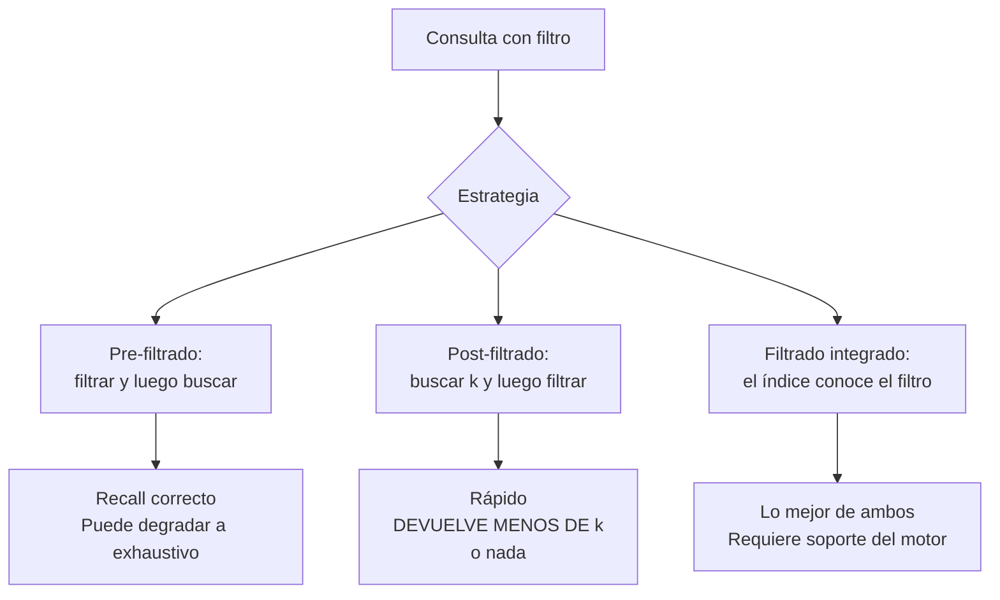

## Propósito

Buscar entre millones de vectores en milisegundos aceptando no encontrar siempre el mejor resultado. El índice aproximado cambia exactitud por velocidad, y hay que saber cuánta.

## Resultados de aprendizaje

Al terminar podrás:

1. Definir recall y medirlo contra la búsqueda exhaustiva.
2. Explicar la estructura de HNSW y el papel de `m` y `ef`.
3. Comparar HNSW, IVF y la cuantización.
4. Ajustar parámetros con una curva de recall frente a latencia.
5. Explicar el efecto del filtrado por metadatos sobre el recall.

## Fundamentos

### Recall: la métrica que no se puede omitir

```text
recall@k = |resultados_aproximados ∩ resultados_exactos| / k
```

Se mide comparando contra la búsqueda **exhaustiva** sobre el mismo conjunto. Si nadie la ha medido, el sistema tiene un recall desconocido, y «desconocido» en la práctica suele significar 0,7.

### HNSW

Malkov y Yashunin proponen un grafo navegable jerárquico:

- Varias capas. La superior tiene pocos nodos con enlaces largos; las inferiores, todos los nodos con enlaces cortos.
- La búsqueda entra por arriba, avanza con avidez hacia el vecino más cercano a la consulta, y baja de capa al no poder mejorar.
- Complejidad aproximada: **O(log N)** en vez de O(N).

Parámetros:

| Parámetro | Momento | Efecto de aumentarlo |
|---|---|---|
| `m` | Construcción | Más enlaces por nodo: mejor recall, más memoria |
| `ef_construction` | Construcción | Grafo de mejor calidad, construcción más lenta |
| `ef_search` | Consulta | **Mejor recall, más latencia** |

`ef_search` es el único ajustable **por consulta**, y es la palanca operativa: permite pedir más exactitud en las consultas que la necesitan sin reconstruir nada.

```text
memoria del grafo ≈ n_vectores × m × 2 × 4 B (enlaces bidireccionales)
1 000 000 × 16 × 2 × 4 B ≈ 128 MB   (además de los vectores)
```

### IVF

Alternativa: agrupar los vectores en `nlist` celdas por k-medias; en la consulta, buscar solo en las `nprobe` celdas más cercanas.

| | HNSW | IVF | IVF + PQ |
|---|---|---|---|
| Memoria | Alta (vectores + grafo) | Media | **Baja** (cuantizada) |
| Construcción | Lenta | Rápida (requiere entrenamiento) | Rápida |
| Recall a igual latencia | **Mejor** | Bueno | Menor |
| Inserción incremental | Buena | Degrada: hay que reentrenar | Ídem |
| Escala | Millones | Miles de millones | Miles de millones |

La **cuantización de producto** (PQ, Johnson et al.) divide el vector en subvectores y sustituye cada uno por el código de su centroide. Comprime 10–50× a cambio de recall. Para mil millones de vectores es la única opción viable en memoria.

### El problema del filtrado

Casi siempre se quiere buscar **dentro de un subconjunto**: solo los fragmentos de un curso, solo los del último año.



**El post-filtrado es la trampa.** Si se piden 10 vecinos y se filtra después por un curso que representa el 1 % del corpus, lo esperable es obtener **0 resultados**, aunque existan cientos de fragmentos relevantes de ese curso.

Qdrant implementa filtrado integrado con índices de carga útil; pgvector se apoya en el planificador de PostgreSQL, que puede elegir entre índice vectorial y filtro previo según la selectividad estimada — con los mismos aciertos y errores de estimación de la clase 042.

## Ejemplo trabajado

Colección: 2 000 000 de fragmentos, vectores de 768 dimensiones normalizados.

**Referencia exhaustiva:**

```sql
SET LOCAL enable_indexscan = off;         -- forzar búsqueda exacta
SELECT id FROM fragmentos ORDER BY embedding <=> :q LIMIT 10;
-- latencia: 1 840 ms   recall: 1,000 por definición
```

**HNSW con distintos `ef_search`:**

```sql
CREATE INDEX ON fragmentos USING hnsw (embedding vector_cosine_ops)
  WITH (m = 16, ef_construction = 64);

SET hnsw.ef_search = 40;
SELECT id FROM fragmentos ORDER BY embedding <=> :q LIMIT 10;
```

**Curva medida sobre 200 consultas de evaluación:**

| `ef_search` | Latencia p50 | Latencia p99 | recall@10 |
|---:|---:|---:|---:|
| 10 | 1,2 ms | 3 ms | 0,71 |
| 40 | 2,8 ms | 6 ms | 0,93 |
| 100 | 5,9 ms | 12 ms | 0,981 |
| 200 | 11,4 ms | 24 ms | 0,994 |
| 400 | 22,1 ms | 47 ms | 0,998 |
| exhaustivo | 1 840 ms | 2 100 ms | 1,000 |

**Lectura de la curva.** Entre 10 y 100 el recall sube 27 puntos por 4,7 ms. Entre 200 y 400 sube 0,4 puntos por 10,7 ms. El rendimiento decreciente es evidente y **el punto de operación se elige aquí**, no por intuición:

```text
Elección: ef_search = 100 → recall 0,981 con p99 de 12 ms
Justificación: perder el 1,9 % de los mejores resultados es aceptable porque
               hay un reordenador posterior (clase 060) y el generador recibe
               10 fragmentos, no 1.
```

**Efecto de `m`,** que sí exige reconstruir:

| `m` | Memoria del grafo | recall@10 (`ef`=100) | Tiempo de construcción |
|---:|---:|---:|---:|
| 8 | 128 MB | 0,942 | 4 min |
| 16 | 256 MB | 0,981 | 9 min |
| 32 | 512 MB | 0,993 | 21 min |
| 64 | 1 024 MB | 0,996 | 52 min |

De 32 a 64 se duplica la memoria por 0,3 puntos. **`m = 16` o `32` es donde está el equilibrio** en la mayoría de los corpus.

**El filtrado, medido:**

```sql
-- Post-filtrado: MAL
WITH v AS (SELECT id, curso_id FROM fragmentos ORDER BY embedding <=> :q LIMIT 10)
SELECT * FROM v WHERE curso_id = 42;
```

```text
curso_id = 42 representa el 0,8 % del corpus
resultados devueltos: 0 de 10 consultas de prueba devolvieron algo
```

Cero. El sistema «funciona» y no encuentra nada.

```sql
-- Pre-filtrado con índice parcial: BIEN cuando hay pocos valores de filtro
CREATE INDEX ON fragmentos USING hnsw (embedding vector_cosine_ops)
  WHERE curso_id = 42;

-- Filtrado integrado (Qdrant): BIEN en el caso general
```

```json
{
  "vector": [...],
  "filter": {"must": [{"key": "curso_id", "match": {"value": 42}}]},
  "limit": 10,
  "params": {"hnsw_ef": 128}
}
```

```text
resultados: 10 de 10   recall@10 dentro del subconjunto: 0,97
```

**Regla de decisión sobre el filtrado:**

| Selectividad del filtro | Estrategia |
|---|---|
| > 20 % del corpus | Post-filtrado con `k` ampliado (pedir 50 para quedarse con 10) |
| 1–20 % | Filtrado integrado |
| < 1 % | Pre-filtrado exhaustivo (el subconjunto es pequeño; el índice no hace falta) |

La última fila es la más contraintuitiva y la más útil: con un filtro muy selectivo, **la búsqueda exhaustiva sobre el subconjunto es rápida y exacta**. No todo necesita índice.

## Comparación

| Escala | Índice recomendado |
|---|---|
| < 10 000 vectores | Ninguno: exhaustivo |
| 10 000 – 10 M | HNSW |
| 10 M – 100 M | HNSW con cuantización, o IVF |
| > 100 M | IVF + PQ, distribuido |
| Filtro muy selectivo | Exhaustivo sobre el subconjunto |

## Errores frecuentes

1. **No medir el recall.** Es el error fundamental: se desconoce qué se está perdiendo.
2. **Post-filtrado con filtros selectivos.** Devuelve menos de `k` o nada.
3. **Subir `ef_search` sin curva.** Se paga latencia sin ganancia apreciable.
4. **`m` muy alto.** Duplica la memoria por décimas de recall.
5. **Reconstruir el índice tras cada inserción.** HNSW admite inserción incremental.
6. **Índice para colecciones pequeñas.** Con 5 000 vectores, el exhaustivo es más rápido y exacto.
7. **Comparar recall entre modelos distintos.** No es comparable.

## De la clase a la operación

El recall se degrada silenciosamente al crecer la colección o al cambiar la distribución de los datos. Medirlo periódicamente contra una muestra exhaustiva —igual que se prueba la restauración de copias— es lo que evita descubrir meses después que la búsqueda dejó de encontrar.

## Reto de transferencia

1. Construye un conjunto de 100 consultas y calcula la referencia exhaustiva.
2. Traza la curva de recall frente a latencia variando `ef_search`.
3. Elige el punto de operación y justifícalo por escrito.
4. Reproduce el fallo del post-filtrado y corrígelo con filtrado integrado.

## Preguntas de evaluación

1. ¿Cómo se mide el recall y contra qué referencia?
2. Explica por qué el post-filtrado devuelve cero resultados con un filtro del 0,8 %.
3. ¿Qué diferencia hay entre `ef_construction` y `ef_search` en cuanto a cuándo se pueden cambiar?
4. Con un filtro que selecciona el 0,3 % del corpus, ¿qué estrategia elegirías y por qué?
