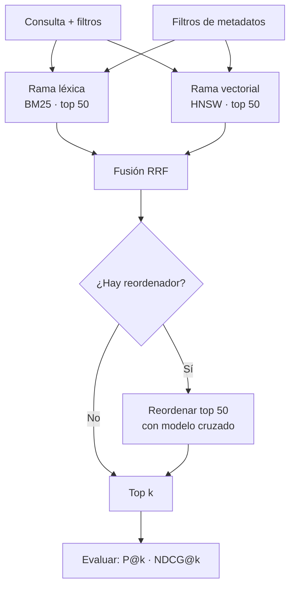

# 060 — Búsqueda híbrida: léxica más vectorial y filtrado por metadatos

> [Programa](../../../README.md) · [Parte 12](../README.md) · [← Anterior](../../part-12-vectores-recuperacion-y-rag/059-indices-vectoriales-aproximados/README.md) · [Siguiente →](../../part-12-vectores-recuperacion-y-rag/061-rag-evaluable/README.md)

Parte 12 — Vectores, recuperación y RAG · Avanzado ·
3 horas estimadas · motores `opensearch`, `qdrant`, `postgresql` · laboratorio
[`labs/06-vector-search`](../../../labs/06-vector-search/README.md) · 4 fuentes.

**Conceptos centrales:** `BM25` · `fusión de rangos` · `filtro previo` · `filtro posterior`

---

## Propósito

Combinar búsqueda léxica y vectorial, porque fallan de formas distintas. La híbrida no es «lo mejor de dos mundos» automáticamente: hay que fusionar bien y medir que mejora.

## Resultados de aprendizaje

Al terminar podrás:

1. Enumerar los fallos característicos de cada método.
2. Aplicar la fusión recíproca de rangos y explicar por qué no necesita normalizar.
3. Comparar fusión por rango y por puntuación.
4. Diseñar el filtrado por metadatos con la estrategia adecuada.
5. Demostrar con medición que la híbrida mejora sobre cada método aislado.

## Fundamentos

### Dónde falla cada método

| Consulta | BM25 (léxico) | Vectorial (semántico) |
|---|---|---|
| «error 1451 foreign key» | **Acierta**: coincidencia exacta | Falla: los códigos no tienen semántica |
| «cómo evito que se pierdan datos» | Falla: no comparte términos | **Acierta**: entiende la intención |
| «pgvector» (término nuevo) | **Acierta** si está indexado | Falla si el modelo no lo conoce |
| «bd» frente a «base de datos» | Falla sin sinónimos | **Acierta** |
| Nombre propio poco frecuente | **Acierta** | Puede fallar |
| Paráfrasis completa | Falla | **Acierta** |

Los fallos son **complementarios**, y por eso la combinación funciona. BM25 no entiende, pero no inventa; el vectorial entiende, y a veces se acerca a algo relacionado pero incorrecto.

### Fusión recíproca de rangos (RRF)

El problema de combinar: las puntuaciones de BM25 (no acotada, ~0 a 30) y las de coseno (−1 a 1) no son comparables ni entre sí ni entre consultas distintas.

RRF ignora las puntuaciones y usa solo las **posiciones**:

```text
RRF(d) = Σ_sistemas  1 / (k + rango_sistema(d))       con k = 60 habitualmente
```

| Documento | Rango BM25 | Rango vectorial | RRF |
|---|---:|---:|---|
| A | 1 | 8 | 1/61 + 1/68 = 0,0311 |
| B | 4 | 2 | 1/64 + 1/62 = 0,0318 |
| C | 2 | 40 | 1/62 + 1/100 = 0,0261 |
| D | — | 1 | 0 + 1/61 = 0,0164 |

Orden final: **B > A > C > D**. B gana por estar bien en ambos, aunque no fuera primero en ninguno. Esa es exactamente la propiedad buscada: **premiar el consenso**.

La constante `k = 60` amortigua las primeras posiciones para que un primer puesto en un solo sistema no domine.

Ventajas de RRF, y por qué se usa tanto: no requiere normalizar, no requiere entrenar, es robusto a escalas distintas y funciona con cualquier número de sistemas.

### La alternativa: fusión por puntuación

```text
score = α · norm(BM25) + (1-α) · norm(coseno)
```

Requiere normalizar por consulta (min-max sobre los resultados devueltos) y ajustar `α`. Puede superar a RRF **si se ajusta con datos de evaluación**; sin ellos, RRF es la elección segura.

### Filtrado

Es el mismo problema de la clase 059, y la regla de decisión es la misma:

| Selectividad del filtro | Estrategia |
|---|---|
| > 20 % | Post-filtrado con `k` ampliado |
| 1–20 % | Filtrado integrado en el índice |
| < 1 % | Pre-filtrado y búsqueda exhaustiva en el subconjunto |



### El reordenador

Un modelo de codificación cruzada procesa **el par (consulta, documento) junto** y produce una relevancia mucho más precisa que comparar dos vectores independientes. Es caro: no se puede aplicar a un millón de documentos, sí a los 50 que la fusión seleccionó.

Patrón habitual: recuperar 50 con la híbrida (rápido), reordenar esos 50 (preciso), devolver 10.

## Ejemplo trabajado

Buscador del programa: 200 000 fragmentos, consultas mezcladas de códigos de error y de intención.

**Implementación en PostgreSQL, un solo motor:**

```sql
WITH lexico AS (
  SELECT id, ROW_NUMBER() OVER (ORDER BY ts_rank(busqueda, q) DESC) AS rango
  FROM fragmentos, plainto_tsquery('spanish', :consulta) q
  WHERE busqueda @@ q AND (:curso IS NULL OR curso_id = :curso)
  ORDER BY ts_rank(busqueda, q) DESC LIMIT 50
),
vectorial AS (
  SELECT id, ROW_NUMBER() OVER (ORDER BY embedding <=> :qvec) AS rango
  FROM fragmentos
  WHERE modelo = 'e5-base-v2' AND (:curso IS NULL OR curso_id = :curso)
  ORDER BY embedding <=> :qvec LIMIT 50
)
SELECT f.id, f.texto,
       COALESCE(1.0/(60 + l.rango), 0) + COALESCE(1.0/(60 + v.rango), 0) AS rrf
FROM fragmentos f
LEFT JOIN lexico    l ON l.id = f.id
LEFT JOIN vectorial v ON v.id = f.id
WHERE l.id IS NOT NULL OR v.id IS NOT NULL
ORDER BY rrf DESC
LIMIT 10;
```

Los `COALESCE` son importantes: un documento que solo aparece en una rama recibe la contribución de esa rama y cero de la otra, en vez de un nulo que anularía la suma.

**Evaluación sobre 60 consultas juzgadas**, mitad léxicas y mitad de intención:

| Método | P@5 | NDCG@10 | Recall@50 |
|---|---:|---:|---:|
| Solo BM25 | 0,52 | 0,61 | 0,74 |
| Solo vectorial | 0,58 | 0,66 | 0,81 |
| RRF (`k`=60) | **0,71** | **0,78** | **0,91** |
| RRF + reordenador | **0,83** | **0,87** | 0,91 |
| Fusión por puntuación (`α`=0,5) | 0,64 | 0,71 | 0,89 |
| Fusión por puntuación (`α` ajustada = 0,35) | 0,73 | 0,79 | 0,91 |

Lecturas:

- La híbrida gana claramente a cada método aislado: **+13 puntos de P@5 sobre el mejor individual**.
- El reordenador añade otros 12 puntos sin cambiar el recall@50: reordena lo ya recuperado, no recupera más.
- La fusión por puntuación **sin ajustar** es peor que RRF; **ajustada** con datos la supera ligeramente. Ese ajuste requiere el conjunto de evaluación, así que RRF sigue siendo el punto de partida correcto.

**Desglose por tipo de consulta**, que es donde se ve el mecanismo:

| Tipo | Solo BM25 | Solo vectorial | RRF |
|---|---:|---:|---:|
| Códigos y términos exactos | 0,81 | 0,34 | 0,79 |
| Preguntas de intención | 0,23 | 0,74 | 0,68 |
| Mixtas | 0,48 | 0,61 | 0,72 |

En cada categoría, RRF pierde algo frente al especialista y **gana en el conjunto**. Ese es el compromiso real de la fusión, y conviene saberlo: si el 100 % de las consultas fueran códigos de error, BM25 solo sería mejor.

**Filtrado, con la regla aplicada:**

```sql
-- Filtro por curso: cada curso es ~0,5 % del corpus → pre-filtrado exhaustivo
SELECT id, texto, embedding <=> :qvec AS d
FROM fragmentos WHERE curso_id = 42
ORDER BY d LIMIT 10;
-- 1 000 fragmentos: exhaustivo en 3 ms, recall 1,000
```

Con 1 000 fragmentos, la búsqueda exacta es más rápida **y** más exacta que cualquier índice aproximado. La decisión correcta es no usar el índice.

## Comparación

| Situación | Método |
|---|---|
| Términos técnicos, códigos, nombres | BM25 |
| Preguntas en lenguaje natural | Vectorial |
| Consultas mezcladas (el caso real) | **Híbrida con RRF** |
| Máxima precisión en el top 10 | Híbrida + reordenador |
| Sin conjunto de evaluación | RRF (no requiere ajuste) |
| Con conjunto de evaluación | Fusión por puntuación ajustada |
| Filtro muy selectivo | Exhaustivo sobre el subconjunto |

## Errores frecuentes

1. **Sumar puntuaciones de escalas distintas.** BM25 y coseno no son comparables.
2. **Adoptar la híbrida sin medir.** Puede empeorar si una rama está mal configurada.
3. **Post-filtrado con filtros selectivos.** Devuelve poco o nada.
4. **Reordenar demasiados candidatos.** El codificador cruzado es caro.
5. **Un solo tipo de consulta en la evaluación.** El conjunto debe reflejar el tráfico real.
6. **Analizadores distintos entre indexación y consulta en la rama léxica** (clase 031).
7. **Creer que el reordenador aumenta el recall.** Solo reordena lo ya recuperado.

## De la clase a la operación

La mejora de un buscador se demuestra o no existe. El conjunto de consultas juzgadas —60 a 100 consultas reales con sus resultados esperados— es el activo que permite cambiar de modelo, de fusión o de parámetros sabiendo si se avanza o se retrocede.

## Reto de transferencia

1. Construye 60 consultas juzgadas que reflejen tu tráfico real, con las tres categorías.
2. Mide P@5 y NDCG@10 con BM25, con vectorial y con RRF.
3. Añade un reordenador sobre los 50 primeros y vuelve a medir.
4. Desglosa por tipo de consulta y decide si la fusión compensa en tu caso.

## Preguntas de evaluación

1. ¿Por qué RRF no necesita normalizar las puntuaciones?
2. Da una consulta de tu dominio donde el vectorial falle y BM25 acierte, y explica por qué.
3. Calcula el RRF de un documento que quedó 3.º en léxico y 15.º en vectorial.
4. ¿En qué caso la búsqueda solo léxica sería la decisión correcta?

---

## Laboratorio

```bash
python scripts/validate_repository.py
python labs/06-vector-search/run_vector_lab.py
```

Guarda como evidencia la salida completa, la versión del motor y la semilla o
los parámetros usados. Una captura sin comando no es evidencia: no se puede
repetir.

## Evaluación

| Criterio | Peso | Qué se comprueba |
|---|---:|---|
| Comprensión conceptual | 25 % | Explica el mecanismo, no solo el resultado |
| Ejecución reproducible | 25 % | Otra persona obtiene lo mismo con las instrucciones dadas |
| Interpretación basada en evidencia | 25 % | Cada conclusión se apoya en una salida o una medición |
| Límites y riesgos declarados | 25 % | Dice qué no demuestra el ejercicio y qué faltaría en producción |

La clase se da por superada cuando la respuesta explica el mecanismo, muestra
la salida que la respalda y declara al menos un límite del ejercicio.

## Fuentes de esta clase

Todo lo afirmado arriba procede de estas obras. Los identificadores viven en
[`catalog/sources.json`](../../../catalog/sources.json) y el estado de los
enlaces se comprueba con `python scripts/check_external_links.py`.

- **Stephen Robertson, Hugo Zaragoza** (2009). [The Probabilistic Relevance Framework: BM25 and Beyond](https://www.staff.city.ac.uk/~sbrp622/papers/foundations_bm25_review.pdf). Foundations and Trends in Information Retrieval 3(4). DOI [10.1561/1500000019](https://doi.org/10.1561/1500000019).  
  Función de ranking léxico contra la que se compara toda búsqueda semántica.
- **OpenSearch Project** (2026). [OpenSearch Documentation](https://docs.opensearch.org/latest/).  
  Índice invertido, analizadores, relevancia y búsqueda k-NN.
- **Andrew Kane** (2026). [pgvector](https://github.com/pgvector/pgvector).  
  Búsqueda vectorial dentro de PostgreSQL: evita un sistema adicional cuando no hace falta.
- **Qdrant** (2026). [Qdrant Documentation](https://qdrant.tech/documentation/).  
  Colecciones, filtros con carga útil y parametros HNSW.

---

> [Programa](../../../README.md) · [Parte 12](../README.md) · [← Anterior](../../part-12-vectores-recuperacion-y-rag/059-indices-vectoriales-aproximados/README.md) · [Siguiente →](../../part-12-vectores-recuperacion-y-rag/061-rag-evaluable/README.md)
