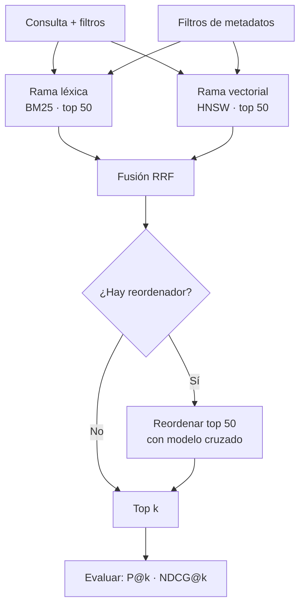

# 060 — Búsqueda híbrida: léxica más vectorial y filtrado por metadatos

> [Programa](../../../README.md) · [Parte 12](../README.md) · [← Anterior](../../part-12-vectores-recuperacion-y-rag/059-indices-vectoriales-aproximados/README.md) · [Siguiente →](../../part-12-vectores-recuperacion-y-rag/061-rag-evaluable/README.md)

Parte 12 — Vectores, recuperación y RAG · Avanzado ·
3 horas estimadas · motores `opensearch`, `qdrant`, `postgresql` · laboratorio
[`labs/06-vector-search`](../../../labs/06-vector-search/README.md) · 4 fuentes.

**Conceptos centrales:** `BM25` · `fusión de rangos` · `filtro previo` · `filtro posterior`

**En este caso se comparan 7 motores**: 5 lo resuelven (3 con el resultado comprobado por máquina) y 2 no, con el motivo escrito.

---

## Propósito

Combinar búsqueda léxica y vectorial, porque fallan de formas distintas. La híbrida no es «lo mejor de dos mundos» automáticamente: hay que fusionar bien y medir que mejora.

## Resultados de aprendizaje

Al terminar podrás:

1. Enumerar los fallos característicos de cada método.
2. Aplicar la fusión recíproca de rangos y explicar por qué no necesita normalizar.
3. Comparar fusión por rango y por puntuación.
4. Diseñar el filtrado por metadatos con la estrategia adecuada.
5. Demostrar con medición que la híbrida mejora sobre cada método aislado.

## Fundamentos

### Dónde falla cada método

| Consulta | BM25 (léxico) | Vectorial (semántico) |
|---|---|---|
| «error 1451 foreign key» | **Acierta**: coincidencia exacta | Falla: los códigos no tienen semántica |
| «cómo evito que se pierdan datos» | Falla: no comparte términos | **Acierta**: entiende la intención |
| «pgvector» (término nuevo) | **Acierta** si está indexado | Falla si el modelo no lo conoce |
| «bd» frente a «base de datos» | Falla sin sinónimos | **Acierta** |
| Nombre propio poco frecuente | **Acierta** | Puede fallar |
| Paráfrasis completa | Falla | **Acierta** |

Los fallos son **complementarios**, y por eso la combinación funciona. BM25 no entiende, pero no inventa; el vectorial entiende, y a veces se acerca a algo relacionado pero incorrecto.

### Fusión recíproca de rangos (RRF)

El problema de combinar: las puntuaciones de BM25 (no acotada, ~0 a 30) y las de coseno (−1 a 1) no son comparables ni entre sí ni entre consultas distintas.

RRF ignora las puntuaciones y usa solo las **posiciones**:

```text
RRF(d) = Σ_sistemas  1 / (k + rango_sistema(d))       con k = 60 habitualmente
```

| Documento | Rango BM25 | Rango vectorial | RRF |
|---|---:|---:|---|
| A | 1 | 8 | 1/61 + 1/68 = 0,0311 |
| B | 4 | 2 | 1/64 + 1/62 = 0,0318 |
| C | 2 | 40 | 1/62 + 1/100 = 0,0261 |
| D | — | 1 | 0 + 1/61 = 0,0164 |

Orden final: **B > A > C > D**. B gana por estar bien en ambos, aunque no fuera primero en ninguno. Esa es exactamente la propiedad buscada: **premiar el consenso**.

La constante `k = 60` amortigua las primeras posiciones para que un primer puesto en un solo sistema no domine.

Ventajas de RRF, y por qué se usa tanto: no requiere normalizar, no requiere entrenar, es robusto a escalas distintas y funciona con cualquier número de sistemas.

### La alternativa: fusión por puntuación

```text
score = α · norm(BM25) + (1-α) · norm(coseno)
```

Requiere normalizar por consulta (min-max sobre los resultados devueltos) y ajustar `α`. Puede superar a RRF **si se ajusta con datos de evaluación**; sin ellos, RRF es la elección segura.

### Filtrado

Es el mismo problema de la clase 059, y la regla de decisión es la misma:

| Selectividad del filtro | Estrategia |
|---|---|
| > 20 % | Post-filtrado con `k` ampliado |
| 1–20 % | Filtrado integrado en el índice |
| < 1 % | Pre-filtrado y búsqueda exhaustiva en el subconjunto |



### El reordenador

Un modelo de codificación cruzada procesa **el par (consulta, documento) junto** y produce una relevancia mucho más precisa que comparar dos vectores independientes. Es caro: no se puede aplicar a un millón de documentos, sí a los 50 que la fusión seleccionó.

Patrón habitual: recuperar 50 con la híbrida (rápido), reordenar esos 50 (preciso), devolver 10.

## Ejemplo trabajado

Buscador del programa: 200 000 fragmentos, consultas mezcladas de códigos de error y de intención.

**Implementación en PostgreSQL, un solo motor:**

```sql
WITH lexico AS (
  SELECT id, ROW_NUMBER() OVER (ORDER BY ts_rank(busqueda, q) DESC) AS rango
  FROM fragmentos, plainto_tsquery('spanish', :consulta) q
  WHERE busqueda @@ q AND (:curso IS NULL OR curso_id = :curso)
  ORDER BY ts_rank(busqueda, q) DESC LIMIT 50
),
vectorial AS (
  SELECT id, ROW_NUMBER() OVER (ORDER BY embedding <=> :qvec) AS rango
  FROM fragmentos
  WHERE modelo = 'e5-base-v2' AND (:curso IS NULL OR curso_id = :curso)
  ORDER BY embedding <=> :qvec LIMIT 50
)
SELECT f.id, f.texto,
       COALESCE(1.0/(60 + l.rango), 0) + COALESCE(1.0/(60 + v.rango), 0) AS rrf
FROM fragmentos f
LEFT JOIN lexico    l ON l.id = f.id
LEFT JOIN vectorial v ON v.id = f.id
WHERE l.id IS NOT NULL OR v.id IS NOT NULL
ORDER BY rrf DESC
LIMIT 10;
```

Los `COALESCE` son importantes: un documento que solo aparece en una rama recibe la contribución de esa rama y cero de la otra, en vez de un nulo que anularía la suma.

**Evaluación sobre 60 consultas juzgadas**, mitad léxicas y mitad de intención:

| Método | P@5 | NDCG@10 | Recall@50 |
|---|---:|---:|---:|
| Solo BM25 | 0,52 | 0,61 | 0,74 |
| Solo vectorial | 0,58 | 0,66 | 0,81 |
| RRF (`k`=60) | **0,71** | **0,78** | **0,91** |
| RRF + reordenador | **0,83** | **0,87** | 0,91 |
| Fusión por puntuación (`α`=0,5) | 0,64 | 0,71 | 0,89 |
| Fusión por puntuación (`α` ajustada = 0,35) | 0,73 | 0,79 | 0,91 |

Lecturas:

- La híbrida gana claramente a cada método aislado: **+13 puntos de P@5 sobre el mejor individual**.
- El reordenador añade otros 12 puntos sin cambiar el recall@50: reordena lo ya recuperado, no recupera más.
- La fusión por puntuación **sin ajustar** es peor que RRF; **ajustada** con datos la supera ligeramente. Ese ajuste requiere el conjunto de evaluación, así que RRF sigue siendo el punto de partida correcto.

**Desglose por tipo de consulta**, que es donde se ve el mecanismo:

| Tipo | Solo BM25 | Solo vectorial | RRF |
|---|---:|---:|---:|
| Códigos y términos exactos | 0,81 | 0,34 | 0,79 |
| Preguntas de intención | 0,23 | 0,74 | 0,68 |
| Mixtas | 0,48 | 0,61 | 0,72 |

En cada categoría, RRF pierde algo frente al especialista y **gana en el conjunto**. Ese es el compromiso real de la fusión, y conviene saberlo: si el 100 % de las consultas fueran códigos de error, BM25 solo sería mejor.

**Filtrado, con la regla aplicada:**

```sql
-- Filtro por curso: cada curso es ~0,5 % del corpus → pre-filtrado exhaustivo
SELECT id, texto, embedding <=> :qvec AS d
FROM fragmentos WHERE curso_id = 42
ORDER BY d LIMIT 10;
-- 1 000 fragmentos: exhaustivo en 3 ms, recall 1,000
```

Con 1 000 fragmentos, la búsqueda exacta es más rápida **y** más exacta que cualquier índice aproximado. La decisión correcta es no usar el índice.

## Comparación

| Situación | Método |
|---|---|
| Términos técnicos, códigos, nombres | BM25 |
| Preguntas en lenguaje natural | Vectorial |
| Consultas mezcladas (el caso real) | **Híbrida con RRF** |
| Máxima precisión en el top 10 | Híbrida + reordenador |
| Sin conjunto de evaluación | RRF (no requiere ajuste) |
| Con conjunto de evaluación | Fusión por puntuación ajustada |
| Filtro muy selectivo | Exhaustivo sobre el subconjunto |

## Errores frecuentes

1. **Sumar puntuaciones de escalas distintas.** BM25 y coseno no son comparables.
2. **Adoptar la híbrida sin medir.** Puede empeorar si una rama está mal configurada.
3. **Post-filtrado con filtros selectivos.** Devuelve poco o nada.
4. **Reordenar demasiados candidatos.** El codificador cruzado es caro.
5. **Un solo tipo de consulta en la evaluación.** El conjunto debe reflejar el tráfico real.
6. **Analizadores distintos entre indexación y consulta en la rama léxica** (clase 031).
7. **Creer que el reordenador aumenta el recall.** Solo reordena lo ya recuperado.

## De la clase a la operación

La mejora de un buscador se demuestra o no existe. El conjunto de consultas juzgadas —60 a 100 consultas reales con sus resultados esperados— es el activo que permite cambiar de modelo, de fusión o de parámetros sabiendo si se avanza o se retrocede.

## Reto de transferencia

1. Construye 60 consultas juzgadas que reflejen tu tráfico real, con las tres categorías.
2. Mide P@5 y NDCG@10 con BM25, con vectorial y con RRF.
3. Añade un reordenador sobre los 50 primeros y vuelve a medir.
4. Desglosa por tipo de consulta y decide si la fusión compensa en tu caso.

## Preguntas de evaluación

1. ¿Por qué RRF no necesita normalizar las puntuaciones?
2. Da una consulta de tu dominio donde el vectorial falle y BM25 acierte, y explica por qué.
3. Calcula el RRF de un documento que quedó 3.º en léxico y 15.º en vectorial.
4. ¿En qué caso la búsqueda solo léxica sería la decisión correcta?

---

## 🌐 El mismo problema en cada motor

**Caso:** Fusionar el ranking léxico y el vectorial sin comparar puntuaciones que no son comparables

La búsqueda léxica encuentra las palabras exactas —nombres propios, códigos,
siglas— y falla con los sinónimos. La vectorial encuentra el significado y
falla con los identificadores literales. Ninguna gana siempre, así que se
usan las dos y hay que combinarlas.

Y ahí está el problema: **sus puntuaciones no son comparables**. Un BM25 de
7,3 y un coseno de 0,82 no están en la misma escala, ni en el mismo rango, ni
tienen la misma distribución; sumarlos o promediarlos no significa nada.

La solución estándar es la **fusión por rango recíproco**: olvidar las
puntuaciones y usar solo las **posiciones**, que siempre significan lo
mismo. Con `k = 60` —el valor del artículo original y el que traen casi todos
los sistemas—, el caso fusiona dos rankings de cuatro documentos. Gana `A`
por estar bien situado en las dos listas sin ser el primero de ninguna, que
es exactamente lo que se le pide a una búsqueda híbrida.

Salida esperada, idéntica en todos los motores que lo resuelven:

| doc |
|---|
| `A` |
| `C` |
| `B` |
| `D` |

El contrato vive en [`motores.yaml`](motores.yaml) y lo comprueba
`python scripts/verificar_equivalencia.py --clase 060`: 3 de
las 5 implementaciones se ejecutan de verdad y su
resultado se compara con esa tabla; el resto se declara como material revisado,
no ejecutado.

| Motor | ¿Resuelve el caso? | Nivel de prueba | Código | Fuente |
|---|---|---|---|---|
| OpenSearch | sí | declarado | [código](implementaciones/opensearch/consulta.json) | [doc oficial](https://docs.opensearch.org/latest/vector-search/ai-search/hybrid-search/) |
| Qdrant | sí | declarado | [código](implementaciones/qdrant/consulta.json) | [doc oficial](https://qdrant.tech/documentation/concepts/hybrid-queries/) |
| PostgreSQL | sí | servicio | [código](implementaciones/postgresql/consulta.sql) | [doc oficial](https://www.postgresql.org/docs/current/functions-window.html) |
| SQLite | sí | núcleo | [código](implementaciones/sqlite/consulta.sql) | [doc oficial](https://sqlite.org/lang_select.html) |
| DuckDB | sí | núcleo | [código](implementaciones/duckdb/consulta.sql) | [doc oficial](https://duckdb.org/docs/stable/sql/functions/window_functions.html) |
| MongoDB | **no** | — | — | [doc oficial](https://www.mongodb.com/docs/atlas/atlas-search/) |
| Redis | **no** | — | — | [doc oficial](https://redis.io/docs/latest/develop/interact/search-and-query/) |

### Los que resuelven el caso

#### OpenSearch · [`implementaciones/opensearch/consulta.json`](implementaciones/opensearch/consulta.json)

⚪ **declarado** — se revisa a mano contra la documentación citada; la máquina no lo ejecuta

```json
{
  "_comentario": [
    "motor: opensearch",
    "doc: https://docs.opensearch.org/latest/vector-search/ai-search/hybrid-search/",
    "nota: implementacion declarada. Aqui «hibrido» es una CONFIGURACION, no un",
    "desarrollo: un procesador de fase de busqueda normaliza y combina las dos",
    "listas antes de devolverlas, asi que el cliente no fusiona nada.",
    "La eleccion entre normalizacion (min-max, l2) y fusion por rango no es",
    "menor: la normalizacion depende de la distribucion de puntuaciones de ESA",
    "consulta, y el rango no depende de nada. Por eso RRF es mas robusto cuando",
    "las consultas son muy distintas entre si.",
    "Se aplica con:  PUT /_search/pipeline/hibrida   (bloque canalizacion)",
    "y se consulta:  POST /documentos/_search?search_pipeline=hibrida  (bloque consulta)"
  ],

  "canalizacion": {
    "description": "Fusiona la lista lexica y la vectorial",
    "phase_results_processors": [
      {
        "normalization-processor": {
          "normalization": { "technique": "min_max" },
          "combination": { "technique": "arithmetic_mean", "parameters": { "weights": [0.5, 0.5] } }
        }
      }
    ]
  },

  "consulta": {
    "query": {
      "hybrid": {
        "queries": [
          { "match": { "titulo": { "query": "bases de datos" } } },
          { "knn": { "v": { "vector": [2, 0, 0], "k": 10 } } }
        ]
      }
    }
  }
}
```

- **Por qué sí:** Tiene las dos búsquedas en el mismo índice —invertido y `knn_vector`— y un procesador de fase de búsqueda que hace la normalización o la fusión sin que el cliente combine nada. Es el sistema donde «híbrido» es una configuración, no un desarrollo.
- **Por qué no:** Ese procesador hay que declararlo por adelantado y afecta a la canalización entera; y mantener índice invertido y vectorial en la misma memoria del clúster hace que dimensionar sea un compromiso entre los dos.
- 📄 Documentación oficial: <https://docs.opensearch.org/latest/vector-search/ai-search/hybrid-search/>

#### Qdrant · [`implementaciones/qdrant/consulta.json`](implementaciones/qdrant/consulta.json)

⚪ **declarado** — se revisa a mano contra la documentación citada; la máquina no lo ejecuta

```json
{
  "_comentario": [
    "motor: qdrant",
    "doc: https://qdrant.tech/documentation/concepts/hybrid-queries/",
    "nota: implementacion declarada. La API de consulta admite varias fuentes en",
    "una sola llamada —un vector denso para el significado y uno DISPERSO para",
    "la parte lexica— y las fusiona con RRF, con el filtro aplicado dentro del",
    "recorrido del grafo.",
    "El limite que hay que tener claro: Qdrant NO analiza texto. El vector",
    "disperso (BM25, SPLADE) hay que calcularlo fuera y enviarlo ya hecho. La",
    "mitad lexica del trabajo sigue estando en otro sitio.",
    "Se consulta con:  POST /collections/documentos/points/query"
  ],

  "consulta": {
    "prefetch": [
      { "query": [2, 0, 0], "using": "denso", "limit": 20 },
      {
        "query": { "indices": [12, 87, 401], "values": [0.9, 0.6, 0.3] },
        "using": "disperso",
        "limit": 20
      }
    ],
    "query": { "fusion": "rrf" },
    "limit": 4,
    "with_payload": true,
    "_orden_esperado": ["A", "C", "B", "D"]
  }
}
```

- **Por qué sí:** Su API de consulta admite varias fuentes —vectores densos, dispersos para la parte léxica— y las fusiona con RRF o con reordenación en una sola llamada, con el filtrado por carga útil aplicado dentro del recorrido.
- **Por qué no:** La parte léxica hay que darle el vector disperso ya calculado (BM25 o SPLADE): no hay analizador de texto ni motor de búsqueda dentro. La mitad del trabajo sigue estando fuera.
- 📄 Documentación oficial: <https://qdrant.tech/documentation/concepts/hybrid-queries/>

#### PostgreSQL · [`implementaciones/postgresql/consulta.sql`](implementaciones/postgresql/consulta.sql)

✅ **verificado** — se ejecuta contra el motor real levantado con `docker compose`

```sql
-- motor: postgresql
-- doc: https://www.postgresql.org/docs/current/functions-window.html
-- nota: con pgvector instalado, las dos busquedas y la fusion caben en UNA
--       consulta y UNA transaccion:
--         WITH lexico AS (
--           SELECT id, ROW_NUMBER() OVER (ORDER BY ts_rank(buscado, q) DESC) AS pos
--           FROM documentos, to_tsquery('spanish', 'bases & datos') q
--           WHERE buscado @@ q LIMIT 50),
--         vectorial AS (
--           SELECT id, ROW_NUMBER() OVER (ORDER BY v <-> :consulta) AS pos
--           FROM documentos ORDER BY v <-> :consulta LIMIT 50)
--         SELECT id FROM (...) GROUP BY id ORDER BY SUM(1.0/(60+pos)) DESC;
--       Sin sistemas adicionales que sincronizar: esa es toda la ventaja.

-- === preparacion ===
DROP TABLE IF EXISTS ranking_lexico, ranking_vectorial;

-- Dos rankings del mismo documento: el lexico (indice invertido, encuentra
-- las palabras exactas) y el vectorial (embeddings, encuentra el significado).
-- No coinciden, y esa discrepancia es justamente lo que los hace
-- complementarios: el lexico acierta con nombres propios, codigos y siglas; el
-- vectorial, con sinonimos y parafrasis.
CREATE TABLE ranking_lexico (
    doc      text PRIMARY KEY,
    posicion integer NOT NULL
);
CREATE TABLE ranking_vectorial (
    doc      text PRIMARY KEY,
    posicion integer NOT NULL
);
INSERT INTO ranking_lexico (doc, posicion) VALUES ('A', 1), ('B', 2), ('C', 3);
INSERT INTO ranking_vectorial (doc, posicion) VALUES ('C', 1), ('A', 2), ('D', 3);

-- === consulta ===
-- Fusion por rango reciproco (RRF): cada lista aporta 1/(k + posicion) y se
-- suman. La clave es que usa POSICIONES, no puntuaciones: las de BM25 y las de
-- coseno no son comparables entre si —ni siquiera estan en la misma escala— y
-- normalizarlas exige conocer sus distribuciones. El rango, en cambio, siempre
-- significa lo mismo.
--
-- El k = 60 amortigua el peso de los primeros puestos. Es el valor del articulo
-- original de Cormack (2009) y el que casi todos los sistemas traen de fabrica.
--
-- Resultado: A gana por aparecer bien situado en LAS DOS listas, aunque no sea
-- el primero de ninguna de las dos. Eso es exactamente lo que se busca.
SELECT doc
FROM (
    SELECT doc, 1.0 / (60 + posicion) AS aporte FROM ranking_lexico
    UNION ALL
    SELECT doc, 1.0 / (60 + posicion) FROM ranking_vectorial
) todos
GROUP BY doc
ORDER BY SUM(aporte) DESC, doc;
```

- **Por qué sí:** Puede hacer las dos búsquedas y la fusión **en una sola consulta y una sola transacción**: `tsvector` con GIN para la léxica, pgvector para la vectorial, y una CTE con `ROW_NUMBER()` para los rangos. Sin sistemas adicionales que sincronizar.
- **Por qué no:** Su relevancia léxica (`ts_rank`) es más pobre que BM25 y no tiene corrección de errores ni sinónimos; y la consulta fusionada es larga y hay que escribirla a mano cada vez.
- 📄 Documentación oficial: <https://www.postgresql.org/docs/current/functions-window.html>

#### SQLite · [`implementaciones/sqlite/consulta.sql`](implementaciones/sqlite/consulta.sql)

✅ **verificado** — se ejecuta en CI sin servicios

```sql
-- motor: sqlite
-- doc: https://sqlite.org/lang_select.html
-- nota: en un sistema completo, las dos tablas de rangos no se escriben a mano:
--       salen de FTS5 y de la busqueda vectorial, con ROW_NUMBER() sobre cada
--       resultado. La fusion —lo unico que esta clase compara— es exactamente
--       este SELECT.

-- === preparacion ===
-- Dos rankings del mismo documento: el lexico (indice invertido, encuentra
-- las palabras exactas) y el vectorial (embeddings, encuentra el significado).
-- No coinciden, y esa discrepancia es justamente lo que los hace
-- complementarios: el lexico acierta con nombres propios, codigos y siglas; el
-- vectorial, con sinonimos y parafrasis.
CREATE TABLE ranking_lexico (
    doc      TEXT PRIMARY KEY,
    posicion INTEGER NOT NULL
);
CREATE TABLE ranking_vectorial (
    doc      TEXT PRIMARY KEY,
    posicion INTEGER NOT NULL
);
INSERT INTO ranking_lexico (doc, posicion) VALUES ('A', 1), ('B', 2), ('C', 3);
INSERT INTO ranking_vectorial (doc, posicion) VALUES ('C', 1), ('A', 2), ('D', 3);

-- === consulta ===
-- Fusion por rango reciproco (RRF): cada lista aporta 1/(k + posicion) y se
-- suman. La clave es que usa POSICIONES, no puntuaciones: las de BM25 y las de
-- coseno no son comparables entre si —ni siquiera estan en la misma escala— y
-- normalizarlas exige conocer sus distribuciones. El rango, en cambio, siempre
-- significa lo mismo.
--
-- El k = 60 amortigua el peso de los primeros puestos. Es el valor del articulo
-- original de Cormack (2009) y el que casi todos los sistemas traen de fabrica.
--
-- Resultado: A gana por aparecer bien situado en LAS DOS listas, aunque no sea
-- el primero de ninguna de las dos. Eso es exactamente lo que se busca.
SELECT doc
FROM (
    SELECT doc, 1.0 / (60 + posicion) AS aporte FROM ranking_lexico
    UNION ALL
    SELECT doc, 1.0 / (60 + posicion) FROM ranking_vectorial
) todos
GROUP BY doc
ORDER BY SUM(aporte) DESC, doc;
```

- **Por qué sí:** Deja la fórmula a la vista, que es lo que hace falta para entenderla: RRF son dos líneas de SQL, no una biblioteca. Y con FTS5 y una tabla de vectores, la búsqueda híbrida completa cabe en un archivo.
- **Por qué no:** La parte vectorial sería fuerza bruta, así que el conjunto tiene que ser pequeño: sirve para una aplicación de escritorio, no para un corpus grande.
- 📄 Documentación oficial: <https://sqlite.org/lang_select.html>

#### DuckDB · [`implementaciones/duckdb/consulta.sql`](implementaciones/duckdb/consulta.sql)

✅ **verificado** — se ejecuta en CI sin servicios

```sql
-- motor: duckdb
-- doc: https://duckdb.org/docs/stable/sql/functions/window_functions.html
-- nota: aqui es donde se AJUSTA la formula. Probar varios valores de k sobre un
--       conjunto de evaluacion completo es una consulta mas:
--         SELECT k, ... FROM UNNEST([10,30,60,100]) AS s(k), ...
--       y comparar el MRR resultante de cada uno. Elegir k = 60 porque lo dice
--       el articulo es razonable; comprobarlo con los datos propios es mejor.

-- === preparacion ===
-- Dos rankings del mismo documento: el lexico (indice invertido, encuentra
-- las palabras exactas) y el vectorial (embeddings, encuentra el significado).
-- No coinciden, y esa discrepancia es justamente lo que los hace
-- complementarios: el lexico acierta con nombres propios, codigos y siglas; el
-- vectorial, con sinonimos y parafrasis.
CREATE TABLE ranking_lexico (
    doc      VARCHAR PRIMARY KEY,
    posicion INTEGER NOT NULL
);
CREATE TABLE ranking_vectorial (
    doc      VARCHAR PRIMARY KEY,
    posicion INTEGER NOT NULL
);
INSERT INTO ranking_lexico (doc, posicion) VALUES ('A', 1), ('B', 2), ('C', 3);
INSERT INTO ranking_vectorial (doc, posicion) VALUES ('C', 1), ('A', 2), ('D', 3);

-- === consulta ===
-- Fusion por rango reciproco (RRF): cada lista aporta 1/(k + posicion) y se
-- suman. La clave es que usa POSICIONES, no puntuaciones: las de BM25 y las de
-- coseno no son comparables entre si —ni siquiera estan en la misma escala— y
-- normalizarlas exige conocer sus distribuciones. El rango, en cambio, siempre
-- significa lo mismo.
--
-- El k = 60 amortigua el peso de los primeros puestos. Es el valor del articulo
-- original de Cormack (2009) y el que casi todos los sistemas traen de fabrica.
--
-- Resultado: A gana por aparecer bien situado en LAS DOS listas, aunque no sea
-- el primero de ninguna de las dos. Eso es exactamente lo que se busca.
SELECT doc
FROM (
    SELECT doc, 1.0 / (60 + posicion) AS aporte FROM ranking_lexico
    UNION ALL
    SELECT doc, 1.0 / (60 + posicion) FROM ranking_vectorial
) todos
GROUP BY doc
ORDER BY SUM(aporte) DESC, doc;
```

- **Por qué sí:** Es donde se **ajusta** la fusión: probar distintos valores de `k`, o pesos distintos para cada lista, sobre un conjunto de evaluación completo es una consulta analítica, y aquí cuesta segundos.
- **Por qué no:** No sirve el resultado a nadie: es el banco de pruebas de la fórmula, no el buscador.
- 📄 Documentación oficial: <https://duckdb.org/docs/stable/sql/functions/window_functions.html>

### Los que no resuelven este caso — y qué se hace en su lugar

Descartar un motor con un argumento es tan formativo como usarlo. Ninguna de estas filas dice que el motor sea peor: dice que este problema no es el suyo.

| Motor | Por qué no | Qué se hace en su lugar | Fuente |
|---|---|---|---|
| MongoDB | La búsqueda híbrida existe en Atlas —con `$rankFusion` en versiones recientes—, pero no en la edición Community que este repositorio levanta: presentarla como una capacidad del motor sería inexacto. | Ejecutar las dos búsquedas por separado y fusionar los rangos en la aplicación con la misma fórmula del caso: RRF no necesita soporte del motor, solo dos listas ordenadas. | [doc](https://www.mongodb.com/docs/atlas/atlas-search/) |
| Redis | Sin el módulo de búsqueda no hay ni índice invertido ni vectorial: no hay dos listas que fusionar. | Redis como caché del resultado fusionado, con la consulta normalizada como clave: la fusión la hace otro y aquí solo se guarda. | [doc](https://redis.io/docs/latest/develop/interact/search-and-query/) |

---

## Laboratorio

```bash
python scripts/validate_repository.py
python labs/06-vector-search/run_vector_lab.py
```

Guarda como evidencia la salida completa, la versión del motor y la semilla o
los parámetros usados. Una captura sin comando no es evidencia: no se puede
repetir.

## Evaluación

| Criterio | Peso | Qué se comprueba |
|---|---:|---|
| Comprensión conceptual | 25 % | Explica el mecanismo, no solo el resultado |
| Ejecución reproducible | 25 % | Otra persona obtiene lo mismo con las instrucciones dadas |
| Interpretación basada en evidencia | 25 % | Cada conclusión se apoya en una salida o una medición |
| Límites y riesgos declarados | 25 % | Dice qué no demuestra el ejercicio y qué faltaría en producción |

La clase se da por superada cuando la respuesta explica el mecanismo, muestra
la salida que la respalda y declara al menos un límite del ejercicio.

## Fuentes de esta clase

Todo lo afirmado arriba procede de estas obras. Los identificadores viven en
[`catalog/sources.json`](../../../catalog/sources.json) y el estado de los
enlaces se comprueba con `python scripts/check_external_links.py`.

- **Stephen Robertson, Hugo Zaragoza** (2009). [The Probabilistic Relevance Framework: BM25 and Beyond](https://www.staff.city.ac.uk/~sbrp622/papers/foundations_bm25_review.pdf). Foundations and Trends in Information Retrieval 3(4). DOI [10.1561/1500000019](https://doi.org/10.1561/1500000019).  
  Función de ranking léxico contra la que se compara toda búsqueda semántica.
- **OpenSearch Project** (2026). [OpenSearch Documentation](https://docs.opensearch.org/latest/).  
  Índice invertido, analizadores, relevancia y búsqueda k-NN.
- **Andrew Kane** (2026). [pgvector](https://github.com/pgvector/pgvector).  
  Búsqueda vectorial dentro de PostgreSQL: evita un sistema adicional cuando no hace falta.
- **Qdrant** (2026). [Qdrant Documentation](https://qdrant.tech/documentation/).  
  Colecciones, filtros con carga útil y parametros HNSW.

---

> [Programa](../../../README.md) · [Parte 12](../README.md) · [← Anterior](../../part-12-vectores-recuperacion-y-rag/059-indices-vectoriales-aproximados/README.md) · [Siguiente →](../../part-12-vectores-recuperacion-y-rag/061-rag-evaluable/README.md)
