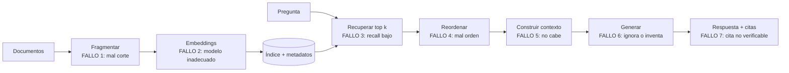

# 061 — RAG evaluable: medir la recuperación antes que la generación

> [Programa](../../../README.md) · [Parte 12](../README.md) · [← Anterior](../../part-12-vectores-recuperacion-y-rag/060-busqueda-hibrida-y-filtrado/README.md) · [Siguiente →](../../part-13-arquitectura-y-proyecto-final/062-persistencia-poliglota-por-evidencia/README.md)

Parte 12 — Vectores, recuperación y RAG · Avanzado ·
3 horas estimadas · motores `qdrant`, `postgresql` · laboratorio
[`labs/06-vector-search`](../../../labs/06-vector-search/README.md) · 3 fuentes.

**Conceptos centrales:** `recall@k` · `precisión@k` · `MRR` · `fragmentación` · `trazabilidad de la cita`

**En este caso se comparan 7 motores**: 5 lo resuelven (4 con el resultado comprobado por máquina) y 2 no, con el motivo escrito.

---

## Propósito

Construir un sistema de generación aumentada por recuperación cuya calidad se pueda medir. La parte de bases de datos —la recuperación— se evalúa por separado y **antes** que la generación.

## Resultados de aprendizaje

Al terminar podrás:

1. Descomponer un sistema RAG y localizar dónde falla.
2. Construir un conjunto de evaluación de recuperación.
3. Calcular recall@k, precision@k, MRR y NDCG@k.
4. Explicar por qué el techo de la generación es el recall de la recuperación.
5. Diseñar la trazabilidad de las citas.

## Fundamentos

### La arquitectura y sus puntos de fallo

Lewis et al. definieron RAG: recuperar pasajes relevantes y dárselos al modelo generador como contexto.



Los fallos 1 a 5 son **de bases de datos**. Solo el 6 es del modelo generador. La consecuencia práctica es que la mayor parte del trabajo de mejora de un RAG es trabajo de recuperación.

### El techo

**Si el pasaje que contiene la respuesta no está entre los `k` recuperados, ningún modelo puede responder correctamente.** Como mucho, dirá que no lo sabe; en el peor caso, inventará.

```text
recall@5 = 0,60  →  el 40 % de las preguntas son irrespondibles
                    por muy bueno que sea el generador
```

De ahí la regla operativa del programa: **medir la recuperación antes de tocar el generador**. Es también la más barata: no consume tokens.

### Las métricas

Con un conjunto de preguntas y, para cada una, los fragmentos relevantes conocidos:

| Métrica | Fórmula | Qué mide |
|---|---|---|
| **Recall@k** | relevantes en el top k / relevantes totales | ¿Está la respuesta ahí? |
| **Precision@k** | relevantes en el top k / k | ¿Cuánto ruido acompaña? |
| **MRR** | media de 1/posición del primer relevante | ¿Cómo de arriba aparece? |
| **NDCG@k** | ganancia descontada / ideal | Relevancia graduada y posición |

Para RAG, **recall@k es la métrica principal**: define el techo. Precision importa porque el contexto es finito y el ruido distrae al generador.

### El conjunto de evaluación

Es el activo central y hay que construirlo:

1. Reunir 50–100 preguntas **reales** (de usuarios, de soporte, de registros).
2. Para cada una, identificar a mano los fragmentos que contienen la respuesta.
3. Guardarlo versionado, junto al código.
4. Ejecutarlo en cada cambio de fragmentación, modelo, índice o fusión.

Sin él, cualquier afirmación sobre la calidad del sistema es una impresión.

## Ejemplo trabajado

RAG sobre este programa: 64 clases fragmentadas, preguntas de estudiantes.

**Conjunto de evaluación:**

```json
[
  {"pregunta": "¿Por qué NOT IN falla con nulos?",
   "relevantes": ["019#3", "012#5"]},
  {"pregunta": "¿Cuándo conviene un índice parcial?",
   "relevantes": ["041#2", "039#4"]},
  {"pregunta": "¿Qué se pierde con appendfsync everysec?",
   "relevantes": ["027#2"]},
  {"pregunta": "¿Cómo evito el doble conteo al reunir dos tablas hijas?",
   "relevantes": ["016#4", "017#1"]}
]
```

**Evaluación de la recuperación, sin generar nada:**

```python
def evaluar(recuperar, conjunto, k=5):
    recalls, precisions, rr = [], [], []
    for caso in conjunto:
        obtenidos = [d.id for d in recuperar(caso["pregunta"], k=k)]
        relevantes = set(caso["relevantes"])
        aciertos = [d for d in obtenidos if d in relevantes]

        recalls.append(len(aciertos) / len(relevantes))
        precisions.append(len(aciertos) / k)
        # MRR: solo cuenta la posición del PRIMER relevante
        pos = next((i + 1 for i, d in enumerate(obtenidos) if d in relevantes), None)
        rr.append(1 / pos if pos else 0.0)

    n = len(conjunto)
    return {"recall@k": sum(recalls)/n, "precision@k": sum(precisions)/n,
            "mrr": sum(rr)/n}
```

**Iteraciones medidas, en orden cronológico:**

| Configuración | recall@5 | precision@5 | MRR |
|---|---:|---:|---:|
| Fragmentos de 2 000 car., solo vectorial | 0,58 | 0,23 | 0,51 |
| Fragmentos de 600 car. con 15 % de solape | 0,71 | 0,31 | 0,62 |
| + cabecera de sección en cada fragmento | 0,78 | 0,34 | 0,69 |
| + híbrida RRF (clase 060) | 0,89 | 0,39 | 0,81 |
| + reordenador sobre 50 | 0,89 | **0,52** | **0,88** |

Observaciones que enseñan más que las cifras:

- **Fragmentar mejor fue la mejora más grande** (+13 puntos) y no costó ni un modelo nuevo ni un servicio nuevo.
- **Añadir la cabecera de sección** al texto del fragmento (+7 puntos) fue casi gratis: da contexto al embedding sobre de qué trata el fragmento.
- **El reordenador no cambia el recall** (0,89 → 0,89) y sube mucho la precisión y el MRR: no recupera más, ordena mejor. Exactamente lo previsto en la clase 060.
- El techo de la generación pasó del 58 % al 89 % **sin tocar el generador**.

**Construcción del contexto**, donde está el fallo 5:

```python
def construir_contexto(fragmentos, presupuesto_tokens=3000):
    partes, usados = [], 0
    for f in fragmentos:                       # ya reordenados: lo mejor primero
        bloque = (f"[{f.id}] {f.clase} · {f.seccion}\n{f.texto}\n")
        t = contar_tokens(bloque)
        if usados + t > presupuesto_tokens:
            break                              # truncar por el final, nunca por el principio
        partes.append(bloque)
        usados += t
    return "\n---\n".join(partes)
```

Dos decisiones deliberadas:

- **Truncar por el final.** Los fragmentos mejor puntuados van primero y nunca se descartan.
- **El identificador `[019#3]` viaja en el contexto.** Es lo que hace verificable la cita.

**Trazabilidad de la cita:**

```python
def verificar_citas(respuesta, contexto_ids):
    citadas = set(re.findall(r"\[(\d{3}#\d+)\]", respuesta))
    inventadas = citadas - set(contexto_ids)
    if inventadas:
        raise CitaInvalida(f"cita no presente en el contexto: {inventadas}")
    return citadas
```

Una cita a un identificador que no estaba en el contexto es una alucinación **detectable mecánicamente**. Es la comprobación más barata y más efectiva de todo el sistema, y no requiere ningún modelo evaluador.

**Registro por consulta**, para poder diagnosticar en producción:

```sql
CREATE TABLE rag_traza (
  id            BIGSERIAL PRIMARY KEY,
  pregunta      TEXT NOT NULL,
  modelo_emb    TEXT NOT NULL,
  ids_recuperados TEXT[] NOT NULL,
  ids_citados     TEXT[] NOT NULL,
  latencia_ms   INTEGER NOT NULL,
  ocurrido_en   TIMESTAMPTZ NOT NULL DEFAULT now()
);
```

Con esta traza, una queja concreta —«me respondió mal»— se diagnostica: si el fragmento correcto no está en `ids_recuperados`, el problema es de recuperación; si estaba y no se citó, es del generador. **Dos equipos distintos, dos arreglos distintos**, y la traza dice cuál.

## Comparación

| Síntoma | Causa probable | Diagnóstico |
|---|---|---|
| «No encuentra información que existe» | Recall bajo | Medir recall@k |
| «Responde con datos de otro tema» | Precision baja o fragmentos grandes | Medir precision, revisar fragmentación |
| «Inventa citas» | Contexto insuficiente o mal construido | Verificar citas mecánicamente |
| «Responde bien a unas y mal a otras» | Conjunto de evaluación poco representativo | Ampliar y desglosar |
| «Va lento» | `ef_search` alto o reordenador sobre demasiados | Curva de la clase 059 |

## Errores frecuentes

1. **Evaluar solo la respuesta final.** No dice dónde está el fallo.
2. **No medir la recuperación.** Se optimiza el generador contra un techo que no se mueve.
3. **Conjunto de evaluación con preguntas inventadas.** No refleja el uso real.
4. **Fragmentos demasiado grandes.** La señal se diluye y el contexto se llena de ruido.
5. **Fragmentos sin contexto de origen.** Un párrafo suelto no se entiende ni se cita.
6. **Citas no verificables.** Impide detectar alucinaciones mecánicamente.
7. **Cambiar el modelo de embeddings sin recalcular la colección** (clase 058).

## De la clase a la operación

Un RAG en producción se degrada por causas de base de datos: documentos nuevos sin indexar, un cambio de modelo a medias, el recall del índice cayendo al crecer la colección. La traza por consulta y la ejecución periódica del conjunto de evaluación son el equivalente aquí de la prueba de restauración de la clase 048.

## Reto de transferencia

1. Construye un conjunto de 50 preguntas reales con sus fragmentos relevantes.
2. Mide recall@5, precision@5 y MRR con tu configuración actual.
3. Prueba tres tamaños de fragmento y quédate con el mejor medido.
4. Implementa la verificación mecánica de citas y la traza por consulta.

## Preguntas de evaluación

1. ¿Por qué recall@k es el techo de la calidad de la respuesta?
2. Explica por qué el reordenador sube la precisión y no el recall.
3. ¿Cómo distingues un fallo de recuperación de uno de generación con la traza?
4. Da una comprobación mecánica de alucinación que no requiera otro modelo.

---

## 🌐 El mismo problema en cada motor

**Caso:** Medir si el documento correcto llegó al contexto, antes de juzgar ninguna respuesta

En un sistema de generación aumentada por recuperación, la parte que más se
mira es la que menos se puede arreglar: el modelo. La que sí se puede
arreglar es la recuperación, y la regla es dura y simple: **si el documento
correcto no llega al contexto, el modelo no puede responder bien**; como
mucho, puede inventar algo plausible.

Por eso la evaluación empieza antes de la generación, con métricas de
recuperación sobre un conjunto de preguntas con respuesta conocida. El caso
calcula dos: cuántas preguntas tienen su documento entre los tres primeros, y
el **MRR** —la media del inverso de la posición—, que premia que el documento
correcto esté arriba y no solo presente.

Con tres preguntas, una acertada en el primer puesto, otra en el tercero y
una fallada: 2 de 3 en el top 3, y MRR = 0,44. Esos dos números son el punto
de partida de cualquier mejora, y se pueden calcular con SQL: no hace falta
ninguna plataforma.

Salida esperada, idéntica en todos los motores que lo resuelven:

| metrica | valor |
|---|---|
| `aciertos_top3` | `2` |
| `mrr` | `0.44` |
| `preguntas` | `3` |

El contrato vive en [`motores.yaml`](motores.yaml) y lo comprueba
`python scripts/verificar_equivalencia.py --clase 061`: 4 de
las 5 implementaciones se ejecutan de verdad y su
resultado se compara con esa tabla; el resto se declara como material revisado,
no ejecutado.

| Motor | ¿Resuelve el caso? | Nivel de prueba | Código | Fuente |
|---|---|---|---|---|
| DuckDB | sí | núcleo | [código](implementaciones/duckdb/consulta.sql) | [doc oficial](https://duckdb.org/docs/stable/sql/functions/aggregates) |
| SQLite | sí | núcleo | [código](implementaciones/sqlite/consulta.sql) | [doc oficial](https://sqlite.org/lang_aggfunc.html) |
| PostgreSQL | sí | servicio | [código](implementaciones/postgresql/consulta.sql) | [doc oficial](https://www.postgresql.org/docs/current/functions-aggregate.html) |
| MySQL | sí | servicio | [código](implementaciones/mysql/consulta.sql) | [doc oficial](https://dev.mysql.com/doc/refman/8.4/en/aggregate-functions.html) |
| OpenSearch | sí | declarado | [código](implementaciones/opensearch/consulta.json) | [doc oficial](https://docs.opensearch.org/latest/api-reference/rank-eval/) |
| Qdrant | **no** | — | — | [doc oficial](https://qdrant.tech/documentation/concepts/search/) |
| Redis | **no** | — | — | [doc oficial](https://redis.io/docs/latest/develop/data-types/hashes/) |

### Los que resuelven el caso

#### DuckDB · [`implementaciones/duckdb/consulta.sql`](implementaciones/duckdb/consulta.sql)

✅ **verificado** — se ejecuta en CI sin servicios

```sql
-- motor: duckdb
-- doc: https://duckdb.org/docs/stable/sql/functions/aggregates
-- nota: en un trabajo real, la tabla de evaluacion no se escribe a mano: es el
--       fichero que produjo la corrida de recuperacion.
--         SELECT ... FROM read_parquet('corrida-2026-08-19.parquet')
--       Y comparar dos configuraciones es anadir una columna y un GROUP BY.

-- === preparacion ===
-- El resultado de una recuperacion sobre un conjunto de evaluacion: para cada
-- pregunta, en que posicion aparecio el documento que de verdad la responde.
-- Nulo significa que NO se recupero en absoluto.
CREATE TABLE evaluacion (
    pregunta            VARCHAR PRIMARY KEY,
    posicion_relevante  INTEGER
);
INSERT INTO evaluacion (pregunta, posicion_relevante) VALUES
    ('q1', 1),
    ('q2', 3),
    ('q3', NULL);   -- el sistema no encontro el documento correcto

-- === consulta ===
-- Dos metricas que hay que calcular ANTES de mirar ninguna respuesta generada:
--
--   aciertos en el top 3  cuantas preguntas tienen su documento entre los tres
--                         primeros. Si el documento correcto no llega al
--                         contexto, el modelo NO puede responder bien: como
--                         mucho, puede inventar algo plausible.
--   MRR                   media del inverso de la posicion. Premia que el
--                         documento correcto este ARRIBA, no solo presente.
--
-- Con estos datos: 2 de 3 en el top 3, y MRR = (1/1 + 1/3 + 0) / 3 = 0,44.
SELECT metrica, valor
FROM (
    SELECT 'preguntas' AS metrica,
           CAST(COUNT(*) AS VARCHAR) AS valor
    FROM evaluacion
    UNION ALL
    SELECT 'aciertos_top3',
           CAST(SUM(CASE WHEN posicion_relevante IS NOT NULL
                          AND posicion_relevante <= 3 THEN 1 ELSE 0 END) AS VARCHAR)
    FROM evaluacion
    UNION ALL
    SELECT 'mrr',
           CAST(ROUND(SUM(CASE WHEN posicion_relevante IS NULL THEN 0.0
                               ELSE 1.0 / posicion_relevante END) / COUNT(*), 2) AS VARCHAR)
    FROM evaluacion
) metricas
ORDER BY metrica;
```

- **Por qué sí:** Es la herramienta natural de la evaluación: los resultados de la recuperación son un fichero, las métricas son agregaciones, y comparar dos configuraciones es un `GROUP BY` más. Sin servicios y sin plataforma.
- **Por qué no:** No recupera nada: evalúa lo que otro recuperó. La calidad del conjunto de evaluación —que es lo que de verdad decide si la métrica significa algo— sigue siendo trabajo humano.
- 📄 Documentación oficial: <https://duckdb.org/docs/stable/sql/functions/aggregates>

#### SQLite · [`implementaciones/sqlite/consulta.sql`](implementaciones/sqlite/consulta.sql)

✅ **verificado** — se ejecuta en CI sin servicios

```sql
-- motor: sqlite
-- doc: https://sqlite.org/lang_aggfunc.html
-- nota: el nulo de q3 es la parte delicada. Si se escribiera
--         AVG(1.0 / posicion_relevante)
--       SQLite ignoraria la fila nula y el MRR saldria 0,67 en vez de 0,44: el
--       fallo de recuperacion desapareceria de la metrica. Por eso el CASE
--       convierte el nulo en 0,0 explicitamente.

-- === preparacion ===
-- El resultado de una recuperacion sobre un conjunto de evaluacion: para cada
-- pregunta, en que posicion aparecio el documento que de verdad la responde.
-- Nulo significa que NO se recupero en absoluto.
CREATE TABLE evaluacion (
    pregunta            TEXT PRIMARY KEY,
    posicion_relevante  INTEGER
);
INSERT INTO evaluacion (pregunta, posicion_relevante) VALUES
    ('q1', 1),
    ('q2', 3),
    ('q3', NULL);   -- el sistema no encontro el documento correcto

-- === consulta ===
-- Dos metricas que hay que calcular ANTES de mirar ninguna respuesta generada:
--
--   aciertos en el top 3  cuantas preguntas tienen su documento entre los tres
--                         primeros. Si el documento correcto no llega al
--                         contexto, el modelo NO puede responder bien: como
--                         mucho, puede inventar algo plausible.
--   MRR                   media del inverso de la posicion. Premia que el
--                         documento correcto este ARRIBA, no solo presente.
--
-- Con estos datos: 2 de 3 en el top 3, y MRR = (1/1 + 1/3 + 0) / 3 = 0,44.
SELECT metrica, valor
FROM (
    SELECT 'preguntas' AS metrica,
           CAST(COUNT(*) AS TEXT) AS valor
    FROM evaluacion
    UNION ALL
    SELECT 'aciertos_top3',
           CAST(SUM(CASE WHEN posicion_relevante IS NOT NULL
                          AND posicion_relevante <= 3 THEN 1 ELSE 0 END) AS TEXT)
    FROM evaluacion
    UNION ALL
    SELECT 'mrr',
           CAST(ROUND(SUM(CASE WHEN posicion_relevante IS NULL THEN 0.0
                               ELSE 1.0 / posicion_relevante END) / COUNT(*), 2) AS TEXT)
    FROM evaluacion
) metricas
ORDER BY metrica;
```

- **Por qué sí:** Sirve para lo mismo sin instalar nada, y deja la fórmula del MRR a la vista: es una división y una media, no una caja negra.
- **Por qué no:** Con conjuntos de evaluación grandes y muchas configuraciones que comparar, se queda corto; y no tiene funciones estadísticas para acompañar la métrica con un intervalo de confianza, que es lo que separa una medición de una anécdota.
- 📄 Documentación oficial: <https://sqlite.org/lang_aggfunc.html>

#### PostgreSQL · [`implementaciones/postgresql/consulta.sql`](implementaciones/postgresql/consulta.sql)

✅ **verificado** — se ejecuta contra el motor real levantado con `docker compose`

```sql
-- motor: postgresql
-- doc: https://www.postgresql.org/docs/current/functions-aggregate.html
-- nota: el valor de tenerlo aqui no es el calculo —es aritmetica— sino la
--       compania: el corpus, los vectores y el historico de evaluaciones en la
--       misma base permiten preguntar como evoluciono el MRR entre versiones
--       sin exportar nada.

-- === preparacion ===
DROP TABLE IF EXISTS evaluacion;

-- El resultado de una recuperacion sobre un conjunto de evaluacion: para cada
-- pregunta, en que posicion aparecio el documento que de verdad la responde.
-- Nulo significa que NO se recupero en absoluto.
CREATE TABLE evaluacion (
    pregunta            text PRIMARY KEY,
    posicion_relevante  integer
);
INSERT INTO evaluacion (pregunta, posicion_relevante) VALUES
    ('q1', 1),
    ('q2', 3),
    ('q3', NULL);   -- el sistema no encontro el documento correcto

-- === consulta ===
-- Dos metricas que hay que calcular ANTES de mirar ninguna respuesta generada:
--
--   aciertos en el top 3  cuantas preguntas tienen su documento entre los tres
--                         primeros. Si el documento correcto no llega al
--                         contexto, el modelo NO puede responder bien: como
--                         mucho, puede inventar algo plausible.
--   MRR                   media del inverso de la posicion. Premia que el
--                         documento correcto este ARRIBA, no solo presente.
--
-- Con estos datos: 2 de 3 en el top 3, y MRR = (1/1 + 1/3 + 0) / 3 = 0,44.
SELECT metrica, valor
FROM (
    SELECT 'preguntas' AS metrica,
           CAST(COUNT(*) AS text) AS valor
    FROM evaluacion
    UNION ALL
    SELECT 'aciertos_top3',
           CAST(SUM(CASE WHEN posicion_relevante IS NOT NULL
                          AND posicion_relevante <= 3 THEN 1 ELSE 0 END) AS text)
    FROM evaluacion
    UNION ALL
    SELECT 'mrr',
           CAST(ROUND(SUM(CASE WHEN posicion_relevante IS NULL THEN 0.0
                               ELSE 1.0 / posicion_relevante END) / COUNT(*), 2) AS text)
    FROM evaluacion
) metricas
ORDER BY metrica;
```

- **Por qué sí:** Permite guardar el histórico de evaluaciones junto al corpus y a los vectores: se puede consultar cómo evolucionó el MRR entre versiones del sistema con una sola consulta, sin exportar nada.
- **Por qué no:** No aporta nada específico a la evaluación: es aritmética. Su valor está en tener los datos juntos, no en el cálculo.
- 📄 Documentación oficial: <https://www.postgresql.org/docs/current/functions-aggregate.html>

#### MySQL · [`implementaciones/mysql/consulta.sql`](implementaciones/mysql/consulta.sql)

✅ **verificado** — se ejecuta contra el motor real levantado con `docker compose`

```sql
-- motor: mysql
-- doc: https://dev.mysql.com/doc/refman/8.4/en/aggregate-functions.html
-- nota: mismo aviso sobre los nulos que en SQLite, y aqui con mas motivo: los
--       agregados de MySQL ignoran nulos en silencio, asi que un fallo de
--       recuperacion se convierte en una metrica inflada sin que nada avise.

-- === preparacion ===
DROP TABLE IF EXISTS evaluacion;

-- El resultado de una recuperacion sobre un conjunto de evaluacion: para cada
-- pregunta, en que posicion aparecio el documento que de verdad la responde.
-- Nulo significa que NO se recupero en absoluto.
CREATE TABLE evaluacion (
    pregunta            VARCHAR(20) PRIMARY KEY,
    posicion_relevante  INT
);
INSERT INTO evaluacion (pregunta, posicion_relevante) VALUES
    ('q1', 1),
    ('q2', 3),
    ('q3', NULL);   -- el sistema no encontro el documento correcto

-- === consulta ===
-- Dos metricas que hay que calcular ANTES de mirar ninguna respuesta generada:
--
--   aciertos en el top 3  cuantas preguntas tienen su documento entre los tres
--                         primeros. Si el documento correcto no llega al
--                         contexto, el modelo NO puede responder bien: como
--                         mucho, puede inventar algo plausible.
--   MRR                   media del inverso de la posicion. Premia que el
--                         documento correcto este ARRIBA, no solo presente.
--
-- Con estos datos: 2 de 3 en el top 3, y MRR = (1/1 + 1/3 + 0) / 3 = 0,44.
SELECT metrica, valor
FROM (
    SELECT 'preguntas' AS metrica,
           CAST(COUNT(*) AS CHAR) AS valor
    FROM evaluacion
    UNION ALL
    SELECT 'aciertos_top3',
           CAST(SUM(CASE WHEN posicion_relevante IS NOT NULL
                          AND posicion_relevante <= 3 THEN 1 ELSE 0 END) AS CHAR)
    FROM evaluacion
    UNION ALL
    SELECT 'mrr',
           CAST(ROUND(SUM(CASE WHEN posicion_relevante IS NULL THEN 0.0
                               ELSE 1.0 / posicion_relevante END) / COUNT(*), 2) AS CHAR)
    FROM evaluacion
) metricas
ORDER BY metrica;
```

- **Por qué sí:** La misma aritmética con la misma sintaxis estándar: la evaluación no depende del motor, y eso es precisamente lo que conviene demostrar.
- **Por qué no:** Su tratamiento de la división decimal y de los nulos en agregados obliga a escribir los `CASE` con cuidado: un nulo mal tratado convierte un fallo de recuperación en un cero silencioso y **infla** la métrica.
- 📄 Documentación oficial: <https://dev.mysql.com/doc/refman/8.4/en/aggregate-functions.html>

#### OpenSearch · [`implementaciones/opensearch/consulta.json`](implementaciones/opensearch/consulta.json)

⚪ **declarado** — se revisa a mano contra la documentación citada; la máquina no lo ejecuta

```json
{
  "_comentario": [
    "motor: opensearch",
    "doc: https://docs.opensearch.org/latest/api-reference/rank-eval/",
    "nota: implementacion declarada. La API _rank_eval calcula precision, recall,",
    "MRR y nDCG DENTRO del motor, contra un conjunto de juicios de relevancia:",
    "se evalua la configuracion real de busqueda, no una reproduccion.",
    "Su limite: solo evalua su propia recuperacion. Para comparar contra un",
    "sistema vectorial externo hay que volver al calculo de este caso, que es",
    "independiente del motor y por eso sirve para todos.",
    "Se consulta con:  POST /documentos/_rank_eval"
  ],

  "requests": [
    {
      "id": "q1",
      "request": { "query": { "match": { "titulo": "bases de datos" } } },
      "ratings": [{ "_index": "documentos", "_id": "d1", "rating": 1 }]
    },
    {
      "id": "q2",
      "request": { "query": { "match": { "titulo": "replicacion" } } },
      "ratings": [{ "_index": "documentos", "_id": "d2", "rating": 1 }]
    },
    {
      "id": "q3",
      "request": { "query": { "match": { "titulo": "protocolos de red" } } },
      "ratings": [{ "_index": "documentos", "_id": "d9", "rating": 1 }]
    }
  ],

  "metric": {
    "mean_reciprocal_rank": { "k": 3, "relevant_rating_threshold": 1 }
  }
}
```

- **Por qué sí:** Tiene una API dedicada a esto, `_rank_eval`, que calcula precisión, recall, MRR y nDCG contra un conjunto de juicios de relevancia **dentro del propio motor**: se evalúa la configuración real de búsqueda, no una reproducción aproximada.
- **Por qué no:** Solo evalúa su propia recuperación: no sirve para comparar contra otro motor ni contra un sistema vectorial externo, que es justamente lo que hay que hacer al elegir.
- 📄 Documentación oficial: <https://docs.opensearch.org/latest/api-reference/rank-eval/>

### Los que no resuelven este caso — y qué se hace en su lugar

Descartar un motor con un argumento es tan formativo como usarlo. Ninguna de estas filas dice que el motor sea peor: dice que este problema no es el suyo.

| Motor | Por qué no | Qué se hace en su lugar | Fuente |
|---|---|---|---|
| Qdrant | Devuelve resultados, no métricas: no hay API de evaluación. Y no la necesita, porque la evaluación tiene que ser **externa al sistema evaluado** para poder comparar alternativas. | Guardar las posiciones devueltas en un fichero y calcular las métricas fuera, exactamente como hace este caso: así el mismo cálculo sirve para Qdrant, para pgvector y para lo que venga después. | [doc](https://qdrant.tech/documentation/concepts/search/) |
| Redis | No participa en la evaluación: no guarda el conjunto de juicios ni calcula agregados sobre él. | Cachear las respuestas de las preguntas frecuentes ya evaluadas, para no pagar la recuperación y la generación dos veces por la misma pregunta. | [doc](https://redis.io/docs/latest/develop/data-types/hashes/) |

---

## Laboratorio

```bash
python scripts/validate_repository.py
python labs/06-vector-search/run_vector_lab.py
```

Guarda como evidencia la salida completa, la versión del motor y la semilla o
los parámetros usados. Una captura sin comando no es evidencia: no se puede
repetir.

## Evaluación

| Criterio | Peso | Qué se comprueba |
|---|---:|---|
| Comprensión conceptual | 25 % | Explica el mecanismo, no solo el resultado |
| Ejecución reproducible | 25 % | Otra persona obtiene lo mismo con las instrucciones dadas |
| Interpretación basada en evidencia | 25 % | Cada conclusión se apoya en una salida o una medición |
| Límites y riesgos declarados | 25 % | Dice qué no demuestra el ejercicio y qué faltaría en producción |

La clase se da por superada cuando la respuesta explica el mecanismo, muestra
la salida que la respalda y declara al menos un límite del ejercicio.

## Fuentes de esta clase

Todo lo afirmado arriba procede de estas obras. Los identificadores viven en
[`catalog/sources.json`](../../../catalog/sources.json) y el estado de los
enlaces se comprueba con `python scripts/check_external_links.py`.

- **Patrick Lewis, Ethan Perez, Aleksandra Piktus** (2020). [Retrieval-Augmented Generation for Knowledge-Intensive NLP Tasks](https://arxiv.org/abs/2005.11401). NeurIPS.  
  Artículo que define RAG: la base de datos es parte del sistema, no un accesorio.
- **Vladimir Karpukhin, Barlas Oguz, Sewon Min** (2020). [Dense Passage Retrieval for Open-Domain Question Answering](https://arxiv.org/abs/2004.04906). EMNLP.  
  Recuperación densa entrenada, y su comparación honesta contra BM25.
- **Stephen Robertson, Hugo Zaragoza** (2009). [The Probabilistic Relevance Framework: BM25 and Beyond](https://www.staff.city.ac.uk/~sbrp622/papers/foundations_bm25_review.pdf). Foundations and Trends in Information Retrieval 3(4). DOI [10.1561/1500000019](https://doi.org/10.1561/1500000019).  
  Función de ranking léxico contra la que se compara toda búsqueda semántica.

---

> [Programa](../../../README.md) · [Parte 12](../README.md) · [← Anterior](../../part-12-vectores-recuperacion-y-rag/060-busqueda-hibrida-y-filtrado/README.md) · [Siguiente →](../../part-13-arquitectura-y-proyecto-final/062-persistencia-poliglota-por-evidencia/README.md)
