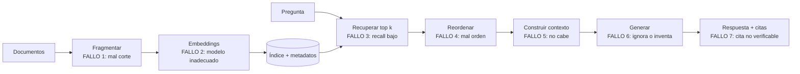

## Propósito

Construir un sistema de generación aumentada por recuperación cuya calidad se pueda medir. La parte de bases de datos —la recuperación— se evalúa por separado y **antes** que la generación.

## Resultados de aprendizaje

Al terminar podrás:

1. Descomponer un sistema RAG y localizar dónde falla.
2. Construir un conjunto de evaluación de recuperación.
3. Calcular recall@k, precision@k, MRR y NDCG@k.
4. Explicar por qué el techo de la generación es el recall de la recuperación.
5. Diseñar la trazabilidad de las citas.

## Fundamentos

### La arquitectura y sus puntos de fallo

Lewis et al. definieron RAG: recuperar pasajes relevantes y dárselos al modelo generador como contexto.



Los fallos 1 a 5 son **de bases de datos**. Solo el 6 es del modelo generador. La consecuencia práctica es que la mayor parte del trabajo de mejora de un RAG es trabajo de recuperación.

### El techo

**Si el pasaje que contiene la respuesta no está entre los `k` recuperados, ningún modelo puede responder correctamente.** Como mucho, dirá que no lo sabe; en el peor caso, inventará.

```text
recall@5 = 0,60  →  el 40 % de las preguntas son irrespondibles
                    por muy bueno que sea el generador
```

De ahí la regla operativa del programa: **medir la recuperación antes de tocar el generador**. Es también la más barata: no consume tokens.

### Las métricas

Con un conjunto de preguntas y, para cada una, los fragmentos relevantes conocidos:

| Métrica | Fórmula | Qué mide |
|---|---|---|
| **Recall@k** | relevantes en el top k / relevantes totales | ¿Está la respuesta ahí? |
| **Precision@k** | relevantes en el top k / k | ¿Cuánto ruido acompaña? |
| **MRR** | media de 1/posición del primer relevante | ¿Cómo de arriba aparece? |
| **NDCG@k** | ganancia descontada / ideal | Relevancia graduada y posición |

Para RAG, **recall@k es la métrica principal**: define el techo. Precision importa porque el contexto es finito y el ruido distrae al generador.

### El conjunto de evaluación

Es el activo central y hay que construirlo:

1. Reunir 50–100 preguntas **reales** (de usuarios, de soporte, de registros).
2. Para cada una, identificar a mano los fragmentos que contienen la respuesta.
3. Guardarlo versionado, junto al código.
4. Ejecutarlo en cada cambio de fragmentación, modelo, índice o fusión.

Sin él, cualquier afirmación sobre la calidad del sistema es una impresión.

## Ejemplo trabajado

RAG sobre este programa: 64 clases fragmentadas, preguntas de estudiantes.

**Conjunto de evaluación:**

```json
[
  {"pregunta": "¿Por qué NOT IN falla con nulos?",
   "relevantes": ["019#3", "012#5"]},
  {"pregunta": "¿Cuándo conviene un índice parcial?",
   "relevantes": ["041#2", "039#4"]},
  {"pregunta": "¿Qué se pierde con appendfsync everysec?",
   "relevantes": ["027#2"]},
  {"pregunta": "¿Cómo evito el doble conteo al reunir dos tablas hijas?",
   "relevantes": ["016#4", "017#1"]}
]
```

**Evaluación de la recuperación, sin generar nada:**

```python
def evaluar(recuperar, conjunto, k=5):
    recalls, precisions, rr = [], [], []
    for caso in conjunto:
        obtenidos = [d.id for d in recuperar(caso["pregunta"], k=k)]
        relevantes = set(caso["relevantes"])
        aciertos = [d for d in obtenidos if d in relevantes]

        recalls.append(len(aciertos) / len(relevantes))
        precisions.append(len(aciertos) / k)
        # MRR: solo cuenta la posición del PRIMER relevante
        pos = next((i + 1 for i, d in enumerate(obtenidos) if d in relevantes), None)
        rr.append(1 / pos if pos else 0.0)

    n = len(conjunto)
    return {"recall@k": sum(recalls)/n, "precision@k": sum(precisions)/n,
            "mrr": sum(rr)/n}
```

**Iteraciones medidas, en orden cronológico:**

| Configuración | recall@5 | precision@5 | MRR |
|---|---:|---:|---:|
| Fragmentos de 2 000 car., solo vectorial | 0,58 | 0,23 | 0,51 |
| Fragmentos de 600 car. con 15 % de solape | 0,71 | 0,31 | 0,62 |
| + cabecera de sección en cada fragmento | 0,78 | 0,34 | 0,69 |
| + híbrida RRF (clase 060) | 0,89 | 0,39 | 0,81 |
| + reordenador sobre 50 | 0,89 | **0,52** | **0,88** |

Observaciones que enseñan más que las cifras:

- **Fragmentar mejor fue la mejora más grande** (+13 puntos) y no costó ni un modelo nuevo ni un servicio nuevo.
- **Añadir la cabecera de sección** al texto del fragmento (+7 puntos) fue casi gratis: da contexto al embedding sobre de qué trata el fragmento.
- **El reordenador no cambia el recall** (0,89 → 0,89) y sube mucho la precisión y el MRR: no recupera más, ordena mejor. Exactamente lo previsto en la clase 060.
- El techo de la generación pasó del 58 % al 89 % **sin tocar el generador**.

**Construcción del contexto**, donde está el fallo 5:

```python
def construir_contexto(fragmentos, presupuesto_tokens=3000):
    partes, usados = [], 0
    for f in fragmentos:                       # ya reordenados: lo mejor primero
        bloque = (f"[{f.id}] {f.clase} · {f.seccion}\n{f.texto}\n")
        t = contar_tokens(bloque)
        if usados + t > presupuesto_tokens:
            break                              # truncar por el final, nunca por el principio
        partes.append(bloque)
        usados += t
    return "\n---\n".join(partes)
```

Dos decisiones deliberadas:

- **Truncar por el final.** Los fragmentos mejor puntuados van primero y nunca se descartan.
- **El identificador `[019#3]` viaja en el contexto.** Es lo que hace verificable la cita.

**Trazabilidad de la cita:**

```python
def verificar_citas(respuesta, contexto_ids):
    citadas = set(re.findall(r"\[(\d{3}#\d+)\]", respuesta))
    inventadas = citadas - set(contexto_ids)
    if inventadas:
        raise CitaInvalida(f"cita no presente en el contexto: {inventadas}")
    return citadas
```

Una cita a un identificador que no estaba en el contexto es una alucinación **detectable mecánicamente**. Es la comprobación más barata y más efectiva de todo el sistema, y no requiere ningún modelo evaluador.

**Registro por consulta**, para poder diagnosticar en producción:

```sql
CREATE TABLE rag_traza (
  id            BIGSERIAL PRIMARY KEY,
  pregunta      TEXT NOT NULL,
  modelo_emb    TEXT NOT NULL,
  ids_recuperados TEXT[] NOT NULL,
  ids_citados     TEXT[] NOT NULL,
  latencia_ms   INTEGER NOT NULL,
  ocurrido_en   TIMESTAMPTZ NOT NULL DEFAULT now()
);
```

Con esta traza, una queja concreta —«me respondió mal»— se diagnostica: si el fragmento correcto no está en `ids_recuperados`, el problema es de recuperación; si estaba y no se citó, es del generador. **Dos equipos distintos, dos arreglos distintos**, y la traza dice cuál.

## Comparación

| Síntoma | Causa probable | Diagnóstico |
|---|---|---|
| «No encuentra información que existe» | Recall bajo | Medir recall@k |
| «Responde con datos de otro tema» | Precision baja o fragmentos grandes | Medir precision, revisar fragmentación |
| «Inventa citas» | Contexto insuficiente o mal construido | Verificar citas mecánicamente |
| «Responde bien a unas y mal a otras» | Conjunto de evaluación poco representativo | Ampliar y desglosar |
| «Va lento» | `ef_search` alto o reordenador sobre demasiados | Curva de la clase 059 |

## Errores frecuentes

1. **Evaluar solo la respuesta final.** No dice dónde está el fallo.
2. **No medir la recuperación.** Se optimiza el generador contra un techo que no se mueve.
3. **Conjunto de evaluación con preguntas inventadas.** No refleja el uso real.
4. **Fragmentos demasiado grandes.** La señal se diluye y el contexto se llena de ruido.
5. **Fragmentos sin contexto de origen.** Un párrafo suelto no se entiende ni se cita.
6. **Citas no verificables.** Impide detectar alucinaciones mecánicamente.
7. **Cambiar el modelo de embeddings sin recalcular la colección** (clase 058).

## De la clase a la operación

Un RAG en producción se degrada por causas de base de datos: documentos nuevos sin indexar, un cambio de modelo a medias, el recall del índice cayendo al crecer la colección. La traza por consulta y la ejecución periódica del conjunto de evaluación son el equivalente aquí de la prueba de restauración de la clase 048.

## Reto de transferencia

1. Construye un conjunto de 50 preguntas reales con sus fragmentos relevantes.
2. Mide recall@5, precision@5 y MRR con tu configuración actual.
3. Prueba tres tamaños de fragmento y quédate con el mejor medido.
4. Implementa la verificación mecánica de citas y la traza por consulta.

## Preguntas de evaluación

1. ¿Por qué recall@k es el techo de la calidad de la respuesta?
2. Explica por qué el reordenador sube la precisión y no el recall.
3. ¿Cómo distingues un fallo de recuperación de uno de generación con la traza?
4. Da una comprobación mecánica de alucinación que no requiera otro modelo.
