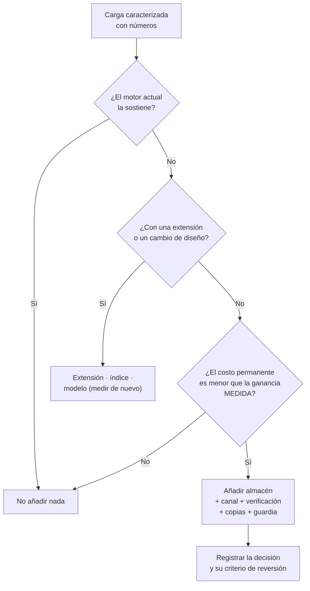

## Propósito

Decidir cuántos almacenes de datos usar. Cada motor añadido resuelve un problema y crea varios permanentes; el criterio debe ser una medición, no una tendencia.

## Resultados de aprendizaje

Al terminar podrás:

1. Caracterizar una carga de trabajo con números antes de elegir motor.
2. Enumerar el costo permanente de añadir un almacén.
3. Aplicar la regla de agotar primero las capacidades del motor existente.
4. Diseñar la sincronización entre almacenes y su verificación.
5. Defender una arquitectura de un solo motor cuando corresponda.

## Fundamentos

### Caracterizar antes de elegir

Sadalage y Fowler acuñaron «persistencia poliglota»: usar el almacén adecuado a cada carga. La parte que se cita menos es que **cada almacén adicional es un sistema completo que operar**.

La caracterización necesaria, con números reales:

| Dimensión | Pregunta |
|---|---|
| Volumen | ¿Cuántos datos hoy y en 3 años? |
| Caudal | Lecturas/s y escrituras/s, con su pico |
| Patrón de acceso | ¿Por clave, por rango, agregado, recorrido, similitud? |
| Latencia exigida | p50 y p99, por operación |
| Consistencia | ¿Qué invariantes deben ser atómicas? |
| Ciclo de vida | ¿Retención, expiración, histórico? |
| Consultas no previstas | ¿Con qué frecuencia aparecen? |

Sin estas cifras, la elección de motor es una preferencia.

### El costo permanente

Añadir un almacén cuesta, para siempre:

| Costo | Detalle |
|---|---|
| Operación | Actualizar, parchear, dimensionar, vigilar |
| Copias | Otro plan de respaldo y **otra prueba de restauración** (clase 048) |
| Seguridad | Otro modelo de control de acceso, otras credenciales |
| Sincronización | Un canal que puede desincronizarse (clase 056) |
| Consistencia | Invariantes que cruzan almacenes y ya no son atómicas (clase 047) |
| Conocimiento | Alguien debe saber operarlo; y su suplente también |
| Guardia | Otra fuente de incidentes de madrugada |

Regla del programa: **un almacén nuevo debe resolver un problema medido que el actual no puede resolver**, no un problema anticipado.

### Agotar primero lo que ya se tiene

PostgreSQL cubre por sí solo una superficie sorprendente:

| Necesidad | Motor «natural» | PostgreSQL |
|---|---|---|
| Documentos | MongoDB | `jsonb` + GIN (clase 021) |
| Clave-valor | Redis | `UNLOGGED` + índice hash |
| Búsqueda de texto | OpenSearch | `tsvector` + GIN (clase 031) |
| Vectores | Qdrant | `pgvector` (clase 059) |
| Series temporales | InfluxDB | TimescaleDB (clase 030) |
| Cola de trabajos | RabbitMQ | `SELECT ... FOR UPDATE SKIP LOCKED` |
| Analítica | ClickHouse | Réplica + agregados, o Parquet + DuckDB |
| Grafos | Neo4j | CTE recursiva (clase 028) |

Ninguna de estas alternativas es la mejor **en su especialidad**. Todas son suficientes hasta cierto punto, y ese punto está mucho más lejos de lo que se supone. La pregunta correcta no es «¿cuál es el mejor motor para X?», sino **«¿ha dejado de bastarme el que ya opero?»**.



## Ejemplo trabajado

Plataforma educativa. Caracterización real de sus cinco cargas:

| # | Carga | Volumen | Caudal | Patrón | Latencia | Consistencia |
|---|---|---|---|---|---|---|
| 1 | Inscripciones y notas | 5 M filas | 300 l/s, 5 e/s | Relacional, reuniones | p99 < 50 ms | **Transaccional** |
| 2 | Sesiones | 50 k activas | 2 000 l/s, 200 e/s | Clave-valor, TTL | p99 < 5 ms | Se puede perder |
| 3 | Búsqueda de contenido | 200 k fragmentos | 50 c/s | Léxica + semántica | p99 < 200 ms | Desfase de minutos |
| 4 | Panel de dirección | 5 M filas | 12 c/día | Agregación completa | < 30 s | Desfase de horas |
| 5 | Telemetría de uso | 200 M eventos/año | 3 000 e/s | Escritura, ventanas | escritura < 10 ms | Se puede perder |

**Análisis carga por carga:**

**1. PostgreSQL.** No hay discusión: transacciones, integridad, reuniones.

**2. Sesiones.** ¿Redis? Primero la medición sobre PostgreSQL:

```sql
CREATE UNLOGGED TABLE sesiones (   -- UNLOGGED: sin WAL, mucho más rápido, se pierde al caer
  token      TEXT PRIMARY KEY,
  student_id INTEGER NOT NULL,
  expira_en  TIMESTAMPTZ NOT NULL
);
CREATE INDEX ON sesiones (expira_en);
```

```text
Medición: 2 000 lecturas/s por clave primaria → p99 = 1,8 ms
Exigencia: p99 < 5 ms  ✔
Veredicto: NO añadir Redis. PostgreSQL cumple con margen.
```

`UNLOGGED` es la clave: sin WAL, y perder las sesiones al caer el servidor ya se había declarado aceptable.

**3. Búsqueda.** Léxica con `tsvector` y semántica con `pgvector`, sobre 200 000 fragmentos:

```text
Medición: híbrida RRF (clase 060) → p99 = 84 ms, recall@5 = 0,89
Exigencia: p99 < 200 ms  ✔
Veredicto: NO añadir OpenSearch ni Qdrant.
Revisión: si el corpus llega a 5 M de fragmentos, volver a medir.
```

La última línea es tan importante como el veredicto: **la decisión lleva su condición de revisión escrita**.

**4. Panel.** Ejecutado sobre el primario degradaba el OLTP (clase 054):

```text
Opción A: réplica de solo lectura       → 47 s, sin impacto en OLTP  ✔
Opción B: exportación a Parquet+DuckDB  → 1,2 s, sin servidor nuevo  ✔✔
Veredicto: opción B. Coste: un trabajo programado.
```

**5. Telemetría.** 3 000 escrituras/s, 200 M de eventos al año:

```text
Medición sobre PostgreSQL con TimescaleDB:
  ingesta sostenida: 3 000/s ✔
  almacenamiento con compresión y retención por niveles (clase 030): 34 GB/año ✔
  consulta de ventana con agregado continuo: 180 ms ✔
Veredicto: TimescaleDB, que es una extensión del motor que YA se opera.
Coste marginal: una extensión, no un sistema.
```

**Arquitectura resultante:**

```text
PostgreSQL 16
  + TimescaleDB      (telemetría)
  + pgvector         (búsqueda semántica)
  + tsvector/GIN     (búsqueda léxica)
  + tabla UNLOGGED   (sesiones)
  + réplica de solo lectura
  + exportación nocturna a Parquet, consultada con DuckDB

Almacenes que operar: UNO.
```

Frente a la arquitectura «de manual» —PostgreSQL + Redis + OpenSearch + Qdrant + ClickHouse + InfluxDB, seis sistemas—, esta cumple **todas** las exigencias medidas con uno.

**Y cuándo dejaría de bastar**, escrito por adelantado:

| Umbral | Motor a añadir |
|---|---|
| Sesiones > 20 000 lecturas/s | Redis |
| Corpus > 5 M fragmentos o recall < 0,85 | Qdrant |
| Telemetría > 50 000 escrituras/s | ClickHouse |
| Panel sobre > 500 GB o varias fuentes | Almacén columnar |

**Este es el entregable de la clase**: no una arquitectura, sino una arquitectura **con sus condiciones de cambio**. Cada umbral es medible y cada uno tiene una alerta.

## Comparación

| Enfoque | Sistemas | Coste operativo | Rendimiento por carga | Riesgo |
|---|---|---|---|---|
| Un motor con extensiones | 1 | Bajo | Bueno en todo, óptimo en nada | Techo por carga |
| Poliglota por evidencia | 2–3 | Medio | Óptimo donde se midió | Sincronización |
| Poliglota por tendencia | 5+ | **Alto** | Óptimo y desaprovechado | Divergencia, guardia, conocimiento |

## Errores frecuentes

1. **Elegir motor por la arquitectura de otra empresa.** Sus cifras no son las tuyas.
2. **No caracterizar la carga.** Sin números, la elección es estética.
3. **Ignorar el costo permanente.** Se contabiliza el desarrollo y no la operación.
4. **Añadir un almacén sin canal verificado.** Divergencia silenciosa.
5. **Suponer que PostgreSQL no sirve.** Suele servir mucho más allá de lo que se cree.
6. **No escribir la condición de revisión.** La decisión se vuelve dogma.
7. **Optimizar para un volumen que no se tiene.** Complejidad hoy por un problema hipotético.

## De la clase a la operación

Cada almacén añadido multiplica los estados posibles del sistema, y por tanto los modos de fallo. Un equipo pequeño con seis almacenes no los opera bien: los tiene. La arquitectura defendible es la que el equipo puede sostener a las tres de la mañana.

## Reto de transferencia

1. Caracteriza las cinco cargas principales de tu sistema con números reales.
2. Mide cada una contra tu motor actual, con las extensiones disponibles.
3. Justifica cada almacén adicional con la medición que lo hace necesario.
4. Escribe los umbrales de revisión y configura una alerta para cada uno.

## Preguntas de evaluación

1. Enumera el costo permanente de añadir un almacén a tu sistema.
2. Da una carga tuya que hoy usa un motor especializado y podría volver al principal.
3. ¿Qué medirías antes de añadir un motor de búsqueda dedicado?
4. Escribe el umbral de revisión de una de tus decisiones y cómo lo vigilarías.
