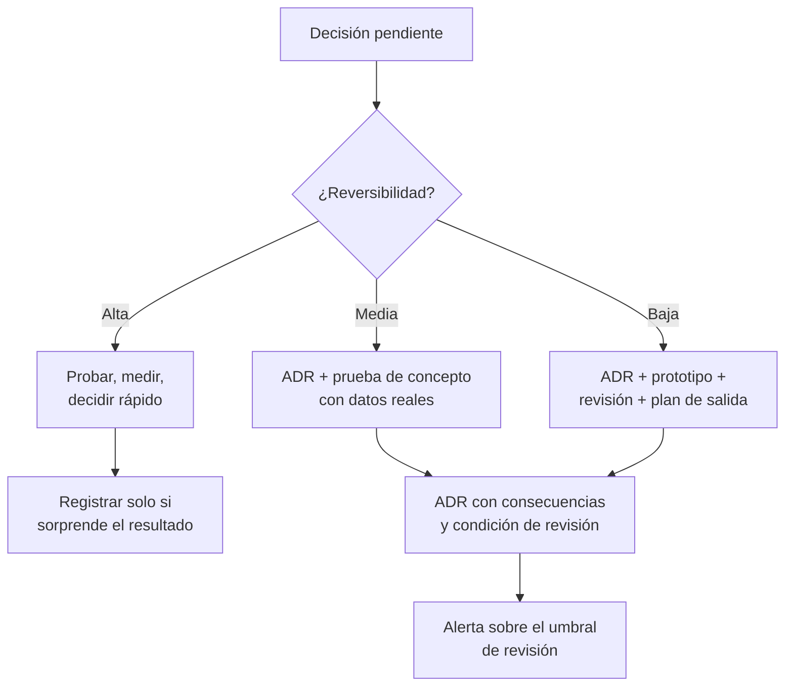

# 063 — Registro de decisiones de arquitectura y costo total

> [Programa](../../../README.md) · [Parte 13](../README.md) · [← Anterior](../../part-13-arquitectura-y-proyecto-final/062-persistencia-poliglota-por-evidencia/README.md) · [Siguiente →](../../part-13-arquitectura-y-proyecto-final/064-proyecto-final-disenar-medir-y-defender/README.md)

Parte 13 — Arquitectura y proyecto final · Avanzado ·
3 horas estimadas · motores `postgresql` · laboratorio
[`labs/02-polyglot-modeling`](../../../labs/02-polyglot-modeling/README.md) · 3 fuentes.

**Conceptos centrales:** `ADR` · `contexto` · `consecuencia` · `costo total de propiedad` · `reversibilidad`

---

## Propósito

Dejar constancia de por qué el sistema es como es. Sin registro de decisiones, cada relevo del equipo debe reconstruir el razonamiento por arqueología, o lo cambia sin saber qué rompe.

## Resultados de aprendizaje

Al terminar podrás:

1. Escribir un registro de decisión de arquitectura (ADR) completo.
2. Distinguir contexto, decisión, alternativas y consecuencias.
3. Calcular el costo total de propiedad de una opción de datos.
4. Evaluar la reversibilidad de una decisión y ajustar el rigor a ella.
5. Escribir la condición de revisión que evita que la decisión se vuelva dogma.

## Fundamentos

### El ADR

Documento corto, versionado junto al código, inmutable una vez aceptado. Si la decisión cambia, se escribe un ADR nuevo que **supersede** al anterior; no se edita el viejo, porque el histórico es el valor.

```markdown
# ADR-007: Usar pgvector en lugar de un motor vectorial dedicado

- Estado: aceptado
- Fecha: 2026-08-19
- Decide: equipo de plataforma
- Supersede a: —

## Contexto
[Situación, restricciones y cifras medidas. Sin opiniones.]

## Decisión
[Qué se hace, en una frase.]

## Alternativas consideradas
[Cada una con por qué se descartó, no solo que se descartó.]

## Consecuencias
[Positivas, negativas y neutras. Las negativas son obligatorias.]

## Condición de revisión
[El umbral medible que obliga a reabrir esta decisión.]
```

La sección que casi siempre falta es **consecuencias negativas**. Un ADR sin ellas no documenta una decisión: la vende. Y la que casi nadie escribe es la **condición de revisión**, que es la que impide que una elección correcta en 2026 siga vigente por inercia en 2030.

### Costo total de propiedad

El costo de una decisión de datos no es la licencia ni la instancia:

| Componente | Cómo estimarlo |
|---|---|
| Infraestructura | Instancias, almacenamiento, red, copias |
| Licencias | Si aplica, con su modelo de crecimiento |
| Operación | Horas/mes de mantenimiento × costo/hora |
| Guardia | Incidentes esperados/mes × horas × costo |
| Aprendizaje | Horas hasta competencia, por persona, incluido el suplente |
| Migración de salida | **Costo de deshacer la decisión** |
| Oportunidad | Lo que el equipo no hace mientras hace esto |

La penúltima fila es la que convierte el análisis en útil: una decisión barata de tomar y carísima de revertir merece mucho más rigor que una reversible.

### Reversibilidad

| Tipo | Ejemplo | Rigor exigible |
|---|---|---|
| **Reversible** | Añadir un índice, ajustar un parámetro | Bajo: probar y medir |
| **Costosa de revertir** | Añadir un almacén, cambiar de modelo de embeddings | Medio: ADR y prueba de concepto |
| **Prácticamente irreversible** | Clave de partición, clave primaria, formato de datos históricos | **Alto**: ADR, prototipo y revisión externa |

El error clásico es aplicar rigor uniforme: se debate una semana sobre un índice —reversible en dos minutos— y se elige la clave de partición en una reunión de media hora.



## Ejemplo trabajado

ADR completo de la decisión de la clase 062.

```markdown
# ADR-007: Búsqueda semántica con pgvector en lugar de un motor dedicado

- Estado: aceptado
- Fecha: 2026-08-19
- Decide: equipo de plataforma (3 personas)
- Supersede a: —

## Contexto

El buscador debe responder preguntas en lenguaje natural sobre 200 000
fragmentos de contenido del programa.

Cifras medidas sobre el conjunto de evaluación de 60 consultas juzgadas:

| Opción                         | p99    | recall@5 | Sistemas |
|--------------------------------|--------|----------|----------|
| PostgreSQL: tsvector + pgvector|  84 ms |    0,89  |    0     |
| Qdrant + OpenSearch            |  31 ms |    0,91  |    2     |

Exigencia de producto: p99 < 200 ms, recall@5 ≥ 0,85.
El equipo son 3 personas y ya opera PostgreSQL con guardia 24/7.
El corpus crece ~15 % anual.

## Decisión

Implementar la búsqueda híbrida dentro de PostgreSQL, con `tsvector` para la
rama léxica y `pgvector` (HNSW, m=16, ef_search=100) para la vectorial,
fusionando con RRF (k=60).

## Alternativas consideradas

1. **Qdrant + OpenSearch.** Mejor latencia (31 ms frente a 84) y recall
   equivalente (0,91 frente a 0,89). Descartada porque ambas cifras superan la
   exigencia con margen y añade dos sistemas: dos planes de copia, dos modelos
   de control de acceso, dos canales de sincronización y dos fuentes de guardia
   para un equipo de tres personas.

2. **Solo búsqueda léxica.** Descartada: recall@5 = 0,74, por debajo de la
   exigencia. Falla en las preguntas de intención, que son el 45 % del tráfico
   observado.

3. **Servicio gestionado de búsqueda.** Descartada por costo (estimado 4× la
   opción elegida) y porque enviaría contenido a un tercero, lo que exigiría
   revisar el registro de tratamiento (ADR-004).

## Consecuencias

**Positivas**
- Un solo sistema que operar, respaldar y asegurar.
- Los filtros por metadatos son SQL ordinario y se combinan con cualquier
  consulta relacional.
- La consistencia entre contenido y su índice es transaccional: no hay canal
  que pueda desincronizarse.

**Negativas**
- Latencia 2,7× superior a la alternativa dedicada. Aceptable hoy; dejará de
  serlo si la exigencia baja de 100 ms.
- El índice HNSW compite por `shared_buffers` con la carga transaccional.
  Vigilado con la métrica de aciertos de buffer.
- Reconstruir el índice HNSW tras un cambio de modelo bloquea la tabla; hay que
  usar `CREATE INDEX CONCURRENTLY` (clase 049).
- Menos funcionalidad de búsqueda: sin facetas nativas, sin sugerencias, sin
  tolerancia a erratas más allá de `pg_trgm`.

**Neutras**
- El equipo debe aprender `pgvector`: estimado en 8 horas por persona.

## Costo total de propiedad a 3 años

| Componente          | pgvector | Qdrant + OpenSearch |
|---------------------|---------:|--------------------:|
| Infraestructura     |  $ 1 800 |            $ 12 600 |
| Operación (h/mes)   |      1 h |                 8 h |
| Guardia (incid/mes) |      0,2 |                 1,5 |
| Aprendizaje inicial |     24 h |               120 h |
| Migración de salida |     40 h |                80 h |
| **Total estimado**  | **$ 9 400** |       **$ 48 200** |

## Condición de revisión

Se reabre esta decisión si se cumple **cualquiera**:

- El corpus supera 5 000 000 de fragmentos.
- El p99 de búsqueda supera 150 ms durante 7 días seguidos.
- El recall@5 medido cae por debajo de 0,85.
- El producto exige facetas o tolerancia a erratas.

Las tres primeras tienen alerta configurada en el panel de búsqueda.
La cuarta se revisa en cada planificación trimestral.
```

**Lo que hace útil a este ADR y no a uno genérico:**

1. **Las cifras son medidas**, con el conjunto de evaluación nombrado. No hay «es más rápido».
2. **La alternativa descartada era mejor en su métrica principal.** Se explica por qué se descarta igualmente. Un ADR donde la opción elegida gana en todo es sospechoso.
3. **Las consecuencias negativas son concretas y verificables**, incluida la que ya tiene mitigación.
4. **La condición de revisión tiene umbrales medibles y alertas configuradas.** No es «lo revisaremos si hace falta».
5. **El costo incluye la salida.** 40 horas de migración es lo que cuesta cambiar de opinión.

## Comparación

| Documento | Responde | Cuándo se escribe |
|---|---|---|
| ADR | **Por qué** es así | Al decidir |
| Documentación de arquitectura | **Cómo** es | Al construir y al cambiar |
| Runbook | **Qué hacer** cuando falla | Antes de la guardia |
| Postmortem | **Qué pasó** y qué se aprendió | Tras el incidente |
| Registro de tratamiento | **Qué datos** y con qué fin | Al diseñar el esquema (clase 053) |

## Errores frecuentes

1. **ADR sin consecuencias negativas.** Es publicidad, no documentación.
2. **Sin condición de revisión.** La decisión se convierte en dogma.
3. **Editar un ADR aceptado.** Se pierde el histórico; hay que superponer uno nuevo.
4. **Alternativas listadas sin explicar el descarte.** No aporta nada al lector futuro.
5. **Costo solo de infraestructura.** Omite operación, guardia y aprendizaje.
6. **Rigor uniforme.** Se debate lo reversible y se improvisa lo irreversible.
7. **ADR escrito después, para justificar.** Documenta la racionalización, no la decisión.

## De la clase a la operación

El valor del ADR se cobra dos años después, cuando alguien propone cambiar algo y puede leer por qué está así, con qué números y bajo qué condición debería cambiarse. Es el documento con mejor relación entre esfuerzo de escritura y utilidad futura de todo el repositorio.

## Reto de transferencia

1. Escribe el ADR de la decisión de datos más importante de tu sistema actual.
2. Incluye una alternativa que fuese mejor en alguna métrica y explica el descarte.
3. Calcula el costo total a tres años, incluida la migración de salida.
4. Define la condición de revisión con umbrales medibles y configura su alerta.

## Preguntas de evaluación

1. ¿Por qué un ADR aceptado no se edita?
2. Da una decisión tuya prácticamente irreversible y di qué rigor recibió.
3. Estima el costo de salida de tu almacén principal, en horas.
4. Escribe la condición de revisión de una decisión vigente en tu equipo.

---

## Laboratorio

```bash
python scripts/validate_repository.py
# labs/02-polyglot-modeling se entrega escrito: no hay guion que ejecutar
```

Guarda como evidencia la salida completa, la versión del motor y la semilla o
los parámetros usados. Una captura sin comando no es evidencia: no se puede
repetir.

## Evaluación

| Criterio | Peso | Qué se comprueba |
|---|---:|---|
| Comprensión conceptual | 25 % | Explica el mecanismo, no solo el resultado |
| Ejecución reproducible | 25 % | Otra persona obtiene lo mismo con las instrucciones dadas |
| Interpretación basada en evidencia | 25 % | Cada conclusión se apoya en una salida o una medición |
| Límites y riesgos declarados | 25 % | Dice qué no demuestra el ejercicio y qué faltaría en producción |

La clase se da por superada cuando la respuesta explica el mecanismo, muestra
la salida que la respalda y declara al menos un límite del ejercicio.

## Fuentes de esta clase

Todo lo afirmado arriba procede de estas obras. Los identificadores viven en
[`catalog/sources.json`](../../../catalog/sources.json) y el estado de los
enlaces se comprueba con `python scripts/check_external_links.py`.

- **Peter Bailis, Joseph M. Hellerstein, Michael Stonebraker** (2015). [Readings in Database Systems](http://www.redbook.io/). 5.a ed. MIT Press. ISBN 978-0-262-52964-3.  
  Antologia comentada de acceso libre. Cada capitulo situa los papers en su discusión.
- **Joe Reis, Matt Housley** (2022). [Fundamentals of Data Engineering](https://www.oreilly.com/library/view/fundamentals-of-data/9781098108298/). O'Reilly. ISBN 978-1-0981-0830-4.  
  Ciclo de vida de la ingenieria de datos e integración entre sistemas.
- **Laine Campbell, Charity Majors** (2017). [Database Reliability Engineering](https://www.oreilly.com/library/view/database-reliability-engineering/9781491925935/). O'Reilly. ISBN 978-1-4919-2594-2.  
  Operación, respaldos, objetivos de servicio y gestion de cambios.

---

> [Programa](../../../README.md) · [Parte 13](../README.md) · [← Anterior](../../part-13-arquitectura-y-proyecto-final/062-persistencia-poliglota-por-evidencia/README.md) · [Siguiente →](../../part-13-arquitectura-y-proyecto-final/064-proyecto-final-disenar-medir-y-defender/README.md)
