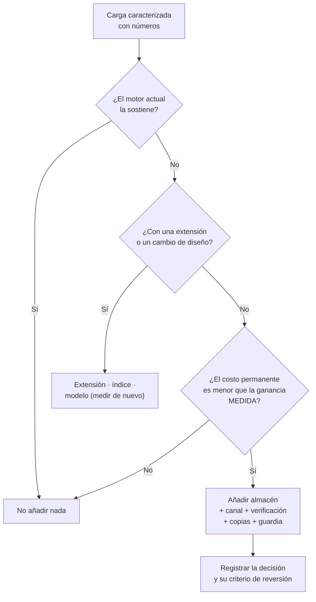

# 072 — Persistencia políglota: decidir por evidencia y no por moda

> [Programa](../../../README.md) · [Parte 14](../README.md) · [← Anterior](../../part-13-vectores-recuperacion-y-rag/071-rag-evaluable/README.md) · [Siguiente →](../../part-14-arquitectura-y-proyecto-final/073-registro-de-decisiones-y-costo-total/README.md)

Parte 14 — Arquitectura y proyecto final · Avanzado ·
3 horas estimadas · motores `postgresql`, `mongodb`, `redis`, `qdrant` · laboratorio
[`labs/02-polyglot-modeling`](../../../labs/02-polyglot-modeling/README.md) · 3 fuentes.

**Conceptos centrales:** `carga de trabajo` · `criterio de selección` · `costo de operación` · `complejidad añadida`

**En este caso se comparan 7 motores**: 5 lo resuelven (0 con el resultado comprobado por máquina) y 2 no, con el motivo escrito.

---

## Propósito

Decidir cuántos almacenes de datos usar. Cada motor añadido resuelve un problema y crea varios permanentes; el criterio debe ser una medición, no una tendencia.

## Resultados de aprendizaje

Al terminar podrás:

1. Caracterizar una carga de trabajo con números antes de elegir motor.
2. Enumerar el costo permanente de añadir un almacén.
3. Aplicar la regla de agotar primero las capacidades del motor existente.
4. Diseñar la sincronización entre almacenes y su verificación.
5. Defender una arquitectura de un solo motor cuando corresponda.

## Fundamentos

### Caracterizar antes de elegir

Sadalage y Fowler acuñaron «persistencia poliglota»: usar el almacén adecuado a cada carga. La parte que se cita menos es que **cada almacén adicional es un sistema completo que operar**.

La caracterización necesaria, con números reales:

| Dimensión | Pregunta |
|---|---|
| Volumen | ¿Cuántos datos hoy y en 3 años? |
| Caudal | Lecturas/s y escrituras/s, con su pico |
| Patrón de acceso | ¿Por clave, por rango, agregado, recorrido, similitud? |
| Latencia exigida | p50 y p99, por operación |
| Consistencia | ¿Qué invariantes deben ser atómicas? |
| Ciclo de vida | ¿Retención, expiración, histórico? |
| Consultas no previstas | ¿Con qué frecuencia aparecen? |

Sin estas cifras, la elección de motor es una preferencia.

### El costo permanente

Añadir un almacén cuesta, para siempre:

| Costo | Detalle |
|---|---|
| Operación | Actualizar, parchear, dimensionar, vigilar |
| Copias | Otro plan de respaldo y **otra prueba de restauración** (clase 048) |
| Seguridad | Otro modelo de control de acceso, otras credenciales |
| Sincronización | Un canal que puede desincronizarse (clase 056) |
| Consistencia | Invariantes que cruzan almacenes y ya no son atómicas (clase 047) |
| Conocimiento | Alguien debe saber operarlo; y su suplente también |
| Guardia | Otra fuente de incidentes de madrugada |

Regla del programa: **un almacén nuevo debe resolver un problema medido que el actual no puede resolver**, no un problema anticipado.

### Agotar primero lo que ya se tiene

PostgreSQL cubre por sí solo una superficie sorprendente:

| Necesidad | Motor «natural» | PostgreSQL |
|---|---|---|
| Documentos | MongoDB | `jsonb` + GIN (clase 021) |
| Clave-valor | Redis | `UNLOGGED` + índice hash |
| Búsqueda de texto | OpenSearch | `tsvector` + GIN (clase 031) |
| Vectores | Qdrant | `pgvector` (clase 059) |
| Series temporales | InfluxDB | TimescaleDB (clase 030) |
| Cola de trabajos | RabbitMQ | `SELECT ... FOR UPDATE SKIP LOCKED` |
| Analítica | ClickHouse | Réplica + agregados, o Parquet + DuckDB |
| Grafos | Neo4j | CTE recursiva (clase 028) |

Ninguna de estas alternativas es la mejor **en su especialidad**. Todas son suficientes hasta cierto punto, y ese punto está mucho más lejos de lo que se supone. La pregunta correcta no es «¿cuál es el mejor motor para X?», sino **«¿ha dejado de bastarme el que ya opero?»**.



## Ejemplo trabajado

Plataforma educativa. Caracterización real de sus cinco cargas:

| # | Carga | Volumen | Caudal | Patrón | Latencia | Consistencia |
|---|---|---|---|---|---|---|
| 1 | Inscripciones y notas | 5 M filas | 300 l/s, 5 e/s | Relacional, reuniones | p99 < 50 ms | **Transaccional** |
| 2 | Sesiones | 50 k activas | 2 000 l/s, 200 e/s | Clave-valor, TTL | p99 < 5 ms | Se puede perder |
| 3 | Búsqueda de contenido | 200 k fragmentos | 50 c/s | Léxica + semántica | p99 < 200 ms | Desfase de minutos |
| 4 | Panel de dirección | 5 M filas | 12 c/día | Agregación completa | < 30 s | Desfase de horas |
| 5 | Telemetría de uso | 200 M eventos/año | 3 000 e/s | Escritura, ventanas | escritura < 10 ms | Se puede perder |

**Análisis carga por carga:**

**1. PostgreSQL.** No hay discusión: transacciones, integridad, reuniones.

**2. Sesiones.** ¿Redis? Primero la medición sobre PostgreSQL:

```sql
CREATE UNLOGGED TABLE sesiones (   -- UNLOGGED: sin WAL, mucho más rápido, se pierde al caer
  token      TEXT PRIMARY KEY,
  student_id INTEGER NOT NULL,
  expira_en  TIMESTAMPTZ NOT NULL
);
CREATE INDEX ON sesiones (expira_en);
```

```text
Medición: 2 000 lecturas/s por clave primaria → p99 = 1,8 ms
Exigencia: p99 < 5 ms  ✔
Veredicto: NO añadir Redis. PostgreSQL cumple con margen.
```

`UNLOGGED` es la clave: sin WAL, y perder las sesiones al caer el servidor ya se había declarado aceptable.

**3. Búsqueda.** Léxica con `tsvector` y semántica con `pgvector`, sobre 200 000 fragmentos:

```text
Medición: híbrida RRF (clase 060) → p99 = 84 ms, recall@5 = 0,89
Exigencia: p99 < 200 ms  ✔
Veredicto: NO añadir OpenSearch ni Qdrant.
Revisión: si el corpus llega a 5 M de fragmentos, volver a medir.
```

La última línea es tan importante como el veredicto: **la decisión lleva su condición de revisión escrita**.

**4. Panel.** Ejecutado sobre el primario degradaba el OLTP (clase 054):

```text
Opción A: réplica de solo lectura       → 47 s, sin impacto en OLTP  ✔
Opción B: exportación a Parquet+DuckDB  → 1,2 s, sin servidor nuevo  ✔✔
Veredicto: opción B. Coste: un trabajo programado.
```

**5. Telemetría.** 3 000 escrituras/s, 200 M de eventos al año:

```text
Medición sobre PostgreSQL con TimescaleDB:
  ingesta sostenida: 3 000/s ✔
  almacenamiento con compresión y retención por niveles (clase 030): 34 GB/año ✔
  consulta de ventana con agregado continuo: 180 ms ✔
Veredicto: TimescaleDB, que es una extensión del motor que YA se opera.
Coste marginal: una extensión, no un sistema.
```

**Arquitectura resultante:**

```text
PostgreSQL 16
  + TimescaleDB      (telemetría)
  + pgvector         (búsqueda semántica)
  + tsvector/GIN     (búsqueda léxica)
  + tabla UNLOGGED   (sesiones)
  + réplica de solo lectura
  + exportación nocturna a Parquet, consultada con DuckDB

Almacenes que operar: UNO.
```

Frente a la arquitectura «de manual» —PostgreSQL + Redis + OpenSearch + Qdrant + ClickHouse + InfluxDB, seis sistemas—, esta cumple **todas** las exigencias medidas con uno.

**Y cuándo dejaría de bastar**, escrito por adelantado:

| Umbral | Motor a añadir |
|---|---|
| Sesiones > 20 000 lecturas/s | Redis |
| Corpus > 5 M fragmentos o recall < 0,85 | Qdrant |
| Telemetría > 50 000 escrituras/s | ClickHouse |
| Panel sobre > 500 GB o varias fuentes | Almacén columnar |

**Este es el entregable de la clase**: no una arquitectura, sino una arquitectura **con sus condiciones de cambio**. Cada umbral es medible y cada uno tiene una alerta.

## Comparación

| Enfoque | Sistemas | Coste operativo | Rendimiento por carga | Riesgo |
|---|---|---|---|---|
| Un motor con extensiones | 1 | Bajo | Bueno en todo, óptimo en nada | Techo por carga |
| Poliglota por evidencia | 2–3 | Medio | Óptimo donde se midió | Sincronización |
| Poliglota por tendencia | 5+ | **Alto** | Óptimo y desaprovechado | Divergencia, guardia, conocimiento |

## Errores frecuentes

1. **Elegir motor por la arquitectura de otra empresa.** Sus cifras no son las tuyas.
2. **No caracterizar la carga.** Sin números, la elección es estética.
3. **Ignorar el costo permanente.** Se contabiliza el desarrollo y no la operación.
4. **Añadir un almacén sin canal verificado.** Divergencia silenciosa.
5. **Suponer que PostgreSQL no sirve.** Suele servir mucho más allá de lo que se cree.
6. **No escribir la condición de revisión.** La decisión se vuelve dogma.
7. **Optimizar para un volumen que no se tiene.** Complejidad hoy por un problema hipotético.

## De la clase a la operación

Cada almacén añadido multiplica los estados posibles del sistema, y por tanto los modos de fallo. Un equipo pequeño con seis almacenes no los opera bien: los tiene. La arquitectura defendible es la que el equipo puede sostener a las tres de la mañana.

## Reto de transferencia

1. Caracteriza las cinco cargas principales de tu sistema con números reales.
2. Mide cada una contra tu motor actual, con las extensiones disponibles.
3. Justifica cada almacén adicional con la medición que lo hace necesario.
4. Escribe los umbrales de revisión y configura una alerta para cada uno.

## Preguntas de evaluación

1. Enumera el costo permanente de añadir un almacén a tu sistema.
2. Da una carga tuya que hoy usa un motor especializado y podría volver al principal.
3. ¿Qué medirías antes de añadir un motor de búsqueda dedicado?
4. Escribe el umbral de revisión de una de tus decisiones y cómo lo vigilarías.

---

## 🌐 El mismo problema en cada motor

**Caso:** Un sistema real con cinco cargas distintas, y la pregunta de si hacen falta cinco motores

Una plataforma educativa tiene cinco cargas: **inscripciones** (transaccional,
con invariantes que no se pueden romper), **sesiones** (clave-valor, alta
frecuencia, desechable), **búsqueda del catálogo** (texto, con relevancia),
**panel de dirección** (analítico, sobre todo el histórico) y **recomendación
semántica** (vectorial).

La respuesta fácil es un motor por carga. Es casi siempre la respuesta
equivocada, porque el costo de la persistencia políglota no está en licencias
ni en servidores: está en la **coherencia entre sistemas**, que ninguna
transacción cubre, y en las cinco formas distintas de respaldar, monitorizar,
actualizar y contratar personal.

La regla que esta parte defiende: **un motor entra en la arquitectura cuando
hay evidencia medida de que el anterior no puede**, y esa evidencia se anota
en un registro de decisión. Aquí se compara qué carga justifica de verdad a
cada motor y a partir de qué umbral.

Esta comparación es **conceptual**: la decisión no se reduce a una consulta con
resultado, así que aquí no hay sello de máquina. Lo que se compara es lo que
cada motor **ofrece** y a qué precio, con la página oficial al lado de cada
afirmación.

| Motor | ¿Resuelve el caso? | Nivel de prueba | Código | Fuente |
|---|---|---|---|---|
| PostgreSQL | sí | conceptual | — | [doc oficial](https://www.postgresql.org/docs/current/) |
| Redis | sí | conceptual | — | [doc oficial](https://redis.io/docs/latest/develop/) |
| OpenSearch | sí | conceptual | — | [doc oficial](https://docs.opensearch.org/latest/) |
| DuckDB | sí | conceptual | — | [doc oficial](https://duckdb.org/docs/stable/) |
| Qdrant | sí | conceptual | — | [doc oficial](https://qdrant.tech/documentation/) |
| MongoDB | **no** | — | — | [doc oficial](https://www.mongodb.com/docs/manual/) |
| Apache Cassandra | **no** | — | — | [doc oficial](https://cassandra.apache.org/doc/latest/) |

### Los que resuelven el caso

#### PostgreSQL

- **Cómo se hace aquí:** La opción por omisión, y con frecuencia la única necesaria: transaccional para inscripciones, `jsonb` para lo semiestructurado, búsqueda de texto con `tsvector`, analítica de tamaño medio con vistas materializadas, y vectorial con pgvector. Cuatro de las cinco cargas, en un sistema, en una transacción.
- **Por qué sí:** Cada sistema que **no** entra en la arquitectura ahorra un plan de respaldo, un panel, un ciclo de actualizaciones y una coherencia que mantener. Empezar aquí y salir con evidencia es una decisión defendible; empezar repartido, casi nunca.
- **Por qué no:** Ninguna de esas cuatro capacidades es la mejor de su categoría, y llega un punto en que se nota: la búsqueda sin sinónimos ni corrección de errores, el panel compitiendo por la caché con las inscripciones, el índice vectorial con millones de vectores. El error simétrico —quedarse aquí después de que la evidencia diga lo contrario— también existe.
- 📄 Documentación oficial: <https://www.postgresql.org/docs/current/>

#### Redis

- **Cómo se hace aquí:** La carga de **sesiones**: alta frecuencia, latencia de microsegundos, caducidad automática y datos que se pueden perder sin consecuencias.
- **Por qué sí:** Es la separación más fácil de justificar de las cinco, porque el dato es **desechable por naturaleza**: no hay coherencia que mantener con la verdad, solo una caché que se puede reconstruir.
- **Por qué no:** La frontera se cruza sola. En cuanto alguien guarda ahí algo que no se puede perder —un carrito, un contador de facturación—, el sistema pasa a tener dos verdades y ninguna transacción que las una.
- 📄 Documentación oficial: <https://redis.io/docs/latest/develop/>

#### OpenSearch

- **Cómo se hace aquí:** La carga de **búsqueda del catálogo**, cuando el buscador deja de ser una caja de texto y pasa a ser el producto: sinónimos, corrección de errores, facetas, resaltado y relevancia ajustable.
- **Por qué sí:** El umbral es claro y medible: cuando `ts_rank` de PostgreSQL deja de dar resultados aceptables en el conjunto de evaluación, hay evidencia. Y esa medición es la de la clase 061.
- **Por qué no:** Es un índice secundario que va por detrás del origen: hay que alimentarlo, reindexarlo cuando cambia el analizador, y aceptar que puede mostrar algo que ya no existe. Añade un sistema entero con su propia operación.
- 📄 Documentación oficial: <https://docs.opensearch.org/latest/>

#### DuckDB

- **Cómo se hace aquí:** La carga del **panel de dirección**, sobre una copia exportada del histórico. Sin servidor y sin competir por los recursos del sistema transaccional.
- **Por qué sí:** Es la separación más barata que existe: no añade un servicio, solo un fichero y un proceso de exportación. Resuelve el conflicto entre analítica y transaccional sin montar un almacén de datos.
- **Por qué no:** El panel va con el retraso de la última exportación, y eso hay que declararlo en el propio panel. Cuando el negocio exige el dato al minuto, esta opción se acaba.
- 📄 Documentación oficial: <https://duckdb.org/docs/stable/>

#### Qdrant

- **Cómo se hace aquí:** La carga **vectorial**, cuando el número de vectores o la exigencia de filtrado superan lo que pgvector sostiene con el recall requerido.
- **Por qué sí:** El umbral vuelve a ser medible: recall y latencia sobre el mismo conjunto de evaluación, comparados contra pgvector. Si pgvector cumple, no hay decisión que tomar.
- **Por qué no:** Los vectores viven separados de los datos de negocio, sin transacción común: un documento borrado puede seguir apareciendo en los resultados hasta que alguien sincronice. Esa incoherencia hay que diseñarla, no descubrirla.
- 📄 Documentación oficial: <https://qdrant.tech/documentation/>

### Los que no resuelven este caso — y qué se hace en su lugar

Descartar un motor con un argumento es tan formativo como usarlo. Ninguna de estas filas dice que el motor sea peor: dice que este problema no es el suyo.

| Motor | Por qué no | Qué se hace en su lugar | Fuente |
|---|---|---|---|
| MongoDB | En este sistema no hay ninguna carga que lo justifique **frente a PostgreSQL**: lo semiestructurado cabe en `jsonb` con índices GIN y con las transacciones y las claves foráneas del resto del esquema al lado. Añadirlo sería sumar un sistema sin una carga que solo él resuelva. | Se justifica cuando el modelo documental **es** el dominio —agregados grandes que se leen y escriben enteros y no se relacionan entre sí— o cuando el esquema tiene que evolucionar sin migraciones coordinadas. Esa es la evidencia que hay que aportar, no la preferencia. | [doc](https://www.mongodb.com/docs/manual/) |
| Apache Cassandra | Su modelo cuesta lo que cuesta —una tabla por consulta, sin reuniones, sin transacciones, con reparaciones periódicas— y solo se paga cuando el volumen de escritura supera lo que un nodo primario puede absorber. Una plataforma educativa no llega ahí, y adoptarlo «por si crecemos» es pagar el costo sin recibir el beneficio. | Particionado dentro de PostgreSQL y réplicas de lectura, que cubren un crecimiento de dos órdenes de magnitud sin cambiar de modelo de datos ni de forma de razonar. | [doc](https://cassandra.apache.org/doc/latest/) |

---

## Laboratorio

```bash
python scripts/validate_repository.py
# labs/02-polyglot-modeling se entrega escrito: no hay guion que ejecutar
```

Guarda como evidencia la salida completa, la versión del motor y la semilla o
los parámetros usados. Una captura sin comando no es evidencia: no se puede
repetir.

## Evaluación

| Criterio | Peso | Qué se comprueba |
|---|---:|---|
| Comprensión conceptual | 25 % | Explica el mecanismo, no solo el resultado |
| Ejecución reproducible | 25 % | Otra persona obtiene lo mismo con las instrucciones dadas |
| Interpretación basada en evidencia | 25 % | Cada conclusión se apoya en una salida o una medición |
| Límites y riesgos declarados | 25 % | Dice qué no demuestra el ejercicio y qué faltaría en producción |

La clase se da por superada cuando la respuesta explica el mecanismo, muestra
la salida que la respalda y declara al menos un límite del ejercicio.

## Fuentes de esta clase

Todo lo afirmado arriba procede de estas obras. Los identificadores viven en
[`catalog/sources.json`](../../../catalog/sources.json) y el estado de los
enlaces se comprueba con `python scripts/check_external_links.py`.

- **Pramod J. Sadalage, Martin Fowler** (2012). [NoSQL Distilled: A Brief Guide to the Emerging World of Polyglot Persistence](https://martinfowler.com/books/nosql.html). Addison-Wesley. ISBN 978-0-321-82662-6.  
  Origen del término agregado y de la persistencia políglota que estructura este programa.
- **Martin Kleppmann** (2017). [Designing Data-Intensive Applications](https://dataintensive.net/). O'Reilly. ISBN 978-1-4493-7332-0.  
  Referencia central del programa para replicación, partición, transacciones distribuidas y streaming.
- **Peter Bailis, Joseph M. Hellerstein, Michael Stonebraker** (2015). [Readings in Database Systems](http://www.redbook.io/). 5.a ed. MIT Press. ISBN 978-0-262-52964-3.  
  Antologia comentada de acceso libre. Cada capitulo situa los papers en su discusión.

---

> [Programa](../../../README.md) · [Parte 14](../README.md) · [← Anterior](../../part-13-vectores-recuperacion-y-rag/071-rag-evaluable/README.md) · [Siguiente →](../../part-14-arquitectura-y-proyecto-final/073-registro-de-decisiones-y-costo-total/README.md)
