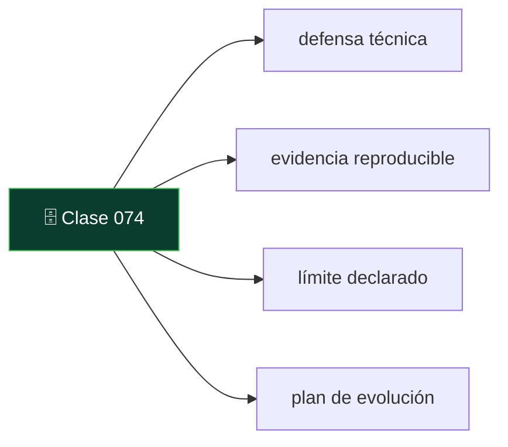

# 074 — Proyecto final: diseñar, medir y defender

   

> [Programa](../../../README.md) · [Parte 14](../README.md) · [← Anterior](../../part-14-arquitectura-y-proyecto-final/073-registro-de-decisiones-y-costo-total/README.md)

Parte 14 — Arquitectura y proyecto final · Avanzado ·
6 horas estimadas · motores `postgresql`, `mongodb`, `redis`, `qdrant`, `duckdb` · laboratorio
[`labs/02-polyglot-modeling`](../../../labs/02-polyglot-modeling/README.md) · 4 fuentes.

**Conceptos centrales:** `defensa técnica` · `evidencia reproducible` · `límite declarado` · `plan de evolución`

**En este caso se comparan 7 motores**: 5 lo resuelven (0 con el resultado comprobado por máquina) y 2 no, con el motivo escrito.



---

## Propósito

Integrar todo el programa en un sistema completo, medido y defendible. El entregable no es código que funciona: es un conjunto de afirmaciones respaldadas por evidencia reproducible.

## Resultados de aprendizaje

Al terminar podrás:

1. Diseñar un sistema de datos completo a partir de requisitos.
2. Producir evidencia reproducible de cada afirmación de rendimiento y corrección.
3. Defender las decisiones con alternativas descartadas y sus cifras.
4. Declarar los límites del trabajo con precisión.
5. Presentar un plan de evolución con umbrales medibles.

## Fundamentos

### Qué se evalúa

No es «que funcione». Es que **cada afirmación esté respaldada** y que los límites estén declarados.

| Dimensión | Peso | Evidencia exigida |
|---|---:|---|
| Modelo y justificación | 20 % | ERD, diccionario, dependencias funcionales, exclusiones |
| Corrección demostrada | 20 % | Invariantes que fallan al romper el dato |
| Rendimiento medido | 20 % | Planes antes/después, condiciones declaradas |
| Operación | 20 % | Restauración cronometrada, control de acceso, observabilidad |
| Decisiones y límites | 20 % | ADR con alternativas y consecuencias negativas |

### Elegir el dominio

Uno de los canónicos del repositorio, o uno propio que cumpla cinco condiciones:

1. Al menos **cuatro entidades** con relaciones no triviales.
2. Al menos **una invariante** que un `CHECK` no pueda expresar.
3. Al menos **una carga** que justifique medir (volumen o concurrencia).
4. **Datos personales**, para ejercitar retención y control de acceso.
5. Una consulta que se beneficie de un modelo no relacional.

### El error que hay que evitar

El trabajo que dice «el sistema soporta 10 000 consultas por segundo» sin decir con qué datos, qué máquina, qué estado de caché y qué consulta. Esa frase no es un resultado: es una impresión con un número.

## Ejemplo trabajado

Estructura completa de un entregable aceptable, con el contenido que debe llevar cada parte.

### 1. Requisitos y alcance

```markdown
## Dominio
Plataforma de cursos con inscripciones, evaluación y búsqueda de contenido.

## Requisitos funcionales
RF1 Inscribir estudiantes respetando el cupo del curso.
RF2 Registrar y rectificar notas, conservando el histórico de rectificaciones.
RF3 Buscar contenido por lenguaje natural.
RF4 Panel de dirección con métricas por período y facultad.

## Requisitos no funcionales
RNF1 p99 de inscripción < 100 ms con 200 inscripciones/s.
RNF2 RPO ≤ 5 min, RTO ≤ 2 h.
RNF3 Un docente solo ve las notas de sus cursos.
RNF4 Registros de acceso: retención 90 días.

## Fuera de alcance (declarado)
- Pagos y aranceles.
- Asistencia.
- Emisión de certificados con firma electrónica.
```

Las exclusiones son parte del entregable (clase 005).

### 2. Modelo, con su justificación

ERD, diccionario de datos con origen de cada regla, dependencias funcionales y forma normal alcanzada, con la justificación de cualquier desnormalización.

```markdown
## Decisiones de modelado
- `enrollments` con clave natural compuesta `(student_id, course_id)`: única,
  no nula e inmutable (clase 007).
- `students` separada de `student_identity` para permitir supresión conservando
  el histórico académico (clase 053).
- `courses.inscritos` NO se almacena: se cuenta. Relación lecturas/escrituras
  medida = 12,5 : 1, por debajo del umbral de 100 : 1 (clase 009).
```

### 3. Invariantes y su verificación

```sql
-- INV-1: ninguna inscripción apunta a un curso inexistente
SELECT e.student_id, e.course_id FROM enrollments e
LEFT JOIN courses c ON c.id = e.course_id WHERE c.id IS NULL;

-- INV-2: ningún curso excede su cupo   (no expresable con CHECK)
SELECT c.id, c.cupo, count(*) AS inscritos
FROM courses c JOIN enrollments e ON e.course_id = c.id AND e.estado = 'activa'
GROUP BY c.id, c.cupo HAVING count(*) > c.cupo;

-- INV-3: toda nota está en el rango de la escala o es nula
SELECT student_id, course_id, nota FROM enrollments
WHERE nota IS NOT NULL AND nota NOT BETWEEN 1.0 AND 7.0;

-- INV-4: todo curso tiene al menos un docente asignado
SELECT c.id FROM courses c
LEFT JOIN teaching t ON t.course_id = c.id WHERE t.course_id IS NULL;
```

**Y la demostración de que las invariantes sirven:** romper el dato a propósito y capturar la salida que lo delata. Una invariante que nunca ha fallado puede estar comprobando la nada (clase 004).

### 4. Evidencia de rendimiento

```markdown
## RNF1 — p99 de inscripción < 100 ms con 200 inscripciones/s

Condiciones:
  PostgreSQL 16.3, 4 vCPU, 16 GB RAM, SSD NVMe
  5 000 000 inscripciones precargadas, 300 cursos, 200 000 estudiantes
  Caché caliente (3 min de precalentamiento antes de medir)
  Cliente: 50 conexiones a través de pgbouncer, 60 s de medición

Resultado:
  caudal sostenido : 214 inscripciones/s
  p50 : 11 ms   p95 : 38 ms   p99 : 74 ms   máx : 210 ms
  errores de serialización: 0,3 % (reintentados con éxito)

Comando:
  python labs/bench/inscripciones.py --dur 60 --conc 50 --seed 42

NO demuestra:
  - Comportamiento con caché fría (medido aparte: p99 = 260 ms)
  - Comportamiento con un curso caliente único (medido aparte: 41/s, cola)
  - Nada sobre más de 5 M de filas
```

El bloque «NO demuestra» es obligatorio y es lo que distingue un informe honesto.

### 5. Operación

```markdown
## RNF2 — Restauración
Prueba ejecutada el 2026-08-18 sobre copia de 512 GB.
  descarga 38 min · restauración 12 min · WAL 24 min · verificación 8 min
  RTO medido: 82 min  (objetivo: 120 min) ✔
  Verificación: 5 002 341 filas, INV-1 a INV-4 en cero.
  RPO medido: 4 min 12 s (archive_timeout = 300 s) ✔

## RNF3 — Control de acceso
Políticas por fila (clase 050) con pruebas automatizadas que intentan
leer y escribir fuera del ámbito. 12 pruebas, todas en verde.

## RNF4 — Retención
Trabajo diario + verificación de que no quedan filas fuera de plazo.
```

### 6. Decisiones

Los ADR de las decisiones no triviales, con alternativas y consecuencias negativas (clase 063).

### 7. Límites y plan de evolución

```markdown
## Límites conocidos
- Probado hasta 5 M de inscripciones. Sin evidencia por encima.
- Un solo nodo: no hay tolerancia a fallo del primario más allá de la réplica.
- La búsqueda semántica tiene recall@5 = 0,89: el 11 % de las preguntas puede
  no recuperar el fragmento correcto.
- El panel tiene hasta 24 h de desfase.

## Umbrales de revisión
| Umbral                              | Acción            | Alerta |
|-------------------------------------|-------------------|--------|
| > 20 M inscripciones                | Particionar       | Sí     |
| p99 de inscripción > 80 ms (7 días) | Revisar índices   | Sí     |
| > 5 M fragmentos de búsqueda        | Evaluar Qdrant    | Sí     |
| Utilización sostenida > 70 %        | Escalar           | Sí     |
```

### 8. La defensa

Quince minutos. Las preguntas que se harán:

1. ¿Por qué esta clave primaria y no otra?
2. ¿Qué invariante no puede garantizar el motor y quién la vigila?
3. Enséñame un plan antes y después, y di qué cambió.
4. ¿Cuánto tardaste en restaurar y qué verificaste?
5. ¿Qué alternativa descartaste que era mejor en alguna métrica?
6. ¿Qué **no** demuestra tu evidencia?
7. ¿Qué se rompe primero al crecer, y cómo lo sabrás?

**La pregunta 6 es la que separa el trabajo maduro del correcto.** Quien sabe qué no ha demostrado, sabe lo que ha demostrado.

## Comparación

| Nivel | Señal |
|---|---|
| Insuficiente | Funciona; sin mediciones ni límites |
| Suficiente | Modelo justificado, invariantes, alguna medición |
| Bueno | Todo lo anterior + restauración cronometrada + ADR |
| Excelente | + alternativas descartadas con cifras, límites precisos y umbrales con alerta |

## Errores frecuentes

1. **Medir sin declarar condiciones.** El número no significa nada.
2. **Omitir la sección de límites.** Sugiere que no se han buscado.
3. **ADR con la opción elegida ganando en todo.** Nadie se lo cree.
4. **Invariantes que nunca se han visto fallar.** Pueden no comprobar nada.
5. **Copia de seguridad sin restauración probada** (clase 048).
6. **Caché caliente presentado como caso general.**
7. **Alcance sin exclusiones.** Se juzga contra expectativas que nadie fijó.

## De la clase a la operación

Este entregable es, con muy pocos cambios, el documento que se lleva a una revisión de arquitectura real, a una auditoría o a una entrevista técnica. La diferencia entre una demostración y un sistema es exactamente lo que aquí se exige: evidencia, límites y un plan de evolución con umbrales.

## Reto de transferencia

El proyecto final es el reto. Entrega:

1. Requisitos con exclusiones declaradas.
2. Modelo con justificación y diccionario de datos.
3. Invariantes, con la demostración de que fallan al romper el dato.
4. Evidencia de rendimiento con condiciones y sección de «no demuestra».
5. Restauración cronometrada y verificada.
6. Control de acceso con pruebas automatizadas.
7. ADR de las decisiones no triviales.
8. Límites y umbrales de revisión con sus alertas.

## Preguntas de evaluación

1. Enuncia una afirmación de tu proyecto y la evidencia exacta que la respalda.
2. ¿Qué invariante de tu sistema no puede garantizar el motor y cómo la vigilas?
3. Da una alternativa que descartaste siendo mejor en alguna métrica, y por qué.
4. ¿Qué se rompe primero cuando tu sistema crezca diez veces, y cómo te enterarás?

---

## 🌐 El mismo problema en cada motor

**Caso:** Qué hay que poder defender de cada motor que entra en el proyecto

El proyecto final no se aprueba por funcionar: se aprueba por **defenderse**.
Y defender una decisión de persistencia significa contestar cuatro preguntas
sobre cada motor que aparezca en la arquitectura, con evidencia y no con
preferencias:

1. **Qué carga resuelve** que ningún otro del proyecto resuelve mejor.
2. **Qué medición lo demuestra**, con protocolo, semilla y límites declarados.
3. **Qué garantía se pierde** al usarlo, y quién asume esa pérdida.
4. **Qué evidencia obligaría a sacarlo** de la arquitectura.

Esta última sección del programa recoge, motor por motor, lo que el tribunal
va a preguntar. No es una lista de defectos: es la lista de las cosas que hay
que haber pensado antes de que las pregunte alguien.

Esta comparación es **conceptual**: la decisión no se reduce a una consulta con
resultado, así que aquí no hay sello de máquina. Lo que se compara es lo que
cada motor **ofrece** y a qué precio, con la página oficial al lado de cada
afirmación.

| Motor | ¿Resuelve el caso? | Nivel de prueba | Código | Fuente |
|---|---|---|---|---|
| PostgreSQL | sí | conceptual | — | [doc oficial](https://www.postgresql.org/docs/current/) |
| Redis | sí | conceptual | — | [doc oficial](https://redis.io/docs/latest/operate/oss_and_stack/management/persistence/) |
| MongoDB | sí | conceptual | — | [doc oficial](https://www.mongodb.com/docs/manual/core/data-modeling-introduction/) |
| DuckDB | sí | conceptual | — | [doc oficial](https://duckdb.org/docs/stable/) |
| Qdrant | sí | conceptual | — | [doc oficial](https://qdrant.tech/documentation/) |
| Apache Cassandra | **no** | — | — | [doc oficial](https://cassandra.apache.org/doc/latest/) |
| SQLite | **no** | — | — | [doc oficial](https://sqlite.org/whentouse.html) |

### Los que resuelven el caso

#### PostgreSQL

- **Cómo se hace aquí:** Hay que defender el **modelo**, no el motor: los invariantes declarados en el esquema, la anomalía de concurrencia reproducida y corregida, el plan de ejecución de la consulta crítica antes y después, y la restauración probada con la comparación de cifras.
- **Por qué sí:** Es el motor donde casi todo lo exigible se puede demostrar con evidencia reproducible y sin infraestructura adicional: no hay excusa para no traerla.
- **Por qué no:** Que sea la opción por omisión no exime de justificarla: «usamos PostgreSQL porque es lo que sé» es tan poco defendible como adoptar un motor de moda. Hay que decir qué carga tiene y por qué le sirve.
- 📄 Documentación oficial: <https://www.postgresql.org/docs/current/>

#### Redis

- **Cómo se hace aquí:** Hay que declarar **qué se pierde si se cae**: qué datos vivían solo ahí, cuánto tarda en reconstruirse la caché y qué le pasa al sistema mientras está fría. Y demostrar que hay política de caducidad.
- **Por qué sí:** Es la separación más fácil de justificar y también la más fácil de justificar mal: basta un dato que no se pueda perder para que la defensa se caiga entera.
- **Por qué no:** La pregunta que más se falla: «¿qué pasa si Redis arranca vacío en hora punta?». Si la respuesta no está medida, la arquitectura tiene una avería que nadie ha visto todavía.
- 📄 Documentación oficial: <https://redis.io/docs/latest/operate/oss_and_stack/management/persistence/>

#### MongoDB

- **Cómo se hace aquí:** Hay que defender el **límite del agregado**: qué documento contiene qué, por qué eso no crece sin techo, y qué operaciones cruzan la frontera del documento y por tanto no son atómicas.
- **Por qué sí:** Cuando el agregado está bien elegido, la defensa es sólida y corta: una escritura, una unidad de consistencia, sin transacción.
- **Por qué no:** Cuando no lo está, aparecen transacciones de varios documentos por todas partes, y eso es la señal de que se está usando un motor documental para un problema relacional. El tribunal lo verá en el código antes que en la explicación.
- 📄 Documentación oficial: <https://www.mongodb.com/docs/manual/core/data-modeling-introduction/>

#### DuckDB

- **Cómo se hace aquí:** Hay que declarar el **retraso**: de cuándo son los datos del panel, cómo se exportan, qué pasa si la exportación falla y cómo se nota que el panel está mostrando algo viejo.
- **Por qué sí:** Es la forma más barata de separar la analítica de lo transaccional, y defenderla es fácil si el retraso está declarado en el propio panel.
- **Por qué no:** Un panel sin fecha de datos es un panel que miente en cuanto la exportación falla una noche. Esa es la pregunta que hay que tener contestada.
- 📄 Documentación oficial: <https://duckdb.org/docs/stable/>

#### Qdrant

- **Cómo se hace aquí:** Hay que traer **recall y latencia medidos** contra la alternativa que no añade un sistema —pgvector—, sobre el mismo conjunto de evaluación, y explicar cómo se mantiene sincronizado con la base de datos.
- **Por qué sí:** Si esa medición existe, la decisión es defendible en una frase. Si no existe, no hay decisión: hay una preferencia.
- **Por qué no:** La pregunta difícil no es el recall: es qué pasa cuando alguien borra un documento en la base y el vector sigue ahí. Esa incoherencia hay que haberla diseñado.
- 📄 Documentación oficial: <https://qdrant.tech/documentation/>

### Los que no resuelven este caso — y qué se hace en su lugar

Descartar un motor con un argumento es tan formativo como usarlo. Ninguna de estas filas dice que el motor sea peor: dice que este problema no es el suyo.

| Motor | Por qué no | Qué se hace en su lugar | Fuente |
|---|---|---|---|
| Apache Cassandra | Salvo que el proyecto tenga un volumen de escritura que una máquina no pueda absorber —y eso hay que **medirlo**, no suponerlo—, incluirlo es añadir un modelo sin reuniones, sin transacciones y con reparaciones periódicas para resolver un problema que no se tiene. | Si aun así entra, hay que defender la tabla por consulta, el tamaño máximo de partición previsto y quién ejecuta las reparaciones. Sin esas tres respuestas, la defensa no se sostiene. | [doc](https://cassandra.apache.org/doc/latest/) |
| SQLite | Para un proyecto con varios usuarios concurrentes y acceso remoto no es una opción defendible como almacén principal, por mucho que simplifique el desarrollo. | Sí es defendible —y muy buena— para las **pruebas** del proyecto: un esquema idéntico en memoria hace que la batería de pruebas corra en segundos y sin servicios. Esa decisión también se documenta. | [doc](https://sqlite.org/whentouse.html) |

---

## Laboratorio

```bash
python scripts/validate_repository.py
# labs/02-polyglot-modeling se entrega escrito: no hay guion que ejecutar
```

Guarda como evidencia la salida completa, la versión del motor y la semilla o
los parámetros usados. Una captura sin comando no es evidencia: no se puede
repetir.

## Evaluación

| Criterio | Peso | Qué se comprueba |
|---|---:|---|
| Comprensión conceptual | 25 % | Explica el mecanismo, no solo el resultado |
| Ejecución reproducible | 25 % | Otra persona obtiene lo mismo con las instrucciones dadas |
| Interpretación basada en evidencia | 25 % | Cada conclusión se apoya en una salida o una medición |
| Límites y riesgos declarados | 25 % | Dice qué no demuestra el ejercicio y qué faltaría en producción |

La clase se da por superada cuando la respuesta explica el mecanismo, muestra
la salida que la respalda y declara al menos un límite del ejercicio.

## Fuentes de esta clase

Todo lo afirmado arriba procede de estas obras. Los identificadores viven en
[`catalog/sources.json`](../../../catalog/sources.json) y el estado de los
enlaces se comprueba con `python scripts/check_external_links.py`.

- **Martin Kleppmann** (2017). [Designing Data-Intensive Applications](https://dataintensive.net/). O'Reilly. ISBN 978-1-4493-7332-0.  
  Referencia central del programa para replicación, partición, transacciones distribuidas y streaming.
- **Abraham Silberschatz, Henry F. Korth, S. Sudarshan** (2019). [Database System Concepts](https://db-book.com/). 7.a ed. McGraw-Hill. ISBN 978-0-07-802215-9.  
  Texto de referencia universitario. El sitio oficial publica diapositivas y capítulos de muestra.
- **Betsy Beyer, Chris Jones, Jennifer Petoff, Niall Richard Murphy** (2016). [Site Reliability Engineering: How Google Runs Production Systems](https://sre.google/sre-book/table-of-contents/). O'Reilly. ISBN 978-1-4919-2912-4.  
  Lectura libre. Objetivos de nivel de servicio y presupuesto de error.
- **Peter Bailis, Joseph M. Hellerstein, Michael Stonebraker** (2015). [Readings in Database Systems](http://www.redbook.io/). 5.a ed. MIT Press. ISBN 978-0-262-52964-3.  
  Antologia comentada de acceso libre. Cada capitulo situa los papers en su discusión.

---

> [Programa](../../../README.md) · [Parte 14](../README.md) · [← Anterior](../../part-14-arquitectura-y-proyecto-final/073-registro-de-decisiones-y-costo-total/README.md)
