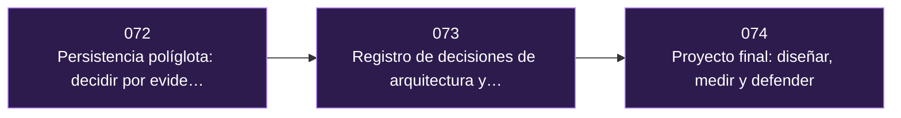

# Parte 14 — Arquitectura y proyecto final

> [Programa](../../README.md) · [Índice de clases](../README.md) ·
> [Glosario](../../GLOSARIO.md) · [Modelo de aprendizaje](../../docs/LEARNING-MODEL.md)

Cerrar el programa con una decisión defendible: comparación por evidencia, costo total y una demostración que se pueda auditar.

**3 clases · 12 horas · 13 conceptos · 7 fuentes**

## Antes de esta parte

Esta parte se apoya en lo trabajado antes. Si vienes de fuera del programa, revisa al menos el vocabulario de:

- [Parte 10 — Distribución, réplica y consistencia](../part-10-distribucion-replica-y-consistencia/README.md)
- [Parte 11 — Operación, seguridad y gobierno](../part-11-operacion-seguridad-y-gobierno/README.md)
- [Parte 12 — Analítica, integración y streaming](../part-12-analitica-integracion-y-streaming/README.md)
- [Parte 13 — Vectores, recuperación y RAG](../part-13-vectores-recuperacion-y-rag/README.md)

## De qué trata esta parte

Tres clases para convertir catorce partes de conocimiento en una decisión que se pueda defender. No hay material nuevo de motores aquí: hay método, registro y defensa.

La primera clase pone la elección de motores en su forma técnica: carga de trabajo cuantificada, criterio de comparación escrito antes de mirar los productos, y la complejidad añadida contada como lo que cuesta —otro modelo de fallo, otro respaldo, otra guardia—. La segunda enseña a dejar constancia con registros de decisión de arquitectura, costo total de propiedad a varios años y reversibilidad como criterio para saber cuánto análisis merece cada decisión. La tercera es el proyecto final: diseñar, medir y defender ante preguntas hostiles, declarando los límites de lo que el trabajo demuestra.

El proyecto final se evalúa como una revisión de arquitectura real. La pregunta no es si funciona, sino qué mediste, qué alternativa descartaste y con qué dato.

## Al terminar esta parte podrás

1. Cuantificar una carga de trabajo y derivar de ella un criterio de selección escrito.
2. Comparar candidatos por evidencia reproducible y no por características anunciadas.
3. Escribir registros de decisión con contexto, alternativas y consecuencias negativas aceptadas.
4. Estimar el costo total de propiedad a tres años, incluidas las horas de operación.
5. Defender el diseño ante preguntas hostiles declarando explícitamente sus límites.

## Mapa de la parte

| # | Clase | Nivel | Horas | Fuentes |
|---|---|---|---:|---:|
| [072](072-persistencia-poliglota-por-evidencia/README.md) | [Persistencia políglota: decidir por evidencia y no por moda](072-persistencia-poliglota-por-evidencia/README.md) | Avanzado | 3 | 3 |
| [073](073-registro-de-decisiones-y-costo-total/README.md) | [Registro de decisiones de arquitectura y costo total](073-registro-de-decisiones-y-costo-total/README.md) | Avanzado | 3 | 3 |
| [074](074-proyecto-final-disenar-medir-y-defender/README.md) | [Proyecto final: diseñar, medir y defender](074-proyecto-final-disenar-medir-y-defender/README.md) | Avanzado | 6 | 4 |

## Las clases, una por una

### [072 — Persistencia políglota: decidir por evidencia y no por moda](072-persistencia-poliglota-por-evidencia/README.md)

*Avanzado · 3 h · 3 fuentes · requiere [010](../part-00-primeros-pasos-del-archivo-a-la-base-de-datos/010-el-mapa-de-los-motores/README.md), [064](../part-12-analitica-integracion-y-streaming/064-oltp-frente-a-olap/README.md)*

La elección de motores hecha como decisión técnica: carga de trabajo cuantificada, criterio de comparación escrito antes de mirar los productos, y la complejidad añadida contada como lo que cuesta —otro modelo de fallo, otro respaldo, otra guardia. Es la clase que convierte las catorce partes anteriores en un método de decisión.

**Conceptos que introduce:** `carga de trabajo` · `criterio de selección` · `costo de operación` · `complejidad añadida`

[Ir a la clase →](072-persistencia-poliglota-por-evidencia/README.md)

### [073 — Registro de decisiones de arquitectura y costo total](073-registro-de-decisiones-y-costo-total/README.md)

*Avanzado · 3 h · 3 fuentes · requiere [072](072-persistencia-poliglota-por-evidencia/README.md)*

Dejar constancia de por qué se decidió lo que se decidió. El registro de decisión de arquitectura con su contexto, sus alternativas descartadas y sus consecuencias negativas aceptadas; el costo total de propiedad a varios años, que suele invertir el ranking; y la reversibilidad, que es el criterio para saber cuánto análisis merece cada decisión.

**Conceptos que introduce:** `ADR` · `contexto` · `consecuencia` · `costo total de propiedad` · `reversibilidad`

[Ir a la clase →](073-registro-de-decisiones-y-costo-total/README.md)

### [074 — Proyecto final: diseñar, medir y defender](074-proyecto-final-disenar-medir-y-defender/README.md)

*Avanzado · 6 h · 4 fuentes · requiere [073](073-registro-de-decisiones-y-costo-total/README.md), [062](../part-11-operacion-seguridad-y-gobierno/062-observabilidad-slo-y-capacidad/README.md)*

El cierre del programa: diseñar un sistema, medirlo y defenderlo ante preguntas hostiles. Se evalúa como una revisión de arquitectura real —qué mediste, qué alternativa descartaste, con qué dato— y exige declarar los límites: qué no demuestra el trabajo y qué faltaría para llevarlo a producción.

**Conceptos que introduce:** `defensa técnica` · `evidencia reproducible` · `límite declarado` · `plan de evolución`

[Ir a la clase →](074-proyecto-final-disenar-medir-y-defender/README.md)

## Errores frecuentes en esta parte

Cada uno de estos es una creencia habitual y su corrección. Si alguna te suena
propia, la clase que la desmonta está señalada arriba.

- «Elegimos X porque es el estándar de la industria.» Eso no es un criterio, es una apelación a la costumbre. El criterio es la carga de trabajo.
- «Persistencia políglota es usar varios motores.» Es usar varios motores cuando cada uno está justificado, contando la complejidad añadida que eso cuesta.
- «Comparé el precio por hora de cómputo.» Falta el costo mayor: las personas, las guardias, la formación y la migración de salida.
- «Declarar límites debilita la defensa.» La refuerza: distingue lo que mediste de lo que esperas, y eso es exactamente lo que un revisor busca.

## Vocabulario de la parte

Los 13 términos que esta parte introduce. Cada uno enlaza a la clase
en la que se trabaja, y todos aparecen también en el
[glosario del programa](../../GLOSARIO.md) con sus términos relacionados.

| Término | Qué significa | Se trabaja en |
|---|---|---|
| **ADR** | Registro de decisión de arquitectura: un documento corto y numerado con el contexto, la decisión, las alternativas descartadas y las consecuencias. Su valor aparece dos años después, cuando alguien pregunta por qué esto es así y nadie lo recuerda. | [073](073-registro-de-decisiones-y-costo-total/README.md) |
| **carga de trabajo** | La descripción cuantificada de lo que el sistema tendrá que aguantar: volumen, proporción de lecturas y escrituras, latencia objetivo, consultas dominantes, crecimiento previsto. Es lo que convierte la elección de motor en una decisión técnica y no en una preferencia. | [072](072-persistencia-poliglota-por-evidencia/README.md) |
| **complejidad añadida** | Lo que cuesta cada sistema adicional: otro modelo de fallo, otro respaldo, otra guardia, otra consistencia que reconciliar. Es el argumento más fuerte a favor de un solo motor multimodelo mientras la carga lo permita. | [072](072-persistencia-poliglota-por-evidencia/README.md) |
| **consecuencia** | Lo que la decisión hace más fácil y lo que hace más difícil, incluidas las consecuencias negativas aceptadas. Un ADR que solo lista ventajas no es un registro de decisión: es un anuncio. | [073](073-registro-de-decisiones-y-costo-total/README.md) |
| **contexto** | La sección del ADR que describe las fuerzas del momento: restricciones, plazos, volúmenes y lo que se sabía entonces. Es lo que permite juzgar la decisión con justicia después, y lo que indica cuándo dejó de ser válida. | [073](073-registro-de-decisiones-y-costo-total/README.md) |
| **costo de operación** | Todo lo que cuesta mantener vivo un motor después de instalarlo: respaldos probados, actualizaciones, monitorización, personas de guardia. Suele superar con creces el costo de licencia o de cómputo. | [072](072-persistencia-poliglota-por-evidencia/README.md) |
| **costo total de propiedad** | La suma a varios años de licencias, infraestructura, personas, formación y migración de salida. Comparar solo el precio por hora de cómputo suele invertir el orden del ranking en cuanto se añaden las horas de operación. | [073](073-registro-de-decisiones-y-costo-total/README.md) |
| **criterio de selección** | La lista escrita de propiedades que se van a comparar entre candidatos, con su peso, fijada antes de mirar los productos. Escribirla después es escribir la justificación de lo que ya se había decidido. | [072](072-persistencia-poliglota-por-evidencia/README.md) |
| **defensa técnica** | Sostener una decisión ante preguntas hostiles: por qué este motor, qué mediste, qué alternativa descartaste y con qué dato. Es el formato de evaluación del proyecto final porque es el formato real de una revisión de arquitectura. | [074](074-proyecto-final-disenar-medir-y-defender/README.md) |
| **evidencia reproducible** | Mediciones que otra persona puede repetir: comando, versión, datos, semilla y salida. Sin ellas, un número de rendimiento en una defensa es una afirmación, y se le puede oponer cualquier otra. | [074](074-proyecto-final-disenar-medir-y-defender/README.md) |
| **límite declarado** | Lo que el trabajo explícitamente no demuestra: escala no probada, fallos no simulados, supuestos del entorno. Declararlo aumenta la credibilidad en lugar de restarla, porque distingue lo medido de lo esperado. | [074](074-proyecto-final-disenar-medir-y-defender/README.md) |
| **plan de evolución** | Qué se haría al multiplicar por diez el volumen, y qué señal indicaría que ha llegado el momento. Convierte una arquitectura en una decisión con fecha de revisión en lugar de en una apuesta permanente. | [074](074-proyecto-final-disenar-medir-y-defender/README.md) |
| **reversibilidad** | Cuánto cuesta deshacer la decisión si resulta equivocada. Es el criterio que decide cuánto análisis merece: una decisión barata de revertir se prueba, una cara se estudia antes. | [073](073-registro-de-decisiones-y-costo-total/README.md) |

## Fuentes usadas en esta parte

7 obras distintas sostienen lo que se afirma en estas
3 clases. Los identificadores viven en
[`catalog/sources.json`](../../catalog/sources.json) y el estado de los enlaces
se comprueba con `python scripts/check_external_links.py`.

- **Laine Campbell, Charity Majors** (2017). [Database Reliability Engineering](https://www.oreilly.com/library/view/database-reliability-engineering/9781491925935/). O'Reilly. ISBN 978-1-4919-2594-2.  
  Operación, respaldos, objetivos de servicio y gestion de cambios.  
  *Se cita en las clases 073.*
- **Abraham Silberschatz, Henry F. Korth, S. Sudarshan** (2019). [Database System Concepts](https://db-book.com/). 7.a ed. McGraw-Hill. ISBN 978-0-07-802215-9.  
  Texto de referencia universitario. El sitio oficial publica diapositivas y capítulos de muestra.  
  *Se cita en las clases 074.*
- **Martin Kleppmann** (2017). [Designing Data-Intensive Applications](https://dataintensive.net/). O'Reilly. ISBN 978-1-4493-7332-0.  
  Referencia central del programa para replicación, partición, transacciones distribuidas y streaming.  
  *Se cita en las clases 072, 074.*
- **Joe Reis, Matt Housley** (2022). [Fundamentals of Data Engineering](https://www.oreilly.com/library/view/fundamentals-of-data/9781098108298/). O'Reilly. ISBN 978-1-0981-0830-4.  
  Ciclo de vida de la ingenieria de datos e integración entre sistemas.  
  *Se cita en las clases 073.*
- **Pramod J. Sadalage, Martin Fowler** (2012). [NoSQL Distilled: A Brief Guide to the Emerging World of Polyglot Persistence](https://martinfowler.com/books/nosql.html). Addison-Wesley. ISBN 978-0-321-82662-6.  
  Origen del término agregado y de la persistencia políglota que estructura este programa.  
  *Se cita en las clases 072.*
- **Peter Bailis, Joseph M. Hellerstein, Michael Stonebraker** (2015). [Readings in Database Systems](http://www.redbook.io/). 5.a ed. MIT Press. ISBN 978-0-262-52964-3.  
  Antologia comentada de acceso libre. Cada capitulo situa los papers en su discusión.  
  *Se cita en las clases 072, 073, 074.*
- **Betsy Beyer, Chris Jones, Jennifer Petoff, Niall Richard Murphy** (2016). [Site Reliability Engineering: How Google Runs Production Systems](https://sre.google/sre-book/table-of-contents/). O'Reilly. ISBN 978-1-4919-2912-4.  
  Lectura libre. Objetivos de nivel de servicio y presupuesto de error.  
  *Se cita en las clases 074.*

## Cómo estudiar esta parte

El mismo método en las 74 clases, y conviene respetar el orden:

1. **Lee el vocabulario antes que la materia.** Cada clase define sus términos
   arriba precisamente para que no haya que deducirlos del contexto.
2. **Ejecuta el ejemplo trabajado mientras lees**, no después. La mitad de lo
   que se aprende aquí solo aparece cuando la salida no es la esperada.
3. **Compara los motores.** La sección comparada muestra el mismo problema
   resuelto —o descartado con argumento— en varios sistemas. Lee también las
   filas de los que no lo resuelven: descartar con motivo es la habilidad que
   se evalúa en el proyecto final.
4. **Responde las preguntas de evaluación por escrito.** Una respuesta que no
   se puede escribir en tres líneas todavía no está entendida.
5. **Haz el reto de transferencia.** Es el único ejercicio que comprueba si el
   concepto se puede aplicar a un caso que la clase no mostró.
6. **Guarda la evidencia**: comando, versión del motor, semilla y salida
   completa. Sin eso no hay nota, porque no hay nada que revisar.

## Otras partes

- [Parte 00 — Primeros pasos: del archivo a la base de datos](../part-00-primeros-pasos-del-archivo-a-la-base-de-datos/README.md)
- [Parte 01 — Fundamentos, sistemas y método](../part-01-fundamentos-datos-sistemas-y-metodo/README.md)
- [Parte 02 — Modelado conceptual y requisitos](../part-02-modelado-conceptual-y-requisitos/README.md)
- [Parte 03 — Modelo relacional y álgebra](../part-03-modelo-relacional-y-algebra/README.md)
- [Parte 04 — SQL en profundidad](../part-04-sql-en-profundidad/README.md)
- [Parte 05 — Motores relacionales y dialectos](../part-05-motores-relacionales-y-dialectos/README.md)
- [Parte 06 — Documentos y clave-valor](../part-06-documentos-y-clave-valor/README.md)
- [Parte 07 — Grafos, columnas, tiempo y búsqueda](../part-07-grafos-columnas-tiempo-y-busqueda/README.md)
- [Parte 08 — Transacciones, concurrencia y recuperación](../part-08-transacciones-concurrencia-y-recuperacion/README.md)
- [Parte 09 — Almacenamiento, índices y planes](../part-09-almacenamiento-indices-y-planes/README.md)
- [Parte 10 — Distribución, réplica y consistencia](../part-10-distribucion-replica-y-consistencia/README.md)
- [Parte 11 — Operación, seguridad y gobierno](../part-11-operacion-seguridad-y-gobierno/README.md)
- [Parte 12 — Analítica, integración y streaming](../part-12-analitica-integracion-y-streaming/README.md)
- [Parte 13 — Vectores, recuperación y RAG](../part-13-vectores-recuperacion-y-rag/README.md)
