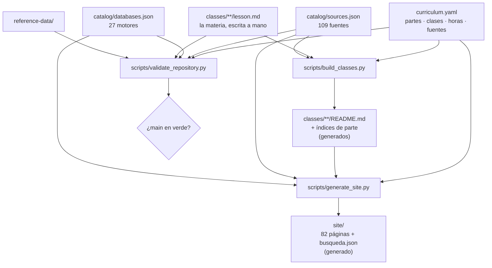

# Arquitectura del repositorio

## Principio

Una sola fuente de verdad por cada cosa, y todo lo demás generado a partir de
ella. La alternativa —mantener a mano el currículo, los índices, los README y el
sitio— produce la incoherencia clásica: el índice dice 60 clases, el README dice
58 y el sitio publica 55.

## Qué es fuente y qué es artefacto

| Ruta | Naturaleza | Se edita a mano |
|---|---|---|
| `curriculum.yaml` | Fuente | **Sí** |
| `classes/**/lesson.md` | Fuente | **Sí** |
| `catalog/*.json` | Fuente | **Sí** |
| `labs/`, `reference-data/`, `docs/` | Fuente | **Sí** |
| `classes/**/README.md` | Artefacto | No |
| `classes/README.md` y `classes/part-*/README.md` | Artefacto | No |
| `site/**` | Artefacto | No |

La integración continua ejecuta los generadores con `--check` y falla si algún
artefacto quedó desactualizado. Es lo que impide que el sitio publicado y el
repositorio digan cosas distintas.

## Los componentes

### `curriculum.yaml`

Metadatos de las 64 clases: identificador, `slug`, título, horas, nivel,
conceptos, motores, laboratorio y **fuentes**. También las rutas por objetivo y
los pesos de evaluación. Nada de lo que aquí se declara se repite en otro sitio.

### `catalog/sources.json`

Registro único de la bibliografía. Cada entrada lleva tipo, autoría, año, URL y
una nota que explica para qué sirve en este programa; los libros llevan ISBN y
los artículos, DOI o sede. Ver [la política de fuentes](SOURCES.md).

### `catalog/databases.json`

Los motores cubiertos, con su familia, lenguaje de consulta, documentación
oficial y si tienen laboratorio ejecutable (`core_lab`) o solo ficha
comparativa. La distinción evita prometer dominio de tecnologías que solo se
mencionan.

### `classes/`

Una carpeta por clase con `lesson.md` (la materia) y `README.md` (el documento
publicable, generado). La separación permite que las 64 clases compartan
encabezado, rúbrica y formato de bibliografía sin 64 copias que mantener.

### `labs/`

Experimentos reproducibles. El primero usa SQLite en memoria y no depende de
nada externo; el resto llega por perfiles de `docker-compose.yml`.

### `reference-data/`

El dominio educativo canónico —estudiantes, cursos, inscripciones— que usan
todas las clases. Que el dominio sea el mismo en las 64 clases es lo que permite
comparar motores sin cambiar de problema.

### `site/`

Sitio estático de GitHub Pages: portada con búsqueda y filtros, una página por
clase con diagramas Mermaid, índices por parte, bibliografía renderizada y
catálogo de motores.

## Controles de integridad

| Control | Qué impide |
|---|---|
| Mínimo de dos fuentes por clase | Material sin respaldo |
| Citas existentes en el registro | Bibliografía fantasma |
| Sin fuentes huérfanas | Registro que envejece sin revisar |
| ISBN en libros, DOI o sede en artículos | Citas no localizables |
| Motores citados presentes en el catálogo | Prometer cobertura inexistente |
| Secuencia 001..064 sin huecos | Clases perdidas al reordenar |
| Secciones obligatorias en cada lección | Notas disfrazadas de clase |
| Enlaces relativos resueltos | Navegación rota |
| Codificación UTF-8 sin mojibake | Acentos corrompidos al editar |
| Integridad del conjunto de referencia | Laboratorios sobre datos inconsistentes |
| Artefactos regenerados | Sitio y repositorio en desacuerdo |

## Decisiones y su motivo

- **`lesson.md` separado de `README.md`.** Cambiar la rúbrica o el pie de página
  es un cambio en el generador, no 64 ediciones.
- **Las fuentes en JSON y no en Markdown.** Permite validar la estructura y
  renderizarlas en varios sitios sin duplicarlas.
- **El sitio versionado en el repositorio.** Se puede revisar el diff de lo que
  se publica, y GitHub Pages no necesita construir nada.
- **Los `slug` en ASCII.** Son rutas de carpeta y de URL; los acentos ahí causan
  problemas entre sistemas de archivos.
- **La validación falla, no avisa.** Un aviso que nadie lee es una regla que no
  existe.
