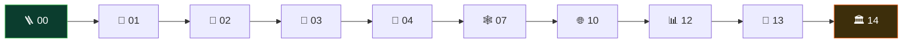

# 🛠️ Ingeniero de datos

> Construyes las tuberías por las que circula el dato de la empresa: lo mueves entre sistemas,
> lo transformas y lo dejas disponible para que otros decidan. Cuando tu trabajo falla, nadie
> ve un error 500: ven un informe que dice algo distinto al del mes pasado.
>
> **Nivel de entrada:** intermedio (requiere SQL y modelado sólidos) · **Foco:** integración,
> captura de cambios, modelado analítico y streaming · **Cargos habituales:** ingeniero de
> datos, ingeniero de plataforma de datos, ingeniero de streaming.

<!-- insignias-ruta:inicio -->

  

<!-- insignias-ruta:fin -->

## 🧭 Qué es y por qué importa

La ingeniería de datos existe porque el dato nace en un sitio y se necesita en otro. Nace en
una base transaccional optimizada para escribir pedidos de uno en uno, y se necesita en un
almacén optimizado para responder «cuánto vendimos por región y mes» sobre millones de filas.
Entre esos dos mundos hay un trabajo de ingeniería: extraer sin frenar el origen, transformar
sin perder el significado, cargar sin duplicar y dejar constancia de qué pasó.

Importa porque **el error de datos es silencioso**. Un servicio caído se nota en un minuto;
una tubería que duplica el 3 % de las filas puede tardar meses en descubrirse, y para entonces
hay decisiones tomadas sobre esos números. Por eso el oficio se juzga por trazabilidad e
idempotencia más que por elegancia: poder decir de dónde salió cada fila y poder reprocesar
sin ensuciar.

También es un rol con mucha moda encima. Cada año aparece una herramienta que promete resolver
la integración; lo que no cambia es el problema de fondo —semántica, tiempo, orden y
duplicados— que ya describían el modelado dimensional en los noventa y los sistemas de
streaming modernos. Este programa se apoya en ese fondo, no en el catálogo de herramientas del
trimestre.

Lo que aquí **no** vas a aprender: operar un clúster concreto de un proveedor en producción,
ni negociar con el equipo de negocio qué significa «cliente activo» —que suele ser la parte más
difícil del trabajo real—.

## 🗓️ Un día en el puesto

- **Revisar las cargas de anoche.** Qué corrió, qué falló, qué llegó tarde. Antes que nada,
  saber si los datos de hoy son confiables.
- **Un origen que cambió sin avisar.** Alguien añadió una columna, o cambió un tipo, o empezó a
  mandar fechas en otra zona horaria. Tu tubería tiene que detectarlo, no tragárselo.
- **Reprocesar un día.** Si tu proceso no es idempotente, reprocesar significa duplicar. Aquí
  se paga el diseño: claves de negocio, marcas de agua y cargas que se pueden repetir.
- **Modelar una tabla nueva para analítica.** Decidir el grano del hecho, las dimensiones y qué
  hacer cuando un atributo cambia con el tiempo.
- **Una consulta analítica que no termina.** Miras el plan, el formato de almacenamiento y la
  partición antes de pedir más máquina.
- **Documentar el linaje.** De dónde viene esta columna, quién la transforma y quién la
  consume. Sin eso, nadie se atreve a cambiar nada.

## 🧠 Qué necesitas saber

### Conocimiento técnico

- **SQL analítico avanzado:** agregación sin duplicar, funciones de ventana, CTE y el coste de
  cada reunión sobre volúmenes grandes.
- **La frontera OLTP/OLAP:** por qué se separan, qué se pierde al mezclarlas y cuándo un
  motor columnar cambia el orden de magnitud.
- **Modelado dimensional:** hechos, dimensiones, grano y dimensiones que cambian lentamente.
- **Integración:** ETL frente a ELT, captura de cambios (CDC) y el registro de cambios como
  nexo entre sistemas.
- **Streaming:** tiempo de evento frente a tiempo de proceso, ventanas, datos que llegan tarde
  y semántica de entrega (al menos una vez, exactamente una vez y sus letras pequeñas).
- **Idempotencia y reintentos:** el requisito no negociable de cualquier tubería que se
  reprocesa.
- **Formatos y particionado:** por qué el formato columnar y una partición bien elegida valen
  más que duplicar el clúster.

### Herramientas del oficio

- Un motor relacional serio (PostgreSQL) y uno analítico (DuckDB, ClickHouse) para entender la
  diferencia con datos propios.
- Un orquestador de flujos y un sistema de transformación versionada como dbt.
- Un registro de eventos (Kafka) y una herramienta de CDC (Debezium) para la parte de
  integración.
- Contenedores para levantar orígenes y destinos reales en tu máquina.

### Habilidades no técnicas

- **Preguntar por la definición antes de escribir la consulta:** «usuario activo» significa
  cosas distintas en marketing y en soporte.
- **Declarar la latencia y la frescura** que tu tubería garantiza, y no prometer más.
- **Escribir contratos de datos** con el equipo que produce el origen, para que un cambio no
  te llegue como sorpresa.

## 📚 Tu ruta en el programa

<!-- recorrido:inicio -->

<!-- recorrido:fin -->

9 partes, 151 horas estimadas.

1. 📚 [**Parte 01 — Fundamentos**](../classes/part-01-fundamentos-datos-sistemas-y-metodo/README.md)
   (4 clases · 12 h).
2. 📚 [**Parte 02 — Modelado conceptual**](../classes/part-02-modelado-conceptual-y-requisitos/README.md)
   (5 clases · 16 h). El significado antes que el formato.
3. 📚 [**Parte 03 — Modelo relacional y álgebra**](../classes/part-03-modelo-relacional-y-algebra/README.md)
   (4 clases · 13 h).
4. 📚 [**Parte 04 — SQL en profundidad**](../classes/part-04-sql-en-profundidad/README.md)
   (6 clases · 20 h). Tu herramienta diaria; no la aprendas a medias.
5. 📚 [**Parte 07 — Grafos, columnas, tiempo y búsqueda**](../classes/part-07-grafos-columnas-tiempo-y-busqueda/README.md)
   (5 clases · 15 h). Especialmente
   [030 — Series temporales](../classes/part-07-grafos-columnas-tiempo-y-busqueda/040-series-temporales-cardinalidad-y-retencion/README.md)
   y [032 — Analítica columnar y vectorización](../classes/part-07-grafos-columnas-tiempo-y-busqueda/042-analitica-columnar-y-vectorizacion/README.md).
6. 📚 [**Parte 10 — Distribución, réplica y consistencia**](../classes/part-10-distribucion-replica-y-consistencia/README.md)
   (5 clases · 17 h). Sin esto, «eventualmente consistente» es una excusa y no un modelo.
7. 📚 [**Parte 12 — Analítica, integración y streaming**](../classes/part-12-analitica-integracion-y-streaming/README.md)
   (4 clases · 13 h). El corazón del rol:
   [054 — OLTP frente a OLAP](../classes/part-12-analitica-integracion-y-streaming/064-oltp-frente-a-olap/README.md),
   [055 — Modelado dimensional](../classes/part-12-analitica-integracion-y-streaming/065-modelado-dimensional/README.md),
   [056 — ETL, ELT y captura de cambios](../classes/part-12-analitica-integracion-y-streaming/066-integracion-etl-elt-y-captura-de-cambios/README.md)
   y [057 — Streaming, tiempo de evento y ventanas](../classes/part-12-analitica-integracion-y-streaming/067-streaming-tiempo-de-evento-y-ventanas/README.md).
8. 📚 [**Parte 13 — Vectores, recuperación y RAG**](../classes/part-13-vectores-recuperacion-y-rag/README.md)
   (4 clases · 13 h). Cada vez más tuberías terminan alimentando una búsqueda semántica.
9. 📚 [**Parte 14 — Arquitectura y proyecto final**](../classes/part-14-arquitectura-y-proyecto-final/README.md)
   (3 clases · 12 h).

Laboratorios de la ruta:

- 🧪 [`01-sql-foundations`](../labs/01-sql-foundations/README.md) — la base que se da por
  supuesta en toda entrevista.
- 🧪 [`02-polyglot-modeling`](../labs/02-polyglot-modeling/README.md) — el mismo dominio en
  relacional, documental y grafo, declarando qué gana y qué pierde cada uno.
- 🧪 [`05-nosql-workloads`](../labs/05-nosql-workloads/README.md) — TTL frente a coherencia,
  incrustar frente a referenciar y el efecto de una clave de partición caliente, medidos.

## 🧪 Qué tienes que poder demostrar

- explicar el **grano** de una tabla de hechos y por qué elegiste ese y no otro;
- diseñar una carga **idempotente** y demostrar que reprocesar un día no duplica filas;
- describir qué pasa con un evento que llega media hora tarde y cómo lo trata tu ventana;
- distinguir captura de cambios de una consulta incremental por fecha, con sus riesgos;
- justificar cuándo conviene un motor columnar con una medición, no con una impresión;
- declarar la frescura y la latencia que tu tubería garantiza, y qué la rompe.

## 🎓 Credenciales

La credencial más reconocible del rol es la
[**Professional Data Engineer** de Google Cloud](https://cloud.google.com/learn/certification/data-engineer):
examen de dos horas, 40–50 preguntas, válido dos años, sin prerrequisitos, y con una
experiencia recomendada de tres años en la industria. Cubre diseño de sistemas de
procesamiento, ingesta, almacenamiento, preparación para análisis y automatización de cargas.

Dos advertencias honestas: está atada a un proveedor —te enseña *su* catálogo tanto como el
oficio— y caduca. Lo que no caduca es entender el modelado y la semántica del tiempo, que es
justo lo que trabajan las Partes 11 y 09 de este programa.

## 📈 Progresión y mercado

1. **Analista de datos o desarrollador** con SQL fuerte: la entrada más común.
2. **Ingeniero de datos** — construyes y mantienes tuberías con supervisión.
3. **Ingeniero de datos sénior** — diseñas el modelo analítico y los contratos con los
   orígenes.
4. **Bifurcación:** plataforma de datos y fiabilidad (cerca de [DBA / SRE](fiabilidad-y-operacion.md)),
   [analytics engineering](analitica-y-bi.md) si te atrae la capa de negocio, o
   [arquitectura](arquitectura.md) si te atrae decidir el conjunto.

Referencia de mercado con fuente: el
[Occupational Outlook Handbook](https://www.bls.gov/ooh/computer-and-information-technology/database-administrators.htm)
del U.S. Bureau of Labor Statistics publica sueldos medianos y proyección de empleo para los
puestos de administración y arquitectura de bases de datos en Estados Unidos —el epígrafe más
cercano a este rol en una fuente oficial—. Para tu país, contrasta ofertas reales: aquí no
inventamos rangos locales.

## ⚠️ Mitos y errores comunes

- **«El dato ya está, solo hay que moverlo.»** Mover es lo fácil; conservar el significado al
  moverlo es el trabajo.
- **«Con una herramienta moderna no necesito modelar.»** El modelado dimensional no es una
  moda de los noventa: es lo que hace que una consulta de negocio tenga una respuesta y no
  tres.
- **«Exactamente una vez lo resuelve el sistema.»** Solo bajo condiciones muy concretas. En la
  práctica se consigue con idempotencia en el destino, no con una promesa del transporte.
- **«Si el informe cuadra, la tubería está bien.»** Cuadra hasta el día que llega un evento
  tarde, o un origen reenvía. Prueba esos casos a propósito.
- **«Más máquina arregla la lentitud.»** El formato, la partición y el grano suelen dar más
  que el doble de CPU, y cuestan menos.
- **«El linaje lo documento después.»** Después es nunca, y sin linaje nadie se atreve a
  cambiar una transformación.

## 🚀 Siguientes pasos

1. Asegura las Partes 00 → 03: sin SQL y modelado sólidos, el resto se construye sobre arena.
2. Haz la Parte 12 completa y modela un dominio propio en estrella, declarando el grano.
3. Ejecuta [`05-nosql-workloads`](../labs/05-nosql-workloads/README.md) y aplica la lección de
   la clave caliente a tu partición real.
4. Toma una tubería tuya y hazla idempotente; demuestra con conteos que reprocesar no duplica.
5. Estudia la Parte 10 antes de prometer consistencia entre sistemas.
6. Cierra con el [proyecto final](../projects/capstone.md), midiendo lo que afirmas.

## 📖 De dónde sale esto

- **Joe Reis, Matt Housley**, *Fundamentals of Data Engineering* — el ciclo de vida del dato
  como oficio, por encima de las herramientas de moda.
- **Ralph Kimball, Margy Ross**, *The Data Warehouse Toolkit* — modelado dimensional, grano y
  dimensiones que cambian lentamente.
- **Tyler Akidau, Slava Chernyak, Reuven Lax**, *Streaming Systems* — tiempo de evento,
  ventanas y semántica de entrega.
- **Google Cloud**, *Professional Data Engineer Certification* — temario oficial de la
  credencial citada.

Fichas completas en el [registro de fuentes](../catalog/sources.json).

---

- ⬅️ [Volver al índice de rutas](README.md)
- 🏠 [Inicio del programa](../README.md)
